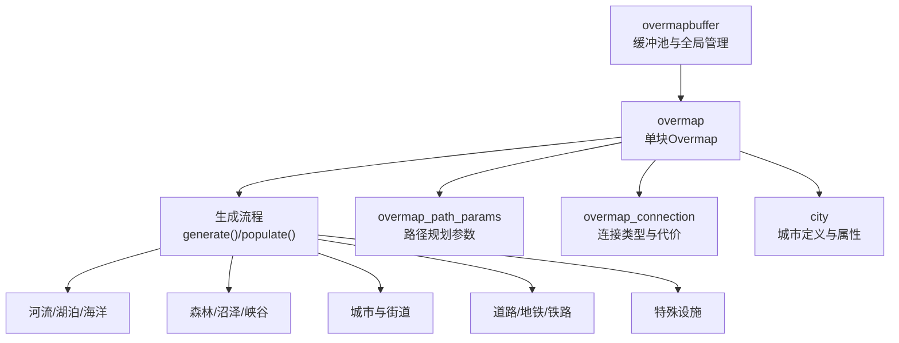
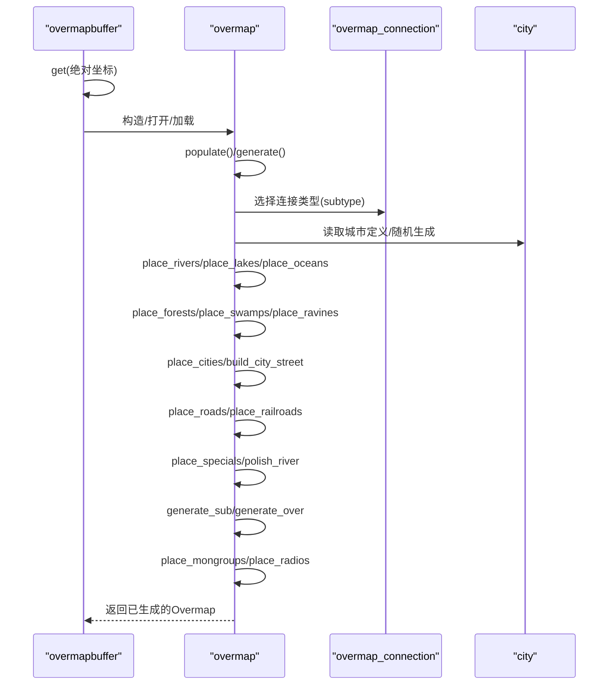
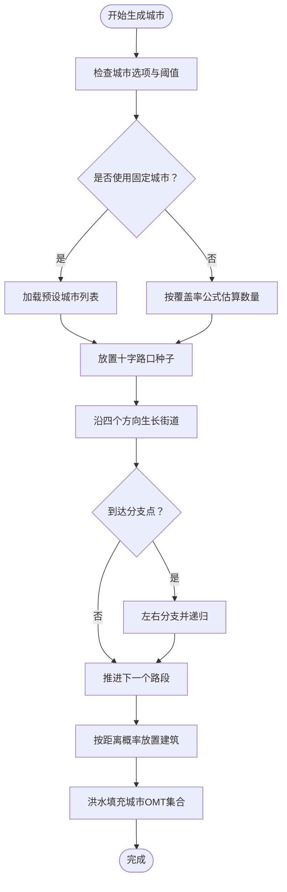
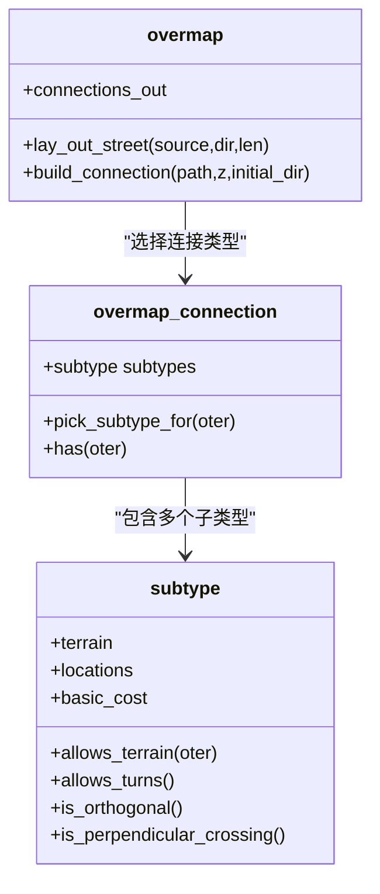
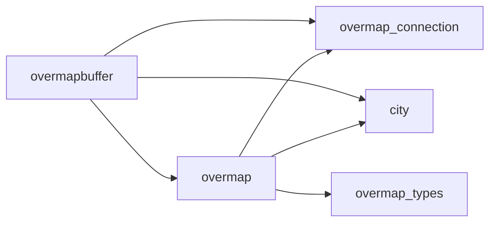

# Overmap系统

<cite>
**本文引用的文件**
- overmap.h
- overmap.cpp
- overmapbuffer.h
- overmapbuffer.cpp
- city.h
- city.cpp
- overmap_connection.h
- overmap_connection.cpp
- overmap_types.h
</cite>

## 目录
1. [引言](#引言)
2. [项目结构](#项目结构)
3. [核心组件](#核心组件)
4. [架构总览](#架构总览)
5. [详细组件分析](#详细组件分析)
6. [依赖关系分析](#依赖关系分析)
7. [性能考量](#性能考量)
8. [故障排查指南](#故障排查指南)
9. [结论](#结论)
10. [附录](#附录)

## 引言
本文件系统化梳理Cataclysm-DDA的Overmap（大地图）系统，围绕设计理念、数据结构、坐标体系与生成管线展开，重点覆盖以下方面：
- Overmap的分块管理与坐标系统
- 城市生成算法：建筑布局、人口密度与功能区划分
- 道路网络生成：路径规划、连接性与可达性
- 植被分布规则：生态区域划分与植物群落生成
- Overmap参数配置与性能优化策略
- 具体生成实现与自定义地图类型的扩展方法

## 项目结构
Overmap系统由“单个Overmap实例”和“Overmap缓冲池（overmapbuffer）”协同工作：
- 单个Overmap负责某一块Overmap的地形、城市、道路、特殊设施等生成与持久化
- Overmap缓冲池负责加载/生成Overmap、跨Overmap导航、全局状态维护与批量操作

图示来源
- overmapbuffer.h
- overmap.h
- overmap.cpp
- overmap_connection.h
- city.h

章节来源
- overmapbuffer.h
- overmap.h
- overmap.cpp

## 核心组件
- Overmap类：承载单块Overmap的地形、城市、道路、特殊设施、怪物群组、气味追踪等，并提供生成、查询、保存/加载等接口
- OvermapBuffer类：管理Overmap生命周期、跨Overmap导航、全局唯一特殊设施计数、NPC/怪物群组迁移修复等
- OvermapConnection类：描述可建造在特定地表上的连接类型（如道路、地铁、铁路），并给出代价与允许的地表类型
- City类：城市定义与随机命名、人口规模、位置等
- OvermapTypes：Overmap专用类型，如scent_trace（气味追踪）

章节来源
- overmap.h
- overmapbuffer.h
- overmap_connection.h
- city.h
- overmap_types.h

## 架构总览
Overmap生成采用“按需生成+邻接信息”的策略：
- 通过overmapbuffer按需加载或生成Overmap
- 生成时先从邻居Overmap收集边界信息（如河流节点、道路出口），再进行本Overmap内部生成
- 生成顺序受选项控制：河流/湖泊/海洋 → 森林/沼泽/峡谷 → 城市 → 道路/地铁/铁路 → 特殊设施 → 路径美化
- 子层与上层生成在主层之后按需迭代

图示来源
- overmapbuffer.cpp
- overmap.cpp
- overmap_connection.cpp
- city.cpp

## 详细组件分析

### Overmap数据结构与坐标系统
- 地形层：每个Overmap包含多层（上下层+若干子层），每层以三维数组存储overmap terrain id
- 可见度与探索：每层维护可见度与探索标记，支持不同视角等级
- Notes/Extras：支持在特定OMT上添加注释与额外标记
- 连接点：记录与其他Overmap的连接出口（用于跨Overmap连通）
- 城市集合：记录城市中心、半径与城市OMT集合；生成后进行洪水填充以闭合城市区域
- 怪物群组：按子图（submap）维度组织，便于世界切换时迁移
- 气味追踪：scent_trace记录时间戳与初始强度，支持怪物追踪

章节来源
- overmap.h
- overmap.h
- overmap_types.h

### Overmap生成流程与管线
- populate/generate：根据选项顺序执行各阶段生成
- 边界信息：从邻居Overmap收集河流节点、道路出口等，保证跨Overmap连续性
- 子层/上层：在主层生成后再逐层生成，确保上下连通性

章节来源
- overmap.cpp
- overmap.cpp

### 河流/湖泊/海洋生成
- 依据相邻Overmap的河流边界与节点，决定本Overmap的起始与走向
- 支持主干流与支流，使用贝塞尔曲线与蜿蜒算法生成自然形态
- 生成后进行河岸美化与连接处理

章节来源
- overmap.cpp
- overmap.cpp
- overmap.cpp

### 森林/沼泽/峡谷生成
- 森林与沼泽按生物群系与噪声场生成，避免与城市重叠
- 峡谷（ ravines ）作为地形特征独立生成，影响移动代价与路径

章节来源
- overmap.cpp
- overmap.cpp
- overmap.cpp

### 城市生成算法
- 基于“城市大小/间距/最大密度”与“城市化程度（urbanity）/森林度（forestosity）”动态调整
- 随机城市：按覆盖率公式估算城市数量，逐个放置种子点（十字路口）
- 固定城市：来自城市数据库，直接在对应Overmap放置
- 街道生长：从十字路口出发，按方向交替生成街道，随机分支并放置建筑
- 建筑选择：按距离城市中心的正态分布选择商店/公园/住宅，避免中心过密
- 唯一建筑：CITY_UNIQUE/GLOBALLY_UNIQUE/OVERMAP_UNIQUE的去重与约束

图示来源
- overmap.cpp
- overmap.cpp
- overmap.cpp
- city.cpp

章节来源
- overmap.cpp
- overmap.cpp
- overmap.cpp
- city.cpp

### 道路网络生成
- 连接类型：Road/Subway/Railroad分别由不同的overmap_connection描述，包含允许的地表类型、基本代价、方向限制等
- 路径规划：基于overmap_path_params设置移动代价、是否仅走已知区域、是否允许对角等
- 连接铺设：lay_out_street/lay_out_connection生成路径，build_connection实际铺设
- 跨Overmap连接：优先利用邻居提供的连接点，不足时在边缘随机生成

图示来源
- overmap_connection.h
- overmap_connection.cpp
- overmap.h

章节来源
- overmap_connection.h
- overmap_connection.cpp
- overmap.h
- overmap.cpp
- overmap.cpp

### 特殊设施与怪物群组
- 特殊设施：按批次（overmap_special_batch）与扇区（sector）策略放置，支持最小出现次数与唯一性约束
- 怪物群组：生成完成后统一放置，按子图维度组织，随Overmap迁移与NPC迁移修复

章节来源
- overmap.h
- overmapbuffer.cpp
- overmap.cpp

### Overmap路径规划与导航
- overmap_path_params：封装移动代价、危险规避、仅走已知区域、对角允许等
- get_travel_path：返回旅行路径（tripoint_abs_omt序列），支持陆/水/空载具与NPC

章节来源
- overmapbuffer.h
- overmapbuffer.h

## 依赖关系分析
- overmap依赖：
  - overmap_connection：决定可在何种地表上建造道路/地铁/铁路
  - city：城市定义与随机生成
  - overmapbuffer：生命周期管理、跨Overmap导航、全局唯一特殊设施计数
  - overmap_types：scent_trace等类型
- overmapbuffer依赖：
  - overmap：生成/查询/保存
  - city：城市检索
  - overmap_connection：代价计算

图示来源
- overmap.h
- overmapbuffer.h
- overmap_connection.h
- city.h

章节来源
- overmap.h
- overmapbuffer.h

## 性能考量
- 按需生成：仅在访问时生成Overmap，减少内存占用
- 扇区放置：将Overmap划分为扇区，分批尝试放置特殊设施，提高成功率并降低失败重试成本
- 缓存与复用：overmapbuffer缓存最近请求的Overmap指针，减少重复查找
- 连接类型缓存：overmap_connection对地表类型到连接子类型的映射进行缓存，加速选择
- 路径代价：overmap_path_params允许按载具/角色设定移动代价，避免无效搜索

章节来源
- overmapbuffer.cpp
- overmapbuffer.h
- overmap_connection.cpp

## 故障排查指南
- 无法生成城市：检查城市选项（城市大小/间距/最大密度）、城市化程度与森林度的动态调整
- 路网不连通：确认相邻Overmap的连接点是否足够（至少3个），必要时在边缘随机生成
- 特殊设施未放置：检查批次最小出现次数与唯一性约束，必要时扩大搜索半径或放宽must_be_unexplored
- 怪物群组/NPC越界：overmapbuffer会在生成新Overmap时迁移并修复，若仍异常，检查fix_mongroups/fix_npcs逻辑

章节来源
- overmap.cpp
- overmapbuffer.cpp

## 结论
Overmap系统通过“按需生成+邻接信息+可配置生成顺序”的设计，在保证地图连续性的同时提供了高度可扩展的生成能力。城市、道路、植被与特殊设施的生成相互解耦，配合overmap_connection与overmap_path_params，既满足玩法多样性，也兼顾了性能与可维护性。

## 附录

### Overmap参数配置与生成开关
- OVERMAP_PLACE_RIVERS/OVERMAP_PLACE_LAKES/OVERMAP_PLACE_OCEANS：启用/禁用对应地貌生成
- OVERMAP_PLACE_FORESTS/OVERMAP_PLACE_SWAMPS/OVERMAP_PLACE_RAVINES：启用/禁用植被/地貌特征
- OVERMAP_PLACE_CITIES：启用/禁用城市生成
- OVERMAP_PLACE_ROADS/OVERMAP_PLACE_RAILROADS：启用/禁用道路/铁路生成
- OVERMAP_PLACE_SPECIALS：启用/禁用特殊设施生成
- OVERMAP_PLACE_FOREST_TRAILS/OVERMAP_PLACE_FOREST_TRAILHEADS：启用/禁用森林小径与起点
- OVERMAP_POPULATE_OUTSIDE_CONNECTIONS_FROM_NEIGHBORS：是否从邻居填充连接点
- OVERMAP_PLACE_RAILROADS_BEFORE_ROADS：优先生成铁路再生成道路
- CITY_SIZE/CITY_SPACING/OVERMAP_MAXIMUM_URBANITY：城市规模、间距与密度上限
- OUTSIDE_DEFINED_OMAP_OMT/OVERMAP_PREGENERATED_PATH：默认地表与预生成Overmap路径

章节来源
- overmap.cpp

### 自定义地图类型的扩展方法
- 新增overmap terrain类型：在JSON中注册ter类型与mapgen函数映射
- 新增overmap_connection子类型：定义允许的地表类型、位置条件、基本代价与标志位
- 新增overmap_special：定义最小出现次数、唯一性标志、约束（如城市尺寸范围）、触发条件
- 新增city：定义名称、人口、规模与位置，或使用随机生成逻辑
- 新增overmap_path_params：为不同载具/角色设定移动代价与行为

章节来源
- overmap.cpp
- overmap_connection.h
- overmap_connection.cpp
- city.cpp
- overmapbuffer.h