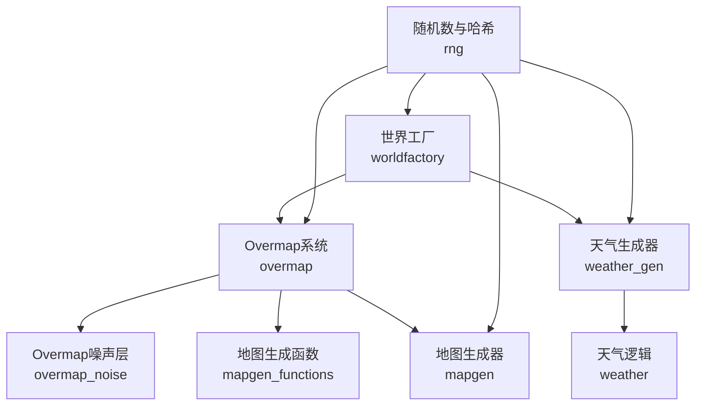
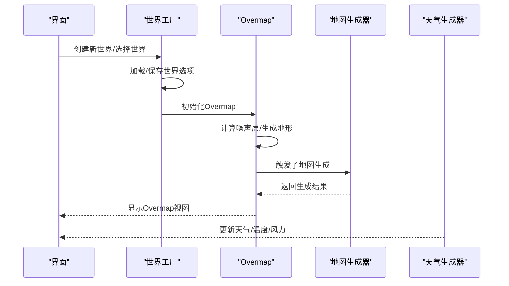
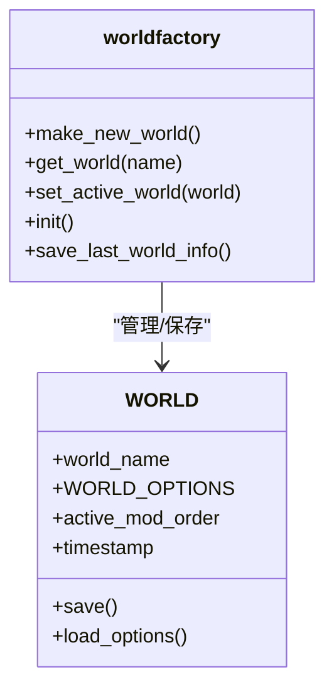
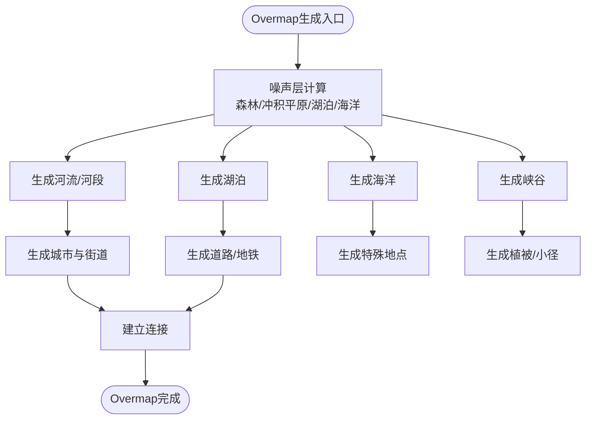
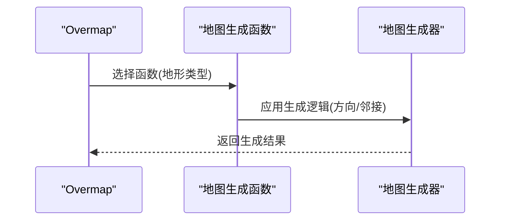
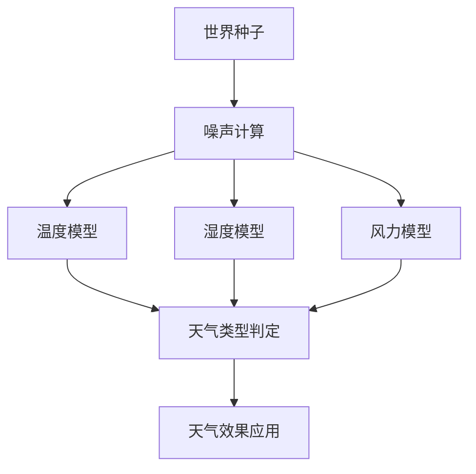
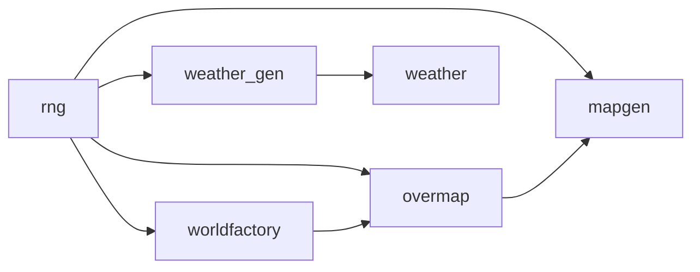

# 世界生成系统

<cite>
**本文档引用的文件**
- worldfactory.cpp
- worldfactory.h
- overmap.cpp
- overmap.h
- weather.cpp
- weather.h
- weather_gen.cpp
- weather_gen.h
- mapgen.cpp
- mapgen_functions.cpp
- mapgen_functions.h
- overmap_noise.cpp
- options.cpp
- rng.cpp
</cite>

## 目录
1. [引言](#引言)
2. [项目结构](#项目结构)
3. [核心组件](#核心组件)
4. [架构总览](#架构总览)
5. [详细组件分析](#详细组件分析)
6. [依赖关系分析](#依赖关系分析)
7. [性能考虑](#性能考虑)
8. [故障排除指南](#故障排除指南)
9. [结论](#结论)
10. [附录](#附录)

## 引言
本技术文档系统性阐述Cataclysm-DDA的世界生成系统，覆盖以下主题：
- 世界种子与随机性：种子来源、哈希与伪随机序列
- 地形生成：噪声层（森林、冲积平原、湖泊、海洋）与地貌特征（河流、湖泊、海洋、峡谷）
- 资源分布与特殊地点：城市、道路、地铁、特殊建筑与怪物群落
- 天气系统：温度、湿度、风力、降水与季节变化
- Overmap系统：城市生成、道路网络、植被分布与连接
- 地图生成函数与参数：可配置的地图生成器与参数传递
- 参数调优与性能优化：世界生成参数、噪声权重与运行时开销
- 自定义扩展：如何添加新的Overmap特殊、噪声层与地图生成函数

## 项目结构
世界生成系统由多个模块协同完成：
- 世界工厂与世界选项：负责世界生命周期、选项持久化与UI交互
- Overmap系统：负责大世界层面的地形、城市、道路、连接与特殊地点放置
- 地图生成：负责子地图（小世界）内的地形、设施与内容生成
- 天气系统：负责全局天气、温度、风力与降水的计算与表现
- 噪声与随机：提供噪声层与随机数工具，支撑地形与资源分布

**图表来源**
- worldfactory.cpp
- overmap.cpp
- weather_gen.cpp
- mapgen_functions.cpp
- mapgen.cpp
- overmap_noise.cpp
- rng.cpp

**章节来源**
- worldfactory.cpp
- overmap.cpp
- weather_gen.cpp
- mapgen_functions.cpp
- mapgen.cpp
- overmap_noise.cpp
- rng.cpp

## 核心组件
- 世界工厂与世界选项
  - 管理世界创建、保存、加载与UI交互
  - 维护世界选项容器与模组列表
- Overmap系统
  - 负责大世界（Overmap）层面的地形、城市、道路、连接与特殊地点
  - 提供噪声层、河流、湖泊、海洋、峡谷等生成流程
- 地图生成器与函数
  - 子地图（小世界）内地形与设施生成
  - 内置地图生成函数（森林、河流、地铁、湖岸等）
- 天气生成器与天气逻辑
  - 基于Simplex噪声的温度、湿度、风力与降水模型
  - 季节变化与白/黑名单控制天气类型
- 随机数与哈希
  - 提供概率判断、骰子模拟与世界种子哈希

**章节来源**
- worldfactory.h
- overmap.h
- mapgen_functions.h
- weather_gen.h
- rng.cpp

## 架构总览
世界生成从“世界工厂”开始，依据世界选项与种子生成Overmap；Overmap再驱动地图生成器在子地图中生成具体设施与内容；同时天气生成器为整个世界提供动态天气。

**图表来源**
- worldfactory.cpp
- overmap.cpp
- mapgen.cpp
- weather_gen.cpp

## 详细组件分析

### 世界工厂与世界种子
- 世界工厂负责世界创建、保存与加载，维护世界选项容器与模组顺序
- 世界名称与时间戳管理，支持复制现有世界
- 世界种子通过随机数引擎与哈希函数生成，确保可重现性

**图表来源**
- worldfactory.h
- worldfactory.cpp

**章节来源**
- worldfactory.cpp
- worldfactory.h
- options.cpp
- rng.cpp

### Overmap系统与地形生成
- Overmap系统负责大世界层面的地形与设施生成
- 噪声层用于控制森林、冲积平原、湖泊与海洋的分布
- 河流、湖泊、海洋与峡谷的生成遵循边界与邻接规则
- 城市与道路网络通过连接与街道构建算法生成

**图表来源**
- overmap.cpp
- overmap.cpp
- overmap.cpp
- overmap.cpp
- overmap.cpp
- overmap.cpp
- overmap_noise.cpp

**章节来源**
- overmap.cpp
- overmap.h
- overmap_noise.cpp

### 地图生成函数与参数
- 内置地图生成函数映射到Overmap地形类型（如森林、河流、地铁、湖岸、海岸）
- 地图生成参数通过mapgen_arguments传递，支持合并与序列化
- 地图生成函数根据方向与邻接关系旋转与适配地形

**图表来源**
- mapgen_functions.cpp
- mapgen_functions.cpp
- mapgen_functions.h
- mapgen.cpp

**章节来源**
- mapgen_functions.cpp
- mapgen_functions.cpp
- mapgen_functions.h
- mapgen.cpp

### 天气系统与季节变化
- 天气生成器基于Simplex噪声计算温度、湿度、气压与风力
- 季节性温度与湿度修正，风向按季节分布采样
- 天气类型由条件对话系统判定，支持黑白名单过滤
- 天气对角色的影响（眩光、湿润、风寒）与广播预报

**图表来源**
- weather_gen.cpp
- weather_gen.cpp
- weather_gen.cpp
- weather.cpp
- weather.h

**章节来源**
- weather_gen.cpp
- weather_gen.h
- weather.cpp
- weather.h

## 依赖关系分析
- 世界工厂依赖随机数与选项系统，以保证世界选项与种子一致
- Overmap系统依赖噪声层与地图生成函数，以生成地形与设施
- 地图生成器依赖Overmap提供的上下文与参数
- 天气生成器独立于Overmap，但受世界种子影响
- 所有模块共享随机数与哈希工具

**图表来源**
- rng.cpp
- worldfactory.cpp
- overmap.cpp
- mapgen.cpp
- weather_gen.cpp
- weather.cpp

**章节来源**
- rng.cpp
- worldfactory.cpp
- overmap.cpp
- mapgen.cpp
- weather_gen.cpp
- weather.cpp

## 性能考虑
- 噪声计算与随机数生成是主要开销点，建议：
  - 合理降低噪声层数或频率
  - 缓存天气与地形查询结果
  - 在生成过程中避免重复计算
- Overmap生成可通过分块与延迟加载减少内存占用
- 地图生成函数应尽量使用批量操作与预分配
- 天气更新频率可按需调整，避免每帧都重算

[本节为通用指导，无需特定文件引用]

## 故障排除指南
- 世界无法保存/加载
  - 检查世界目录权限与路径
  - 确认世界选项序列化成功
- Overmap生成异常
  - 检查噪声层参数与种子一致性
  - 确认邻接Overmap已正确加载
- 天气异常
  - 检查天气生成器的白/黑名单配置
  - 确认世界种子未被修改
- 地图生成失败
  - 检查地图生成函数映射与参数传递
  - 确认方向与邻接关系正确

**章节来源**
- worldfactory.cpp
- overmap.cpp
- weather_gen.cpp
- mapgen_functions.cpp

## 结论
Cataclysm-DDA的世界生成系统通过“世界工厂—Overmap—地图生成—天气”的分层设计，实现了可配置、可扩展且高性能的大世界生成。噪声层与Simplex噪声为地形与气候提供了自然的随机性，而地图生成函数与参数系统则保证了内容的多样性与可控性。通过合理的参数调优与性能优化，可在保证质量的同时提升生成效率。

[本节为总结，无需特定文件引用]

## 附录

### 世界生成参数与调优要点
- 世界选项（隐藏参数示例）
  - 城市规模、城市间距、刷怪密度、物品刷新率、NPC生成时间、怪物速度与韧性、进化倍数等
- Overmap噪声层
  - 森林噪声、冲积平原噪声、湖泊噪声、海洋噪声的频率与幅度
- 地图生成函数
  - 通过参数传递控制生成范围与密度
- 天气生成
  - 基线温度/湿度/气压、风速分布、季节修正与风向分布

**章节来源**
- options.cpp
- overmap_noise.cpp
- mapgen_functions.cpp
- weather_gen.cpp