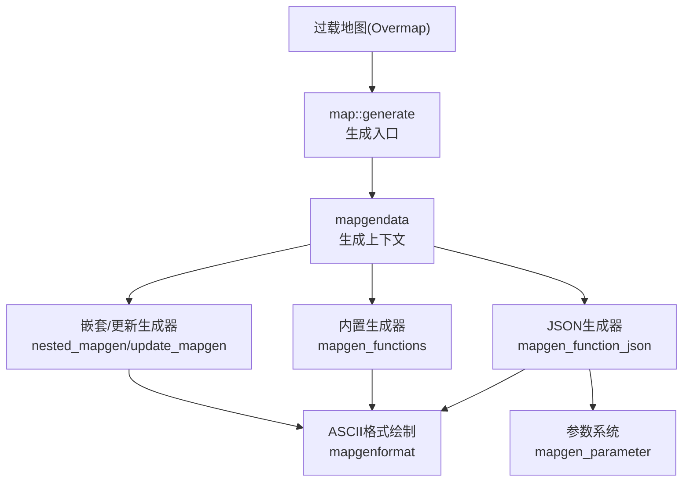
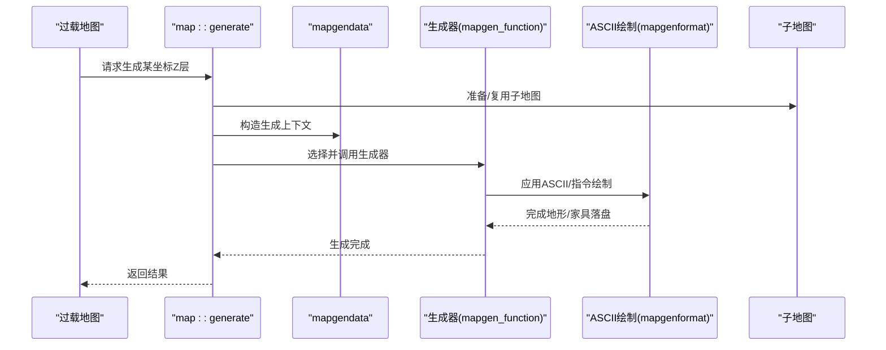
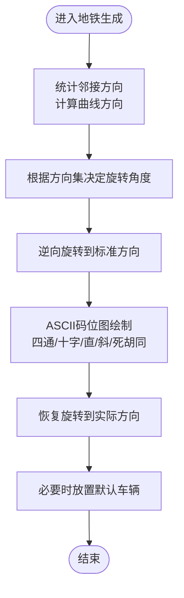
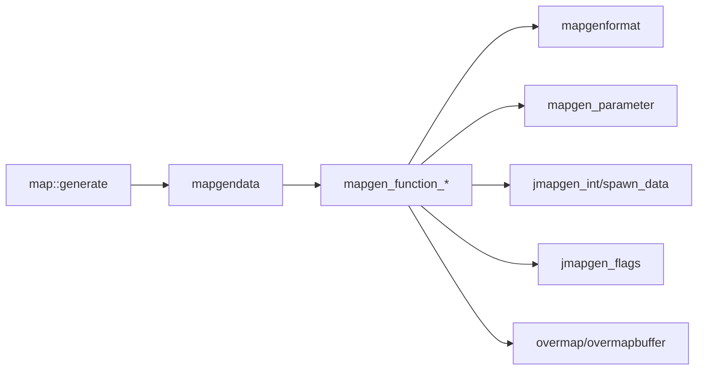
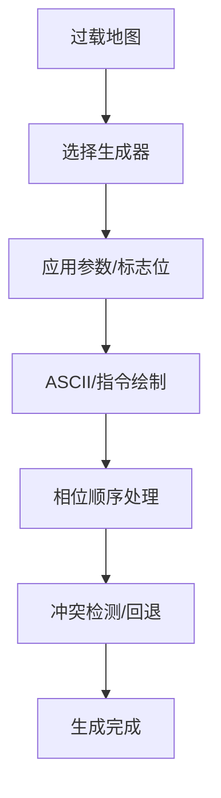

# 地图生成

<cite>
**本文引用的文件**
- src/mapgen.cpp
- src/mapgen.h
- src/mapgen_functions.cpp
- src/mapgen_functions.h
- src/mapgendata.cpp
- src/mapgendata.h
- src/mapgenformat.cpp
- src/mapgenformat.h
- src/mapgen_parameter.h
- src/mapgen_primitives.h
- src/jmapgen_flags.h
- src/mapgen.cpp
- src/mapgen_functions.cpp
- src/mapgendata.cpp
- src/mapgenformat.cpp
- src/mapgen_parameter.h
- src/mapgen_primitives.h
- src/jmapgen_flags.h
</cite>

## 目录
1. [引言](#引言)
2. [项目结构](#项目结构)
3. [核心组件](#核心组件)
4. [架构总览](#架构总览)
5. [详细组件分析](#详细组件分析)
6. [依赖关系分析](#依赖关系分析)
7. [性能考量](#性能考量)
8. [故障排查指南](#故障排查指南)
9. [结论](#结论)
10. [附录](#附录)

## 引言
本文件系统性梳理 Cataclysm-DDA 的地图生成体系，覆盖从过载地图（Overmap）到子地图（Submap）的生成流程，重点解释以下方面：
- 地图生成函数族：内置地形特定生成器（如地铁、河流、森林）、JSON 驱动的生成器与嵌套/更新型生成器。
- 房间生成、走廊连接与特殊区域创建的实现原理与数据流。
- 地图格式系统：ASCII 码位图与字符到地形/家具映射、JSON 配置解析与校验。
- 模板继承与组合：参数化、权重计算、前置条件与继承链。
- 错误处理与回滚策略：冲突检测、失败回退与调试日志。
- 调试方法与性能优化：参数注入、可视化调试、生成器权重与边界处理。

## 项目结构
地图生成相关代码主要集中在 src 目录下，按职责分为：
- 顶层调度与生命周期：map::generate、draw_map、mapgendata 生命周期与参数传递。
- 生成器接口与类型：mapgen_function、mapgen_function_json、nested/update 等。
- 基础设施：ASCII 格式绘制工具、参数系统、整数区间包装等。
- 内置生成器：地铁、河流、森林等专用生成函数。

图表来源
- src/mapgen.cpp
- src/mapgen.h
- src/mapgen_functions.cpp
- src/mapgenformat.cpp
- src/mapgen_parameter.h

章节来源
- src/mapgen.cpp
- src/mapgen.h

## 核心组件
- mapgen_function 与派生类
  - mapgen_function：抽象基类，定义 setup/finalize/check/generate 等生命周期钩子。
  - mapgen_function_builtin：内置函数指针封装，用于地形特定生成器。
  - mapgen_function_json：基于 JSON 的生成器，支持 setmap、对象放置、参数合并与校验。
  - mapgen_function_json_nested/update：嵌套与更新型生成器，支持旋转/镜像/权重选择。
- mapgendata：生成上下文，承载位置、邻接地形、区域设置、参数与标志位。
- mapgenformat：ASCII 码位图绘制工具，将字符映射为地形/家具。
- 参数系统：mapgen_parameter 与 mapgen_parameters，支持作用域（overmap_special/omt/omt_stack/nest）与默认值。
- 原语：jmapgen_int 区间包装、spawn_data 巡逻点等。

章节来源
- src/mapgen.h
- src/mapgen.h
- src/mapgen.h
- src/mapgendata.h
- src/mapgenformat.h
- src/mapgen_parameter.h
- src/mapgen_primitives.h

## 架构总览
地图生成采用“过载地图驱动 + 子地图生成 + JSON/ASCII 绘制”的分层架构。生成入口在 map::generate，随后根据地形类型选择内置或 JSON 生成器；生成器内部通过 mapgenformat 将 ASCII 码位图或 setmap 指令落盘到 map 上；参数系统贯穿全局，支持不同作用域的参数合并与校验。

图表来源
- src/mapgen.cpp
- src/mapgen.h
- src/mapgenformat.cpp

## 详细组件分析

### 1) 生成入口与生命周期：map::generate
- 负责准备子地图缓冲、按 Z 层从上至下生成、叠加覆盖层、合并结果。
- 对于非均匀地形，调用 draw_map 执行具体生成逻辑；对均匀地形直接填充。
- 支持保存/复用已有子地图，避免重复生成。

章节来源
- src/mapgen.cpp

### 2) 生成上下文：mapgendata
- 提供地形邻接信息（8 方向）、区域设置、时间密度、任务指针、预生成器序列、连接标记等。
- 支持复制构造：以新 terrain_type 或参数/标志位重定向生成上下文，便于“先基础后细化”的流水线。
- 提供 get_arg/get_arg_or 获取参数，支持多类型提取。

章节来源
- src/mapgendata.h
- src/mapgendata.cpp

### 3) 生成器接口与类型
- mapgen_function：统一生命周期与检查接口。
- mapgen_function_builtin：内置函数指针封装，权重固定。
- mapgen_function_json：核心 JSON 生成器，支持：
  - setmap 指令（点/线/方块）：地形/家具/陷阱/辐射/移除等。
  - 对象放置（jmapgen_objects）：按相位顺序应用（移除/地形/家具/default/nested/transform/派系/区域）。
  - 参数合并与校验：按作用域合并参数，检查一致性。
  - 嵌套/更新：nested_mapgen 与 update_mapgen_function_json。
- mapgen_function_json_nested：嵌套生成器，支持旋转。
- update_mapgen_function_json：更新型生成器，支持镜像/旋转/冲突检测。

章节来源
- src/mapgen.h
- src/mapgen.h
- src/mapgen.h
- src/mapgen.h

### 4) ASCII 格式绘制：mapgenformat
- formatted_set_simple：将 ASCII 字符串按行扫描，逐字符映射到地形/家具。
- format_effect：字符到 ID 的映射表，支持空位（NULL）跳过。
- 特殊处理：如马桶 f_toilet 的特殊放置逻辑。

章节来源
- src/mapgenformat.h
- src/mapgenformat.cpp

### 5) 参数系统：mapgen_parameter 与 mapgen_parameters
- 支持作用域：overmap_special → omt → omt_stack → nest。
- 默认值与类型约束：通过 `mapgen_value<string>` 与 cata_variant 类型系统。
- 合并与校验：按作用域合并，检查一致性，生成 mapgen_arguments。

章节来源
- src/mapgen_parameter.h

### 6) 内置生成器：地铁、河流、森林
- 地铁（mapgen_subway）
  - 根据邻接地形确定方向集合与曲线方向，计算旋转角度，使用 ASCII 码位图绘制不同形状（四通/十字/直/斜/死胡同），最后回转恢复方向。
  - 支持在死胡同端点放置默认车辆刷怪组。
- 河流（mapgen_river_*）
  - 曲折/直/反向不连段等不同地形类型，通过旋转将通用逻辑归一到标准方向，再绘制水深/浅岸/草皮过渡。
- 森林（mapgen_forest）
  - 基于区域生物群系邻接因子与高斯扰动，计算边界深度与曲率，生成自然过渡的森林边缘。

图表来源
- src/mapgen_functions.cpp

章节来源
- src/mapgen_functions.cpp

### 7) 房间生成、走廊连接与特殊区域
- 房间生成
  - 使用 mapgen_function_json 的对象放置与 setmap 指令，结合相位顺序（terrain/furniture/default）实现房间墙体、地面、家具布置。
  - 可通过参数系统控制房间尺寸、材料、变体权重。
- 走廊连接
  - 通过 setmap 的线性绘制（line_ter/line_furn）沿连接路径铺设地板/墙/门。
  - 结合 room 类型枚举与连接判断函数，确保相邻房间正确对接。
- 特殊区域（实验室/塔楼/中央实验室）
  - 基于 overmap 与邻接地形匹配，选择模板（如 lab_1side/lab_finale_1level），若无 JSON 模板则回退到硬编码绘制。
  - 边界处理：当模板无法覆盖边界时，由代码补画门/楼梯/墙体。

章节来源
- src/mapgen.cpp
- src/mapgen.h

### 8) 地图格式系统与 JSON 解析
- setmap 指令
  - 支持点/线/方块三类操作，分别对应地形/家具/陷阱/辐射/移除等。
  - 支持 chance/repeat/字符串值，实现概率与重复放置。
- 对象放置
  - jmapgen_objects.load_objects 从 JSON 数组加载，按相位顺序应用，支持 bounds 检查与碰撞检测。
- 校验与检查
  - setup/check/check_consistent_with：确保生成器定义与 overmap_terrain 一致，参数合法，相位顺序正确。
- 权重与继承
  - 计算权重（calculate_mapgen_weights），支持继承与 palette 合并，避免循环引用。

章节来源
- src/mapgen.h
- src/mapgen.h
- src/mapgen.h

### 9) 模板继承与组合机制
- 嵌套生成器（nested_mapgen）
  - 多个候选生成器按权重随机选择，支持旋转，适合复杂建筑的随机变体。
- 更新生成器（update_mapgen）
  - 在已生成地图上进行增量修改，支持镜像/旋转/冲突检测，避免与现有车辆/陷阱等发生碰撞。
- 参数继承
  - 通过 mapgen_parameters.params_for_scope 与 get_args，按作用域合并参数，支持默认值与类型约束。

章节来源
- src/mapgen.h
- src/mapgen.h
- src/mapgen_parameter.h

### 10) 错误处理与回滚策略
- 冲突检测
  - jmapgen_piece/has_vehicle_collision：在应用对象/指令前检测与现有车辆/陷阱的冲突，返回冲突对象名称。
  - update_mapgen_function_json.update_map：支持 verify 模式，返回冲突车辆名。
- 回退与降级
  - 无可用 JSON 模板时，回退到硬编码绘制（如实验室 finale/1边）。
  - 参数不一致或越界时，抛出错误或记录 debugmsg 并跳过该生成器。
- 日志与调试
  - 使用 D_MAP_GEN 调试通道输出生成过程，定位问题。

章节来源
- src/mapgen.h
- src/mapgen.h
- src/mapgen.cpp

### 11) 地图生成参数调试方法
- 注入参数
  - 通过 overmap_special 与 mapgen_arguments 合并，使用 get_arg/get_arg_or 获取参数值。
- 可视化调试
  - palette 调试视图（debug_palettes），查看字符到对象的映射。
- 参数校验
  - check_mapgen_definitions/check：在加载阶段执行参数与生成器一致性检查。
- 作用域调试
  - 分别在 overmap_special/omt/omt_stack/nest 作用域下验证参数生效范围。

章节来源
- src/mapgendata.h
- src/mapgen.h
- src/mapgen.h

### 12) 性能优化技巧
- 生成顺序优化
  - 先基础后细化：先生成地形/家具，再应用 nested/transform，减少重复绘制。
- 绘制批量化
  - 使用 ASCII 码位图批量绘制，避免逐格调用 ter_set/furn_set。
- 权重与缓存
  - 合理设置权重，避免大量低概率生成器占用 CPU。
  - 利用子地图复用与均匀地形快速填充，减少重复计算。
- 边界处理
  - 对于实验室等需要精确边界的区域，优先使用 JSON 模板，避免硬编码分支。

章节来源
- src/mapgenformat.cpp
- src/mapgen.cpp

### 13) 自定义地图类型的开发指南
- 新增 JSON 生成器
  - 在 JSON 中定义生成器，使用 setmap/objects/parameters 字段。
  - 在 mapgen_function_json::setup 中注册新的对象类型与映射。
- 新增内置生成器
  - 实现函数指针签名，注册到 get_mapgen_cfunction 映射。
- 参数与继承
  - 定义 mapgen_parameter，指定作用域与默认值，确保与生成器一致。
- 测试与校验
  - 使用 check_mapgen_consistent_with 与 check_mapgen_definitions 进行静态校验。
- 冲突与回退
  - 实现 has_vehicle_collision，必要时提供回退方案（硬编码绘制）。

章节来源
- src/mapgen.h
- src/mapgen.h

## 依赖关系分析
- 组件耦合
  - map::generate 依赖 mapgendata、oter/overmap_buffer、子地图管理。
  - 生成器依赖 mapgenformat 进行绘制，依赖参数系统与标志位。
  - 内置生成器依赖 mapgen_functions 的辅助函数（旋转、NESW 数组）。
- 外部依赖
  - overmap/overmapbuffer 提供邻接地形与区域设置。
  - JSON 解析与校验框架（JsonObject/JsonArray）贯穿生成器定义与参数系统。

图表来源
- src/mapgen.cpp
- src/mapgen.h
- src/mapgenformat.h
- src/mapgen_parameter.h
- src/mapgen_primitives.h
- src/jmapgen_flags.h

章节来源
- src/mapgen.cpp
- src/mapgen.h

## 性能考量
- 绘制成本
  - ASCII 码位图批量绘制比逐格绘制更高效；尽量减少重复绘制与跨相位多次落盘。
- 生成器选择
  - 合理设置权重，避免大量低概率生成器；对均匀地形直接填充，减少复杂逻辑。
- 参数与校验
  - 在加载阶段完成参数合并与校验，运行时避免重复计算。
- 边界与回退
  - 优先使用模板，减少硬编码分支；对必须硬编码的区域，集中在一个函数内处理。

## 故障排查指南
- 常见问题
  - 生成器未生效：检查 has_mapgen_for 与 check_mapgen_consistent_with。
  - 参数缺失：使用 get_arg_or 提供默认值，或在 overmap_special 中注入。
  - 冲突：启用 update_map 的 verify 模式，查看冲突对象名称。
  - 越界/非法索引：检查 jmapgen_int 区间与边界检查函数。
- 调试建议
  - 开启 D_MAP_GEN 调试通道，观察生成步骤。
  - 使用 palette 调试视图核对字符映射。
  - 分阶段注释生成器，定位问题模块。

章节来源
- src/mapgen.h
- src/mapgen.h
- src/mapgen.h

## 结论
Cataclysm-DDA 的地图生成体系以 map::generate 为核心，通过 mapgendata 提供上下文，借助 mapgen_function 族与 mapgenformat 实现灵活而高效的绘制。JSON 驱动的生成器与参数系统提供了强大的可扩展性，内置生成器与硬编码回退保证了稳定性。通过合理的参数设计、冲突检测与调试手段，开发者可以高效地构建复杂且可维护的地图类型。

## 附录
- 关键流程图（概念性）
