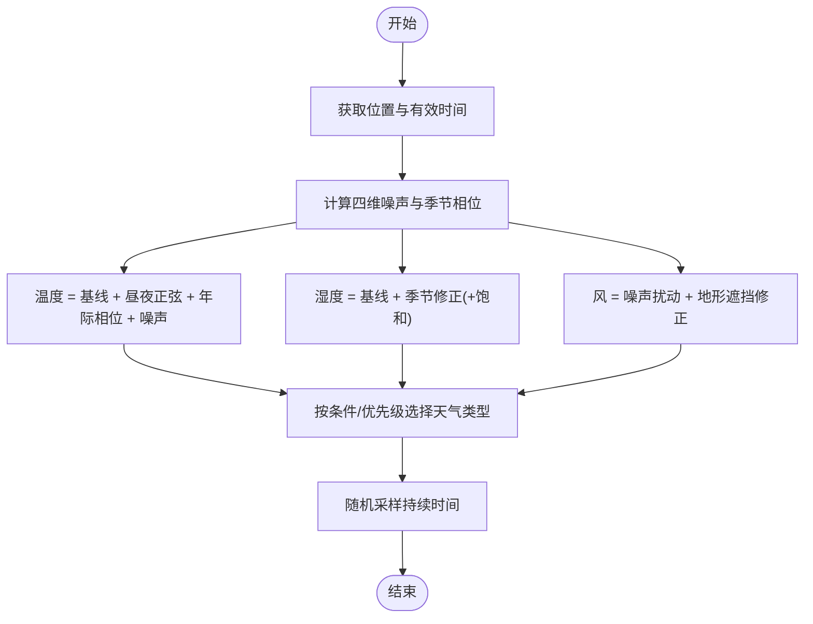

# 天气系统

<cite>
**本文引用的文件**
- weather.h
- weather.cpp
- weather_gen.h
- weather_gen.cpp
- weather_type.h
- weather_type.cpp
- weather_test.cpp
</cite>

## 目录
1. [简介](#简介)
2. [项目结构](#项目结构)
3. [核心组件](#核心组件)
4. [架构总览](#架构总览)
5. [详细组件分析](#详细组件分析)
6. [依赖关系分析](#依赖关系分析)
7. [性能考量](#性能考量)
8. [故障排查指南](#故障排查指南)
9. [结论](#结论)
10. [附录](#附录)

## 简介
本技术文档围绕 Cataclysm-DDA 的天气系统展开，系统性解析天气生成算法、随机事件概率与时间序列生成、季节变化机制（年周期、季节转换、气候模式）、环境影响计算（温度、降水、能见度等）、天气数据的存储与传输、配置方法与调试技巧，以及如何扩展自定义天气类型。文档面向开发者与模组制作者，兼顾可读性与工程实践。

## 项目结构
天气系统由三大模块协同工作：
- 天气生成器：负责基于位置、时间与种子生成天气要素（温度、湿度、风速/向、气压）并判定天气类型。
- 天气类型定义：通过 JSON 配置描述天气外观、效果、持续时间、触发条件等。
- 天气管理器：维护当前天气状态、更新周期、缓存与序列化。

**图表来源**
- weather_gen.h
- weather_type.h
- weather.h

**章节来源**
- weather_gen.h
- weather_type.h
- weather.h

## 核心组件
- 天气生成器 weather_generator
  - 负责温度、湿度、气压、风速/风向的生成与天气类型判定。
  - 支持白名单/黑名单过滤天气类型，按优先级排序。
  - 提供测试输出 CSV 的工具函数。
- 天气类型 weather_type
  - 描述天气名称、颜色、符号、命中惩罚、能见度惩罚、光照修正、声音衰减、危险性、降水等级、动画与音效类别、持续时间范围、触发条件等。
  - 通过工厂模式从 JSON 加载与校验。
- 天气管理器 weather_manager
  - 维护当前天气、温度、风向/速度、下次切换时间、缓存与覆盖项。
  - 周期性调用生成器更新天气，处理危险天气对玩家活动的打断与透明度缓存刷新。

**章节来源**
- weather_gen.h
- weather_type.h
- weather.h

## 架构总览
天气系统在每回合或按需更新时，由天气管理器调用天气生成器，生成当前位置与时间的天气点数据，再根据天气类型规则选择最终天气。随后应用环境影响（如降水收集、眩光、风阻、体感温度等），并更新 UI 缓存与状态。

**图表来源**
- weather.cpp
- weather_gen.cpp
- weather_type.h

## 详细组件分析

### 天气生成器（weather_generator）
- 温度模型
  - 基线温度由“基础温度 + 季节手动修正 + 日周期正弦扰动 + 年际相位扰动”构成。
  - 引入四维噪声作为日随机扰动，控制昼夜与年际波动幅度。
  - 水温模型基于“年均水温正弦变化 + 日内小时相位变化”，用于水域附近环境。
- 湿度与气压
  - 湿度按季节手动修正；强降水天气下自动提升至饱和。
  - 气压为配置项，当前实现中未见动态计算逻辑。
- 风
  - 使用四维噪声生成风力扰动，结合季节性分布峰值与地形遮挡修正。
  - 风向使用静态缓存与转换函数，支持方向字符串与箭头显示。
- 天气类型判定
  - 基于白/黑名单与优先级排序，结合天气类型自身的条件函数与所需前置天气进行筛选。
  - 持续时间在最小/最大范围内随机采样，形成时间序列。

**图表来源**
- weather_gen.cpp
- weather_gen.cpp
- weather_gen.cpp

**章节来源**
- weather_gen.cpp
- weather_gen.cpp
- weather_gen.cpp

### 天气类型（weather_type）
- 关键字段
  - 名称、颜色、符号、地图颜色与符号。
  - 射程惩罚、视野惩罚、光照修正（加法/乘法）、太阳辐射倍率。
  - 危险性、降水等级（无/微/轻/重）、是否下雨、动画与音效类别。
  - 持续时间范围、触发条件函数、所需前置天气列表、调试标识。
- 加载与校验
  - 通过通用工厂类加载，支持动画子对象、条件表达式、边界检查（最小不大于最大）。
  - 运行前统一 finalize，确保必要 ID（clear/null）存在。

**图表来源**
- weather_type.h
- weather_type.cpp

**章节来源**
- weather_type.h
- weather_type.cpp

### 天气管理器（weather_manager）
- 职责
  - 获取当前区域的天气生成器实例，生成并选择天气类型，设置温度、风向/风速与下次切换时间。
  - 处理“永恒天气”选项与覆盖项，触发环境影响与 UI 缓存刷新。
  - 提供温度查询缓存，按坐标缓存户外/室内温度。
- 更新流程
  - 当天气为空或到达切换时间，重新生成天气点并选择天气类型。
  - 若天气改变，刷新透明度缓存、触发相关效果处理。

**图表来源**
- weather.cpp

**章节来源**
- weather.h
- weather.cpp

### 环境影响计算
- 降水收集与漏斗
  - 根据降水强度与漏斗表面积计算每回合充能，按概率填充容器，支持反向推算历史时段的集水量。
- 眩光与光照
  - 根据太阳辐照度与天气光照倍率计算地面辐照，结合季节与雪地条件施加眩光效果。
- 风阻与体感
  - 风速受地形遮挡与海拔修正；体感温度采用冷风/热风模型，考虑湿度与风速。
- 能见度与光照
  - 天气类型提供视野惩罚与光照修正，影响透明度缓存与 UI 显示。

**图表来源**
- weather.cpp
- weather.cpp
- weather.cpp
- weather.cpp

**章节来源**
- weather.cpp
- weather.cpp
- weather.cpp
- weather.cpp

### 季节变化机制
- 年周期与相位
  - 使用年相位与昼夜相位构造温度曲线，结合季节性峰值与日周期正弦扰动，形成昼夜与年际变化。
- 季节转换
  - 依据有效时间计算当前季节，配合手动修正项与噪声扰动，实现自然过渡。
- 水温模型
  - 年均水温随季节正弦变化，日内附加小时相位变化，用于水域环境模拟。

**图表来源**
- weather_gen.cpp
- weather_gen.cpp

**章节来源**
- weather_gen.cpp
- weather_gen.cpp

### 天气数据存储与传输
- 数据结构
  - w_point：包含温度、湿度、气压、风速、风向、风描述、时间与位置。
  - weather_generator：配置项（基础温度/湿度/气压/风速、季节修正、风分布参数、白/黑名单、排序）。
  - weather_type：UI 属性、环境影响、动画与音效、持续时间、触发条件。
- 序列化
  - 提供静态序列化/反序列化接口，便于保存/加载天气状态与生成器配置。

**章节来源**
- weather_gen.h
- weather_gen.h
- weather_type.h
- weather.h

### 配置方法与调试技巧
- 区域设置（weather_generator）
  - 基础温度/湿度/气压/风速、风分布峰值、季节性温度/湿度修正、风季节变化系数、天气白/黑名单、排序。
- 天气类型（weather_type）
  - 名称、颜色、符号、射程/视野惩罚、光照修正、太阳倍率、声音衰减、危险性、降水等级、是否下雨、动画与音效、持续时间、触发条件、所需前置天气。
- 调试
  - 使用生成器的测试输出功能导出一年天气数据到 CSV，辅助统计昼夜/年际波动与降水比例。
  - 测试用例验证风寒/体感模型、昼夜温差、夏季/冬季差异、降水频率等现实一致性。

**章节来源**
- weather_gen.cpp
- weather_type.cpp
- weather_test.cpp
- weather_test.cpp

### 自定义天气类型的扩展方法
- 定义步骤
  - 在 JSON 中声明 weather_type，填写必要字段（名称、ID、符号、惩罚、光照、降水、动画、音效、持续时间、触发条件等）。
  - 可选：添加 required_weathers 限制前置天气；通过 condition 函数实现复杂触发逻辑。
  - 加载后执行 finalize，确保一致性检查通过。
- 排序与生效
  - 生成器会根据白/黑名单与优先级排序，最终按条件筛选生效。
  - 如需强制出现，可加入白名单并提高优先级。

**章节来源**
- weather_type.cpp
- weather_type.cpp
- weather_gen.cpp

## 依赖关系分析
- weather_manager 依赖 weather_generator 提供天气点与类型选择。
- weather_generator 依赖 weather_type 列表进行筛选与排序。
- weather_type 通过工厂模式加载，依赖条件表达式与枚举序列化。
- weather.cpp 提供环境影响与 UI/地图交互，依赖天气生成结果。

**图表来源**
- weather.h
- weather_gen.h
- weather_type.h

**章节来源**
- weather.h
- weather_gen.h
- weather_type.h

## 性能考量
- 计算开销
  - 温度/湿度/风速生成涉及三角函数与噪声，但仅在切换天气或查询时发生，频率可控。
  - 降水收集与眩光判定按需触发，避免每帧重复昂贵计算。
- 缓存策略
  - 天气管理器维护温度缓存与透明度缓存，减少重复计算。
  - 风向/风速在更新后复用，避免频繁生成。
- 优化建议
  - 对于高频查询（如多坐标温度），可扩大缓存范围或分层缓存。
  - 将噪声与三角函数结果缓存于短周期内，降低重复计算。

[本节为通用指导，无需特定文件分析]

## 故障排查指南
- 天气不变化
  - 检查是否启用“永恒天气”选项；确认 weather_manager 的切换时间是否被覆盖。
- 天气类型异常
  - 核对 weather_type 的 condition 与 required_weathers 是否满足；检查白/黑名单与优先级。
- 降水/眩光异常
  - 核对降水等级与阈值；检查光照倍率与太阳辐照；确认地形遮挡与海拔修正。
- 风速/风向异常
  - 检查风分布峰值与季节变化系数；确认地形遮挡标志与相邻格阻挡。

**章节来源**
- weather.cpp
- weather.cpp
- weather.cpp

## 结论
Cataclysm-DDA 的天气系统以可配置的天气类型为核心，结合基于时间与位置的噪声生成器，实现了昼夜与年际的自然变化、降水与眩光等环境影响，并通过管理器统一调度与缓存优化。通过 JSON 扩展与测试工具，开发者可以灵活定制天气行为并验证现实一致性。

[本节为总结，无需特定文件分析]

## 附录
- 关键 API 与路径
  - 天气生成：weather_gen.cpp
  - 天气类型加载：weather_type.cpp
  - 管理器更新：weather.cpp
  - 环境影响：weather.cpp, weather.cpp, weather.cpp
  - 测试与验证：weather_test.cpp, weather_test.cpp

[本节为索引，无需特定文件分析]