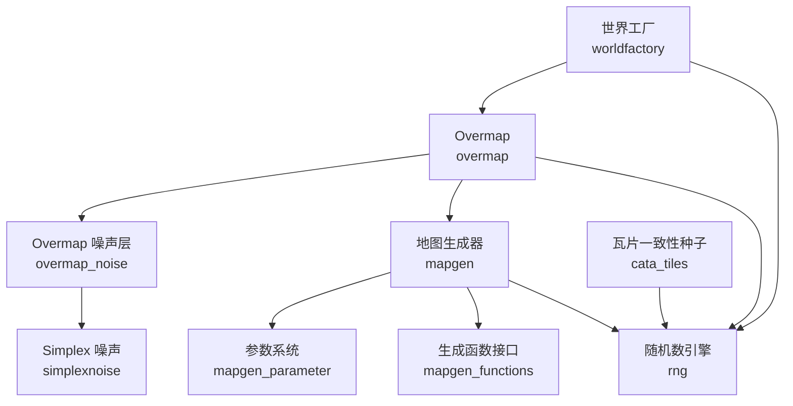
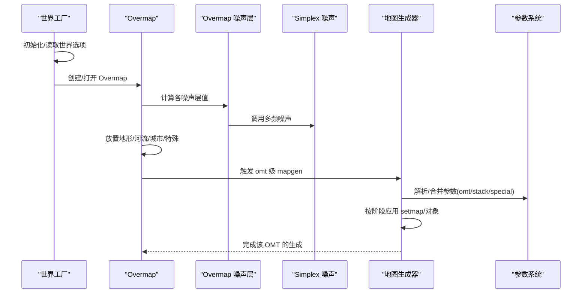
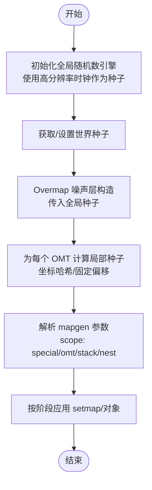
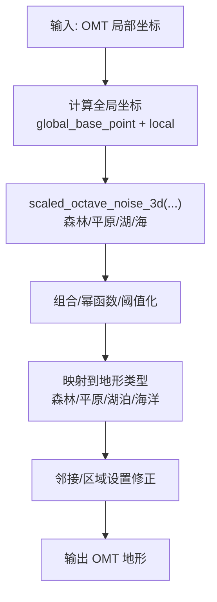
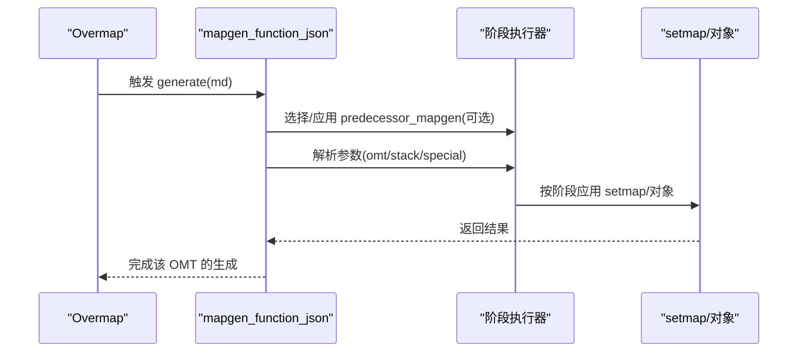
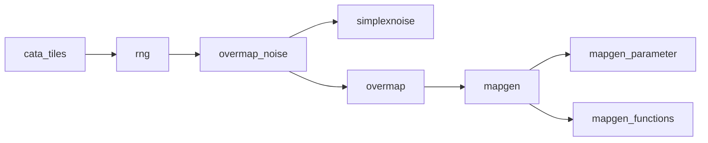

# 程序化生成

<cite>
**本文引用的文件**   
- src/worldfactory.h
- src/worldfactory.cpp
- src/overmap.h
- src/overmap.cpp
- src/overmap_noise.h
- src/overmap_noise.cpp
- src/simplexnoise.h
- src/simplexnoise.cpp
- src/mapgen.h
- src/mapgen.cpp
- src/mapgen_functions.h
- src/mapgen_parameter.h
- src/rng.h
- src/rng.cpp
- src/cata_tiles.cpp
</cite>

## 目录
1. [引言](#引言)
2. [项目结构](#项目结构)
3. [核心组件](#核心组件)
4. [架构总览](#架构总览)
5. [详细组件分析](#详细组件分析)
6. [依赖关系分析](#依赖关系分析)
7. [性能考量](#性能考量)
8. [故障排查指南](#故障排查指南)
9. [结论](#结论)
10. [附录：参数与调优建议](#附录参数与调优建议)

## 引言
本文件系统性梳理 Cataclysm-DDA 的程序化生成体系，覆盖世界种子与随机数、Overmap 地形噪声、地图生成流程与参数、资源与建筑分布规则、以及性能优化与扩展实践。目标是帮助开发者与模组制作者在不深入源码的前提下理解整体工作流，并提供可操作的参数调优与扩展指南。

## 项目结构
围绕程序化生成的关键代码主要分布在以下模块：
- 世界工厂与种子：worldfactory（世界创建、选项持久化）
- Overmap 生成：overmap（大世界分块生成、特殊地物放置、噪声驱动的地形）
- 噪声与地形：overmap_noise、simplexnoise（Simplex 多频噪声、地形场）
- 地图生成：mapgen（JSON 驱动的地图生成器、阶段化执行、参数系统）
- 随机数：rng（全局引擎、种子传播、概率工具）

图表来源
- src/worldfactory.cpp
- src/overmap.cpp
- src/overmap_noise.cpp
- src/simplexnoise.cpp
- src/mapgen.cpp
- src/mapgen_parameter.h
- src/mapgen_functions.h
- src/rng.cpp
- src/cata_tiles.cpp

章节来源
- src/worldfactory.h
- src/worldfactory.cpp
- src/overmap.h
- src/overmap.cpp
- src/overmap_noise.h
- src/overmap_noise.cpp
- src/simplexnoise.h
- src/simplexnoise.cpp
- src/mapgen.h
- src/mapgen.cpp
- src/mapgen_functions.h
- src/mapgen_parameter.h
- src/rng.h
- src/rng.cpp
- src/cata_tiles.cpp

## 核心组件
- 世界工厂（World Factory）：负责世界创建、选项加载/保存、世界名管理、模组选择与兼容性检查；为后续生成提供“世界种子”与选项上下文。
- Overmap（大世界）：按区块生成地形、河流、城市、特殊地物；通过噪声层与区域设置决定地表类型与分布。
- Overmap 噪声层：以 Simplex 多频噪声为基础，生成森林、平原、湖泊、海洋等地形场，保证跨区块连续性。
- 地图生成器（Mapgen）：基于 JSON 的可组合生成器，支持多阶段（移除/地形/家具/默认/嵌套/变换/派系/区域），参数系统贯穿 overmap_special → omt → omt_stack → nest。
- 随机数（RNG）：统一的全局引擎与种子传播，提供概率工具、正态扰动、确定性序列等能力。

章节来源
- src/worldfactory.h
- src/worldfactory.cpp
- src/overmap.h
- src/overmap_noise.h
- src/simplexnoise.h
- src/mapgen.h
- src/mapgen_parameter.h
- src/rng.h

## 架构总览
下图展示从世界创建到 Overmap 生成再到地图生成的整体流程，以及关键种子与参数的传递路径。

图表来源
- src/worldfactory.cpp
- src/overmap.cpp
- src/overmap_noise.cpp
- src/simplexnoise.cpp
- src/mapgen.cpp
- src/mapgen_parameter.h

## 详细组件分析

### 世界种子系统与随机数传播
- 全局随机数引擎：使用标准库最小方差线性同余引擎，首次调用时以高分辨率时钟作为初始种子；可通过外部种子重设。
- 种子传播：
  - Overmap 噪声层构造时传入“游戏种子”，确保跨区块连续性。
  - Overmap 生成中对每个 OMT 使用局部坐标哈希或固定偏移参与噪声计算。
  - 地图生成器在不同作用域（overmap_special、omt、omt_stack、nest）解析参数，参数值可能依赖于全局种子或局部坐标。
  - 瓦片渲染一致性：对不可移动家具、天气等类别采用点位哈希或引擎位作为种子，保证同一位置重复渲染一致。

图表来源
- src/rng.cpp
- src/overmap_noise.h
- src/overmap.cpp
- src/mapgen_parameter.h
- src/mapgen.cpp
- src/cata_tiles.cpp

章节来源
- src/rng.h
- src/rng.cpp
- src/overmap_noise.h
- src/overmap.cpp
- src/mapgen_parameter.h
- src/mapgen.cpp
- src/cata_tiles.cpp

### 地形生成算法：噪声、高度场与类型分类
- 噪声基础：Simplex 多维多频噪声，支持 2D/3D/4D，可缩放到任意范围；多频叠加形成复杂地形。
- Overmap 层次化噪声：
  - 森林层：合成两个噪声，相减得到起伏，再平方增强对比。
  - 冲积平原层：低频噪声平方，形成平缓过渡。
  - 湖泊层：极高频噪声幂函数，形成小而深的水体。
  - 海洋层：与湖泊类似，用于大范围水域。
- 类型分类：根据噪声值阈值映射到森林、平原、湖泊、海洋等；结合区域设置与邻接规则进行微调。

图表来源
- src/overmap_noise.cpp
- src/simplexnoise.cpp
- src/overmap.cpp

章节来源
- src/overmap_noise.h
- src/overmap_noise.cpp
- src/simplexnoise.h
- src/simplexnoise.cpp
- src/overmap.cpp

### 资源分布规则：矿物、植被与建筑
- 矿物与资源：Overmap 特殊地物（如矿脉、废墟）由 overmap_special 定义，放置受“最少出现次数”“唯一性”等约束；生成时会考虑相邻 overmap 的边界数据，避免断层。
- 植被：基于区域设置与噪声场，按权重列表选择地面覆盖（草、树、灌木等），支持“增强覆盖率”加成。
- 建筑与设施：城市与道路由 overmap 生成阶段放置；地图生成器在 omt 级别进一步细化家具、陷阱、辐射等细节。

章节来源
- src/overmap.cpp
- src/regional_settings.cpp
- src/mapgen.cpp

### 地图生成函数调用流程与参数配置
- JSON 驱动：mapgen_function_json 将 JSON 描述转换为可执行的生成步骤，支持 setmap 操作（点/线/矩形）、对象放置、嵌套 mapgen、更新函数等。
- 阶段化执行：按 removal → terrain → furniture → default_ → nested_mapgen → transform → faction_ownership → zones 顺序执行，确保依赖关系正确。
- 参数系统：mapgen_parameters 在不同作用域（overmap_special、omt、omt_stack、nest）合并与校验，支持动态值与变量。
- 更新函数：update_mapgen 提供对已有地图进行二次修改的能力，常用于派系扩张、道路延伸等。

图表来源
- src/mapgen.cpp
- src/mapgen.cpp
- src/mapgen_functions.h
- src/mapgen_parameter.h

章节来源
- src/mapgen.h
- src/mapgen.cpp
- src/mapgen_functions.h
- src/mapgen_parameter.h

### 程序化生成的扩展方法
- 新增 Overmap 噪声层：继承 om_noise_layer，实现 noise_at 并在 overmap.cpp 中注册/使用。
- 新增地图生成器：定义 mapgen_function_json 子类，实现 setup_internal 与 generate；在 JSON 中声明 mapgen 字段并注册。
- 扩展参数系统：通过 mapgen_parameters::add_unique_parameter 注册新参数，限定作用域与类型。
- 更新函数：实现 update_mapgen_function_json，提供对现有地图的二次修改能力。

章节来源
- src/overmap_noise.h
- src/overmap_noise.cpp
- src/mapgen.h
- src/mapgen.cpp
- src/mapgen_parameter.h
- src/mapgen_functions.h

## 依赖关系分析
- Overmap 依赖 overmap_noise 与 simplexnoise 进行地形场计算；同时依赖 mapgen 对 OMT 进行细节生成。
- mapgen 依赖 mapgen_parameter 提供参数解析与合并；依赖 mapgen_functions 提供通用生成辅助。
- RNG 在多个模块中被广泛使用，确保生成过程可重现且可控。

图表来源
- src/overmap_noise.cpp
- src/simplexnoise.cpp
- src/overmap.cpp
- src/mapgen.cpp
- src/mapgen_parameter.h
- src/mapgen_functions.h
- src/rng.cpp
- src/cata_tiles.cpp

章节来源
- src/overmap.h
- src/mapgen.h
- src/rng.h

## 性能考量
- 噪声计算：多频噪声在大范围生成时开销较大，建议：
  - 合理设置 octaves/persistence，避免过度叠加。
  - 对跨区块连续性需求高的区域，优先使用低频噪声主干，高频细节可按需采样。
- 参数解析：mapgen_parameters 在 setup/finalize 阶段集中处理，避免在运行期频繁解析。
- 阶段化执行：尽量将昂贵操作（如嵌套 mapgen）放在必要阶段，减少重复计算。
- 渲染一致性：cata_tiles 对不可移动家具使用点位哈希作为种子，避免额外状态存储。

章节来源
- src/simplexnoise.cpp
- src/mapgen.cpp
- src/cata_tiles.cpp

## 故障排查指南
- 生成异常或断层：
  - 检查 Overmap 边界噪声是否使用相同种子与 global_base_point。
  - 确认相邻 overmap 的预处理（如河流/连接）已正确传递。
- 地图生成失败：
  - 查看 mapgen 阶段执行日志，确认 setmap/对象冲突（如与车辆重叠）。
  - 检查参数合并是否成功，作用域是否匹配。
- 随机性问题：
  - 确保在关键点调用 rng_set_engine_seed 设置种子。
  - 对需要确定性的序列，使用 rng_sequence 或固定偏移。

章节来源
- src/overmap_noise.h
- src/overmap.cpp
- src/mapgen.cpp
- src/rng.cpp

## 结论
Cataclysm-DDA 的程序化生成以“世界种子 + Overmap 噪声 + 地图生成器”为核心，通过层次化的参数系统与阶段化执行，实现了可扩展、可重现的大世界生成。通过合理配置噪声参数、作用域参数与生成阶段，可在保证性能的同时获得丰富的地形与内容分布。

## 附录：参数与调优建议
- Overmap 噪声参数
  - octaves：控制细节层次，建议 4–8。
  - persistence：控制能量衰减，建议 0.4–0.7。
  - scale：控制频率缩放，建议 0.02–0.07。
  - 阈值与幂函数：用于增强对比度与局部特征。
- 地图生成参数
  - 作用域选择：overmap_special → omt → omt_stack → nest，按需在更具体的作用域内覆盖。
  - setmap 操作：优先使用点/线/矩形批量操作，减少循环开销。
- 随机性与一致性
  - 对需要一致性的渲染/放置，使用点位哈希或固定种子。
  - 对可变效果（如天气），可使用引擎位作为随机种子。

章节来源
- src/overmap_noise.cpp
- src/simplexnoise.cpp
- src/mapgen_parameter.h
- src/cata_tiles.cpp