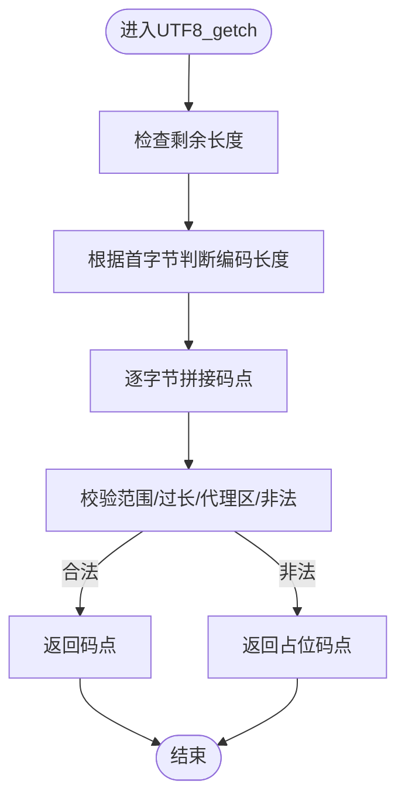

# Unicode字符编码

<cite>
**本文引用的文件**
- src/catacharset.h
- src/catacharset.cpp
- src/unicode.h
- src/unicode.cpp
- src/wcwidth.h
- src/wcwidth.cpp
- src/system_locale.h
- src/system_locale.cpp
- src/json.cpp
- tests/catacharset_test.cpp
- doc/unicode_chars_palette.txt
- lang/unicode_check.py
</cite>

## 目录
1. [引言](#引言)
2. [项目结构](#项目结构)
3. [核心组件](#核心组件)
4. [架构总览](#架构总览)
5. [详细组件分析](#详细组件分析)
6. [依赖关系分析](#依赖关系分析)
7. [性能考量](#性能考量)
8. [故障排查指南](#故障排查指南)
9. [结论](#结论)
10. [附录](#附录)

## 引言
本技术文档聚焦于Cataclysm-DDA（CDDA）中的Unicode字符编码体系，系统阐述UTF-8解码、字符宽度计算、字符集转换与验证、以及本地化适配策略。文档基于仓库中的源代码与测试用例进行深入分析，并提供面向开发与运维的实践建议，帮助在多平台环境下稳定地处理国际化文本。

## 项目结构
围绕Unicode相关的核心代码主要分布在以下模块：
- 字符串与编码工具：UTF-8解码、宽度计算、宽字符转换、Base64编解码等
- Unicode辅助函数：大小写转换、去音调、CJK/Emoji判定
- 宽度计算实现：基于mk_wcwidth的字符宽度查询
- 系统本地化：系统语言与单位制检测
- JSON解析中的UTF-8处理：与catacharset解码逻辑保持一致
- 测试与工具：单元测试、字符画板、Unicode校验脚本

图表来源
- src/catacharset.h
- src/catacharset.cpp
- src/unicode.h
- src/unicode.cpp
- src/wcwidth.h
- src/wcwidth.cpp
- src/system_locale.h
- src/system_locale.cpp
- src/json.cpp
- tests/catacharset_test.cpp
- doc/unicode_chars_palette.txt
- lang/unicode_check.py

章节来源
- src/catacharset.h
- src/catacharset.cpp
- src/unicode.h
- src/unicode.cpp
- src/wcwidth.h
- src/wcwidth.cpp
- src/system_locale.h
- src/system_locale.cpp
- src/json.cpp
- tests/catacharset_test.cpp
- doc/unicode_chars_palette.txt
- lang/unicode_check.py

## 核心组件
- UTF-8解码与遍历：提供从UTF-8字节流中提取Unicode码点的函数，支持错误输入时返回占位码点并进行安全处理
- 字符宽度计算：基于mk_wcwidth实现，区分组合标记、控制字符、以及CJK/Emoji等双宽字符
- 字符串包装器：utf8_wrapper按“显示宽度”而非字节数索引，支持显示宽度切片、居中、截断等
- 宽字符转换：UTF-8与宽字符串互转，跨平台封装Windows与POSIX路径
- Unicode辅助：大小写转换、去音调、CJK/Emoji判定
- 系统本地化：检测系统语言与是否使用公制单位
- JSON解析：与catacharset解码逻辑一致，确保JSON内容正确解码

章节来源
- src/catacharset.h
- src/catacharset.cpp
- src/wcwidth.cpp
- src/unicode.cpp
- src/system_locale.cpp
- src/json.cpp

## 架构总览
下图展示了Unicode相关模块之间的交互关系与数据流：

图表来源
- src/catacharset.cpp
- src/wcwidth.cpp
- src/catacharset.h
- src/system_locale.cpp
- src/json.cpp
- tests/catacharset_test.cpp

## 详细组件分析

### UTF-8解码与验证（UTF8_getch）
- 功能要点
  - 解析UTF-8字节序列，生成Unicode码点
  - 对过长编码、字节序错位、代理区、非法范围等进行严格校验，遇无效输入返回占位码点
  - 与JSON解析中的原始解码函数保持一致性，避免跨模块行为不一致
- 复杂度
  - 时间复杂度：O(n)，n为字符串长度
  - 空间复杂度：O(1)，原地解码
- 错误处理
  - 遇到非法序列时返回占位码点，保证上层逻辑稳健
- 使用场景
  - 计算显示宽度、遍历码点、拆分显示单元、与宽字符转换配合

图表来源
- src/catacharset.cpp
- src/json.cpp

章节来源
- src/catacharset.cpp
- src/json.cpp

### 字符宽度计算（mk_wcwidth）
- 功能要点
  - 基于Unicode标准定义的East Asian宽度类别，区分非组合标记、控制字符、以及CJK/Emoji等双宽字符
  - 组合标记宽度为0，不影响列宽；控制字符宽度为-1，表示不可见
- 复杂度
  - 时间复杂度：O(log k)，k为组合区间数量（二分查找）
  - 空间复杂度：O(1)
- 适用范围
  - 控制台/终端宽度计算、UI布局、文本对齐与截断

图表来源
- src/wcwidth.cpp

章节来源
- src/wcwidth.cpp

### 字符串包装器（utf8_wrapper）
- 功能要点
  - 按“码点数”索引，而非字节数，避免在多字节边界处切分
  - 提供按“显示宽度”切片的子串方法，确保组合标记不被错误拆分
  - 维护内部“显示宽度”，用于居中、截断等UI操作
- 复杂度
  - 初始化：O(n)
  - 切片/插入/删除：O(n)（受底层字符串操作影响）
- 边界处理
  - 组合标记宽度为0，归属前一码点，避免显示宽度错位
  - 显示宽度截断时，末尾追加省略号

图表来源
- src/catacharset.h

章节来源
- src/catacharset.h
- src/catacharset.cpp

### 宽字符转换（UTF-8↔宽字符串）
- 功能要点
  - Windows：使用系统API进行UTF-8与宽字符串互转
  - POSIX：使用标准库函数，处理返回值为-1的异常情况
  - 提供从宽字符串到本地编码的转换接口
- 平台差异
  - Windows与POSIX路径分别处理，确保在不同平台上正确显示与保存

图表来源
- src/catacharset.cpp

章节来源
- src/catacharset.cpp

### Unicode辅助函数（大小写/去音调/CJK判定）
- 大小写转换：覆盖拉丁与西里尔字母，部分处理特殊字符
- 去音调：预构建查找表，快速去除常见重音符号
- CJK/Emoji判定：基于Unicode块范围的二分查找，支持扩展块

图表来源
- src/unicode.cpp

章节来源
- src/unicode.h
- src/unicode.cpp

### 系统本地化适配（语言/单位制）
- 语言检测：Windows通过LCID映射；macOS通过首选语言列表；Android通过JNI获取；Linux通过locale与langinfo
- 单位制检测：Windows通过区域信息；macOS通过CFLocale；Linux通过langinfo
- 语言匹配：将系统语言前缀与游戏可用语言集合匹配，返回最合适的语言代码

图表来源
- src/system_locale.cpp
- src/system_locale.h

章节来源
- src/system_locale.h
- src/system_locale.cpp

### JSON解析中的UTF-8处理
- 与catacharset解码逻辑保持一致，避免跨模块行为差异
- 在JSON序列化/反序列化过程中，确保Unicode码点正确解码与编码

章节来源
- src/json.cpp

## 依赖关系分析
- 模块耦合
  - catacharset依赖wcwidth进行宽度计算
  - unicode提供CJK/Emoji判定与大小写/去音调辅助
  - system_locale为UI与本地化提供语言/单位制信息
  - json依赖catacharset解码逻辑
- 可能的循环依赖
  - 当前未发现直接循环依赖；各模块职责清晰
- 外部依赖
  - Windows：MultiByteToWideChar/WideCharToMultiByte
  - POSIX：mbstowcs/wcstombs、langinfo（可选）

图表来源
- src/catacharset.cpp
- src/unicode.cpp
- src/wcwidth.cpp
- src/json.cpp

章节来源
- src/catacharset.cpp
- src/unicode.cpp
- src/wcwidth.cpp
- src/json.cpp

## 性能考量
- UTF-8解码
  - O(n)线性扫描，无额外分配；注意避免在热路径重复解码
- 宽度计算
  - O(log k)二分查找组合区间；对大量字符批量计算时可考虑缓存中间结果
- utf8_wrapper
  - 初始化一次性计算显示宽度；频繁切片时优先使用按显示宽度的子串方法，减少边界错误
- 宽字符转换
  - Windows路径使用系统API，避免C库转换失败；POSIX路径需处理返回值为-1的情况
- JSON解析
  - 与catacharset解码保持一致，避免重复转换带来的开销

[本节为通用性能建议，无需列出章节来源]

## 故障排查指南
- UTF-8解码错误
  - 现象：出现占位码点或显示异常
  - 排查：确认输入是否为合法UTF-8；检查是否存在过长编码、代理区或非法范围
  - 参考：UTF8_getch的校验分支与返回逻辑
- 宽度计算异常
  - 现象：中文字符显示宽度不符合预期
  - 排查：确认mk_wcwidth的组合标记与控制字符处理；检查是否包含零宽字符
- 文本截断/居中错位
  - 现象：截断位置不准确或居中偏移
  - 排查：使用按显示宽度的切片与居中函数；避免在多字节边界切分
- 宽字符转换失败
  - 现象：宽字符串与UTF-8互转后乱码
  - 排查：Windows路径使用UTF-8编码；POSIX路径确保locale有效
- 语言/单位制检测失败
  - 现象：语言未匹配或单位制未知
  - 排查：检查系统语言环境与平台API可用性；回退到默认语言

章节来源
- src/catacharset.cpp
- src/wcwidth.cpp
- src/system_locale.cpp
- lang/unicode_check.py

## 结论
CDDA的Unicode系统以UTF-8为核心，结合mk_wcwidth实现精确的显示宽度计算，并通过utf8_wrapper提供稳定的字符串索引与显示操作。平台差异通过条件编译与系统API封装统一处理，本地化能力由SystemLocale模块提供。整体设计兼顾正确性与性能，适合在多语言、多平台环境中稳定运行。

[本节为总结性内容，无需列出章节来源]

## 附录
- 字符宽度参考
  - 组合标记宽度为0
  - 控制字符宽度为-1
  - CJK/Emoji等双宽字符宽度为2
- 测试与工具
  - 单元测试覆盖UTF-8宽度、显示分组、大小写/去音调、宽字符转换等
  - 字符画板用于可视化展示Unicode块
  - Unicode校验脚本用于定位PO文件中的编码错误

章节来源
- tests/catacharset_test.cpp
- doc/unicode_chars_palette.txt
- lang/unicode_check.py