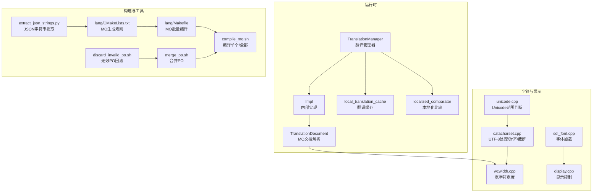
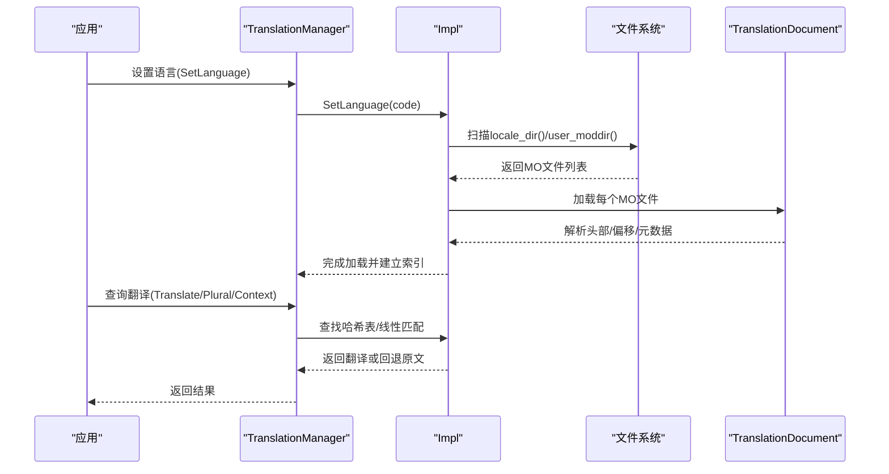
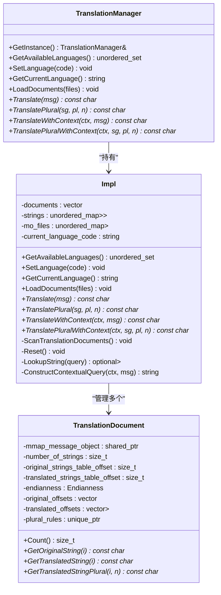
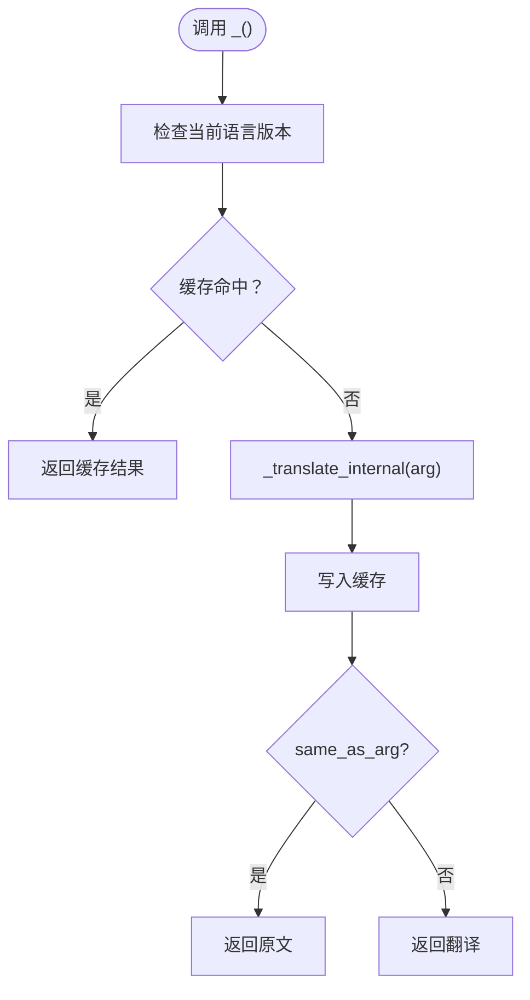
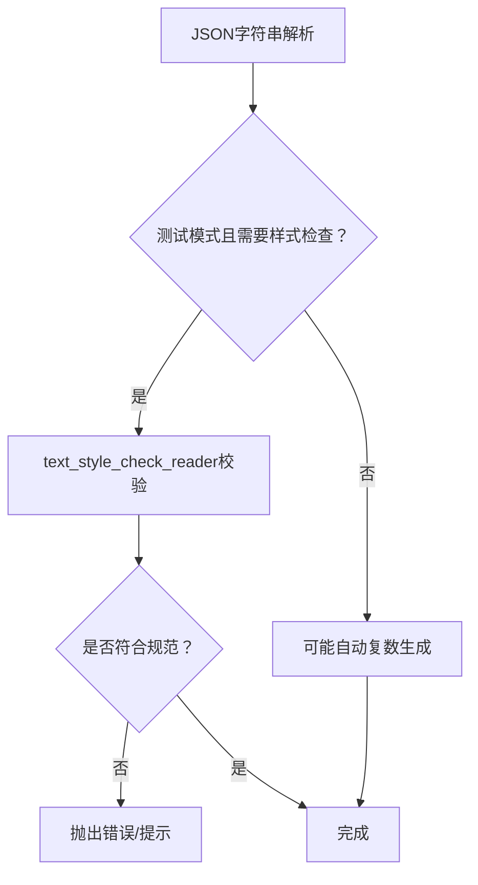
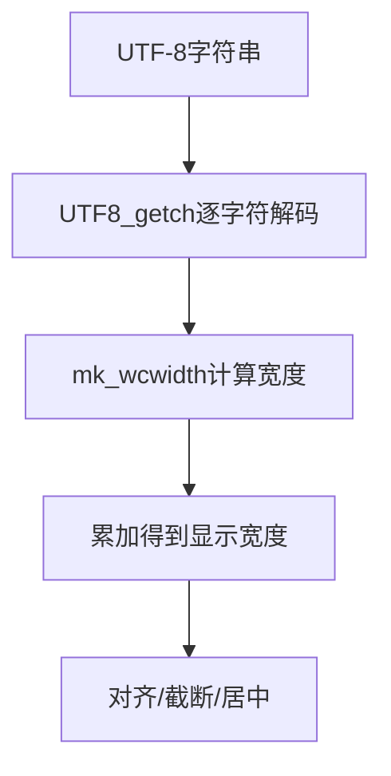
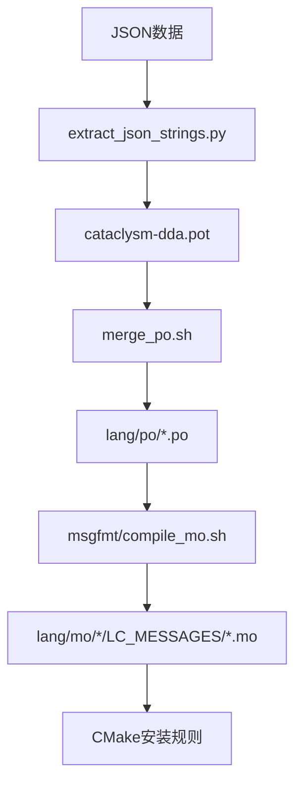
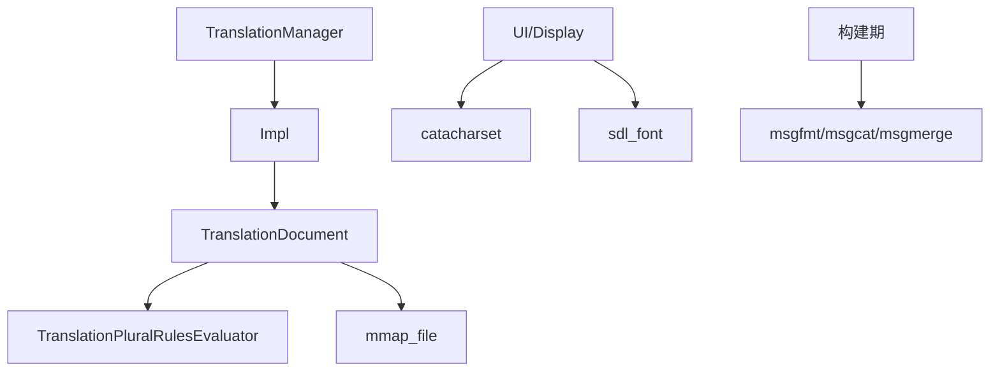
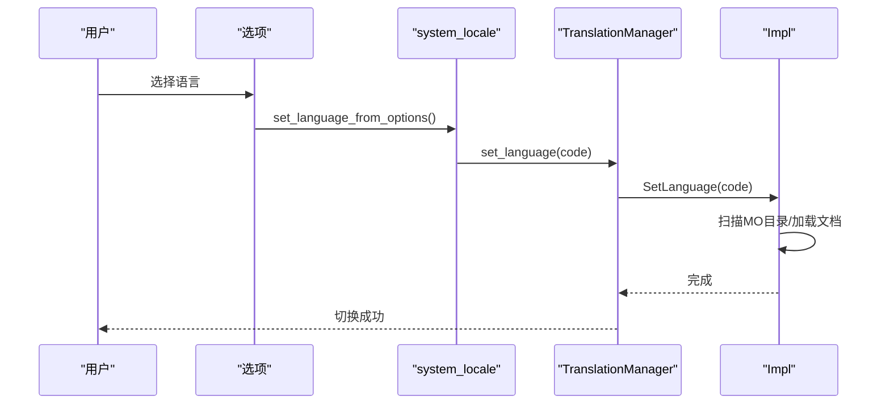
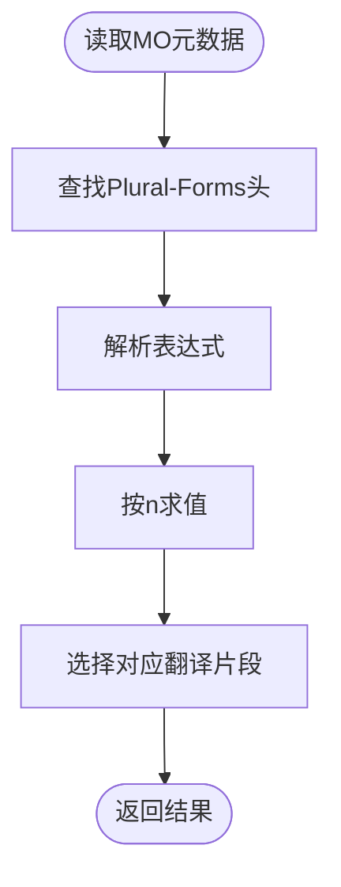

# 国际化系统

<cite>
**本文引用的文件**
- src/translation_manager.h
- src/translation_manager.cpp
- src/translation_manager_impl.h
- src/translation_manager_impl.cpp
- src/translation_document.h
- src/translation_document.cpp
- src/translations.h
- src/translation.cpp
- src/translation_cache.h
- src/unicode.cpp
- src/wcwidth.cpp
- src/catacharset.cpp
- src/char_validity_check.cpp
- src/system_locale.cpp
- src/system_locale.h
- src/localized_comparator.h
- src/localized_comparator.cpp
- src/text_style_check.h
- src/text_style_check_reader.cpp
- src/lang_stats.h
- src/lang_stats.cpp
- src/lang_stats.inc
- src/options.cpp
- src/options.h
- src/path_info.h
- src/path_info.cpp
- src/filesystem.h
- src/filesystem.cpp
- src/debug.h
- src/mmap_file.h
- src/mmap_file.cpp
- src/string_formatter.h
- src/string_formatter.cpp
- src/json.h
- src/json.cpp
- src/translation_plural_evaluator.h
- src/translation_plural_evaluator.cpp
- src/pinyin.cpp
- src/pinyin.h
- src/font_loader.cpp
- src/font_loader.h
- src/sdl_font.cpp
- src/sdl_font.h
- src/sdl_utils.cpp
- src/sdl_utils.h
- src/display.cpp
- src/display.h
- src/ui_manager.cpp
- src/ui_manager.h
- src/widget.h
- src/widget.cpp
- src/regional_settings.cpp
- src/regional_settings.h
- src/translation_system_test.cpp
- src/translations_test.cpp
- src/string_formatter_test.cpp
- src/unicode_chars_palette.txt
- lang/CMakeLists.txt
- lang/Makefile
- lang/compile_mo.sh
- lang/discard_invalid_po.sh
- lang/extract_json_strings.py
- lang/merge_po.sh
- lang/update_pot.sh
- lang/strip_line_numbers.py
- lang/unicode_check.py
- lang/update_stats.sh
- doc/TRANSLATING.md
- doc/USER_INTERFACE_AND_ACCESSIBILITY.md
- doc/unicode_chars_palette.txt
</cite>

## 目录
1. [简介](#简介)
2. [项目结构](#项目结构)
3. [核心组件](#核心组件)
4. [架构总览](#架构总览)
5. [详细组件分析](#详细组件分析)
6. [依赖关系分析](#依赖关系分析)
7. [性能考量](#性能考量)
8. [故障排查指南](#故障排查指南)
9. [结论](#结论)
10. [附录](#附录)

## 简介
本文件面向Cataclysm-DDA的国际化系统，提供从设计到实现、从运行时到构建期的完整技术文档。内容覆盖：
- 多语言支持机制与GNU gettext风格的MO文件解析
- 运行时语言切换、缓存与回退策略
- 翻译质量检查（复数规则、文本样式、无效PO处理）
- Unicode字符编码、字符宽度计算与本地化排版适配
- 翻译管理工具链：提取、合并、编译、统计与校验
- 字体加载、显示优化与跨语言排版需求
- 开发最佳实践与性能优化建议
- 具体实现示例与多语言测试方法

## 项目结构
国际化相关代码主要分布在以下区域：
- 核心运行时：翻译管理器、文档解析、缓存与比较器
- 字符编码与宽度：Unicode辅助、宽字符宽度计算、UTF-8处理
- 构建期工具：CMake/Makefile规则、脚本与Python提取器
- UI与显示：字体加载、SDL渲染、UI布局与对齐
- 测试：翻译系统与字符串格式化等单元测试

**图表来源**
- src/translation_manager.cpp
- src/translation_manager_impl.cpp
- src/translation_document.cpp
- src/translation_cache.h
- src/localized_comparator.cpp
- src/wcwidth.cpp
- src/catacharset.cpp
- src/unicode.cpp
- src/sdl_font.cpp
- src/display.cpp
- lang/CMakeLists.txt
- lang/Makefile
- lang/compile_mo.sh
- lang/merge_po.sh
- lang/extract_json_strings.py
- lang/discard_invalid_po.sh

**章节来源**
- src/translation_manager.h
- src/translation_manager.cpp
- src/translation_manager_impl.h
- src/translation_manager_impl.cpp
- src/translation_document.h
- src/translation_document.cpp
- src/translations.h
- src/translation.cpp
- src/translation_cache.h
- src/localized_comparator.h
- src/localized_comparator.cpp
- src/wcwidth.cpp
- src/catacharset.cpp
- src/unicode.cpp
- src/sdl_font.cpp
- src/display.cpp
- lang/CMakeLists.txt
- lang/Makefile
- lang/compile_mo.sh
- lang/merge_po.sh
- lang/extract_json_strings.py
- lang/discard_invalid_po.sh

## 核心组件
- 翻译管理器与文档解析
  - TranslationManager：对外接口，提供语言设置、可用语言枚举、翻译查询与复数形式处理
  - TranslationManager::Impl：扫描MO目录、加载文档、哈希查找、上下文拼接与重置逻辑
  - TranslationDocument：解析MO文件头、偏移表、元数据（含复数规则）、字符串表与终止符校验
- 运行时宏与缓存
  - translations.h中的_()、n_gettext、pgettext、npgettext宏，以及local_translation_cache缓存
  - translation类：JSON序列化、自动复数生成、样式检查、本地化比较
- 字符与显示
  - unicode.cpp：CJK/Emoji范围判断
  - wcwidth.cpp：基于Unicode宽窄定义的字符宽度计算
  - catacharset.cpp：UTF-8解码、宽度计算、对齐/截断、光标位置换算、显示分割
- 构建与工具
  - lang/CMakeLists.txt与lang/Makefile：MO生成与安装规则
  - compile_mo.sh、merge_po.sh、discard_invalid_po.sh、extract_json_strings.py、update_pot.sh等脚本

**章节来源**
- src/translation_manager.h
- src/translation_manager.cpp
- src/translation_manager_impl.h
- src/translation_manager_impl.cpp
- src/translation_document.h
- src/translation_document.cpp
- src/translations.h
- src/translation_cache.h
- src/translation.cpp
- src/unicode.cpp
- src/wcwidth.cpp
- src/catacharset.cpp
- lang/CMakeLists.txt
- lang/Makefile

## 架构总览
国际化系统采用“运行时翻译 + 构建期资源”的双轨模式：
- 构建期：通过CMake/Makefile与脚本将PO转换为MO，并按语言目录安装
- 运行时：TranslationManager扫描并加载MO，使用哈希表快速定位原始字符串，返回对应翻译或回退原文

**图表来源**
- src/translation_manager_impl.cpp
- src/translation_document.cpp
- src/translation_manager.cpp

**章节来源**
- src/translation_manager_impl.cpp
- src/translation_document.cpp
- src/translation_manager.cpp

## 详细组件分析

### 翻译管理器与文档解析
- 设计要点
  - 使用pimpl隐藏实现细节，接口稳定
  - 哈希表加速查找，避免每次全量扫描
  - 支持上下文拼接（以NUL分隔）以区分同名字符串的不同含义
  - 复数规则从MO元数据读取，动态评估
- 关键流程
  - SetLanguage触发扫描与加载；若无对应语言则清空缓存
  - Translate系列函数先查索引，再按需调用Document获取翻译
  - 复数与上下文版本分别处理，回退策略一致

**图表来源**
- src/translation_manager.h
- src/translation_manager_impl.h
- src/translation_document.h

**章节来源**
- src/translation_manager.h
- src/translation_manager.cpp
- src/translation_manager_impl.h
- src/translation_manager_impl.cpp
- src/translation_document.h
- src/translation_document.cpp

### 运行时宏与缓存机制
- 宏与别名
  - _()、n_gettext、pgettext、npgettext提供统一的翻译入口
  - 在禁用LOCALIZE时，这些宏直接返回原文，保证构建兼容性
- 缓存策略
  - local_translation_cache按语言版本与参数缓存，避免重复查询
  - 对于const char*版本，若无翻译则回退原文，模拟gettext行为

**图表来源**
- src/translations.h
- src/translation_cache.h

**章节来源**
- src/translations.h
- src/translation_cache.h

### 翻译质量检查与样式验证
- 复数自动生成与提示
  - translation类在反序列化时可自动推导复数形式，必要时抛出错误提示
- 文本样式检查
  - 在测试模式下，text_style_check_reader对字符串进行样式检查，确保符合规范
- 无效PO处理
  - discard_invalid_po.sh尝试编译PO，失败则回滚，避免CI阻塞

**图表来源**
- src/translation.cpp
- src/translation.cpp
- src/text_style_check_reader.cpp
- lang/discard_invalid_po.sh

**章节来源**
- src/translation.cpp
- src/translation.cpp
- src/text_style_check_reader.cpp
- lang/discard_invalid_po.sh

### Unicode字符编码与字符宽度计算
- Unicode范围判断
  - is_cjk_or_emoji用于识别CJK与Emoji区间，辅助排版与字体选择
- 宽字符宽度
  - mk_wcwidth遵循Unicode East Asian宽度分类，结合组合字符处理
- UTF-8处理
  - UTF8_getch解码UTF-8，utf8_width计算显示宽度，left/right_justify与utf8_truncate支撑UI对齐与截断

**图表来源**
- src/unicode.cpp
- src/wcwidth.cpp
- src/catacharset.cpp
- src/catacharset.cpp
- src/catacharset.cpp

**章节来源**
- src/unicode.cpp
- src/wcwidth.cpp
- src/catacharset.cpp
- src/catacharset.cpp
- src/catacharset.cpp

### 字体加载与显示优化
- 字体加载
  - font_loader与sdl_font负责从配置加载字体，支持不同语言字符集
- 显示控制
  - display与UI组件根据字符宽度与屏幕宽度进行布局与滚动
- 区域设置
  - regional_settings影响数字、日期、货币等格式化

**图表来源**
- src/font_loader.cpp
- src/font_loader.h
- src/sdl_font.cpp
- src/sdl_font.h
- src/display.cpp
- src/regional_settings.cpp

**章节来源**
- src/font_loader.cpp
- src/font_loader.h
- src/sdl_font.cpp
- src/sdl_font.h
- src/display.cpp
- src/regional_settings.cpp

### 翻译管理工具链
- 提取与更新
  - update_pot.sh生成/更新cataclysm-dda.pot
  - extract_json_strings.py递归扫描JSON并写入POT
- 合并与编译
  - merge_po.sh合并incoming的PO到lang/po并更新
  - compile_mo.sh/msgfmt批量编译为MO
- 统计与校验
  - update_stats.sh统计进度
  - strip_line_numbers.py清理行号
  - unicode_check.py检查Unicode字符有效性

**图表来源**
- lang/update_pot.sh
- lang/extract_json_strings.py
- lang/merge_po.sh
- lang/compile_mo.sh
- lang/CMakeLists.txt

**章节来源**
- lang/update_pot.sh
- lang/extract_json_strings.py
- lang/merge_po.sh
- lang/compile_mo.sh
- lang/CMakeLists.txt

## 依赖关系分析
- 组件耦合
  - TranslationManager依赖Impl实现，Impl依赖TranslationDocument与文件系统
  - TranslationDocument依赖mmap_file与复数规则求值器
  - UI层依赖catacharset与sdl_font进行显示
- 外部依赖
  - 构建期：gettext工具链（msgfmt/msgcat/msgmerge）
  - 运行时：平台字体与SDL渲染栈

**图表来源**
- src/translation_manager_impl.cpp
- src/translation_document.cpp
- src/translation_plural_evaluator.h
- src/mmap_file.h
- src/catacharset.cpp
- src/sdl_font.cpp
- lang/CMakeLists.txt

**章节来源**
- src/translation_manager_impl.cpp
- src/translation_document.cpp
- src/translation_plural_evaluator.h
- src/mmap_file.h
- src/catacharset.cpp
- src/sdl_font.cpp
- lang/CMakeLists.txt

## 性能考量
- 哈希查找与缓存
  - 使用32位多项式哈希与开放寻址思想，load factor设为1以降低冲突
  - local_translation_cache按语言版本与参数双重键缓存，显著减少重复查询
- 内存映射与零拷贝
  - MO文件通过mmap映射，避免重复IO与复制
- 字符宽度计算
  - mk_wcwidth基于区间二分查找，时间复杂度低
  - UTF8_getch按需解码，避免全量预处理
- UI布局
  - utf8_width仅在需要时计算，配合缓存与显示分割减少CPU占用

[本节为通用性能讨论，无需特定文件来源]

## 故障排查指南
- MO文件加载失败
  - 检查MO文件大小、魔数、偏移表边界与终止符
  - 确认locale_dir与user_moddir路径存在且可访问
- 语言切换无效
  - 确认SetLanguage传入的语言代码与MO目录一致
  - 检查扫描阶段是否正确收集了该语言的所有MO
- 复数规则异常
  - 检查MO元数据中的Plural-Forms头，确认表达式合法
- 无效PO导致CI失败
  - 使用discard_invalid_po.sh自动回滚无法编译的PO
- 字符显示错位
  - 检查mk_wcwidth返回值与组合字符处理
  - 确认UTF-8解码与显示宽度计算一致

**章节来源**
- src/translation_document.cpp
- src/translation_manager_impl.cpp
- src/translation_plural_evaluator.cpp
- lang/discard_invalid_po.sh
- src/wcwidth.cpp
- src/catacharset.cpp

## 结论
Cataclysm-DDA的国际化系统以轻量、可扩展为目标，结合运行时缓存与构建期工具链，实现了高效的多语言支持。其关键优势在于：
- 基于MO的高效解析与缓存
- 可配置的复数规则与上下文翻译
- 面向UI的字符宽度计算与对齐工具
- 完整的翻译工作流与质量保障脚本

建议在后续迭代中持续完善：
- 更丰富的复数规则测试矩阵
- 跨语言排版与字体覆盖策略
- 性能基准与热点路径优化

[本节为总结性内容，无需特定文件来源]

## 附录

### 运行时语言切换流程

**图表来源**
- src/options.cpp
- src/system_locale.cpp
- src/system_locale.h
- src/translation_manager.cpp
- src/translation_manager_impl.cpp

**章节来源**
- src/options.cpp
- src/system_locale.cpp
- src/system_locale.h
- src/translation_manager.cpp
- src/translation_manager_impl.cpp

### 复数规则解析流程

**图表来源**
- src/translation_document.cpp
- src/translation_document.cpp
- src/translation_plural_evaluator.h

**章节来源**
- src/translation_document.cpp
- src/translation_document.cpp
- src/translation_plural_evaluator.h

### 多语言测试方法
- 单元测试
  - translation_system_test.cpp与translations_test.cpp覆盖翻译流程与缓存
  - string_formatter_test.cpp验证格式化与占位符
- 本地化测试
  - 使用不同语言的MO文件进行回归测试
  - 验证复数形式、上下文翻译与字符宽度对齐

**章节来源**
- tests/translation_system_test.cpp
- tests/translations_test.cpp
- tests/string_formatter_test.cpp