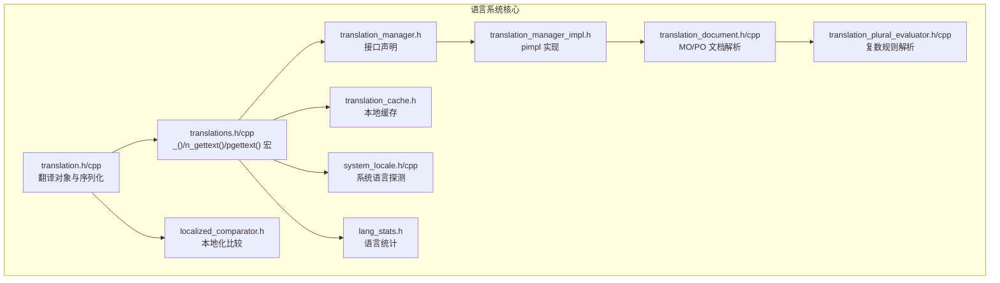
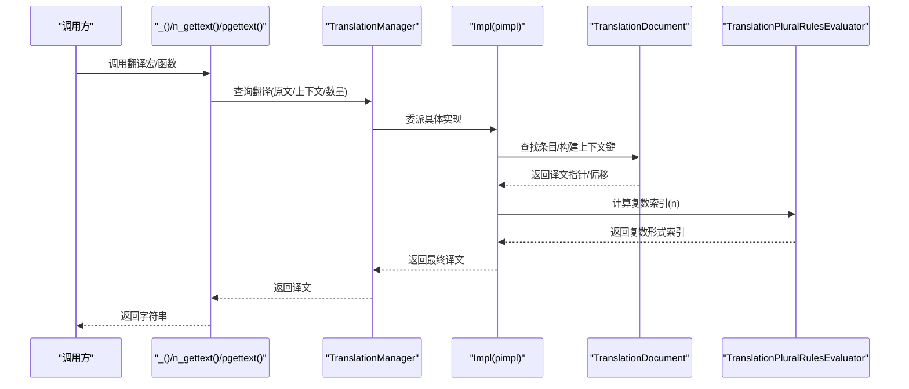
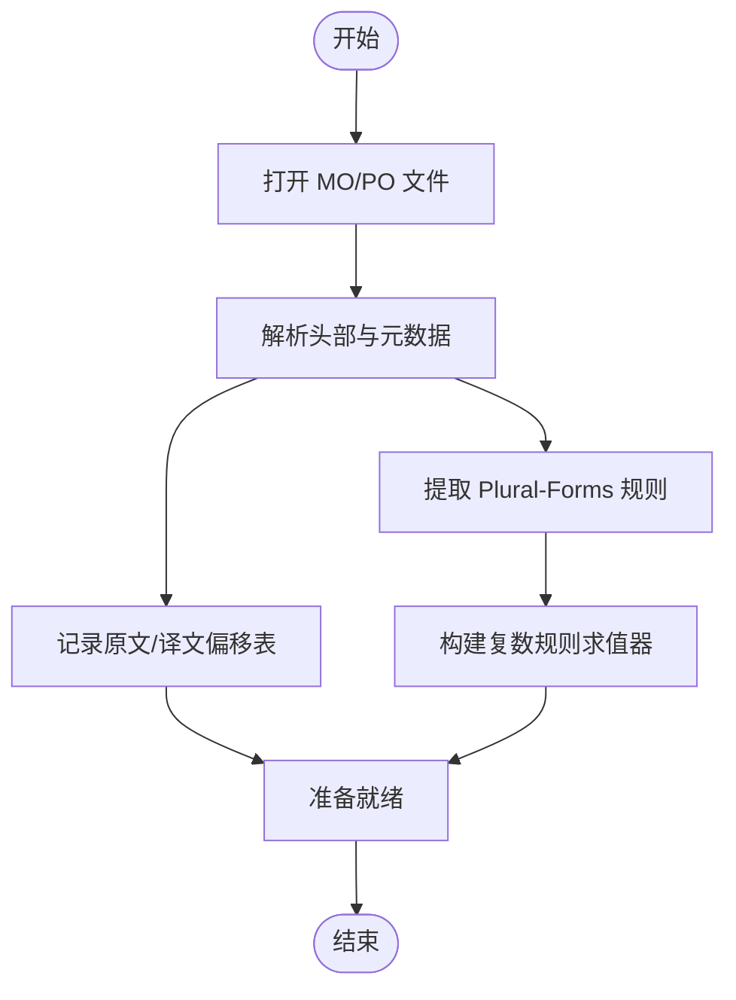
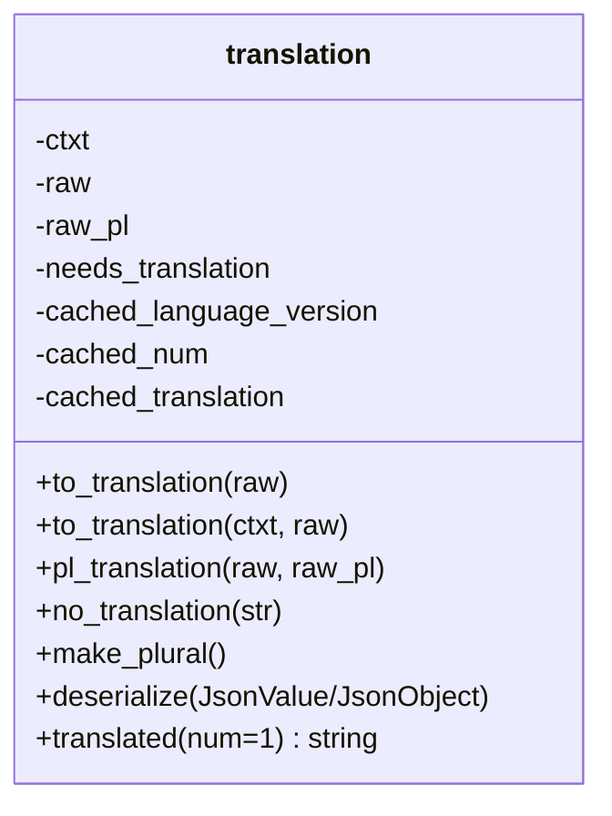
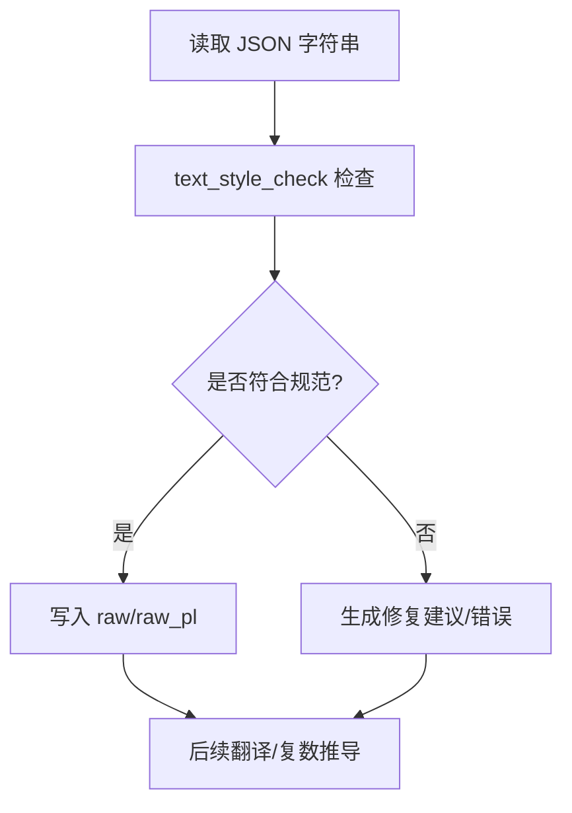
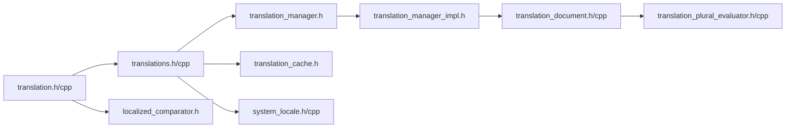

# 多语言支持

<cite>
**本文引用的文件**
- TRANSLATING.md
- translation.h
- translation.cpp
- translation_document.h
- translation_document.cpp
- translation_manager.h
- translation_manager_impl.h
- translation_cache.h
- translation_plural_evaluator.h
- translation_plural_evaluator.cpp
- translations.h
- translations.cpp
- system_locale.h
- system_locale.cpp
- localized_comparator.h
- text_style_check.h
- lang_stats.h
</cite>

## 目录
1. [引言](#引言)
2. [项目结构](#项目结构)
3. [核心组件](#核心组件)
4. [架构总览](#架构总览)
5. [组件详解](#组件详解)
6. [依赖关系分析](#依赖关系分析)
7. [性能考量](#性能考量)
8. [故障排查指南](#故障排查指南)
9. [结论](#结论)
10. [附录](#附录)

## 引言
本文件面向开发者与翻译人员，系统化阐述 Cataclysm-DDA 的多语言支持体系：从 PO 文件格式解析、翻译条目加载与缓存、运行时语言切换到翻译质量检查与社区协作流程。文档以代码级分析为基础，辅以图示帮助理解，并提供最佳实践与调试建议。

## 项目结构
围绕多语言功能的关键源码位于 src/ 下，主要模块包括：
- 翻译对象与宏：translation.h/cpp、translations.h/cpp
- 文档与规则：translation_document.*、translation_plural_evaluator.*
- 管理器：translation_manager.*（含 pimpl 实现）
- 缓存与本地化：translation_cache.h、localized_comparator.h
- 系统语言探测：system_locale.*、system_locale.cpp
- 质量检查：text_style_check.h
- 统计与选项：lang_stats.h、options.cpp（语言选项生成）



**图表来源**
- translation.h
- translation.cpp
- translation_manager.h
- translation_manager_impl.h
- translation_document.h
- translation_document.cpp
- translation_plural_evaluator.h
- translation_plural_evaluator.cpp
- translation_cache.h
- localized_comparator.h
- system_locale.h
- system_locale.cpp
- translations.h
- translations.cpp
- lang_stats.h

**章节来源**
- translations.h
- translation.h
- translation_manager.h
- translation_manager_impl.h
- translation_document.h
- translation_document.cpp
- translation_plural_evaluator.h
- translation_plural_evaluator.cpp
- translation_cache.h
- localized_comparator.h
- system_locale.h
- system_locale.cpp
- translations.cpp
- lang_stats.h

## 核心组件
- 翻译对象 translation：封装原始字符串、可选上下文、可选复数形式；支持从 JSON 反序列化、延迟翻译、缓存与比较。
- 运行时翻译宏与函数：_()、n_gettext()、pgettext()、npgettext()，通过 TranslationManager 提供查询。
- 翻译管理器 TranslationManager：单例，负责语言设置、扫描 MO/PO 文档、查询与复数规则评估。
- 文档解析 TranslationDocument：读取 MO/PO 文件，提取原文与译文偏移、解析 Plural-Forms 规则。
- 复数规则求值器 TranslationPluralRulesEvaluator：词法/语法解析并计算复数形式索引。
- 本地化缓存：detail::local_translation_cache，按语言版本与参数缓存结果。
- 系统语言探测：SystemLocale::Language()，跨平台获取系统语言代码。
- 本地化比较：localized_comparator，对字符串或 translation 进行本地化排序。
- 翻译质量检查：text_style_check，用于 C++/JSON 文本风格校验与修复建议。
- 语言统计：lang_stats，提供各语言完成度信息。

**章节来源**
- translation.h
- translation.cpp
- translations.h
- translation_manager.h
- translation_manager_impl.h
- translation_document.h
- translation_document.cpp
- translation_plural_evaluator.h
- translation_plural_evaluator.cpp
- translation_cache.h
- system_locale.h
- localized_comparator.h
- text_style_check.h
- lang_stats.h

## 架构总览
下图展示从调用层到底层文档解析与规则求值的整体流程。



**图表来源**
- translations.h
- translation_manager.h
- translation_manager_impl.h
- translation_document.h
- translation_document.cpp
- translation_plural_evaluator.h

## 组件详解

### PO/MO 文件解析与条目加载
- TranslationDocument 负责打开并解析 MO/PO 文件，记录原文与译文在缓冲区中的字节偏移，以便 O(1) 快速定位。
- 从元数据中解析 Plural-Forms 头部，构造 TranslationPluralRulesEvaluator 以支持复杂语言的复数规则。
- 支持带上下文的查询键拼接，避免同原文多义冲突。



**图表来源**
- translation_document.cpp
- translation_document.h
- translation_plural_evaluator.cpp

**章节来源**
- translation_document.cpp
- translation_document.h
- translation_plural_evaluator.h
- translation_plural_evaluator.cpp

### 翻译对象与延迟翻译
- translation 封装原始字符串、上下文、复数形式与缓存字段；支持从 JSON 反序列化，自动进行文本风格检查与复数推导。
- translated(num) 在需要时才进行翻译，避免静态初始化时的翻译问题；缓存最近一次使用的数量与结果，减少重复查询成本。



**图表来源**
- translation.h
- translation.cpp

**章节来源**
- translation.h
- translation.cpp

### 运行时语言切换与界面刷新
- set_language_from_options 与 set_language 读取配置或系统语言，调用 TranslationManager::SetLanguage 切换语言。
- 语言版本号变化后，本地缓存与 translation 对象缓存失效，确保后续查询返回新语言内容。
- options.cpp 中生成语言选项列表，包含系统语言与各语言的翻译进度百分比。

```mermaid
sequenceDiagram
participant Game as "游戏/选项"
participant Opt as "options.cpp"
participant Sys as "SystemLocale : : Language()"
participant Lang as "translations.cpp"
participant TM as "TranslationManager"
Game->>Opt : 获取语言选项
Opt->>Sys : 探测系统语言
Sys-->>Opt : 返回语言代码
Opt-->>Game : 展示语言列表(含进度)
Game->>Lang : set_language_from_options()
Lang->>TM : SetLanguage(语言代码)
TM-->>Lang : 切换完成
Lang-->>Game : 语言已更新
```

**图表来源**
- translations.cpp
- system_locale.cpp
- options.cpp

**章节来源**
- translations.cpp
- system_locale.cpp
- options.cpp

### 翻译质量检查与格式验证
- text_style_check 提供统一的文本风格检查与修复建议，覆盖标点、空格、转义等。
- translation::deserialize 在 JSON 反序列化时执行文本风格检查，必要时抛出错误或警告，辅助翻译一致性。
- TRANSLATING.md 提供社区翻译规范、复数规则、上下文使用与测试流程说明。



**图表来源**
- text_style_check.h
- translation.cpp
- TRANSLATING.md

**章节来源**
- text_style_check.h
- translation.cpp
- TRANSLATING.md

### 不同语言的翻译管理策略
- 自动化更新：每周工作流拉取 Transifex 翻译，维护 POT/Po/MO 流程。
- 手动更新：update_pot.sh 更新模板，merge_po.sh 合并翻译，compile_mo.sh 编译 MO。
- 语言统计：lang_stats.inc 提供各语言完成度，options 中展示百分比。
- 上下文与复数：通过 translation 对象与 plural 规则求值器保证多义与数量正确。

**章节来源**
- TRANSLATING.md
- lang_stats.h

## 依赖关系分析
- translations.h/cpp 为核心入口，定义宏与函数，依赖 TranslationManager。
- translation_manager_impl.h 依赖 TranslationDocument 与 TranslationPluralRulesEvaluator。
- translation_document 依赖 translation_plural_evaluator 解析复数规则。
- translation_cache.h 依赖 translations.h 的宏实现与语言版本号。
- system_locale.* 为 set_language 提供系统语言探测。
- localized_comparator.h 依赖 translation.h 的比较运算。



**图表来源**
- translation.h
- translations.h
- translation_manager.h
- translation_manager_impl.h
- translation_document.h
- translation_plural_evaluator.h
- translation_cache.h
- system_locale.h
- localized_comparator.h

**章节来源**
- translation.h
- translations.h
- translation_manager.h
- translation_manager_impl.h
- translation_document.h
- translation_plural_evaluator.h
- translation_cache.h
- system_locale.h
- localized_comparator.h

## 性能考量
- 本地缓存：detail::local_translation_cache 与 translation 对象缓存最近一次结果，降低重复查询开销。
- 语言版本控制：INVALID_LANGUAGE_VERSION 与 get_current_language_version 配合，语言切换时自动失效缓存。
- 文档解析：TranslationDocument 使用偏移表 O(1) 定位条目，避免线性扫描。
- 复数规则：TranslationPluralRulesEvaluator 预编译表达式树，Evaluate 为 O(规则长度)。

**章节来源**
- translation_cache.h
- translation.h
- translation_document.h
- translation_plural_evaluator.h

## 故障排查指南
- 无翻译返回原文：确认 _() 调用在翻译系统初始化后进行；避免静态变量初始化时调用翻译函数。
- 复数形式越界：检查 MO 文件的 Plural-Forms 头与求值器表达式；确保 n 的取值范围与规则一致。
- 翻译不生效：核对语言选项与 set_language 调用；确认 MO 目录与语言代码匹配。
- 文本风格问题：运行 text_style_check 或单元测试，修正标点、空格与转义。
- 翻译进度显示异常：检查 lang_stats 数据与 options 选项生成逻辑。

**章节来源**
- translation_document.cpp
- translation.cpp
- translations.cpp
- text_style_check.h
- options.cpp

## 结论
CDDA 的多语言系统以 translation 对象为中心，结合 TranslationManager 的文档扫描与查询、TranslationDocument 的高效解析、TranslationPluralRulesEvaluator 的规则求值以及本地化缓存与系统语言探测，形成了稳定、可扩展且高性能的语言支持框架。配合 TRANSLATING.md 的社区流程与质量检查工具，能够持续提升翻译质量与用户体验。

## 附录
- 开发者与翻译者指南：参见 doc/TRANSLATING.md，涵盖翻译函数、复数规则、上下文使用与自动化流程。
- 最佳实践要点
  - 使用 translation 对象与 JSON 反序列化，避免静态初始化时的翻译调用。
  - 正确设置与切换语言，确保缓存失效与界面刷新。
  - 使用 text_style_check 与单元测试保障翻译一致性。
  - 通过 lang_stats 了解语言完成度，指导优先级。

**章节来源**
- TRANSLATING.md