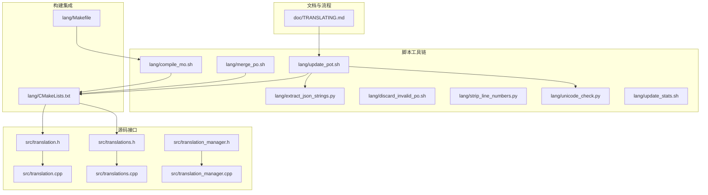
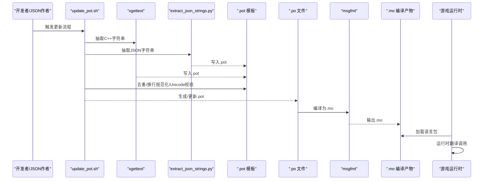
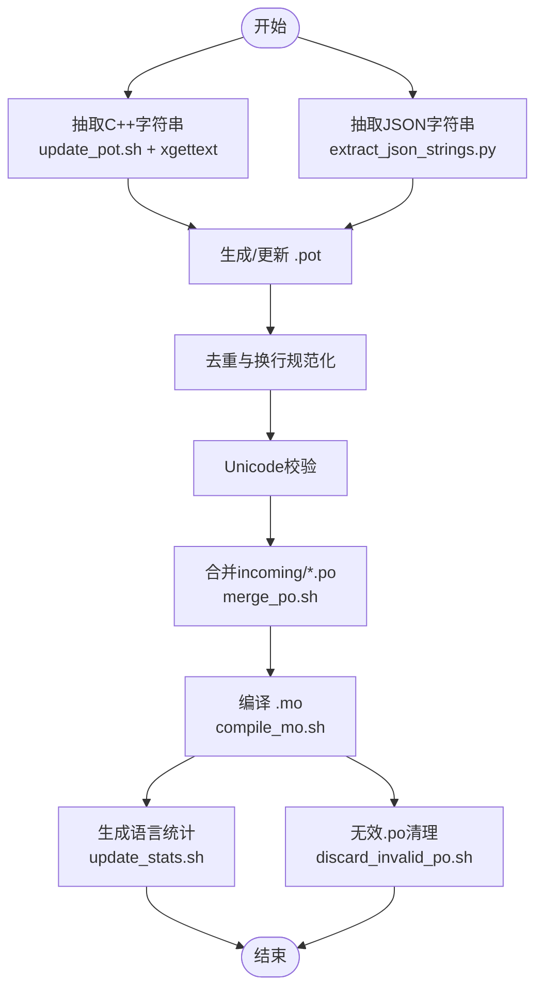
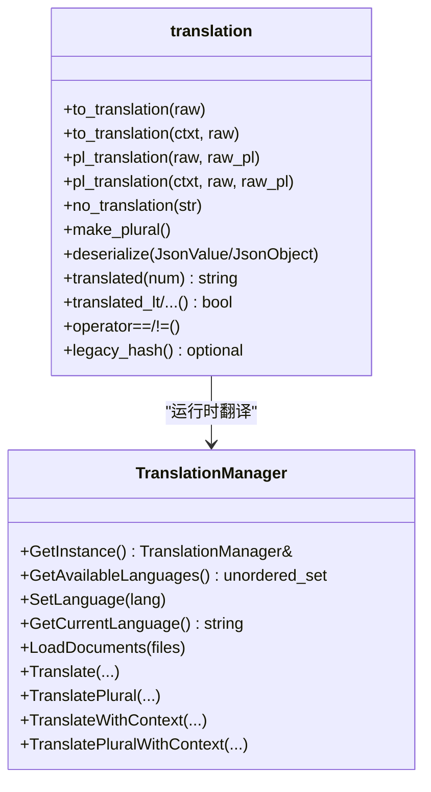
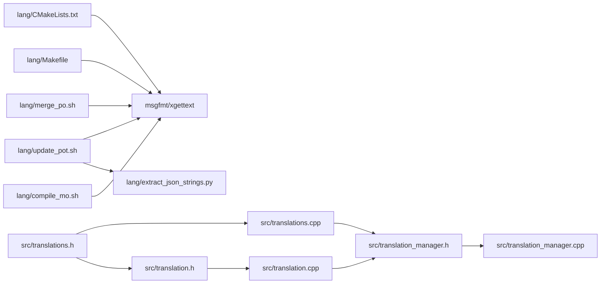

# 本地化管理

<cite>
**本文引用的文件**
- doc/TRANSLATING.md
- lang/CMakeLists.txt
- lang/Makefile
- lang/compile_mo.sh
- lang/update_pot.sh
- lang/extract_json_strings.py
- lang/merge_po.sh
- lang/discard_invalid_po.sh
- lang/strip_line_numbers.py
- lang/unicode_check.py
- lang/update_stats.sh
- src/translation.h
- src/translation.cpp
- src/translations.h
- src/translations.cpp
- src/translation_manager.h
- src/translation_manager.cpp
</cite>

## 目录
- [本地化管理](#本地化管理)
  - [目录](#目录)
  - [简介](#简介)
  - [项目结构](#项目结构)
  - [核心组件](#核心组件)
  - [架构总览](#架构总览)
  - [组件详解](#组件详解)
    - [翻译文件组织与命名规范](#翻译文件组织与命名规范)
    - [批量翻译处理工具链](#批量翻译处理工具链)
    - [社区贡献与审核流程](#社区贡献与审核流程)
    - [运行时翻译与缓存](#运行时翻译与缓存)
    - [不同语言的排版与字体支持](#不同语言的排版与字体支持)
  - [依赖关系分析](#依赖关系分析)
  - [性能与可维护性](#性能与可维护性)
  - [故障排查指南](#故障排查指南)
  - [结论](#结论)
  - [附录](#附录)

## 简介
本文件面向Cataclysm: DDA（以下简称“DDA”）的本地化管理，系统化梳理翻译文件组织与命名规范、批量翻译处理工具链、社区贡献流程、排版与字体支持策略，并给出维护指南与最佳实践。内容基于仓库内官方文档与本地化脚本、源码实现进行提炼，帮助开发者、维护者与翻译人员高效协作。

## 项目结构
DDA的本地化体系由“官方文档指引 + 脚本工具链 + 源码翻译接口 + 构建集成”四部分组成：
- 官方文档：提供翻译流程、术语表、上下文性别规则、平台与工具使用说明等
- 工具链：负责从C++与JSON抽取字符串、生成.pot模板、合并与编译.po/.mo、统计与校验
- 源码接口：提供标记可翻译字符串、运行时翻译函数、翻译对象封装、语言切换与缓存
- 构建集成：通过CMake/Makefile在构建期生成.mo并安装到系统或游戏数据目录

图表来源
- doc/TRANSLATING.md
- lang/update_pot.sh
- lang/extract_json_strings.py
- lang/compile_mo.sh
- lang/merge_po.sh
- lang/discard_invalid_po.sh
- lang/strip_line_numbers.py
- lang/unicode_check.py
- lang/update_stats.sh
- src/translation.h
- src/translation.cpp
- src/translations.h
- src/translations.cpp
- src/translation_manager.h
- src/translation_manager.cpp
- lang/CMakeLists.txt
- lang/Makefile

章节来源
- doc/TRANSLATING.md
- lang/CMakeLists.txt
- lang/Makefile

## 核心组件
- 文档与流程：官方翻译指南，定义术语、上下文性别、平台与工具使用
- 抽取与模板：从C++与JSON抽取字符串，生成.pot模板，统一注释与换行
- 合并与编译：合并外部贡献的.po，编译为.mo，支持按语言选择
- 运行时翻译：提供便捷宏与类封装，延迟翻译、缓存、复数与上下文支持
- 构建集成：CMake/Makefile在构建期生成.mo并安装
- 统计与校验：生成语言完成度统计，校验Unicode与无效.po

章节来源
- doc/TRANSLATING.md
- lang/update_pot.sh
- lang/extract_json_strings.py
- lang/compile_mo.sh
- lang/merge_po.sh
- src/translation.h
- src/translation.cpp
- src/translations.h
- src/translations.cpp
- src/translation_manager.h
- src/translation_manager.cpp
- lang/update_stats.sh
- lang/unicode_check.py

## 架构总览
下图展示从源码到运行时的翻译调用链，以及构建期的.mo生成路径。

图表来源
- lang/update_pot.sh
- lang/extract_json_strings.py
- lang/compile_mo.sh
- src/translations.h
- src/translation.cpp

## 组件详解

### 翻译文件组织与命名规范
- 语言代码与目录结构
  - 语言代码遵循标准命名，如 zh_CN、en、ru 等
  - .po文件位于 `lang/po/<lang>.po`
  - .mo文件输出至 `lang/mo/<lang>/LC_MESSAGES/cataclysm-dda.mo`
  - 构建期安装路径受安装选项影响，可能为 share/locale 或相对路径
- 版本管理策略
  - 通过脚本生成的.pot作为模板，.po基于.pot更新
  - 语言统计文件写入 `lang/stats/<lang>` 并汇总到 src/lang_stats.inc
- 命名与路径一致性
  - incoming目录用于临时存放外部贡献的.po，随后被merge_po.sh合并进lang/po
  - 编译脚本支持按语言参数选择编译，便于测试与CI

章节来源
- doc/TRANSLATING.md
- lang/CMakeLists.txt
- lang/Makefile
- lang/compile_mo.sh
- lang/update_stats.sh

### 批量翻译处理工具链
- 字符串抽取
  - C++：通过update_pot.sh调用xgettext，关键字覆盖 _、pgettext、n_gettext、to_translation/pl_translation等
  - JSON：通过extract_json_strings.py递归扫描data与mods目录，排除特定文件/目录，追加到.pot
- 模板生成与校验
  - 去重与规范化：msguniq去重；统一换行为Unix风格；Unicode完整性检查
  - 编译自检：msgfmt -c对.pot进行语法检查
- 合并与编译
  - 合并：merge_po.sh将incoming/*.po与lang/po/*.po合并，更新并清理模糊标记
  - 编译：compile_mo.sh按语言编译为.mo，支持指定语言或全量
- 统计与清理
  - update_stats.sh统计每种语言已/未翻译条目，生成语言统计
  - discard_invalid_po.sh对无法msgfmt的.po执行回滚，避免CI阻塞
  - strip_line_numbers.py清洗.pot/.po中的行号注释，减少差异

图表来源
- lang/update_pot.sh
- lang/extract_json_strings.py
- lang/merge_po.sh
- lang/compile_mo.sh
- lang/update_stats.sh
- lang/discard_invalid_po.sh
- lang/strip_line_numbers.py

章节来源
- lang/update_pot.sh
- lang/extract_json_strings.py
- lang/merge_po.sh
- lang/compile_mo.sh
- lang/update_stats.sh
- lang/discard_invalid_po.sh
- lang/strip_line_numbers.py

### 社区贡献与审核流程
- 官方平台：使用Transifex进行翻译，社区可在项目中加入新语言
- 提交流程：下载.po → 放入lang/incoming → update_pot.sh更新.pot → merge_po.sh合并 → compile_mo.sh编译
- 冲突与回归：merge_po.sh采用--use-first策略并清理模糊标记；discard_invalid_po.sh自动回滚无效文件
- 发布协调：每周GitHub工作流pull-translations自动更新；手动更新步骤见文档

章节来源
- doc/TRANSLATING.md
- doc/TRANSLATING.md

### 运行时翻译与缓存
- 翻译函数与宏
  - 单数：_()、pgettext()
  - 复数：n_gettext()、npgettext()
  - 对象封装：translation类，支持上下文、复数、JSON序列化/反序列化
- 延迟翻译与缓存
  - translation::translated()根据语言版本与num缓存结果，避免重复查询
  - 切换语言会递增语言版本以失效缓存
- 语言选择与安装路径
  - set_language_from_options()/set_language()设置当前语言
  - locale_dir()决定.mo安装位置（系统或应用数据目录）

图表来源
- src/translation.h
- src/translation.cpp
- src/translation_manager.h
- src/translation_manager.cpp

章节来源
- src/translations.h
- src/translations.cpp
- src/translation.h
- src/translation.cpp
- src/translation_manager.h
- src/translation_manager.cpp

### 不同语言的排版与字体支持
- 上下文性别与复数
  - 通过grammatical gender list与上下文标识（如npc:m）支持性别化翻译
  - 复数规则由n_gettext/npgettext处理，translation类支持复数缓存
- 特殊字符与Unicode
  - update_pot.sh在生成.pot后执行Unicode检查，确保无编码错误
  - strip_line_numbers.py清洗行号注释，减少差异与CI噪声
- 字体与渲染
  - 仓库包含字体配置与加载相关源码（如font_loader、sdl_font），建议在目标语言环境中验证字体覆盖与渲染效果
  - 对于从右到左（RTL）语言，需结合UI布局与文本方向策略进行适配

章节来源
- doc/TRANSLATING.md
- lang/update_pot.sh
- lang/strip_line_numbers.py
- src/translation.cpp

## 依赖关系分析
- 构建期依赖
  - CMakeLists.txt依赖gettext/msgfmt，生成locale目标并安装.mo
  - Makefile提供简化的编译与安装流程
- 运行时依赖
  - translations.h/cpp提供语言选择与翻译入口
  - translation_manager.h/cpp封装底层翻译实现
  - translation.h/cpp提供高层封装与缓存

图表来源
- lang/CMakeLists.txt
- lang/Makefile
- lang/update_pot.sh
- lang/extract_json_strings.py
- lang/merge_po.sh
- lang/compile_mo.sh
- src/translations.h
- src/translations.cpp
- src/translation.h
- src/translation.cpp
- src/translation_manager.h
- src/translation_manager.cpp

章节来源
- lang/CMakeLists.txt
- lang/Makefile
- src/translations.h
- src/translation_manager.h

## 性能与可维护性
- 性能
  - 翻译缓存：translation按语言版本与复数参数缓存结果，降低重复查询开销
  - 选择性编译：compile_mo.sh支持按语言编译，缩短测试周期
- 可维护性
  - 统一的抽取与校验流程：update_pot.sh串联xgettext与JSON抽取，msguniq与Unicode检查保障质量
  - 清晰的构建集成：CMake/Makefile职责明确，便于CI与手动构建
  - 无效文件自动清理：discard_invalid_po.sh避免CI失败阻塞

章节来源
- src/translation.cpp
- lang/compile_mo.sh
- lang/update_pot.sh
- lang/discard_invalid_po.sh

## 故障排查指南
- 无法找到lang/po目录
  - 脚本会在当前目录或上层目录查找lang/po，若仍失败请确认工作目录
- msgfmt编译失败
  - 检查.pot是否通过msgfmt -c自检；使用discard_invalid_po.sh回滚无效文件
- Unicode错误
  - 使用unicode_check.py定位错误行，修正编码问题后再生成.pot
- 行号注释导致差异过大
  - 使用strip_line_numbers.py清洗.pot/.po中的行号注释
- 语言统计异常
  - 使用update_stats.sh重新统计，确认输出文件生成

章节来源
- lang/compile_mo.sh
- lang/update_pot.sh
- lang/unicode_check.py
- lang/strip_line_numbers.py
- lang/update_stats.sh
- lang/discard_invalid_po.sh

## 结论
DDA的本地化体系以官方文档为纲、脚本工具为轴、源码接口为核、构建集成为基，形成从抽取、校验、合并、编译到运行时翻译的完整闭环。通过明确的语言代码与目录规范、严格的Unicode与模板校验、完善的缓存与安装机制，既保证了翻译质量，也提升了团队协作效率。建议在日常维护中坚持使用统一的工具链与流程，配合CI自动校验，持续提升翻译完成度与稳定性。

## 附录
- 术语与上下文性别
  - 在JSON中为对话等字符串提供上下文性别列表，翻译时按上下文区分
- 静态变量初始化注意事项
  - 避免在静态变量初始化时调用翻译函数，应使用translation对象并在运行时获取翻译
- 错误与调试信息
  - 错误与调试信息不应标记为可翻译，以便玩家准确反馈

章节来源
- doc/TRANSLATING.md
- src/translation.cpp