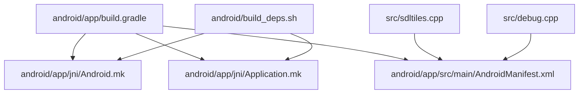
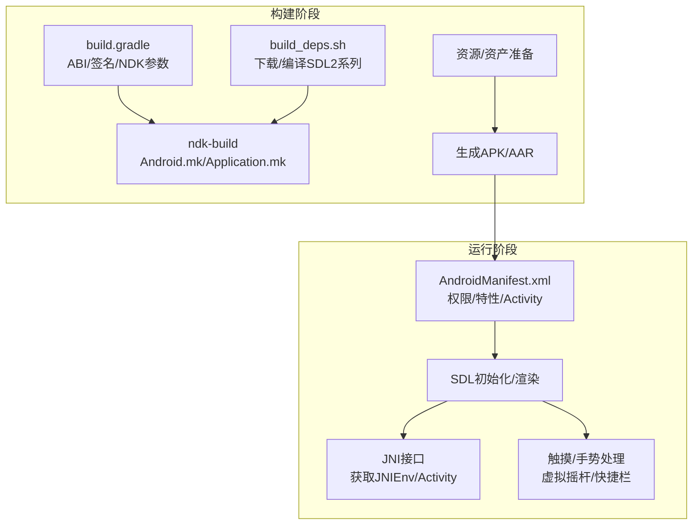
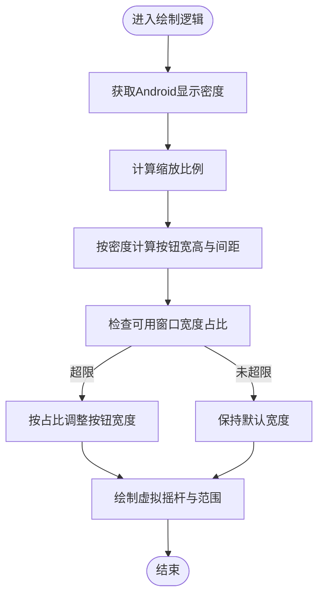
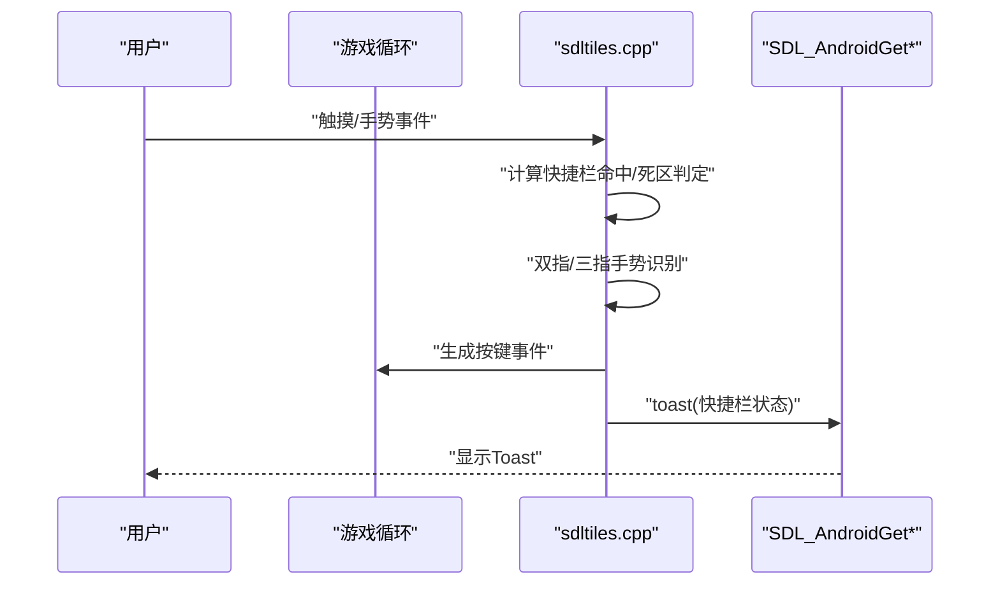
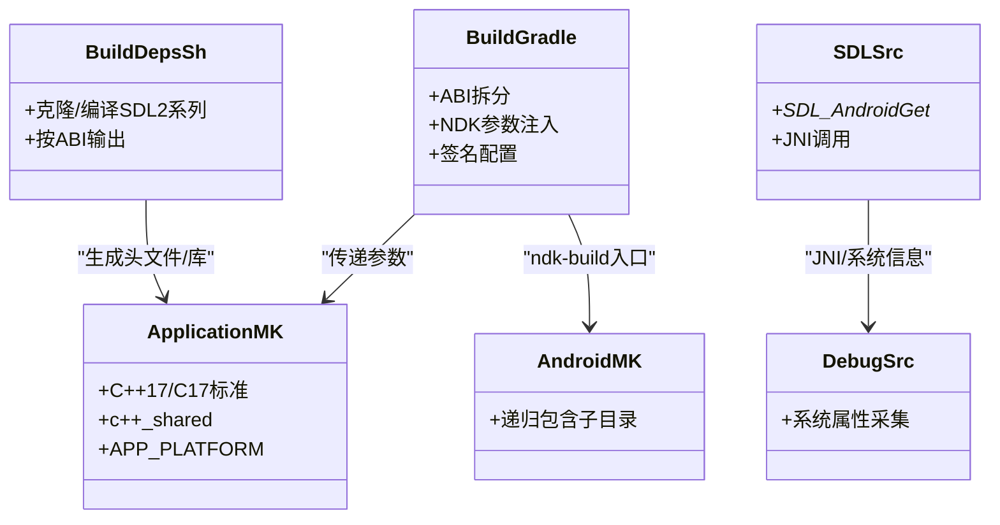
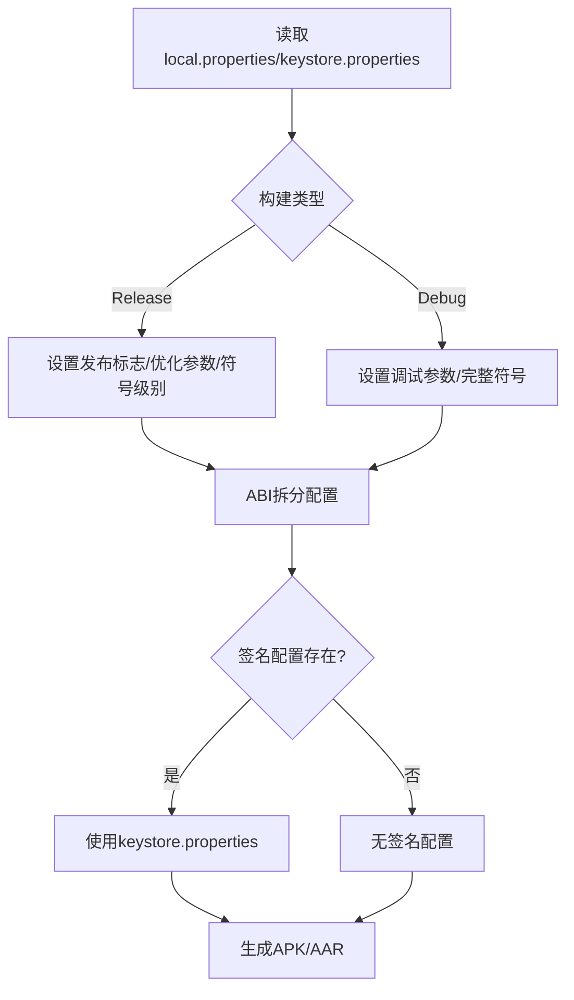
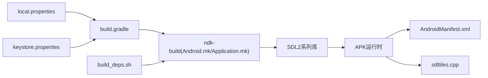

# Android平台适配

<cite>
**本文引用的文件**
- android/app/build.gradle
- android/app/src/main/AndroidManifest.xml
- android/app/jni/Android.mk
- android/app/jni/Application.mk
- android/build_deps.sh
- android/local.properties
- src/sdltiles.cpp
- src/debug.cpp
</cite>

## 目录
1. [简介](#简介)
2. [项目结构](#项目结构)
3. [核心组件](#核心组件)
4. [架构总览](#架构总览)
5. [组件详解](#组件详解)
6. [依赖关系分析](#依赖关系分析)
7. [性能考量](#性能考量)
8. [故障排查指南](#故障排查指南)
9. [结论](#结论)
10. [附录](#附录)

## 简介
本文件面向Cataclysm DDA（以下简称“DDA”）在Android平台的适配与工程化落地，系统梳理UI适配策略、触摸输入处理、屏幕尺寸适配、权限管理、NDK集成与JNI交互、打包签名与发布流程，并给出常见问题的解决方案与调试技巧。内容基于仓库中现有的Android构建脚本、清单文件与源码中的Android相关实现进行归纳总结。

## 项目结构
Android相关工程位于android目录下，采用Gradle + NDK（ndk-build）的传统方案组织，核心文件包括：
- Gradle构建：顶层与模块级构建脚本，定义ABI拆分、签名配置、NDK参数传递等
- 清单文件：声明OpenGL ES特性、权限、Activity与硬件加速等
- NDK构建：Android.mk与Application.mk，统一STL、C/C++标准与平台最低版本
- 依赖构建脚本：自动拉取并编译SDL2系列依赖，生成各ABI目标产物
- 源码适配：在渲染与输入层针对Android显示密度、虚拟摇杆、快捷键等进行适配

**图示来源**
- android/app/build.gradle
- android/app/jni/Android.mk
- android/app/jni/Application.mk
- android/app/src/main/AndroidManifest.xml
- android/build_deps.sh
- src/sdltiles.cpp
- src/debug.cpp

**章节来源**
- android/app/build.gradle
- android/app/src/main/AndroidManifest.xml
- android/app/jni/Android.mk
- android/app/jni/Application.mk
- android/build_deps.sh

## 核心组件
- 构建与打包
  - Gradle模块负责ABI拆分、多渠道风味、签名配置、NDK参数注入与资源准备
  - ndk-build负责原生库编译，统一STL与C/C++标准
- 权限与清单
  - 声明OpenGL ES 2.0、外部存储写入、振动权限；设置Activity横屏、保持唤醒、硬件加速等
- 输入与UI适配
  - 针对Android显示密度计算快捷栏尺寸，支持虚拟摇杆绘制与透明度控制
  - 支持双指缩放、三指操作等手势映射到按键事件
- NDK与JNI
  - 通过SDL提供的JNI接口获取环境与Activity对象，调用Toast提示
  - 后台崩溃回溯信息采集（Android属性读取）

**章节来源**
- android/app/build.gradle
- android/app/src/main/AndroidManifest.xml
- src/sdltiles.cpp
- src/sdltiles.cpp
- src/sdltiles.cpp
- src/debug.cpp

## 架构总览
下图展示从构建到运行的关键路径：Gradle读取本地配置与属性，注入NDK参数与ABI拆分；ndk-build拉取并编译SDL2系列依赖；最终生成多ABI原生库供APK使用；运行时通过SDL与JNI交互，结合Android权限与硬件能力完成渲染与输入。

**图示来源**
- android/app/build.gradle
- android/app/jni/Android.mk
- android/app/jni/Application.mk
- android/build_deps.sh
- android/app/src/main/AndroidManifest.xml
- src/sdltiles.cpp

## 组件详解

### UI适配与屏幕尺寸适配
- 显示密度与控件尺寸
  - 快捷栏按钮尺寸按Android显示密度缩放，确保不同分辨率设备上触控友好
  - 可用窗口宽度百分比限制快捷栏总宽度，避免溢出
- 虚拟摇杆绘制
  - 根据死区范围与重复延迟范围绘制视觉反馈，当前触摸点以半尺寸绘制
  - 透明度由选项控制，随屏幕最长边动态缩放

**图示来源**
- src/sdltiles.cpp
- src/sdltiles.cpp

**章节来源**
- src/sdltiles.cpp
- src/sdltiles.cpp

### 触摸输入处理与手势映射
- 快捷栏检测
  - 在屏幕底部区域根据手指当前位置返回对应快捷键事件
- 双指与三指手势
  - 双指滑动映射为上下左右方向键事件
  - 三指捏合映射为缩放事件
- 三指点击切换快捷栏可见性，并通过JNI调用Toast提示

**图示来源**
- src/sdltiles.cpp
- src/sdltiles.cpp
- src/sdltiles.cpp
- src/sdltiles.cpp

**章节来源**
- src/sdltiles.cpp
- src/sdltiles.cpp
- src/sdltiles.cpp
- src/sdltiles.cpp

### Android权限管理与文件访问控制
- 权限声明
  - 外部存储写入权限用于保存/读取存档与配置
  - 振动权限用于触觉反馈
  - OpenGL ES 2.0特性声明确保渲染可用
- 运行时注意事项
  - Android 6.0及以上建议在运行时请求危险权限（如存储），并在清单中声明
  - 对于分区存储（Android 10+），需使用适当的存储策略或兼容模式
  - 若启用录音功能，需在清单中添加相应权限并处理运行时授权

**章节来源**
- android/app/src/main/AndroidManifest.xml

### Android特有的性能优化
- 内存管理
  - 使用NDK调试符号级别控制（发布/调试差异），减少发布包体积与开销
  - 通过ABI拆分生成多APK，降低单APK体积与内存占用
- 电池优化
  - 保持屏幕常亮（适用于游戏界面），避免不必要的CPU唤醒
  - 合理使用渲染频率与输入轮询，避免高频唤醒
- 后台处理限制
  - Activity配置为单实例，避免重复启动导致的资源浪费
  - 横屏固定可减少配置变更带来的重绘与重建成本

**章节来源**
- android/app/build.gradle
- android/app/build.gradle
- android/app/src/main/AndroidManifest.xml

### NDK集成、JNI接口与原生库编译
- NDK构建配置
  - Application.mk统一C++17、C17标准与c++_shared STL，指定最低平台版本
  - Android.mk递归包含子目录，便于多模块原生库组织
- 依赖构建
  - build_deps.sh自动克隆并编译SDL2系列库，按ABI生成目标产物
- JNI调用
  - 通过SDL提供的JNI接口获取JNIEnv与Activity对象，调用Toast方法进行消息提示
- 崩溃回溯
  - Android平台下采集系统属性（厂商、型号、系统版本等）辅助定位问题

**图示来源**
- android/app/build.gradle
- android/app/jni/Application.mk
- android/app/jni/Android.mk
- android/build_deps.sh
- src/sdltiles.cpp
- src/debug.cpp

**章节来源**
- android/app/jni/Application.mk
- android/app/jni/Android.mk
- android/build_deps.sh
- src/sdltiles.cpp
- src/debug.cpp

### 应用打包、签名与发布流程
- 构建类型
  - Release：禁用混淆，开启NDK符号表级别，传入发布标志与优化参数
  - Debug：保留完整符号，便于调试
- ABI拆分
  - 通过productFlavors与splits配置生成多APK，按ABI选择最优包体
- 签名配置
  - 从keystore.properties读取密钥信息，支持release与debug两套签名
- 版本号与命名
  - 通过版本头文件与Gradle属性组合生成版本名称与代码

**图示来源**
- android/app/build.gradle
- android/app/build.gradle
- android/app/build.gradle

**章节来源**
- android/app/build.gradle
- android/app/build.gradle
- android/local.properties

## 依赖关系分析
- 构建期耦合
  - build.gradle依赖local.properties与keystore.properties，影响签名与SDK路径
  - ndk-build依赖Application.mk与Android.mk，以及build_deps.sh产出的SDL2系列头文件与库
- 运行期耦合
  - 渲染与输入依赖SDL，通过SDL_AndroidGet*接口与Android系统交互
  - 快捷栏与虚拟摇杆绘制依赖显示密度与窗口尺寸选项

**图示来源**
- android/local.properties
- android/app/build.gradle
- android/app/jni/Android.mk
- android/app/jni/Application.mk
- android/build_deps.sh
- android/app/src/main/AndroidManifest.xml
- src/sdltiles.cpp

**章节来源**
- android/local.properties
- android/app/build.gradle
- android/app/jni/Android.mk
- android/app/jni/Application.mk
- android/build_deps.sh
- android/app/src/main/AndroidManifest.xml
- src/sdltiles.cpp

## 性能考量
- 渲染与输入
  - 固定横屏与硬件加速有助于稳定帧率与减少重绘
  - 虚拟摇杆与快捷栏的绘制按密度缩放，避免过度像素填充
- 包体与加载
  - ABI拆分显著降低APK体积，缩短安装与启动时间
  - 发布构建关闭混淆但启用优化参数，兼顾体积与性能
- 系统交互
  - 保持屏幕常亮适合游戏场景，但需注意耗电；可在退出游戏界面时恢复默认

**章节来源**
- android/app/src/main/AndroidManifest.xml
- android/app/build.gradle
- android/app/build.gradle

## 故障排查指南
- 构建失败
  - SDK路径缺失：检查local.properties中的sdk.dir是否正确
  - keystore文件不存在：确认keystore.properties路径与文件存在
  - ABI全禁用：确保至少启用一种ABI，否则会抛出异常
- 运行期问题
  - Toast无法弹出：确认SDL_AndroidGet*接口可用且Activity已正确初始化
  - 快捷栏不可见：检查快捷栏高度、边界与屏幕百分比选项，确认显示密度计算正确
  - 手势不响应：核对双指/三指识别阈值与死区范围，确保事件坐标计算有效
- 调试技巧
  - 使用NDK调试符号级别区分发布与调试日志
  - 采集系统属性（厂商、型号、系统版本）辅助跨设备问题定位

**章节来源**
- android/local.properties
- android/app/build.gradle
- src/sdltiles.cpp
- src/sdltiles.cpp
- src/debug.cpp

## 结论
本适配方案以Gradle + ndk-build为核心，结合SDL2系列库与Android系统特性，在UI适配、触摸输入、权限与性能方面形成闭环。通过ABI拆分、显示密度适配、手势映射与JNI交互，DDA在Android平台上实现了较好的可用性与稳定性。后续可进一步完善运行时权限申请流程与分区存储策略，以满足更高版本Android系统的合规要求。

## 附录
- 关键构建参数参考
  - compileSdkVersion/targetSdkVersion/minSdkVersion：在构建脚本中作为属性传入
  - ndkVersion/APP_PLATFORM：在Application.mk与ndk-build参数中生效
  - ABI开关：armeabi-v7a/arm64-v8a/x86/x86_64按需启用
- 建议的清单扩展
  - 如需录音：添加RECORD_AUDIO权限并处理运行时授权
  - 如需网络：添加INTERNET权限（若涉及在线功能）
  - 如需外置存储细粒度控制：考虑使用Storage Access Framework