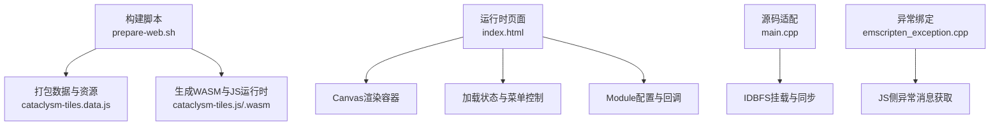
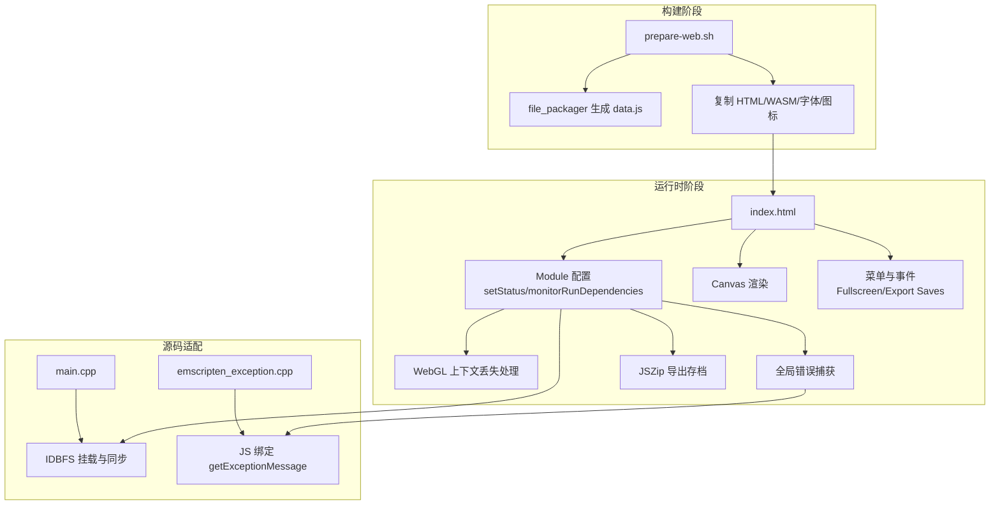
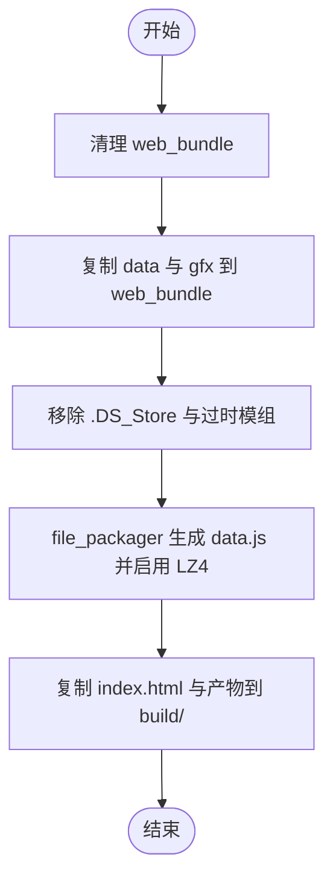
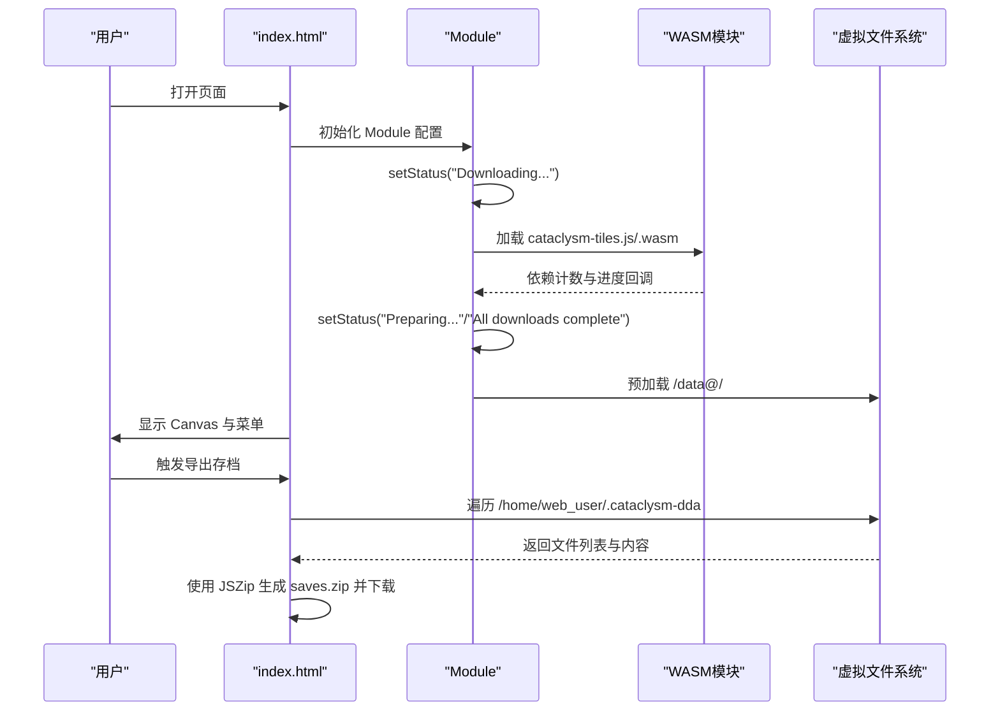
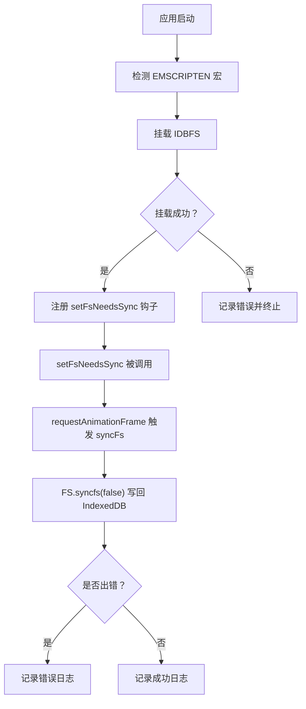
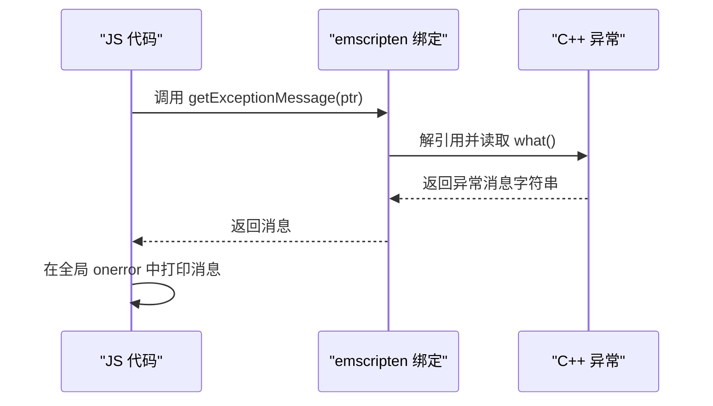
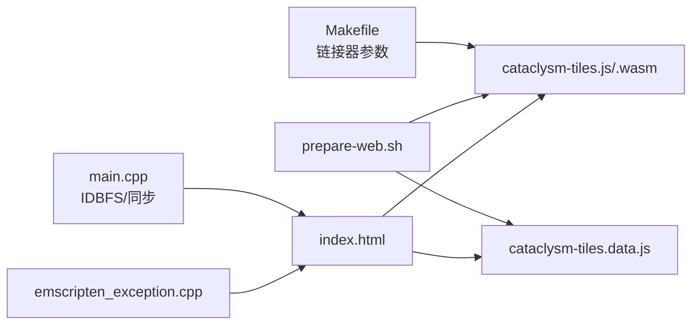

# Web平台适配

<cite>
**本文引用的文件**
- README.md
- index.html
- shell.html
- prepare-web.sh
- Makefile
- main.cpp
- emscripten_exception.cpp
</cite>

## 目录
1. [简介](#简介)
2. [项目结构](#项目结构)
3. [核心组件](#核心组件)
4. [架构总览](#架构总览)
5. [详细组件分析](#详细组件分析)
6. [依赖关系分析](#依赖关系分析)
7. [性能考虑](#性能考虑)
8. [故障排查指南](#故障排查指南)
9. [结论](#结论)
10. [附录](#附录)

## 简介
本文件面向Cataclysm: Dark Days Ahead（简称CDDA）在浏览器端的Web平台适配，聚焦于以下方面：
- WebAssembly与Emscripten集成：编译器配置、运行时行为、内存管理与持久化
- 浏览器兼容性与polyfill策略
- Web存储机制：IndexedDB、LocalStorage与文件系统模拟
- Web音频与图形API适配
- 性能优化：Worker线程、异步加载、缓存策略
- 错误处理与调试方法

该文档以仓库中已存在的Web构建与运行时脚本为基础，结合源码中的Emscripten相关实现进行系统化梳理，并提供可操作的实践建议。

## 项目结构
Web平台适配涉及的关键位置如下：
- 构建与打包：构建脚本负责打包资源、生成WebAssembly模块与数据文件
- 运行时页面：HTML模板定义Canvas、加载状态、菜单与事件绑定
- 源码适配：主程序入口与异常绑定用于Web环境初始化与错误暴露
- 工具页：示例HTML模板展示如何在Web中使用Emscripten生成的模块

**图表来源**
- prepare-web.sh
- index.html
- main.cpp
- emscripten_exception.cpp

**章节来源**
- README.md
- prepare-web.sh
- index.html

## 核心组件
- 构建与打包脚本：负责清理旧产物、复制必要数据、剔除不适用资源、使用file_packager生成预加载数据包，并输出到构建目录
- 运行时页面与Module配置：定义Canvas、加载提示、全屏切换、保存导出等交互；通过Module对象配置依赖计数、状态更新、WebGL上下文丢失处理、全局错误捕获
- 源码适配层：在Web环境下挂载IndexedDB文件系统（IDBFS），提供同步钩子以触发持久化
- 异常绑定：将C++异常指针转换为字符串，供JS侧读取并显示

**章节来源**
- prepare-web.sh
- index.html
- main.cpp
- emscripten_exception.cpp

## 架构总览
下图展示了从构建到运行的端到端流程，以及关键的Web特性开关与运行时交互点。

**图表来源**
- prepare-web.sh
- index.html
- main.cpp
- emscripten_exception.cpp

## 详细组件分析

### 构建与打包（prepare-web.sh）
- 清理与准备：删除旧的web_bundle，创建目录并复制核心数据与gfx资源
- 资源精简：移除.DS_Store、过时模组、特定tileset，减少体积
- 数据打包：使用file_packager以LZ4压缩方式生成cataclysm-tiles.data与cataclysm-tiles.data.js，采用“预加载”模式将资源打包进WASM运行时
- 输出：复制index.html、WASM产物、字体与图标至构建目录

**图表来源**
- prepare-web.sh

**章节来源**
- prepare-web.sh

### 运行时页面与Module配置（index.html）
- Canvas与样式：定义全屏、像素化渲染、最小尺寸约束
- 加载状态：动态更新加载进度与提示信息
- 菜单与交互：齿轮菜单、全屏切换、导出存档（使用JSZip打包Emscripten虚拟文件系统）
- Module配置要点：
  - setStatus/monitorRunDependencies：统一管理下载与初始化进度
  - canvas.webglcontextlost：WebGL上下文丢失时提示用户刷新
  - 全局onerror：尝试调用getExceptionMessage以输出C++异常信息
  - onbeforeunload：防止未保存退出
  - 异步加载WASM与数据：data.js与js/wasm按顺序加载

**图表来源**
- index.html

**章节来源**
- index.html

### 源码适配（main.cpp）
- IDBFS挂载：在Web环境下挂载IndexedDB为持久化文件系统，确保存档与用户数据持久化
- 同步钩子：setFsNeedsSync在需要时调度一次FS.syncfs，避免频繁写入造成抖动
- 同步流程：通过requestAnimationFrame触发同步，完成后根据结果打印日志或错误

**图表来源**
- main.cpp

**章节来源**
- main.cpp

### 异常绑定（emscripten_exception.cpp）
- 将C++异常指针转换为字符串，供JS侧调用
- 在全局错误回调中优先尝试读取异常消息，提升调试体验

**图表来源**
- emscripten_exception.cpp
- index.html

**章节来源**
- emscripten_exception.cpp
- index.html

### 工具页模板（shell.html）
- 展示了在Web中嵌入Emscripten模块的标准做法：占位符注入、cwrap调用、输入校验与错误提示
- 可作为理解JS与WASM互操作的参考

**章节来源**
- shell.html

## 依赖关系分析
- 构建期依赖：Emscripten工具链、file_packager、LZ4压缩
- 运行期依赖：WASM模块、预加载数据、浏览器API（WebGL、IndexedDB、FileSaver/JSZip）
- 源码适配依赖：EMSCRIPTEN宏条件编译、IDBFS挂载接口、FS.syncfs

**图表来源**
- Makefile
- prepare-web.sh
- index.html
- main.cpp
- emscripten_exception.cpp

**章节来源**
- Makefile
- prepare-web.sh
- index.html

## 性能考虑
- 内存与栈
  - 初始内存、最大内存、允许增长、栈大小均在链接阶段配置，适合浏览器端大世界加载
  - 建议在发布版启用LZ4压缩以减小传输体积
- 异步化
  - 启用ASYNCIFY以支持阻塞式调用在Web环境下的协程化，降低主线程阻塞风险
- 缓存策略
  - 预加载数据包与静态资源可结合HTTP缓存头与Service Worker策略进一步优化
- 渲染与图形
  - WebGL版本上限设置为2，确保现代浏览器图形管线可用
- 存储与I/O
  - 使用IDBFS进行持久化，避免频繁写入，通过钩子合并多次变更后再同步

**章节来源**
- Makefile
- prepare-web.sh
- index.html

## 故障排查指南
- WebGL上下文丢失
  - 页面已内置上下文丢失提示与阻止默认行为，需引导用户刷新页面恢复
- 全局异常
  - onerror会尝试读取C++异常消息；若可用则优先输出，便于定位问题
- 存档导出失败
  - 检查虚拟文件系统路径与权限；确认JSZip生成与下载流程未被拦截
- 内存不足或增长受限
  - 检查链接参数与运行时内存配置；必要时调整初始/最大内存与栈大小
- 调试建议
  - 开启FS_DEBUG与符号分离（调试模式）以获得更详细的文件系统日志与堆栈
  - 在浏览器开发者工具中观察网络面板的预加载数据与WASM加载情况

**章节来源**
- index.html
- Makefile

## 结论
CDDA的Web平台适配基于Emscripten实现了从构建到运行的完整闭环：通过file_packager将资源预加载进WASM运行时，借助Module配置实现进度与错误管理，利用IDBFS保障存档持久化，并在页面层面提供全屏、导出等实用功能。结合ASYNCIFY与内存参数调优，可在浏览器端稳定运行大型回合制游戏。后续可围绕Worker线程、缓存策略与更多浏览器API polyfill进行深度优化。

## 附录

### 浏览器兼容性与Polyfill策略
- WebGL版本上限设为2，确保现代浏览器图形能力可用
- 使用标准DOM与Canvas API，避免非标准扩展
- 对历史浏览器可通过polyfill库补充缺失能力（如Promise、fetch、Array.from等），但需注意体积与性能权衡
- 建议在CI中对主流浏览器进行自动化测试，覆盖关键路径（渲染、存档、音频）

### Web存储机制
- IndexedDB：通过IDBFS实现持久化文件系统，适合保存用户存档与配置
- LocalStorage：可用于轻量配置项与用户偏好，避免与IDBFS冲突
- 文件系统模拟：Emscripten虚拟FS在内存与IndexedDB之间桥接，提供类Unix文件操作语义

### Web音频与图形API适配
- 图形：使用WebGL渲染，结合Canvas与着色器管线；注意上下文丢失处理
- 音频：若启用音效，可使用Web Audio API或浏览器媒体元素；在WebAssembly中通过JS绑定或Emscripten提供的音频接口进行桥接

### 性能优化清单
- 发布版启用LZ4压缩与更高优化级别
- 使用ASYNCIFY与合理的栈大小平衡功能完整性与性能
- 将静态资源与WASM模块置于CDN并配合HTTP缓存
- 对频繁I/O操作进行批处理与节流，减少IDBFS写入频率