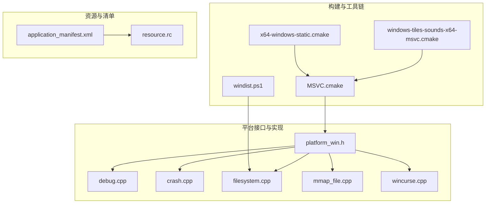
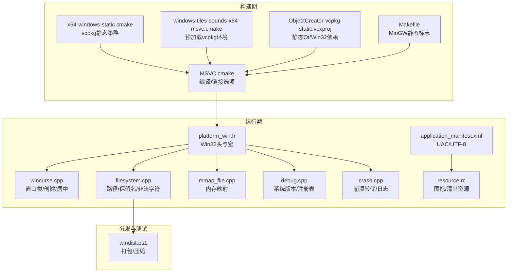
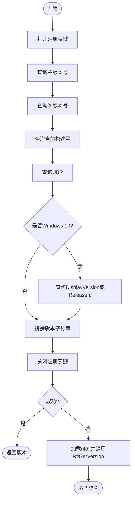
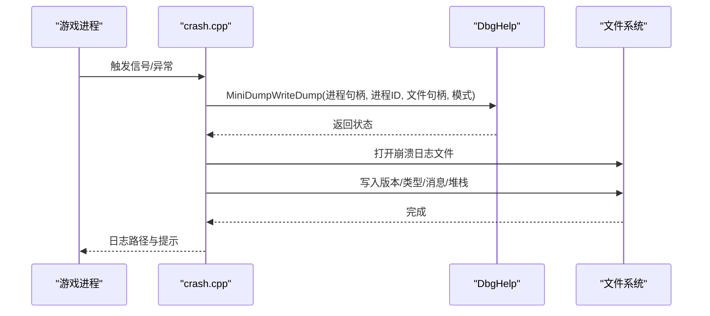
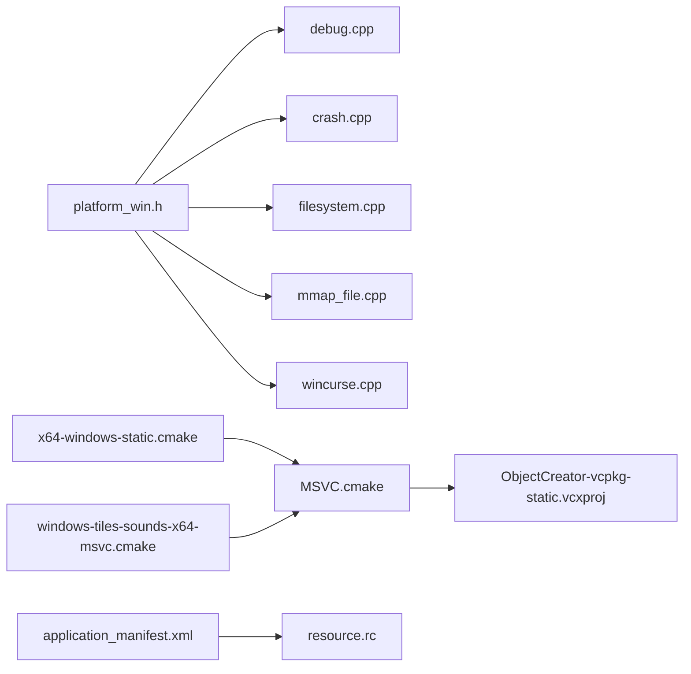

# Windows平台适配

<cite>
**本文引用的文件**
- platform_win.h
- MSVC.cmake
- x64-windows-static.cmake
- windows-tiles-sounds-x64-msvc.cmake
- windist.ps1
- application_manifest.xml
- resource.rc
- debug.cpp
- crash.cpp
- crash.h
- filesystem.cpp
- mmap_file.cpp
- wincurse.cpp
- Makefile
- ObjectCreator-vcpkg-static.vcxproj
</cite>

## 目录
1. [引言](#引言)
2. [项目结构](#项目结构)
3. [核心组件](#核心组件)
4. [架构总览](#架构总览)
5. [组件详解](#组件详解)
6. [依赖关系分析](#依赖关系分析)
7. [性能考量](#性能考量)
8. [故障排查指南](#故障排查指南)
9. [结论](#结论)
10. [附录](#附录)

## 引言
本文件面向Cataclysm-DDA在Windows平台的适配与工程化落地，系统梳理Windows原生API集成、构建配置（静态链接、DLL依赖管理、Visual Studio集成）、文件系统与注册表访问、系统信息获取、UAC与权限处理、防火墙与杀软兼容性、性能监控与内存泄漏检测、崩溃转储分析以及Windows特有优化与部署策略。内容基于仓库中实际存在的源码与脚本进行归纳总结，帮助开发者在Windows环境下稳定构建、运行与排障。

## 项目结构
围绕Windows适配的关键目录与文件如下：
- 构建与工具链：build-scripts（MSVC.cmake、x64-windows-static.cmake、windows-tiles-sounds-x64-msvc.cmake、windist.ps1）
- 平台头文件：src/platform_win.h（统一定义Windows相关宏与最小头集）
- 资源与清单：data/application_manifest.xml、src/resource.rc
- 平台实现：src/debug.cpp（系统版本与注册表查询）、src/crash.cpp（崩溃转储）、src/filesystem.cpp（Windows路径与保留名）、src/mmap_file.cpp（Windows内存映射）、src/wincurse.cpp（Win32窗口）
- 静态链接与MSVC工程：Makefile（MinGW/MSYS2静态标志）、ObjectCreator-vcpkg-static.vcxproj（vcpkg静态库、平台工具集）

**图表来源**
- MSVC.cmake
- x64-windows-static.cmake
- windows-tiles-sounds-x64-msvc.cmake
- windist.ps1
- platform_win.h
- debug.cpp
- crash.cpp
- filesystem.cpp
- mmap_file.cpp
- wincurse.cpp
- application_manifest.xml
- resource.rc

**章节来源**
- platform_win.h
- MSVC.cmake
- x64-windows-static.cmake
- windows-tiles-sounds-x64-msvc.cmake
- windist.ps1
- application_manifest.xml
- resource.rc

## 核心组件
- 平台头文件与宏：统一引入Windows头文件并设置最小宏集合，确保编译一致性与兼容性。
- 系统信息与注册表：通过注册表键值查询Windows版本信息，并回退到RtlGetVersion以增强兼容性。
- 崩溃转储与日志：使用DbgHelp生成MiniDump，结合调试符号输出堆栈与日志。
- 文件系统与路径：针对Windows保留设备名与非法字符进行校验与规避。
- 内存映射文件：封装CreateFileMapping/MapViewOfFile等Win32 API，提供跨平台抽象。
- Win32窗口与资源：注册窗口类、调整窗口尺寸、居中显示；通过资源脚本注入图标与清单。
- 构建与打包：MSVC工具链参数、vcpkg静态三库策略、分发脚本压缩归档。

**章节来源**
- platform_win.h
- debug.cpp
- crash.cpp
- filesystem.cpp
- mmap_file.cpp
- wincurse.cpp
- MSVC.cmake
- x64-windows-static.cmake
- windist.ps1

## 架构总览
下图展示Windows适配在构建、运行期与诊断层面的交互关系。

**图表来源**
- MSVC.cmake
- x64-windows-static.cmake
- windows-tiles-sounds-x64-msvc.cmake
- ObjectCreator-vcpkg-static.vcxproj
- Makefile
- platform_win.h
- wincurse.cpp
- filesystem.cpp
- mmap_file.cpp
- debug.cpp
- crash.cpp
- application_manifest.xml
- resource.rc
- windist.ps1

## 组件详解

### Windows原生API集成与平台头文件
- 统一包含windows.h并设置WIN32_LEAN_AND_MEAN、NOMINMAX、STRICT等宏，减少不必要的头文件开销与冲突。
- 提供getWindowHandle等平台函数声明，便于后续扩展。

**章节来源**
- platform_win.h

### 系统信息获取与注册表操作
- 使用RegQueryValueEx从注册表读取主次版本号、构建号、UBR、DisplayVersion或ReleaseId等键值，拼接完整版本字符串。
- 若注册表查询失败，则通过ntdll导出的RtlGetVersion回退获取版本信息。
- 该流程同时兼容MSYS2/MINGW/Cygwin环境与原生Windows。

**图表来源**
- debug.cpp

**章节来源**
- debug.cpp

### 崩溃转储与日志记录
- 初始化信号处理器与C++异常终止处理函数，在崩溃时生成MiniDump文件并写入日志，包含版本、类型、消息与堆栈。
- 在非调试器附加场景下弹出错误提示（若启用图形界面），并将日志落盘。

**图表来源**
- crash.cpp

**章节来源**
- crash.cpp
- crash.h

### 文件系统访问与路径规范
- 针对Windows保留设备名（如CON、PRN、AUX、NUL及COM/LPT系列）进行严格校验，避免命名冲突。
- 对非法字符（如`/\:*?"<>|`）进行过滤与拒绝。
- 使用标准库filesystem进行路径规范化与目录创建，保证跨平台一致性。

**章节来源**
- filesystem.cpp

### 内存映射文件（mmap）
- 使用Win32 API实现文件映射：CreateFileMapping/MapViewOfFile/UnmapViewOfFile/CloseHandle。
- 自动获取文件大小并根据可写需求选择页面保护与映射标志。
- 提供RAII式资源管理，确保异常路径也能正确释放。

**章节来源**
- mmap_file.cpp

### Win32窗口与资源
- 注册窗口类（含默认图标、光标、类名），计算窗口矩形并居中显示。
- 通过SystemParametersInfo获取工作区域，实现窗口居中逻辑。
- 资源脚本将图标与应用清单注入可执行文件，清单中声明UTF-8与请求权限级别。

**章节来源**
- wincurse.cpp
- resource.rc
- application_manifest.xml

### 构建配置与静态链接
- MSVC工具链：设置编译器/链接器选项、警告屏蔽、运行时库、vcpkg集成与triplet。
- vcpkg静态策略：目标架构x64、CRT与库均静态链接，发布构建类型release。
- 预加载脚本：自动注入VCPKG_ROOT环境变量，确保IDE与CI一致。
- MinGW/MSYS2静态标志：在Makefile中根据动态/静态开关添加静态链接标志与子系统参数。
- MSVC工程：ObjectCreator项目启用vcpkg静态、多字节字符集、指定平台工具集与Qt静态库依赖。

**章节来源**
- MSVC.cmake
- x64-windows-static.cmake
- windows-tiles-sounds-x64-msvc.cmake
- Makefile
- ObjectCreator-vcpkg-static.vcxproj

### UAC权限与清单
- 应用清单声明请求执行级别为“asInvoker”，不提升权限，降低UAC弹窗概率。
- 启用UTF-8编码设置，改善国际化文本显示与文件名处理。

**章节来源**
- application_manifest.xml
- resource.rc

### 防火墙与杀毒软件兼容性
- 建议在安装/更新流程中加入白名单规则（具体规则由发行方维护），避免误报。
- 将可执行文件与数据目录放置于用户可写且受信任的路径，减少权限变更触发的拦截行为。
- 分发包采用压缩归档，减少单文件体积与扫描压力。

**章节来源**
- windist.ps1

## 依赖关系分析
- 平台层：platform_win.h集中引入Win32头文件，被debug、crash、filesystem、mmap_file、wincurse等模块间接依赖。
- 构建层：MSVC.cmake与x64-windows-static.cmake共同决定编译器、警告、运行时与vcpkg静态策略；windows-tiles-sounds-x64-msvc.cmake负责环境变量注入；ObjectCreator-vcpkg-static.vcxproj定义静态Qt与Win32依赖。
- 资源层：application_manifest.xml与resource.rc共同完成图标与清单注入。
- 运行期：debug.cpp与crash.cpp分别承担系统信息采集与崩溃诊断，filesystem.cpp与mmap_file.cpp提供底层文件能力。

**图表来源**
- platform_win.h
- debug.cpp
- crash.cpp
- filesystem.cpp
- mmap_file.cpp
- wincurse.cpp
- MSVC.cmake
- x64-windows-static.cmake
- windows-tiles-sounds-x64-msvc.cmake
- application_manifest.xml
- resource.rc

**章节来源**
- platform_win.h
- MSVC.cmake
- x64-windows-static.cmake
- windows-tiles-sounds-x64-msvc.cmake
- application_manifest.xml
- resource.rc

## 性能考量
- 编译器优化：MSVC工具链开启/Opt:Ref/ICF、禁用LTCG，Release模式最大化速度；MinGW侧按需静态链接以减少运行时开销。
- 运行时库：MSVC使用MultiThreaded/Debug运行时库，避免额外CRT开销；vcpkg静态CRT减少DLL依赖。
- 文件访问：filesystem与mmap_file在Windows上采用标准库与Win32 API组合，兼顾可移植性与性能。
- UI与窗口：wincurse.cpp通过AdjustWindowRect与SystemParametersInfo实现快速布局与居中，降低UI初始化成本。

**章节来源**
- MSVC.cmake
- Makefile
- filesystem.cpp
- mmap_file.cpp
- wincurse.cpp

## 故障排查指南
- 版本信息为空或不准确：检查注册表键是否存在，必要时启用RtlGetVersion回退路径。
- 崩溃无转储或日志缺失：确认DbgHelp可用、MiniDumpWriteDump权限、日志文件写入路径存在且可写。
- 文件创建失败：核对路径是否包含保留名或非法字符，确保父目录已存在。
- 内存映射失败：检查文件大小、句柄有效性与页面保护标志，确保异常路径释放资源。
- UAC弹窗频繁：确认应用清单请求级别为asInvoker，避免不必要的权限提升。
- 杀软拦截：将可执行与数据目录加入白名单，分发包采用压缩归档减少误报。

**章节来源**
- debug.cpp
- crash.cpp
- filesystem.cpp
- mmap_file.cpp
- application_manifest.xml

## 结论
本适配方案通过统一的平台头文件、严谨的注册表与系统信息采集、完善的崩溃转储与日志机制、严格的文件系统命名规范与内存映射封装，以及MSVC/vcpkg静态构建策略，实现了Cataclysm-DDA在Windows平台上的稳定运行与可诊断性。配合应用清单与分发脚本，进一步降低了UAC与杀软带来的使用障碍，为Windows用户提供了可靠的体验基础。

## 附录
- 关键实现位置参考：
  - 平台宏与头文件：platform_win.h
  - 系统版本与注册表：debug.cpp
  - 崩溃转储与日志：crash.cpp、crash.h
  - 文件系统与路径：filesystem.cpp
  - 内存映射：mmap_file.cpp
  - Win32窗口与资源：wincurse.cpp、resource.rc、application_manifest.xml
  - 构建与静态策略：MSVC.cmake、x64-windows-static.cmake、windows-tiles-sounds-x64-msvc.cmake、Makefile、ObjectCreator-vcpkg-static.vcxproj
  - 分发打包：windist.ps1