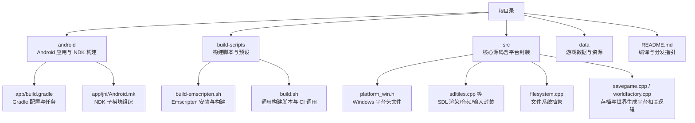
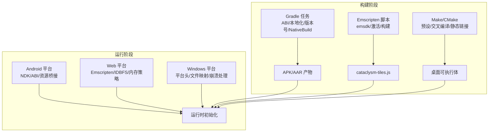
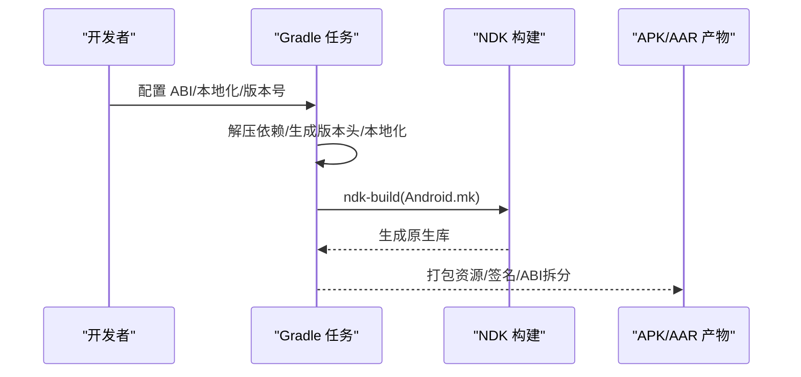
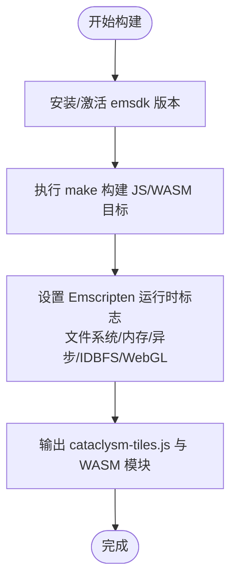
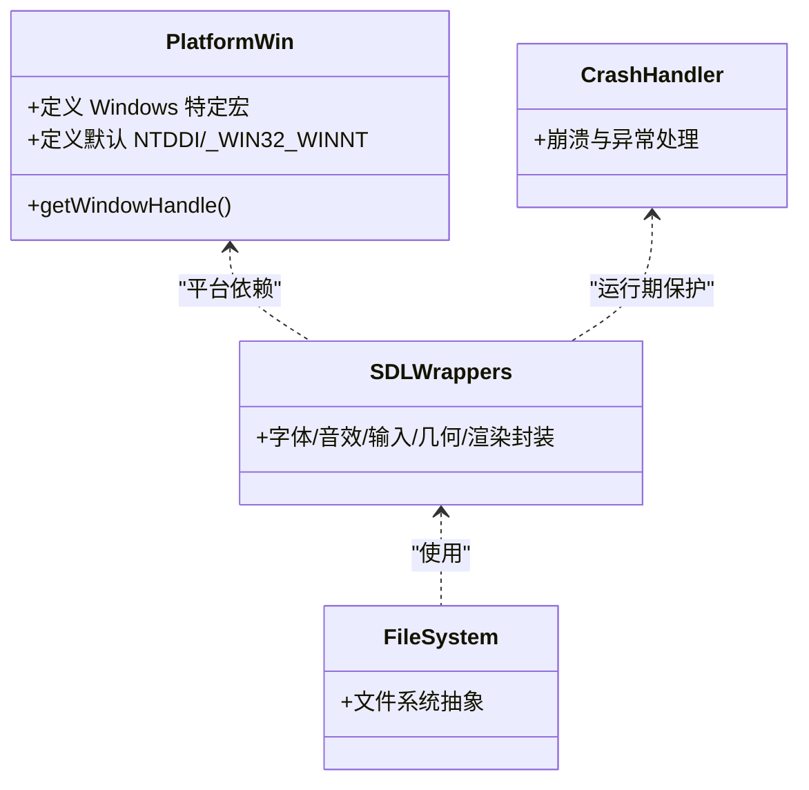
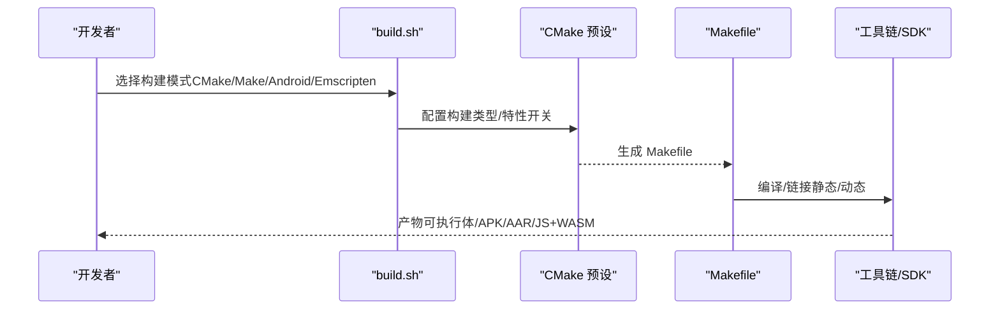
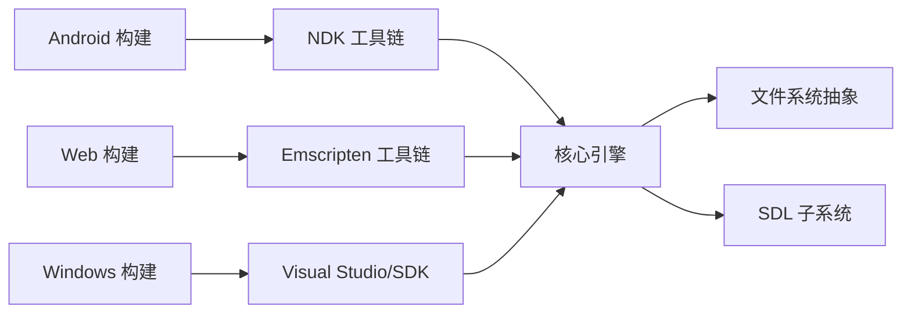

# 平台适配

<cite>
**本文引用的文件**
- README.md
- android/app/build.gradle
- android/app/jni/Android.mk
- build-scripts/build-emscripten.sh
- build-scripts/build.sh
- Makefile
- src/platform_win.h
- src/sdltiles.cpp
- src/mmap_file.cpp
- src/sdl_font.cpp
- src/sdl_sound.cpp
- src/sdl_wrappers.cpp
- src/sdl_utils.cpp
- src/sdl_gamepad.cpp
- src/sdl_geometry.cpp
- src/emscripten_exception.cpp
- src/crash.cpp
- src/filesystem.cpp
- src/options.cpp
- src/savegame.cpp
- src/worldfactory.cpp
- src/game.cpp
- src/main.cpp
</cite>

## 目录
1. [引言](#引言)
2. [项目结构](#项目结构)
3. [核心组件](#核心组件)
4. [架构总览](#架构总览)
5. [详细组件分析](#详细组件分析)
6. [依赖关系分析](#依赖关系分析)
7. [性能考量](#性能考量)
8. [故障排查指南](#故障排查指南)
9. [结论](#结论)
10. [附录](#附录)

## 引言
本文件面向Cataclysm: Dark Days Ahead（简称 CDDA）的多平台适配系统，系统性梳理并说明以下平台与技术栈的适配策略与实现要点：
- Android 移动端：应用打包、NDK 构建、ABI 分包、资源与本地化、Windows 主机上的符号链接资产桥接。
- WebAssembly（Emscripten）：浏览器运行时集成、文件系统桥接、内存与异步策略、存储机制。
- Windows 原生：平台头文件、窗口句柄、文件映射与内存管理、音视频与字体渲染、崩溃与异常处理。
- 跨平台构建：CMake 预设、Makefile 规则、脚本化构建流程、交叉编译与依赖管理。

目标是帮助开发者在不同平台上稳定构建、正确集成平台特性，并进行针对性优化与兼容性处理。

## 项目结构
围绕平台适配的关键目录与文件如下：
- android：Android 应用工程与 NDK 构建配置，包含 Gradle 构建脚本与 Android.mk 子模块组织。
- build-scripts：跨平台构建脚本，含 Emscripten 安装与构建、通用构建流程、CI 流水线调用。
- src：核心源码，按功能模块划分，包含平台相关封装（如 Windows 头文件、SDL 封装、文件系统等）。
- data：游戏数据、资源与清单；与平台资源打包/挂载密切相关。
- 其他：README 提供总体编译与分发信息；CMakeModules 提供 CMake 查找模块。

图表来源
- android/app/build.gradle
- android/app/jni/Android.mk
- build-scripts/build-emscripten.sh
- build-scripts/build.sh
- src/platform_win.h
- src/sdltiles.cpp
- src/filesystem.cpp

章节来源
- README.md

## 核心组件
- Android 应用与 NDK 构建
  - Gradle 通过属性开关控制 ABI、本地化、版本号与 NDK 版本；支持按 ABI 生成独立 APK；支持生成 AAR 库产物；Windows 上通过符号链接桥接 assets。
- WebAssembly（Emscripten）
  - Makefile 中定义了大量 Emscripten 运行时标志，包括强制文件系统、导出运行时方法、初始/最大内存、堆栈大小、异步化、IDBFS 挂载、WebGL 版本限制等。
- Windows 原生
  - 平台头文件统一定义 Windows 特定宏与最小头集；文件映射与内存管理封装；音视频与字体渲染通过 SDL 层；崩溃与异常处理贯穿运行期。
- 跨平台构建
  - CMake 预设与 Makefile 双轨并行；脚本化构建流程支持 CI；支持交叉编译与静态链接；Emscripten 专用安装与构建脚本。

章节来源
- android/app/build.gradle
- android/app/build.gradle
- android/app/build.gradle
- build-scripts/build-emscripten.sh
- Makefile
- src/platform_win.h
- src/mmap_file.cpp
- src/sdl_wrappers.cpp

## 架构总览
下图展示从构建到运行的平台适配路径：构建阶段通过 Gradle/Emscripten/Make/CMake 组合产出可执行体或 JS/WASM；运行阶段由平台层（Android/Windows/Web）加载资源、初始化 SDL 子系统、接入文件系统与存储、处理输入与渲染。

图表来源
- android/app/build.gradle
- build-scripts/build-emscripten.sh
- Makefile
- src/platform_win.h

## 详细组件分析

### Android 平台适配
- 构建与打包
  - Gradle 通过属性控制 ABI 列表（ARM32/ARM64/x86/x86_64），启用按 ABI 分包并禁用通用 APK；支持生成 AAR 库产物；签名配置可选。
  - 预构建阶段包含解压依赖、本地化构建、版本头生成、Windows 符号链接资产桥接。
- 资源与本地化
  - 支持在 Linux/Windows 下分别执行本地化构建；Windows 上通过符号链接将 assets 指向项目根目录的数据目录，保证资源一致。
- NDK 构建与 ABI
  - 使用 Android NDK 的 Android.mk 组织子模块；Gradle 传入 APP_PLATFORM 与并行编译参数；调试符号级别可配置。

图表来源
- android/app/build.gradle
- android/app/build.gradle
- android/app/jni/Android.mk

章节来源
- android/app/build.gradle
- android/app/jni/Android.mk

### WebAssembly（Emscripten）集成
- 运行时与内存
  - 强制使用文件系统、导出运行时方法（FS、堆栈跟踪）、初始/最大内存、允许内存增长、堆栈大小、异步化（ASYNCIFY）与栈大小、BigInt 支持、限制 WebGL 版本。
- 存储机制
  - 启用 IDBFS（IndexedDB 文件系统）以持久化用户数据；在发布模式启用 LZ4 压缩。
- 构建流程
  - 通过脚本安装并激活指定版本的 emsdk，结合 ccache 加速编译，构建 JS/WASM 目标。

图表来源
- build-scripts/build-emscripten.sh
- Makefile

章节来源
- build-scripts/build-emscripten.sh
- Makefile

### Windows 平台原生适配
- 平台头文件与最小依赖
  - 统一定义 Windows 特定宏（如 WIN32_LEAN_AND_MEAN、NOMINMAX、STRICT）与默认 NTDDI/_WIN32_WINNT 版本，减少头文件体积与编译时间。
- 文件映射与内存管理
  - 文件映射封装在平台相关代码中，确保跨版本兼容与错误处理。
- SDL 子系统封装
  - 字体、音效、输入、几何、渲染等均通过 SDL 封装，便于在 Windows 上复用。
- 崩溃与异常处理
  - 运行期崩溃与异常处理贯穿核心模块，保障稳定性。

图表来源
- src/platform_win.h
- src/sdl_wrappers.cpp
- src/filesystem.cpp
- src/crash.cpp

章节来源
- src/platform_win.h
- src/mmap_file.cpp
- src/sdl_font.cpp
- src/sdl_sound.cpp
- src/sdl_gamepad.cpp
- src/sdl_geometry.cpp
- src/sdl_wrappers.cpp
- src/crash.cpp

### 跨平台构建系统与依赖管理
- CMake 预设与 Makefile
  - CMake 预设用于生成构建系统；Makefile 提供跨平台构建规则、交叉编译开关、目标系统判定（如 Windows）、静态链接选项等。
- 脚本化构建
  - build.sh 统一入口，支持 CMake/Make 双轨、clang-tidy 分析、并行测试、NDK Android 构建、CI 场景下的 JSON 校验与样式检查。
- 依赖管理
  - CMakeModules 提供第三方库查找模块；Windows 静态链接方案通过 CMake 与 vcpkg 集成；Emscripten 通过 emsdk 管理工具链。

图表来源
- build-scripts/build.sh
- Makefile

章节来源
- build-scripts/build.sh
- Makefile

## 依赖关系分析
- 平台耦合度
  - Android 与 Windows 在核心逻辑上通过 SDL 抽象解耦；Web 平台通过 Emscripten 运行时桥接文件系统与内存模型。
- 直接与间接依赖
  - 构建脚本依赖工具链与 SDK；运行时依赖 SDL 子系统与平台文件系统；存档/世界生成模块依赖文件系统抽象。
- 循环依赖与规避
  - 平台头文件仅在必要处包含，避免循环包含；SDL 封装作为中间层隔离平台差异。

图表来源
- android/app/build.gradle
- build-scripts/build-emscripten.sh
- Makefile
- src/filesystem.cpp
- src/sdl_wrappers.cpp

## 性能考量
- Android
  - 按 ABI 拆分 APK 降低体积与启动时间；NDK 并行编译提升构建效率；可选 ccache 与编译器检查策略优化增量编译。
- WebAssembly
  - 启用内存增长与较大初始内存以减少运行时扩容；异步化支持阻塞式调用转为非阻塞；IDBFS 持久化避免频繁下载；发布模式启用压缩。
- Windows
  - 静态链接减少运行时依赖；最小头集与严格宏减少编译开销；文件映射与内存管理封装提升 I/O 效率；崩溃处理降低不可预期停机风险。

章节来源
- android/app/build.gradle
- android/app/build.gradle
- build-scripts/build.sh
- Makefile
- src/platform_win.h
- src/mmap_file.cpp

## 故障排查指南
- Android 构建失败
  - 检查 ABI 开关是否全部关闭导致报错；确认依赖 ZIP 是否存在；校验 keystore 配置与文件路径；Windows 上确认符号链接创建是否成功。
- WebAssembly 运行异常
  - 确认浏览器支持 BigInt 与 WebGL 2；检查 IDBFS 初始化与挂载路径；验证内存参数与异步化配置；查看运行时导出方法可用性。
- Windows 运行问题
  - 核对平台头文件宏定义与 SDK 版本；检查文件映射与权限；验证崩溃日志与异常捕获；确认 SDL 子系统初始化顺序与资源路径。

章节来源
- android/app/build.gradle
- android/app/build.gradle
- android/app/build.gradle
- Makefile
- src/platform_win.h
- src/crash.cpp

## 结论
CDDA 的多平台适配通过“构建脚本 + 平台封装 + SDL 抽象”的组合实现了跨 Android、WebAssembly 与 Windows 的稳定运行。Android 侧通过 Gradle 与 NDK 实现 ABI 分包与资源桥接；WebAssembly 侧通过 Emscripten 运行时与 IDBFS 实现浏览器内持久化；Windows 侧通过平台头文件与 SDL 封装实现最小依赖与高效 I/O。建议在实际部署中结合平台特性进行针对性优化，并完善自动化测试与 CI 验证。

## 附录
- 平台特定功能示例与测试验证方法
  - Android：通过 Gradle 任务生成多 ABI APK，验证资源挂载与本地化；在模拟器/真机上运行主菜单与存档加载。
  - WebAssembly：在浏览器中加载 JS/WASM，验证存档读写与 UI 响应；检查 IndexedDB 数据持久化。
  - Windows：验证静态链接产物、文件映射读写、崩溃日志生成；运行核心单元测试与回归测试。

章节来源
- android/app/build.gradle
- build-scripts/build-emscripten.sh
- build-scripts/build.sh
- src/savegame.cpp
- src/worldfactory.cpp
- src/game.cpp
- src/main.cpp