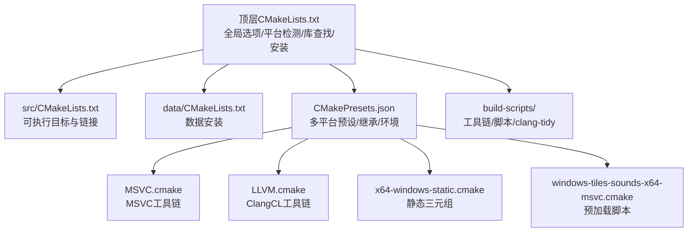
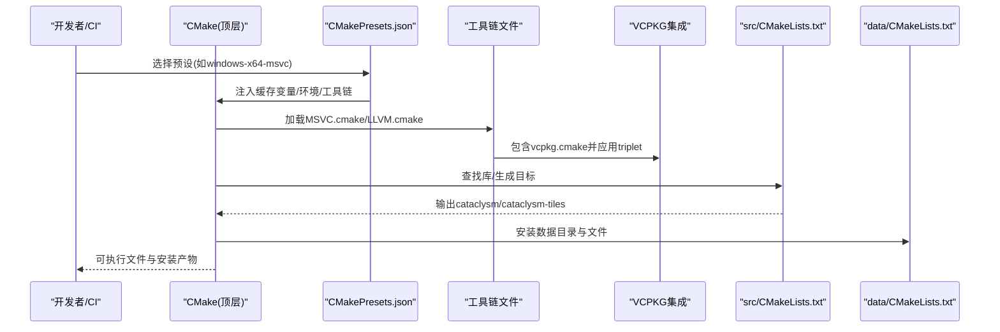
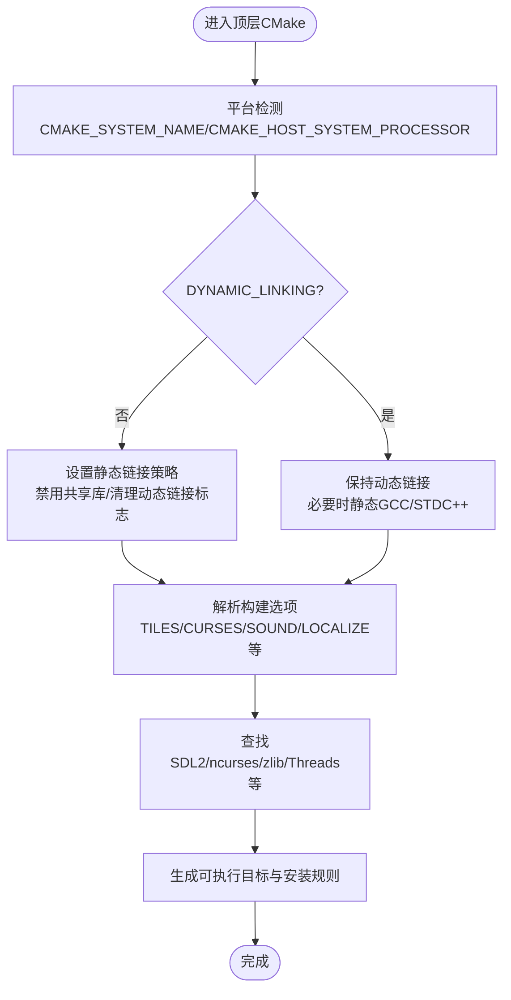
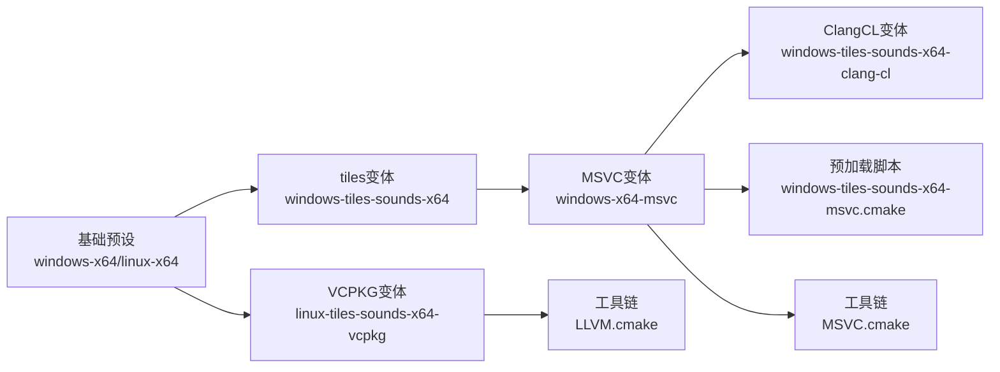
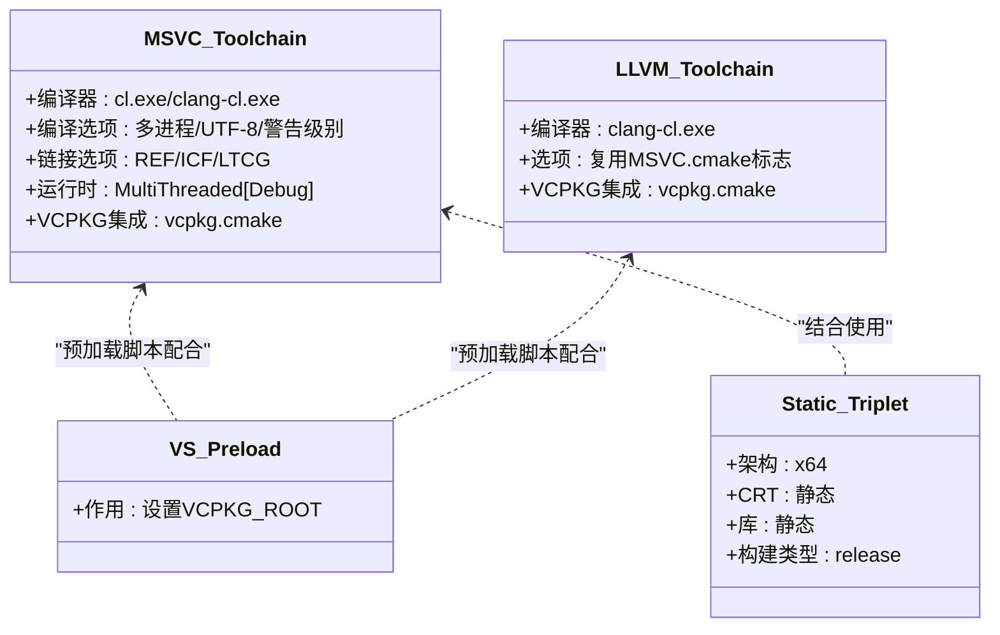
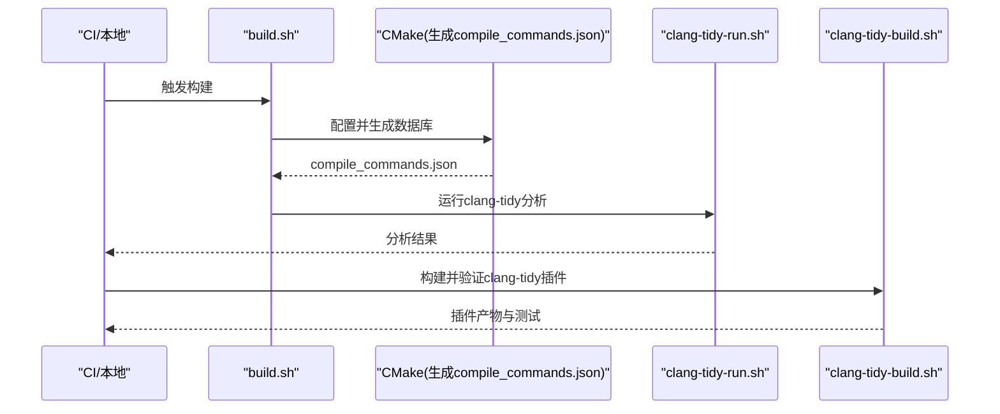
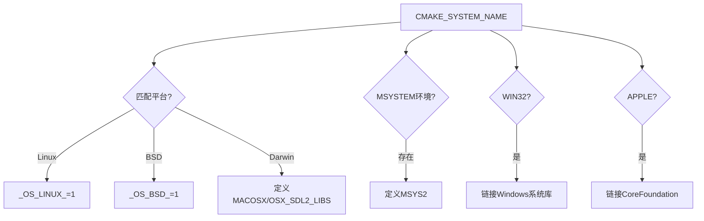
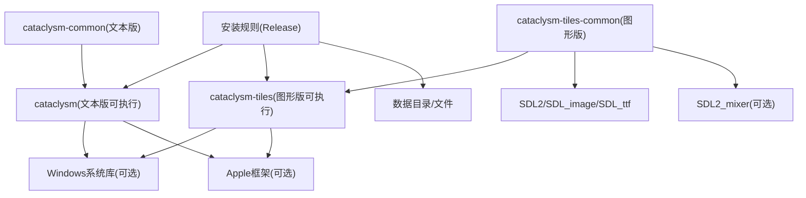
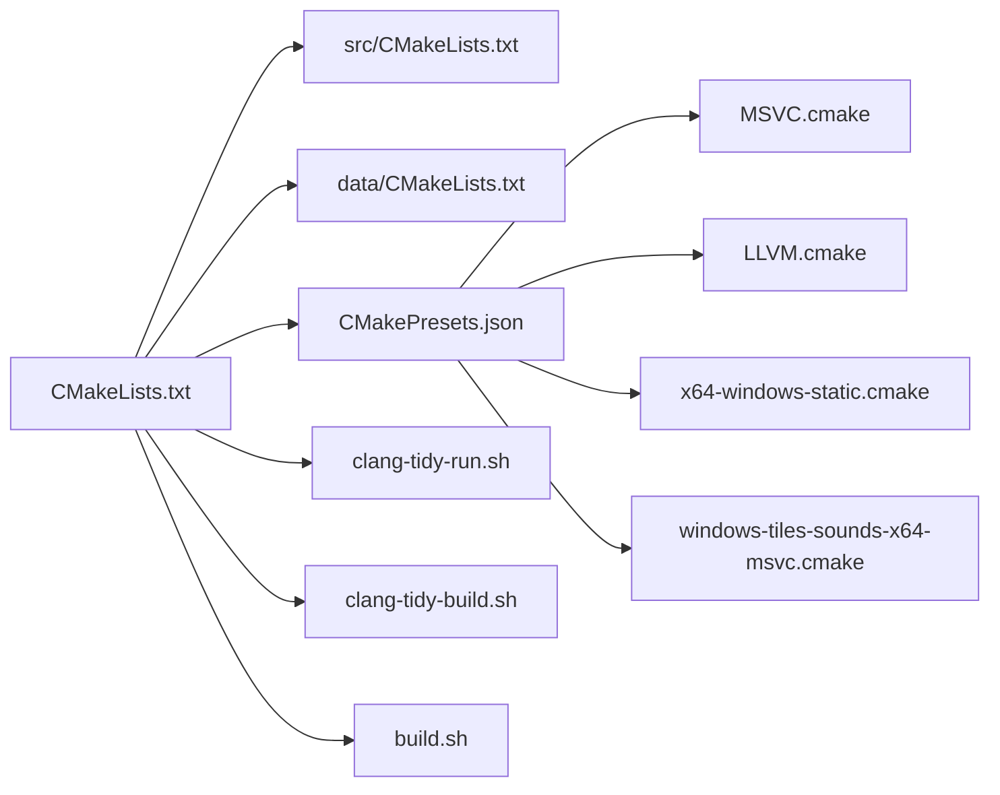

# 跨平台构建系统

<cite>
**本文引用的文件**
- CMakeLists.txt
- CMakePresets.json
- CMakeUserPresets.json.in
- build.sh
- MSVC.cmake
- LLVM.cmake
- x64-windows-static.cmake
- windows-tiles-sounds-x64-msvc.cmake
- src/CMakeLists.txt
- data/CMakeLists.txt
- clang-tidy-build.sh
- clang-tidy-run.sh
</cite>

## 目录
1. [简介](#简介)
2. [项目结构](#项目结构)
3. [核心组件](#核心组件)
4. [架构总览](#架构总览)
5. [详细组件分析](#详细组件分析)
6. [依赖关系分析](#依赖关系分析)
7. [性能考量](#性能考量)
8. [故障排查指南](#故障排查指南)
9. [结论](#结论)
10. [附录](#附录)

## 简介
本文件面向Cataclysm-DDA的跨平台构建系统，系统性梳理CMake配置与预设、条件编译与平台检测、工具链与交叉编译、构建脚本组织与自动化任务，并给出扩展方法与常见问题诊断。文档以仓库中实际文件为依据，通过图示与分层说明帮助读者快速理解并高效使用该构建体系。

## 项目结构
仓库采用“顶层CMake + 子目录模块”的组织方式：
- 顶层根CMakeLists.txt负责全局选项、平台检测、库查找与安装规则
- src/data等子目录分别定义可执行目标与数据安装
- build-scripts提供跨平台工具链、CI脚本与clang-tidy支持
- CMakePresets.json集中描述多平台构建预设，支持继承与环境注入

图表来源
- CMakeLists.txt
- src/CMakeLists.txt
- data/CMakeLists.txt
- CMakePresets.json
- MSVC.cmake
- LLVM.cmake
- x64-windows-static.cmake
- windows-tiles-sounds-x64-msvc.cmake

章节来源
- CMakeLists.txt
- CMakePresets.json

## 核心组件
- 全局构建选项与平台检测：在顶层CMakeLists中定义构建类型、编译器警告、动态/静态链接策略、国际化与本地化开关、测试开关等；通过CMAKE_SYSTEM_NAME与CMAKE_HOST_SYSTEM_PROCESSOR输出构建环境信息，并对MSYS2、Darwin等进行差异化处理。
- 条件编译与功能开关：TILES/CURSES/SOUND/BACKTRACE/LOCALIZE/USE_XDG_DIR/USE_HOME_DIR/DYNAMIC_LINKING/JSON_FORMAT/CATA_CCACHE等选项控制功能组合与链接模式。
- 库查找与目标生成：根据选项查找SDL2/SDL2_ttf/SDL2_image/SDL2_mixer/ncurses/zlib/threads等；在src/CMakeLists中按平台生成cataclysm与cataclysm-tiles两个可执行目标及其公共对象库。
- 预设系统：CMakePresets.json集中定义Windows/Linux多套预设，支持继承、环境变量注入、工具链文件与项目前置脚本。
- 工具链与交叉编译：MSVC.cmake/LLVM.cmake/x64-windows-static.cmake提供编译器、链接器、运行时与VCPKG集成；windows-tiles-sounds-x64-msvc.cmake用于预加载VCPKG根路径。
- 构建脚本：build-scripts/build.sh统一CI与本地构建流程，支持clang-tidy插件构建与测试；clang-tidy-run.sh/clang-tidy-build.sh提供clang-tidy检查流水线。
- 数据安装：data/CMakeLists.txt按SOUND开关安装音效资源，按RELEASE安装游戏数据目录与文件。

章节来源
- CMakeLists.txt
- src/CMakeLists.txt
- data/CMakeLists.txt
- CMakePresets.json
- MSVC.cmake
- LLVM.cmake
- x64-windows-static.cmake
- windows-tiles-sounds-x64-msvc.cmake
- build.sh
- clang-tidy-build.sh
- clang-tidy-run.sh

## 架构总览
下图展示从用户选择预设到生成可执行目标与安装数据的整体流程，以及工具链与VCPKG的集成点。

图表来源
- CMakePresets.json
- MSVC.cmake
- LLVM.cmake
- src/CMakeLists.txt
- data/CMakeLists.txt

## 详细组件分析

### 组件A：顶层CMake配置与条件编译
- 平台检测与宏定义：基于CMAKE_SYSTEM_NAME设置_OS_*宏，Darwin平台附加MACOSX与SDL相关宏；MSYS2环境下添加MSYS2宏。
- 动态/静态链接策略：DYNAMIC_LINKING关闭时强制静态链接，设置BUILD_SHARED_LIBRARIES与链接器标志；MINGW非MSVC时避免依赖MinGW运行时DLL。
- 编译器警告与标准：非MSVC启用严格警告集合并按编译器差异调整；强制C++17标准。
- 构建类型与输出：Debug默认开发模式，输出至源目录；Release设置安装前缀与数据目录布局。
- 功能开关与互斥：TILES与CURSES互斥；USE_XDG_DIR与USE_HOME_DIR互斥；LOCALIZE与GETTEXT集成。
- 库查找与目标：按需查找SDL2/SDL2_ttf/SDL2_image/SDL2_mixer/ncurses/zlib/Threads；添加lang/src/data/tests等子目录。

图表来源
- CMakeLists.txt
- CMakeLists.txt
- CMakeLists.txt
- CMakeLists.txt

章节来源
- CMakeLists.txt

### 组件B：CMake预设系统与变量继承
- 预设分层：windows/linux两类，每类包含基础与带图形/声音的变体；部分预设通过inherits继承，减少重复配置。
- 关键变量：
  - generator：Ninja Multi-Config或Visual Studio 17 2022
  - cacheVariables：DYNAMIC_LINKING、CURSES/LOCALIZE/TILES/SOUND/TESTS等
  - toolset：ClangCL用于ClangCL环境
  - environment：VCPKG_ROOT/VCPKG_APPLOCAL_DEPS等
  - CMAKE_PROJECT_INCLUDE_BEFORE：预加载VCPKG根路径
  - CMAKE_TOOLCHAIN_FILE：指向MSVC.cmake或LLVM.cmake
  - VCPKG_TARGET_TRIPLET：x64-windows-static等
- 用户预设模板：CMakeUserPresets.json.in提供用户级构建预设模板，便于本地覆盖。

图表来源
- CMakePresets.json
- CMakeUserPresets.json.in
- windows-tiles-sounds-x64-msvc.cmake
- MSVC.cmake
- LLVM.cmake

章节来源
- CMakePresets.json
- CMakeUserPresets.json.in

### 组件C：工具链与交叉编译配置
- MSVC.cmake：指定cl.exe/clang-cl.exe作为编译器，统一编译/链接选项与编译器定义；设置多进程编译、UTF-8字符集、禁用部分安全检查；注入VCPKG_ROOT并包含vcpkg.cmake。
- LLVM.cmake：在ClangCL基础上复用MSVC.cmake的大部分标志，适配LLVM工具链。
- x64-windows-static.cmake：设置VCPKG_TARGET_ARCHITECTURE、CRT与库链接均为静态，构建类型为release。
- windows-tiles-sounds-x64-msvc.cmake：在VS环境中预加载VCPKG_ROOT，确保后续工具链与预设正确解析。

图表来源
- MSVC.cmake
- LLVM.cmake
- x64-windows-static.cmake
- windows-tiles-sounds-x64-msvc.cmake

章节来源
- MSVC.cmake
- LLVM.cmake
- x64-windows-static.cmake
- windows-tiles-sounds-x64-msvc.cmake

### 组件D：构建脚本组织与自动化任务
- build.sh：统一CI与本地构建入口，支持CMAKE/NATIVE两种模式；在CMAKE模式下生成compile_commands.json并可选clang-tidy分析；在NATIVE模式下直接调用make并运行测试；支持Android NDK构建。
- clang-tidy-run.sh：导出compile_commands.json后，按变更文件集合与subset策略并行分析受影响文件；支持CI中全量分析触发。
- clang-tidy-build.sh：构建clang-tidy插件并验证测试，便于本地调试自定义检查。

图表来源
- build.sh
- clang-tidy-run.sh
- clang-tidy-build.sh

章节来源
- build.sh
- clang-tidy-run.sh
- clang-tidy-build.sh

### 组件E：目标平台检测与条件编译逻辑
- 平台宏：_OS_LINUX_/_OS_BSD_/_OS_DARWIN_用于条件编译与特性开关。
- MSYS2检测：通过环境变量标记，影响编译器与运行时行为。
- Windows/Apple特例：Windows目标链接gdi32/winmm/imm32/ole32等；Apple目标链接CoreFoundation框架。
- TILES/CURSES互斥：确保图形版与文本版二选一。

图表来源
- CMakeLists.txt
- CMakeLists.txt
- src/CMakeLists.txt

章节来源
- CMakeLists.txt
- src/CMakeLists.txt

### 组件F：可执行目标与安装规则
- 图形版(cataclysm-tiles)与文本版(cataclysm)：均以公共对象库聚合源码，再链接第三方库与系统库；图形版额外链接SDL2系列与可选SDL2_mixer。
- Windows清单与资源：在Win32下设置资源文件依赖与链接器参数；MSYS2 RelWithDebInfo下进行调试符号分离与剥离。
- 安装规则：Release模式安装可执行文件与数据目录；按SOUND开关决定是否安装sound目录。

图表来源
- src/CMakeLists.txt
- src/CMakeLists.txt
- data/CMakeLists.txt

章节来源
- src/CMakeLists.txt
- data/CMakeLists.txt

## 依赖关系分析
- 顶层CMake对src/data/tests/工具模块有直接依赖；src依赖third-party与平台库；data依赖顶层选项控制安装范围。
- 预设通过CMAKE_PROJECT_INCLUDE_BEFORE与CMAKE_TOOLCHAIN_FILE间接耦合工具链与VCPKG。
- clang-tidy相关脚本依赖compile_commands.json与VCPKG提供的clang-tidy插件。

图表来源
- CMakeLists.txt
- src/CMakeLists.txt
- data/CMakeLists.txt
- CMakePresets.json
- MSVC.cmake
- LLVM.cmake
- x64-windows-static.cmake
- windows-tiles-sounds-x64-msvc.cmake
- clang-tidy-run.sh
- clang-tidy-build.sh
- build.sh

章节来源
- CMakeLists.txt
- CMakePresets.json

## 性能考量
- 编译加速：启用ccache并通过CMAKE_C/CXX_LINKER_LAUNCHER注入；RelWithDebInfo优化与调试信息平衡。
- 并行构建：Ninja Multi-Config与多核编译；clang-tidy分析采用随机打散与并行执行。
- 链接优化：Windows下使用/OPT:REF/ICF减少冗余；RelWithDebInfo启用函数内联提示。
- 体积与发布：Release模式安装数据目录，图形版按需安装gfx；静态链接减少运行时依赖但增大体积。

章节来源
- CMakeLists.txt
- build.sh
- MSVC.cmake

## 故障排查指南
- 未找到Git导致版本号为空：顶层CMake会输出警告并回退至空版本；可通过-DGIT_BINARY指定git路径。
- 缺少SDL2/SDL2_ttf/SDL2_image/SDL2_mixer或ncurses：顶层CMake会在对应选项开启时要求相应库；请安装开发包或切换到另一模式。
- MSVC/ClangCL工具链问题：确认VCPKG_ROOT与CMAKE_TOOLCHAIN_FILE；ClangCL需设置toolset与环境变量。
- 静态链接失败：检查CMAKE_EXE_LINKER_FLAGS与BUILD_SHARED_LIBRARIES；Windows下可能需要特定CRT链接策略。
- 测试与clang-tidy：确保生成compile_commands.json；CI中若无插件则脚本会提前退出，需手动指定检查范围。

章节来源
- CMakeLists.txt
- CMakeLists.txt
- CMakeLists.txt
- MSVC.cmake
- clang-tidy-run.sh

## 结论
该构建系统通过CMake顶层配置、子目录目标与数据安装、CMakePresets.json预设、工具链与VCPKG集成，以及完善的CI/本地构建脚本，实现了跨平台、可扩展且可维护的构建流程。建议在新增平台或第三方库时遵循现有预设与工具链模式，保持变量继承与环境注入的一致性，以降低维护成本并提升可移植性。

## 附录
- 扩展方法
  - 自定义模块：在CMakeModules目录下新增Find*.cmake或模块脚本，纳入CMAKE_MODULE_PATH
  - 第三方库集成：优先通过VCPKG triplet管理；若需本地库，参考MSVC.cmake中的包含与链接方式
  - 构建优化：根据平台调整编译/链接选项；利用ccache与并行构建；合理选择DYNAMIC_LINKING
- 常见问题
  - 预设未生效：检查generator与缓存变量；确认CMAKE_PROJECT_INCLUDE_BEFORE与CMAKE_TOOLCHAIN_FILE路径
  - VCPKG找不到：确保VCPKG_ROOT或VCPKG_MANIFEST_DIR正确；triplet与目标架构一致
  - 测试失败：查看clang-tidy-run.sh的subset与files_changed逻辑；必要时全量分析