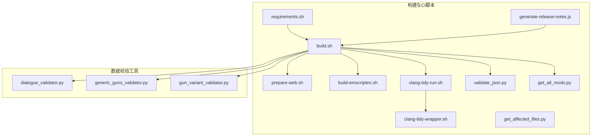
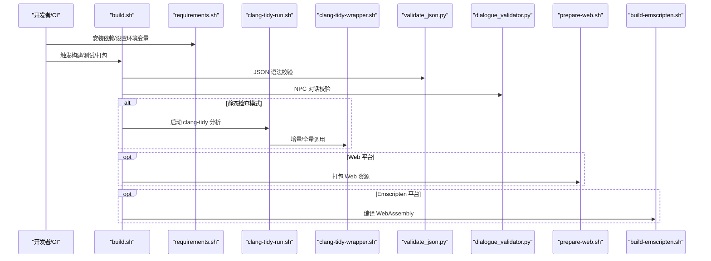
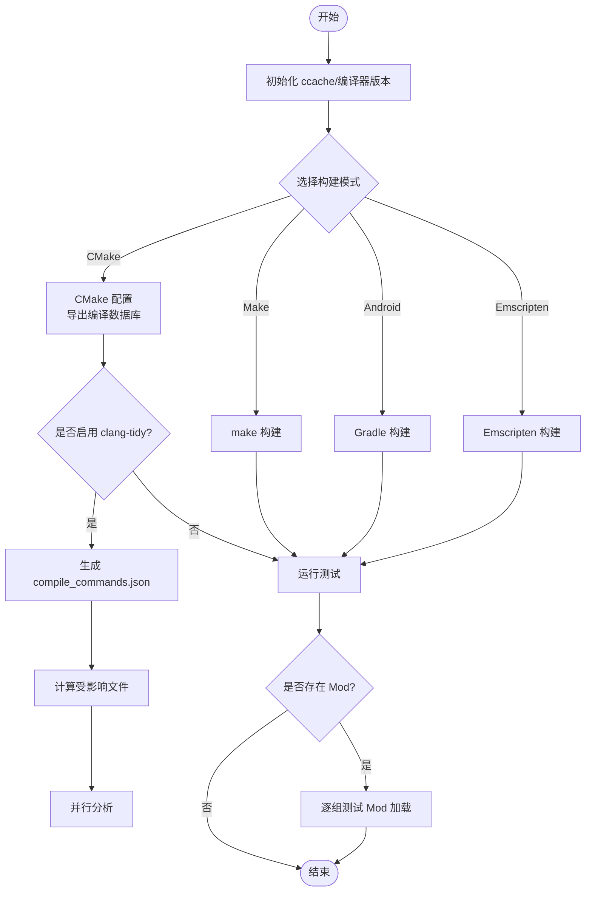
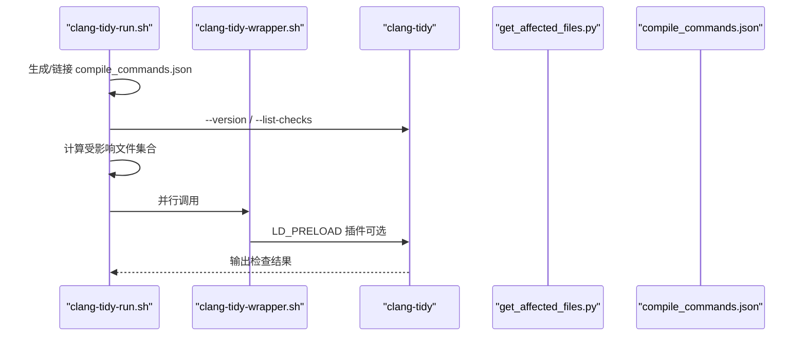
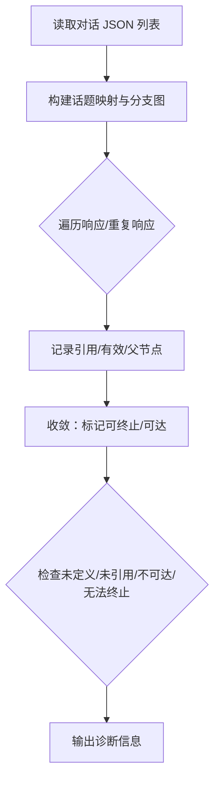
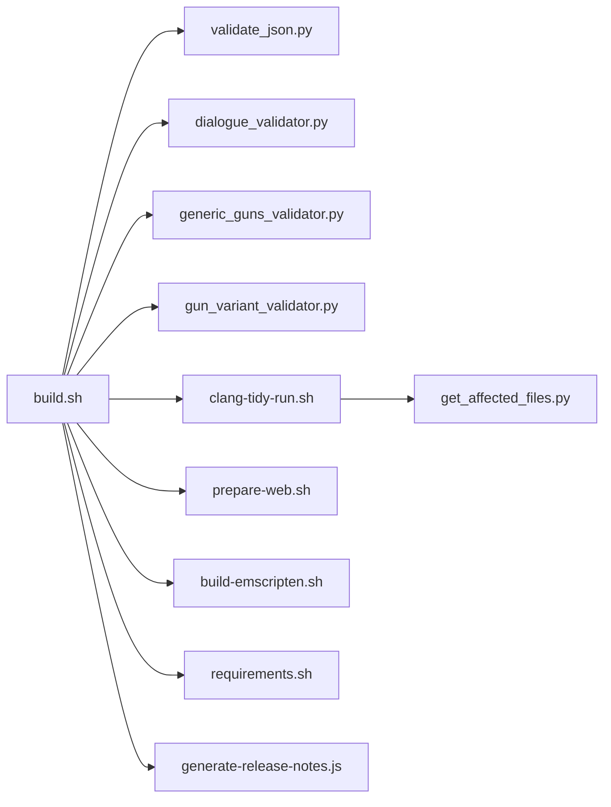

# 实用工具

<cite>
**本文引用的文件**
- build.sh
- requirements.sh
- prepare-web.sh
- build-emscripten.sh
- validate_json.py
- get_affected_files.py
- get_all_mods.py
- clang-tidy-run.sh
- clang-tidy-wrapper.sh
- generate-release-notes.js
- dialogue_validator.py
- generic_guns_validator.py
- gun_variant_validator.py
</cite>

## 目录
1. [简介](#简介)
2. [项目结构](#项目结构)
3. [核心组件](#核心组件)
4. [架构总览](#架构总览)
5. [详细组件分析](#详细组件分析)
6. [依赖分析](#依赖分析)
7. [性能考虑](#性能考虑)
8. [故障排查指南](#故障排查指南)
9. [结论](#结论)
10. [附录](#附录)

## 简介
本文件系统性梳理 Cataclysm-DDA 的实用工具集合，覆盖数据校验与转换、配置生成、批处理脚本、跨平台构建与发布自动化等。文档面向不同层次读者：既提供高层工作流说明，也给出代码级细节与可视化图示，帮助开发者快速理解并高效使用这些工具，同时提供扩展与最佳实践建议。

## 项目结构
仓库中与“实用工具”直接相关的主要目录与文件：
- build-scripts：CI/本地构建、测试、静态检查、Web 打包、Emscripten 构建、问题匹配器等脚本
- tools：游戏数据校验工具（对话、JSON 规则）
- tools/json_tools：面向 JSON 数据的专用校验器（通用枪械迁移、枪械变体）

**图表来源**
- build.sh
- requirements.sh
- prepare-web.sh
- build-emscripten.sh
- validate_json.py
- get_affected_files.py
- get_all_mods.py
- clang-tidy-run.sh
- clang-tidy-wrapper.sh
- generate-release-notes.js
- dialogue_validator.py
- generic_guns_validator.py
- gun_variant_validator.py

**章节来源**
- build.sh
- requirements.sh

## 核心组件
- 构建与测试流水线：统一入口脚本负责选择构建模式（CMake/Make/Native Android/Emscripten）、参数传递、缓存与并发控制、测试执行与覆盖率收集。
- 静态检查与增量分析：clang-tidy 运行脚本与包装器，结合“受影响文件”计算，实现按需增量检查。
- 数据校验：JSON 语法校验、NPC 对话完整性校验、通用枪械迁移一致性校验、枪械命名与变体规范校验。
- 跨平台与打包：Windows/MXE 交叉编译、Android Gradle 构建、Web 平台打包与资源预加载。
- 发布自动化：GitHub Actions 中自动生成发行说明。

**章节来源**
- build.sh
- clang-tidy-run.sh
- validate_json.py
- dialogue_validator.py
- generic_guns_validator.py
- gun_variant_validator.py
- prepare-web.sh
- build-emscripten.sh
- generate-release-notes.js

## 架构总览
下图展示从触发到产出的关键路径：CI/本地脚本驱动构建、测试、静态检查与打包；数据校验工具在构建前或独立运行；发布脚本通过 GitHub API 生成发行说明。

**图表来源**
- build.sh
- requirements.sh
- validate_json.py
- dialogue_validator.py
- clang-tidy-run.sh
- clang-tidy-wrapper.sh
- prepare-web.sh
- build-emscripten.sh

## 详细组件分析

### 构建与测试流水线（build.sh）
- 功能要点
  - 统一入口：根据环境变量选择构建后端（CMake/Make/Native Android/Emscripten）。
  - 参数化：支持 Release/Debug、Tiles/Sound、Backtrace、clang-tidy 插件等开关。
  - 增量测试：使用并行执行器与用户目录隔离，支持按标签过滤测试用例。
  - Mod 兼容性测试：枚举所有 Mod 组合，逐组验证加载。
  - JSON/样式检查：在特定阶段对 JSON 与样式进行批量校验。
- 关键流程
  - 初始化 ccache、统计缓存命中率。
  - 选择构建类型与编译器，生成编译数据库。
  - clang-tidy 模式：生成 compile_commands.json，基于变更文件计算受影响文件，随机并行分析。
  - 正常构建模式：常规 make 或 CMake 构建，随后并行运行测试集。
  - Android 模式：Gradle 构建实验性发布包，启用 NDK ccache 内容校验。
  - Windows 模式：使用 Wine 并行运行测试，注入 ASan/UBSan 选项。

**图表来源**
- build.sh

**章节来源**
- build.sh

### 静态检查与增量分析（clang-tidy-run.sh 与 clang-tidy-wrapper.sh）
- clang-tidy-run.sh
  - 生成 compile_commands.json，打印编译器与 clang-tidy 头文件搜索路径。
  - 若存在插件，优先使用插件模式；否则回退为普通调用。
  - 增量策略：当检测到全局配置变化时切换为全量分析；否则仅分析受影响文件。
  - 支持按子集切分（直接变更/间接变更源码/间接变更其他）以并行化。
- clang-tidy-wrapper.sh
  - 在存在插件时通过 LD_PRELOAD 注入，记录检查性能与结果。

**图表来源**
- clang-tidy-run.sh
- clang-tidy-wrapper.sh
- get_affected_files.py

**章节来源**
- clang-tidy-run.sh
- clang-tidy-wrapper.sh
- get_affected_files.py

### 数据校验工具

#### JSON 语法校验（validate_json.py）
- 功能：遍历仓库内所有 JSON 文件，逐个解析，输出错误统计。
- 使用场景：CI 中作为前置检查，确保 JSON 语法正确。

**章节来源**
- validate_json.py

#### NPC 对话完整性校验（dialogue_validator.py）
- 功能：扫描对话 JSON，验证话题定义与引用的一致性、可达性与终止条件。
- 特点：内置已知起始/结束话题集合，自动构建话题分支图并迭代收敛，报告未定义/未引用/不可达/无法终止等问题。

**图表来源**
- dialogue_validator.py

**章节来源**
- dialogue_validator.py

#### 通用枪械迁移校验（generic_guns_validator.py）
- 功能：对比核心数据与 Generic Guns 模组，检查弹药/弹夹/枪支是否完成迁移，必要时提示加入白名单或黑名单。
- 关键逻辑：解析 ITEM/BLACKLIST/MIGRATION 等条目，过滤假项、技能白名单、口袋限制、可卸下性等条件。

**章节来源**
- generic_guns_validator.py

#### 枪械命名与变体校验（gun_variant_validator.py）
- 功能：检查枪械与弹夹共享标识符、名称描述性、重复命名、相似度合并建议等。
- 关键逻辑：解析 JSON 结构，规范化单位与属性，计算相似度阈值，输出建议与错误列表。

**章节来源**
- gun_variant_validator.py

### 跨平台与打包

#### Web 平台打包（prepare-web.sh）
- 功能：复制核心数据与资源，移除 .DS_Store、过时 Mod、废弃 tileset，使用 Emscripten 的 file_packager 生成预加载数据包，拷贝 HTML/WASM/JS/Favicon 至构建目录。

**章节来源**
- prepare-web.sh

#### Emscripten 构建（build-emscripten.sh）
- 功能：安装并激活指定版本的 Emscripten 工具链，启用/禁用 ccache，执行 Release 构建生成 WebAssembly。

**章节来源**
- build-emscripten.sh

#### 依赖准备（requirements.sh）
- 功能：根据 CI 环境安装/配置依赖，如 libbacktrace、MXE 交叉编译链、Wine、ccache、并行工具等；在 GitHub Actions 中持久化关键环境变量。

**章节来源**
- requirements.sh

### 发布自动化（generate-release-notes.js）
- 功能：通过 GitHub API 获取最新稳定版标签，调用自动生成发行说明接口，按最大长度截断并输出分段内容。

**章节来源**
- generate-release-notes.js

## 依赖分析
- 构建脚本之间存在明确的调用关系：build.sh 作为主入口，调用 validate_json.py、clang-tidy-run.sh、prepare-web.sh、build-emscripten.sh 等；clang-tidy-run.sh 依赖 get_affected_files.py 与 compile_commands.json；requirements.sh 为前置依赖准备。
- 工具脚本彼此独立，但共同服务于数据质量保障与构建稳定性。

**图表来源**
- build.sh
- clang-tidy-run.sh
- get_affected_files.py
- requirements.sh
- generate-release-notes.js

**章节来源**
- build.sh
- clang-tidy-run.sh
- get_affected_files.py
- requirements.sh
- generate-release-notes.js

## 性能考虑
- 并行与缓存
  - 使用 ccache 并在 Android 场景启用内容校验，显著缩短重复编译时间。
  - 测试阶段使用并行执行器与用户目录隔离，避免竞态与 IO 抖动。
- 增量分析
  - clang-tidy 通过“受影响文件”计算与随机打散，减少全量分析开销。
  - Web 打包仅预加载必要资源，剔除冗余文件。
- 资源与网络
  - MXE/SDL2 下载采用重试与校验，降低失败重跑概率。
  - Emscripten 工具链版本固定，避免兼容性波动。

[本节为通用指导，无需列出具体文件来源]

## 故障排查指南
- 构建失败
  - 检查 requirements.sh 是否成功安装依赖与设置环境变量（尤其是 GitHub Actions 的 GITHUB_ENV 持久化）。
  - 确认 CMake/Make 选项与目标平台匹配（Tiles/Sound/Backtrace 等）。
- 测试异常
  - 查看并行测试输出中的退出码与 sed 处理日志，定位具体用例与参数。
  - 在 Windows 环境下确认 Wine 初始化与并行执行的竞态问题。
- 静态检查卡顿
  - 若全量分析耗时过长，确认是否误触发全局配置变更导致切换为全量；或手动指定子集分析。
- JSON 校验报错
  - validate_json.py 会输出具体文件与错误类型，逐项修复编码与格式问题。
- 对话校验失败
  - dialogue_validator.py 会指出未定义/未引用/不可达/无法终止的话题，按提示完善定义与引用。
- Mod 兼容性问题
  - get_all_mods.py 会输出互不冲突的 Mod 组合，逐组验证加载以定位冲突源。

**章节来源**
- build.sh
- requirements.sh
- clang-tidy-run.sh
- validate_json.py
- dialogue_validator.py

## 结论
该工具集实现了从数据校验、静态检查、跨平台构建到 Web 打包与发布自动化的完整闭环。通过增量分析、并行执行与缓存优化，显著提升了开发效率与构建稳定性。建议在日常开发中结合这些工具形成“提交前校验 + CI 增量检查 + 定期全量审查”的最佳实践。

[本节为总结性内容，无需列出具体文件来源]

## 附录

### 最佳实践清单
- 提交前
  - 运行 validate_json.py 与 dialogue_validator.py，确保数据层无明显问题。
  - 使用 clang-tidy-run.sh 的增量模式快速定位新增问题。
- CI 阶段
  - 将 get_all_mods.py 的组合测试纳入矩阵，覆盖主要 Mod 组合。
  - 在纯 JSON 变更场景跳过全量构建，加速反馈。
- 跨平台
  - Android 使用 NDK ccache 内容校验；Windows 使用 Wine 并行测试；Web 使用固定 Emscripten 版本。
- 发布
  - 使用 generate-release-notes.js 自动生成说明，避免遗漏变更。

[本节为通用指导，无需列出具体文件来源]