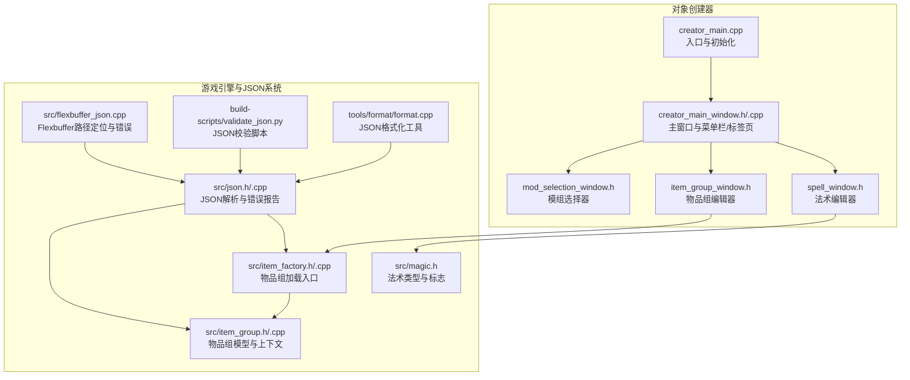
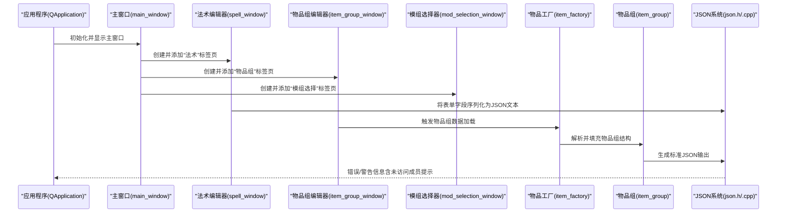
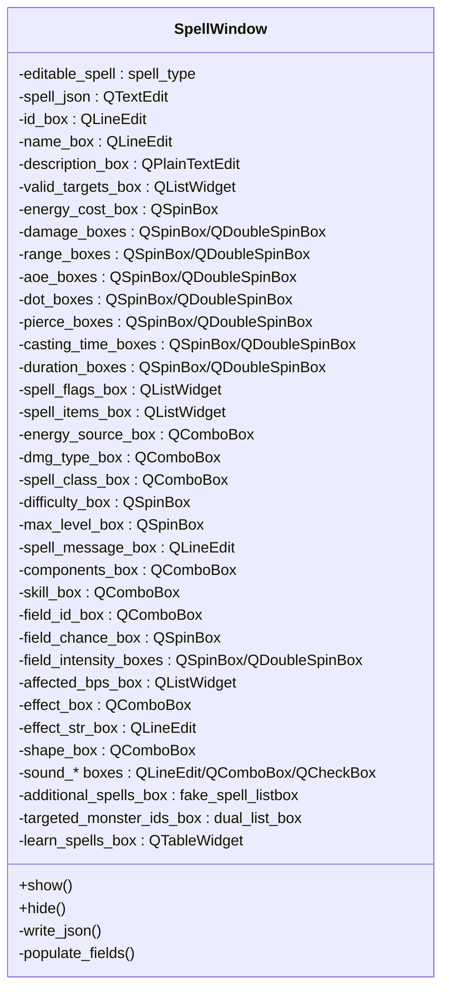
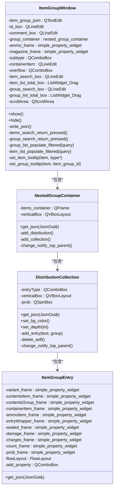
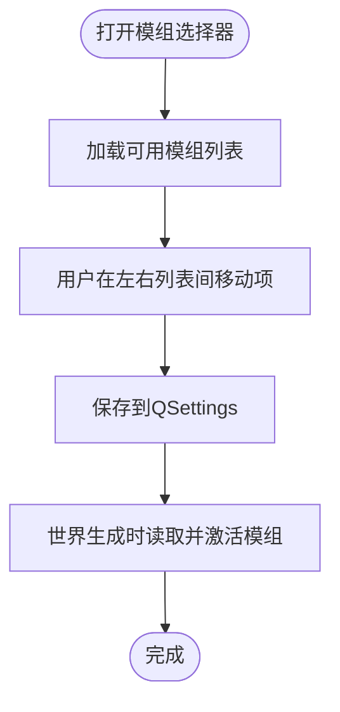
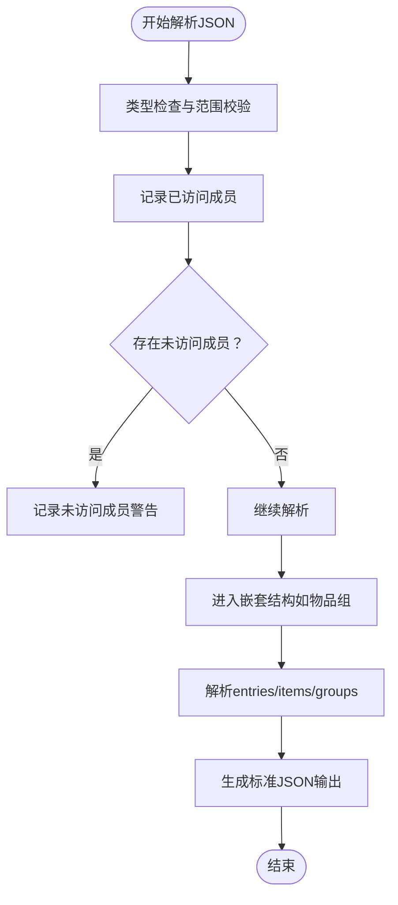
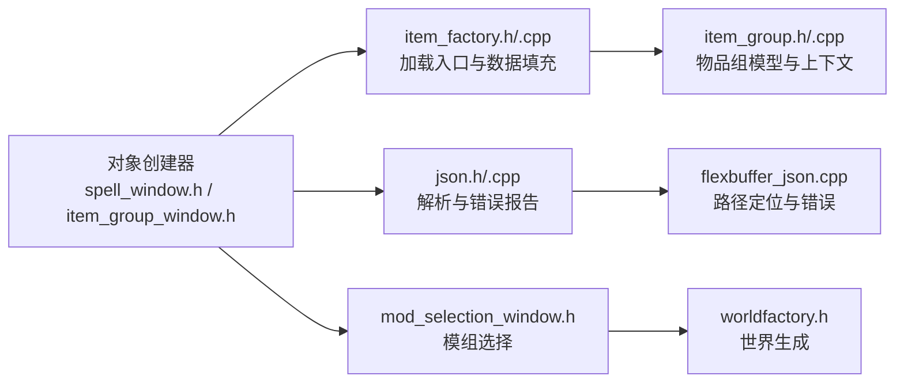

# 对象创建器

<cite>
**本文引用的文件**
- object_creator/creator_main.cpp
- object_creator/creator_main_window.h
- object_creator/creator_main_window.cpp
- object_creator/spell_window.h
- object_creator/item_group_window.h
- object_creator/mod_selection_window.h
- src/json.h
- src/json.cpp
- src/flexbuffer_json.cpp
- src/item_factory.h
- src/item_factory.cpp
- src/item_group.h
- src/item_group.cpp
- src/magic.h
- build-scripts/validate_json.py
- tools/format/format.cpp
</cite>

## 目录
1. [简介](#简介)
2. [项目结构](#项目结构)
3. [核心组件](#核心组件)
4. [架构总览](#架构总览)
5. [详细组件分析](#详细组件分析)
6. [依赖关系分析](#依赖关系分析)
7. [性能考虑](#性能考虑)
8. [故障排除指南](#故障排除指南)
9. [结论](#结论)
10. [附录](#附录)

## 简介
本文件为 Cataclysm: DDA 对象创建器（Object Creator）的详细使用与技术文档。对象创建器是一个基于 Qt 的图形化工具，用于辅助模组开发者与内容创作者高效地创建与编辑游戏中的各类对象定义，包括法术（Spell）、物品组（Item Group）以及模组选择（Mod Selection）。该工具通过直观的界面与实时 JSON 输出，帮助用户在不直接手写复杂 JSON 结构的情况下完成高质量的内容创作。

对象创建器的核心目标：
- 提供可视化的表单界面，降低 JSON 编写的门槛
- 实时生成可直接导入游戏的数据结构
- 支持多标签页工作流：法术、物品组、模组选择
- 集成模组加载与校验流程，确保生成内容与当前世界配置兼容

## 项目结构
对象创建器位于独立的 object_creator 目录中，采用模块化设计，主窗口负责组织标签页，各标签页对应不同的对象类型编辑器。同时，工具通过构建脚本与 JSON 校验工具进行集成，确保生成内容符合游戏引擎的解析要求。

图表来源
- object_creator/creator_main.cpp
- object_creator/creator_main_window.cpp
- object_creator/spell_window.h
- object_creator/item_group_window.h
- object_creator/mod_selection_window.h
- src/json.h
- src/flexbuffer_json.cpp
- src/item_factory.h
- src/item_group.h
- src/magic.h

章节来源
- object_creator/creator_main.cpp
- object_creator/creator_main_window.cpp

## 核心组件
- 主窗口与应用生命周期
  - 负责创建主窗口、菜单栏、标签页容器，以及启动时的闪屏与设置加载。
  - 初始化游戏静态数据与世界配置，确保后续编辑器可用的上下文。
- 法术编辑器（Spell Window）
  - 提供法术 ID、名称、描述、能量消耗、伤害范围、施法时间、持续时间、法术标志、法术类别、技能需求、音效与消息等字段的可视化输入。
  - 内置“法术列表”与“额外法术”等交互控件，支持复杂法术组合。
- 物品组编辑器（Item Group Window）
  - 提供嵌套集合/分布结构的可视化编辑，支持条目权重、概率、弹药、容器、损坏度、数量、计数等属性的灵活配置。
  - 支持搜索与拖拽操作，便于从大量物品与分组中快速选择。
- 模组选择器（Mod Selection Window）
  - 提供双列表控件，允许用户在可用模组间移动选择，保存到 QSettings 中，作为世界生成时的模组激活依据。

章节来源
- object_creator/creator_main_window.h
- object_creator/creator_main_window.cpp
- object_creator/spell_window.h
- object_creator/item_group_window.h
- object_creator/mod_selection_window.h

## 架构总览
对象创建器采用“主窗口组织 + 多编辑器标签页”的结构，每个编辑器负责特定对象类型的可视化与 JSON 输出。编辑器通过游戏引擎提供的 JSON 解析与加载接口，将用户输入转换为标准的 JSON 数据结构，随后由构建脚本或游戏加载流程进行进一步处理。

图表来源
- object_creator/creator_main_window.cpp
- object_creator/spell_window.h
- object_creator/item_group_window.h
- src/item_factory.h
- src/item_group.h
- src/json.h

## 详细组件分析

### 法术编辑器（Spell Window）
法术编辑器提供完整的法术定义界面，覆盖法术的基础属性、数值范围、效果类型、目标与音效等。其核心职责是将用户输入映射到标准的法术 JSON 结构，并在需要时生成可读的 JSON 文本以供导出或调试。

图表来源
- object_creator/spell_window.h

章节来源
- object_creator/spell_window.h

### 物品组编辑器（Item Group Window）
物品组编辑器支持复杂的嵌套结构（集合/分布），并通过拖拽与搜索实现高效的条目管理。其内部包含多个嵌套容器类，分别负责集合、分布与条目的 JSON 序列化逻辑。

图表来源
- object_creator/item_group_window.h

章节来源
- object_creator/item_group_window.h

### 模组选择器（Mod Selection Window）
模组选择器提供双列表控件，允许用户在“可用模组”与“已选模组”之间移动，最终将结果保存至 QSettings，供世界生成时使用。

图表来源
- object_creator/mod_selection_window.h

章节来源
- object_creator/mod_selection_window.h

### JSON 数据结构与验证规范
对象创建器生成的 JSON 必须遵循游戏引擎的解析规范。以下为关键要点：
- 字段命名与类型
  - 所有字段需与游戏定义一致；未被访问的成员会被标记为潜在错误，有助于发现拼写错误或遗漏字段。
  - 数值类型支持整型与浮点型，超出范围会触发错误。
- 嵌套结构
  - 物品组支持集合与分布两种模式，可通过数组或对象形式定义条目；条目可为字符串（引用已有分组/物品）、数组（物品ID与概率）或内联对象（包含多种属性）。
- 错误定位
  - JSON 解析器支持基于 Flexbuffer 的路径定位，结合源文件路径与偏移量，提供精确的错误位置信息。
- 格式化与校验
  - 工具链提供 JSON 格式化与校验脚本，建议在提交前运行以保证一致性与可读性。

图表来源
- src/json.h
- src/json.cpp
- src/flexbuffer_json.cpp
- src/item_factory.cpp
- src/item_group.cpp

章节来源
- src/json.h
- src/json.cpp
- src/flexbuffer_json.cpp
- src/item_factory.cpp
- src/item_group.cpp

## 依赖关系分析
对象创建器与游戏引擎之间的耦合主要体现在 JSON 解析与加载接口上。编辑器通过这些接口将用户输入转换为标准结构，再由引擎完成后续处理。

图表来源
- object_creator/spell_window.h
- object_creator/item_group_window.h
- object_creator/mod_selection_window.h
- src/item_factory.h
- src/item_group.h
- src/json.h
- src/flexbuffer_json.cpp

章节来源
- object_creator/spell_window.h
- object_creator/item_group_window.h
- object_creator/mod_selection_window.h
- src/item_factory.h
- src/item_group.h
- src/json.h
- src/flexbuffer_json.cpp

## 性能考虑
- 启动与闪屏
  - 应用启动时显示闪屏并短暂延迟，确保 UI 初始化完成后再进入事件循环，避免闪烁与卡顿。
- 模组加载
  - 在启动阶段加载静态数据与世界配置，减少编辑过程中的阻塞。
- JSON 解析
  - 使用流式解析与路径定位，避免一次性加载大文件导致内存峰值过高。
- UI 更新
  - 编辑器内部通过事件通知与增量更新，减少不必要的重绘与计算。

章节来源
- object_creator/creator_main.cpp
- object_creator/creator_main_window.cpp

## 故障排除指南
- 生成的 JSON 报错“存在未访问成员”
  - 检查是否遗漏了必需字段或拼写错误；根据日志提示定位具体键名。
- 数值越界或类型不匹配
  - 确认整型/浮点型范围与类型，避免超出支持范围或混用类型。
- 物品组无法解析
  - 检查 entries/items/groups 的结构与类型，确保条目为字符串、数组或对象之一。
- 模组未生效
  - 确认模组选择器中的模组已保存到设置，并在世界生成时正确读取。
- JSON 格式不规范
  - 使用工具链中的格式化与校验脚本进行预处理，提升可读性与一致性。

章节来源
- src/json.cpp
- src/json.h
- src/flexbuffer_json.cpp
- build-scripts/validate_json.py
- tools/format/format.cpp

## 结论
对象创建器通过直观的图形界面与严谨的 JSON 解析体系，显著降低了模组开发者在法术与物品组方面的创作门槛。配合模组选择与构建脚本，能够高效产出与游戏引擎兼容的内容。建议在开发过程中遵循字段命名规范、使用工具链进行格式化与校验，并关注 JSON 解析器的错误提示，以获得最佳的开发体验与内容质量。

## 附录
- 最佳实践
  - 先在法术编辑器中完成基础属性，再逐步细化数值与效果；最后导出 JSON 进行校验。
  - 物品组优先使用集合/分布的组合表达复杂掉落，避免过深嵌套。
  - 使用模组选择器明确启用所需模组，避免默认模组与自定义内容冲突。
- 常见问题
  - 若出现“无效字段名”或“值格式异常”，请对照游戏定义逐项核对键名与类型。
  - 若物品组解析失败，请确认条目类型与概率设置是否符合预期。