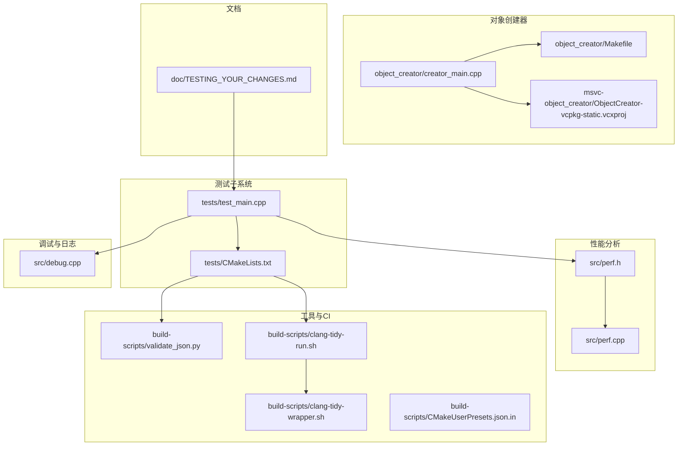
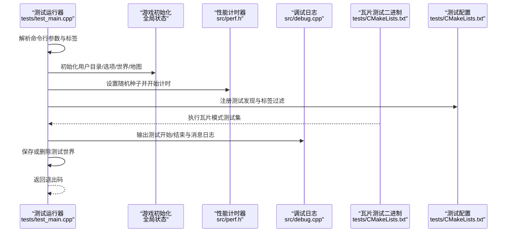
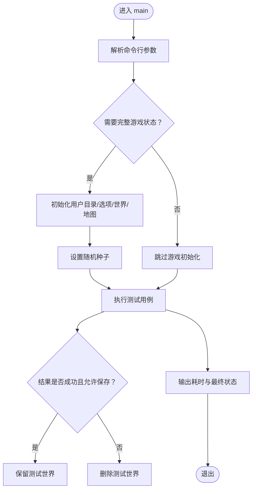
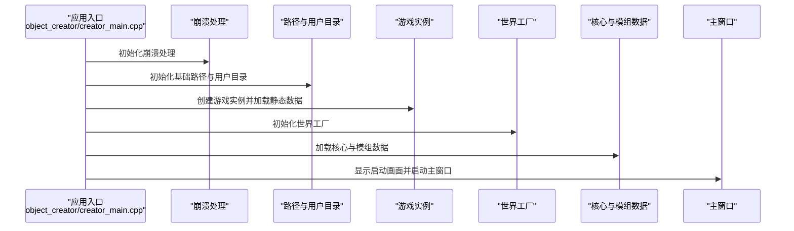
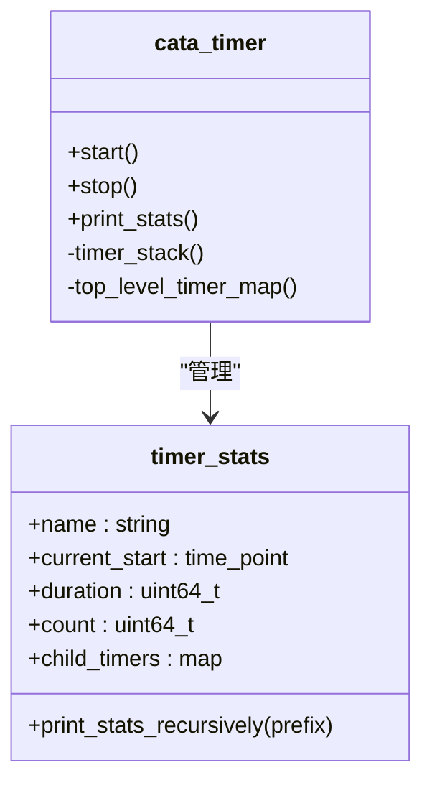
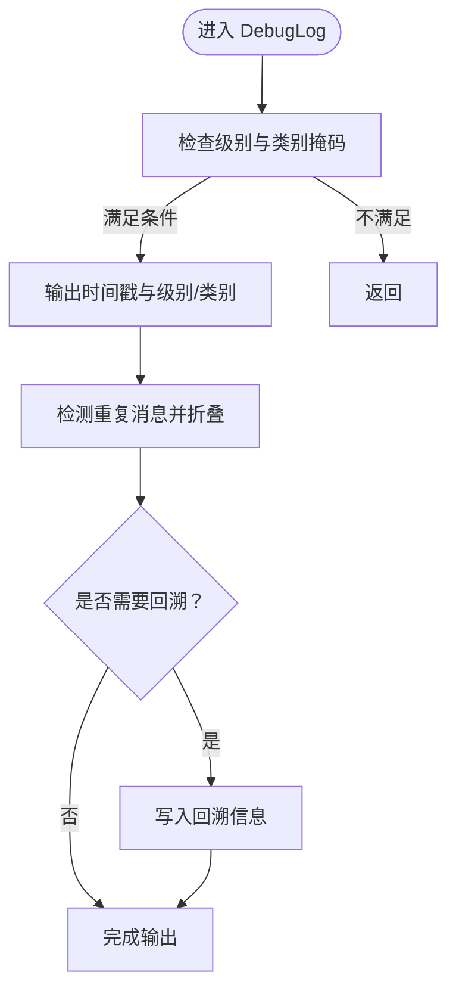
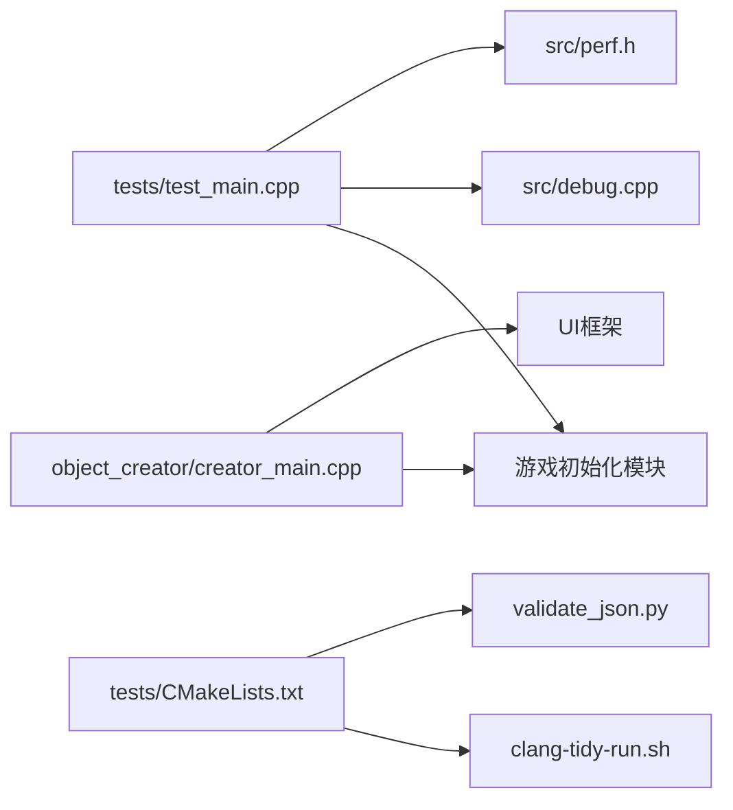

# 开发工具与测试

<cite>
**本文引用的文件**
- tests/CMakeLists.txt
- tests/test_main.cpp
- src/perf.h
- src/perf.cpp
- src/debug.cpp
- object_creator/creator_main.cpp
- object_creator/Makefile
- msvc-object_creator/ObjectCreator-vcpkg-static.vcxproj
- build-scripts/validate_json.py
- build-scripts/clang-tidy-run.sh
- build-scripts/clang-tidy-wrapper.sh
- doc/TESTING_YOUR_CHANGES.md
- build-scripts/CMakeUserPresets.json.in
</cite>

## 目录
1. [简介](#简介)
2. [项目结构](#项目结构)
3. [核心组件](#核心组件)
4. [架构总览](#架构总览)
5. [组件详解](#组件详解)
6. [依赖关系分析](#依赖关系分析)
7. [性能考量](#性能考量)
8. [故障排除指南](#故障排除指南)
9. [结论](#结论)
10. [附录](#附录)

## 简介
本文件面向Cataclysm-DDA（CDDA）开发者与测试工程师，系统化梳理并说明以下主题：
- 对象创建器（Object Creator）：界面与构建方式、启动流程与数据加载路径
- 数据验证工具：JSON语法校验脚本与使用场景
- 性能分析工具：内置计时器与统计输出机制
- 单元测试框架：基于Catch2的测试运行器、监听器与报告器
- 集成测试策略：测试标签、测试数据准备与执行环境
- 测试数据管理：测试世界生成、用户目录隔离与持久化控制
- 调试工具：日志系统、错误折叠与提示、回溯输出
- 持续集成流程：clang-tidy检查、测试执行与问题定位
- 开发工作流最佳实践与团队协作建议
- 具体工具使用示例与常见问题排查

## 项目结构
围绕“开发工具与测试”这一目标，仓库中与之直接相关的模块分布如下：
- 测试子系统：tests/ 目录下的测试用例与CMake配置；测试运行入口在 tests/test_main.cpp
- 对象创建器：object_creator/ 目录下的GUI工具，支持跨平台构建与打包
- 性能分析：src/perf.* 提供计时器与统计输出
- 调试与日志：src/debug.cpp 实现日志记录、重复消息折叠、错误提示与可选回溯
- 工具链与CI：build-scripts/ 下的Python校验脚本、clang-tidy检查脚本与包装器
- 文档：doc/ 下的测试指南与变更测试说明

图表来源
- tests/test_main.cpp
- tests/CMakeLists.txt
- object_creator/creator_main.cpp
- object_creator/Makefile
- msvc-object_creator/ObjectCreator-vcpkg-static.vcxproj
- src/perf.h
- src/perf.cpp
- src/debug.cpp
- build-scripts/validate_json.py
- build-scripts/clang-tidy-run.sh
- build-scripts/clang-tidy-wrapper.sh
- build-scripts/CMakeUserPresets.json.in
- doc/TESTING_YOUR_CHANGES.md

章节来源
- tests/CMakeLists.txt
- tests/test_main.cpp
- src/perf.h
- src/perf.cpp
- src/debug.cpp
- object_creator/creator_main.cpp
- object_creator/Makefile
- msvc-object_creator/ObjectCreator-vcpkg-static.vcxproj
- build-scripts/validate_json.py
- build-scripts/clang-tidy-run.sh
- build-scripts/clang-tidy-wrapper.sh
- doc/TESTING_YOUR_CHANGES.md
- build-scripts/CMakeUserPresets.json.in

## 核心组件
- 测试运行器与监听器
  - tests/test_main.cpp 提供基于Catch2的测试运行器，包含自定义事件监听器与CI友好报告器，负责初始化游戏状态、设置随机种子、清理日志与消息缓冲、保存或删除测试世界等。
- 对象创建器
  - object_creator/creator_main.cpp 是对象创建器的入口，负责初始化崩溃处理、路径与用户目录、加载静态数据、世界工厂初始化、加载核心与模组数据，并启动主窗口。
- 性能分析
  - src/perf.h/.cpp 提供cata_timer计时器类，支持嵌套计时、递归打印统计、栈式管理与顶层映射，配合调试日志输出。
- 调试与日志
  - src/debug.cpp 实现DebugLog、重复消息折叠、错误观察标志、日志文件轮换与关闭、可选回溯输出等。
- 数据验证
  - build-scripts/validate_json.py 遍历仓库内所有JSON文件进行语法校验，输出健康度统计。
- 代码质量与CI
  - build-scripts/clang-tidy-run.sh 与 clang-tidy-wrapper.sh 组合实现增量/全量clang-tidy检查、插件加载与检查性能追踪。

章节来源
- tests/test_main.cpp
- object_creator/creator_main.cpp
- src/perf.h
- src/debug.cpp
- build-scripts/validate_json.py
- build-scripts/clang-tidy-run.sh
- build-scripts/clang-tidy-wrapper.sh

## 架构总览
下图展示测试运行器、对象创建器与性能/调试模块之间的交互关系，以及CI侧的clang-tidy与JSON校验流程。

图表来源
- tests/test_main.cpp
- tests/CMakeLists.txt
- src/perf.h
- src/debug.cpp

## 组件详解

### 测试运行器与监听器
- 功能要点
  - 命令行参数解析：支持mod列表、用户目录、选项覆盖、错误格式、调试级别限制等。
  - 游戏状态初始化：构造测试世界、加载核心与模组数据、创建角色与地图、设置天气。
  - 随机性控制：根据Catch2 RNG种子设置CDDA引擎随机种子，确保可复现实验。
  - 日志与消息：每用例前后清理消息缓冲，失败时输出最近日志；支持CI友好报告器。
  - 结果处理：根据是否发生错误与是否保存测试世界决定返回码。
- 使用示例
  - 运行默认测试集：在仓库根目录执行ctest或直接运行生成的测试二进制。
  - 指定模组与用户目录：通过命令行参数传入--mods与--user-dir。
  - CI友好输出：在CI环境中自动切换到GitHub Actions友好的错误格式。

图表来源
- tests/test_main.cpp

章节来源
- tests/test_main.cpp

### 对象创建器
- 启动流程
  - 初始化崩溃处理、路径与用户目录、加载静态数据、初始化选项与颜色、创建世界工厂、加载核心与模组数据、显示启动画面、启动主窗口。
- 构建方式
  - Makefile 支持跨平台编译，区分Windows与非Windows目标，链接必要库与头文件。
  - MSVC工程文件启用vcpkg清单与静态库链接，便于在Windows上快速构建。
- 使用场景
  - 在本地修改数据后，通过对象创建器预览效果；结合调试菜单进行快速验证。

图表来源
- object_creator/creator_main.cpp
- object_creator/Makefile
- msvc-object_creator/ObjectCreator-vcpkg-static.vcxproj

章节来源
- object_creator/creator_main.cpp
- object_creator/Makefile
- msvc-object_creator/ObjectCreator-vcpkg-static.vcxproj

### 性能分析工具
- 计时器模型
  - cata_timer封装timer_stats，支持嵌套计时、累计时长与调用次数、递归打印统计、栈式管理与顶层映射。
  - 通过DebugLog输出统计信息，便于定位热点路径。
- 使用建议
  - 在关键路径包裹计时器，避免在高频调用中过度打印；仅在需要时开启统计输出。

图表来源
- src/perf.h
- src/perf.cpp

章节来源
- src/perf.h
- src/perf.cpp

### 调试工具与日志系统
- 日志与错误
  - DebugLog统一输出时间戳、级别、类别与消息；错误级别强制输出，主消息类别同样强制输出。
  - 重复消息折叠：检测相同位置与文本的重复输出，合并为一次并追加重复计数。
  - 错误观察标志：记录是否出现过错误，用于测试阶段判定失败。
- 回溯与提示
  - 可选回溯输出；在错误或异常时弹出提示框，支持超阈值重复错误的特殊提示。
- 使用建议
  - 在CI中限制调试级别以减少噪声；在本地调试时提高详细度。

图表来源
- src/debug.cpp
- src/debug.cpp

章节来源
- src/debug.cpp

### 数据验证工具
- JSON语法校验
  - 遍历仓库内所有JSON文件，跳过特定路径，逐个尝试解析；统计错误数量并输出汇总。
- 使用建议
  - 在提交前运行脚本，确保新增或修改的JSON文件语法正确；在CI中作为预检步骤。

章节来源
- build-scripts/validate_json.py

### 持续集成与代码质量
- clang-tidy检查
  - 生成compile_commands.json，按变更文件集合选择增量检查或全量检查；支持插件加载与检查性能追踪；支持按子集切分并行分析。
- 使用建议
  - 在PR中优先运行受影响文件的检查；如涉及全局配置变更则全量扫描。

章节来源
- build-scripts/clang-tidy-run.sh
- build-scripts/clang-tidy-wrapper.sh

## 依赖关系分析
- 测试运行器依赖
  - 依赖游戏初始化模块（世界工厂、地图、天气、选项等），以便在需要时构造完整测试环境。
  - 依赖调试模块输出测试过程中的日志与错误。
  - 依赖性能模块在需要时进行计时统计。
- 对象创建器依赖
  - 依赖游戏与世界工厂以加载核心与模组数据；依赖UI框架以提供可视化编辑体验。
- CI工具链
  - 测试配置依赖clang-tidy脚本与包装器；测试配置依赖JSON校验脚本。

图表来源
- tests/test_main.cpp
- object_creator/creator_main.cpp
- src/debug.cpp
- src/perf.h
- tests/CMakeLists.txt
- build-scripts/validate_json.py
- build-scripts/clang-tidy-run.sh

章节来源
- tests/test_main.cpp
- object_creator/creator_main.cpp
- src/debug.cpp
- src/perf.h
- tests/CMakeLists.txt
- build-scripts/validate_json.py
- build-scripts/clang-tidy-run.sh

## 性能考量
- 计时器开销
  - 嵌套计时与递归打印会带来一定开销，建议仅在关键路径使用；在高频循环中谨慎调用。
- 日志输出
  - DebugLog在错误与主消息类别下强制输出，频繁日志会影响性能；可在CI中降低调试级别。
- 测试执行
  - 使用标签过滤与随机化顺序提升效率；在CI中按子集并行分析clang-tidy。

## 故障排除指南
- 测试失败但无日志
  - 检查是否使用了[nogame]标签导致未初始化游戏状态；确认测试运行器对错误的判定逻辑。
- 重复错误过多
  - 查看日志中的重复折叠提示，定位重复触发点；必要时在源码中增加去抖或限速。
- JSON语法错误
  - 使用validate_json.py定位具体文件与错误类型；修正后重新运行。
- clang-tidy检查失败
  - 查看增量/全量分析日志，确认受影响文件列表；若为全局配置变更则改为全量扫描。
- 对象创建器无法加载模组
  - 检查用户目录与模组路径配置；确认已加载核心与模组数据后再启动主窗口。

章节来源
- tests/test_main.cpp
- src/debug.cpp
- build-scripts/validate_json.py
- build-scripts/clang-tidy-run.sh
- object_creator/creator_main.cpp

## 结论
本文件从工具与测试视角梳理了CDDA的开发与质量保障体系：测试运行器提供灵活的执行与报告能力，对象创建器支撑数据验证与快速迭代，性能计时器与调试日志共同构成可观测性基础，CI侧的clang-tidy与JSON校验确保代码与数据质量。遵循本文的使用示例与最佳实践，可显著提升开发效率与软件质量。

## 附录
- 开发工作流最佳实践
  - 在本地先运行validate_json.py与clang-tidy-run.sh进行预检；使用测试运行器执行针对性用例；在CI中启用标签过滤与并行分析。
- 团队协作指南
  - 统一使用测试标签标识用例类型；在PR中明确测试范围与验证方法；在doc/TESTING_YOUR_CHANGES.md中补充变更测试说明。

章节来源
- doc/TESTING_YOUR_CHANGES.md
- build-scripts/CMakeUserPresets.json.in