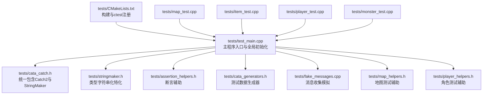
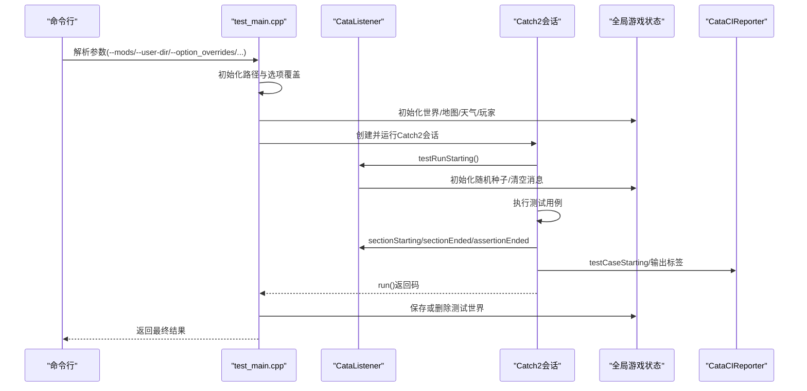
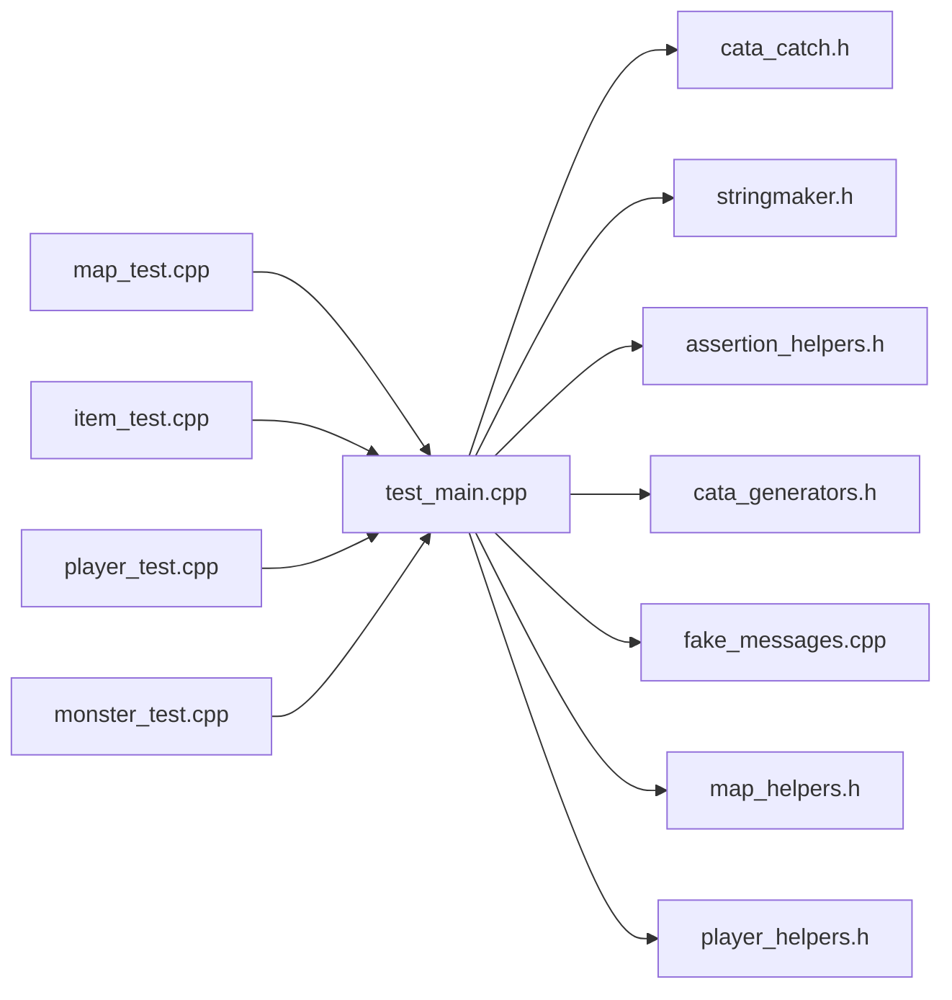

# 测试框架

<cite>
**本文引用的文件**
- tests/CMakeLists.txt
- tests/test_main.cpp
- tests/assertion_helpers.h
- tests/cata_catch.h
- tests/cata_generators.h
- tests/stringmaker.h
- tests/fake_messages.cpp
- tests/map_helpers.h
- tests/player_helpers.h
- tests/map_test.cpp
- tests/item_test.cpp
- tests/player_test.cpp
- tests/monster_test.cpp
</cite>

## 目录
1. [引言](#引言)
2. [项目结构](#项目结构)
3. [核心组件](#核心组件)
4. [架构总览](#架构总览)
5. [详细组件分析](#详细组件分析)
6. [依赖关系分析](#依赖关系分析)
7. [性能与覆盖率](#性能与覆盖率)
8. [故障排查指南](#故障排查指南)
9. [结论](#结论)
10. [附录](#附录)

## 引言
本文件系统性梳理 Cataclysm-DDA 的测试框架，覆盖单元测试组织、测试用例编写规范、断言机制、集成测试设计与执行流程、测试数据与模拟对象、测试环境配置、覆盖率与性能基准、持续集成自动化与报告、以及 TDD 工作流与质量保障实践。目标是帮助开发者快速理解并高效扩展测试体系。

## 项目结构
测试子系统位于 tests/ 目录，采用 CMake 控制构建与发现，基于 Catch2 框架运行。核心入口为 test_main.cpp，负责全局初始化（用户目录、选项覆盖、世界与地图加载）、随机种子设置、监听器注册、CI 报告器等；各功能域测试文件按模块划分，如 map_test.cpp、item_test.cpp、player_test.cpp、monster_test.cpp 等。

**图示来源**
- tests/CMakeLists.txt
- tests/test_main.cpp
- tests/cata_catch.h
- tests/stringmaker.h
- tests/assertion_helpers.h
- tests/cata_generators.h
- tests/fake_messages.cpp
- tests/map_helpers.h
- tests/player_helpers.h
- tests/map_test.cpp
- tests/item_test.cpp
- tests/player_test.cpp
- tests/monster_test.cpp

**章节来源**
- tests/CMakeLists.txt
- tests/test_main.cpp

## 核心组件
- 统一 Catch2 包装与导出：cata_catch.h 将 Catch2 与自定义 StringMaker 合并导出，避免 ODR 违规。
- 类型字符串化：stringmaker.h 为关键类型（如 item、point、cuboid、time_duration 等）提供 StringMaker 特化，提升断言失败时的可读性。
- 断言辅助：assertion_helpers.h 提供容器相等性断言工具，简化复杂容器比较。
- 随机数据生成器：cata_generators.h 提供点与三維坐标的生成器，便于参数化测试。
- 消息模拟：fake_messages.cpp 在测试中拦截并存储消息，便于失败时输出上下文日志。
- 地图与角色辅助：map_helpers.h、player_helpers.h 提供地图清理、怪物生成、角色装备等常用前置条件。
- 主程序与监听器：test_main.cpp 负责命令行解析、全局游戏状态初始化、随机种子设置、测试运行前后钩子、CI 报告器注册、世界保存策略等。

**章节来源**
- tests/cata_catch.h
- tests/stringmaker.h
- tests/assertion_helpers.h
- tests/cata_generators.h
- tests/fake_messages.cpp
- tests/map_helpers.h
- tests/player_helpers.h
- tests/test_main.cpp

## 架构总览
测试运行时序与控制流如下：

**图示来源**
- tests/test_main.cpp
- tests/test_main.cpp
- tests/test_main.cpp

## 详细组件分析

### 组件A：测试入口与全局初始化
- 命令行参数支持：
  - --mods：指定加载的模组列表，自动附加 test_data 模组。
  - --user-dir：测试世界存放目录，默认 ./test_user_dir/。
  - --option_overrides：以 n:v[,n:v] 形式覆盖配置项。
  - --error-format：错误格式（human-readable/github-action）。
  - --check-plural：复数检查策略。
  - --set-debug-level-mask：限制调试级别掩码。
- 全局初始化：
  - 用户目录、配置、模板目录准备。
  - 选项加载与覆盖、颜色初始化。
  - 世界生成与激活、日历与季节设定、核心与模组数据加载。
  - 玩家与地图初始化、天气更新。
- 随机性与消息：
  - 依据 Catch2 种子设置 Cata RNG。
  - 清空消息缓冲并在失败时输出最近消息。
- 结果处理：
  - 若未失败且未显式保留，则删除测试世界；否则保存以便诊断。
  - 输出总耗时与随机种子。

**章节来源**
- tests/test_main.cpp
- tests/test_main.cpp
- tests/test_main.cpp
- tests/test_main.cpp
- tests/test_main.cpp

### 组件B：断言与断言辅助
- 容器相等断言：check_containers_equal 比较大小并逐元素相等，同时 CAPTURE 两个容器内容，便于失败定位。
- Catch2 宏使用建议：
  - 使用 CAPTURE 记录变量值。
  - 使用 INFO 提供上下文信息。
  - 使用 REQUIRE/ CHECK 控制失败后继续执行策略。
- 类型字符串化：通过 StringMaker 特化，使 item、point、cuboid 等在断言失败时显示更友好的文本表示。

**章节来源**
- tests/assertion_helpers.h
- tests/stringmaker.h

### 组件C：测试数据生成与模拟
- 随机数据生成器：random_points/random_tripoints 用于生成地图坐标，结合 Catch2 GENERATE 实现参数化测试。
- 消息模拟：fake_messages.cpp 将消息存入内存向量，在测试失败时输出“最近消息”，辅助问题定位。
- 地图与角色辅助：
  - 地图：wipe_map_terrain、clear_map、build_test_map、spawn_test_monster 等。
  - 角色：clear_character、equip_shooter、give_and_activate_bionic 等。

**章节来源**
- tests/cata_generators.h
- tests/fake_messages.cpp
- tests/map_helpers.h
- tests/player_helpers.h

### 组件D：单元测试组织与用例规范
- 文件命名与分组：按功能域拆分至 map_test.cpp、item_test.cpp、player_test.cpp、monster_test.cpp 等。
- 标签与过滤：
  - 无游戏状态需求的测试标注 [nogame]，入口据此决定是否初始化全局游戏。
  - 支持按标签过滤（如 [item]、[active_item][map]），便于定向运行。
- Given/When/Then：部分用例采用 GIVEN/WHEN/THEN 描述行为场景，提升可读性。
- 参数化与生成器：结合 GENERATE 与随机生成器进行边界与异常场景覆盖。

示例参考路径：
- tests/map_test.cpp
- tests/map_test.cpp
- tests/item_test.cpp
- tests/player_test.cpp
- tests/monster_test.cpp

**章节来源**
- tests/map_test.cpp
- tests/item_test.cpp
- tests/player_test.cpp
- tests/monster_test.cpp

### 组件E：集成测试设计与执行流程
- 场景驱动：
  - 地图：坐标转换、越界检查、容器活性缓存一致性、破坏抓取家具释放等。
  - 物品：体积与堆叠、层叠顺序、枪械附件层变化、随时间堆叠规则等。
  - 角色：体感温度收敛、出汗与湿度变化、不同着装组合的目标温度等。
  - 怪物：寻路移动统计、追击/逃跑博弈、速度与步数分布等。
- 执行流程：
  - 测试开始前清理全局状态（地图、NPC、怪物、场地上下文）。
  - 设置期望初始条件（位置、速度、装备、天气）。
  - 执行动作或推进时间。
  - 断言结果与统计指标。
  - 失败时输出最近消息与上下文信息。

**章节来源**
- tests/map_test.cpp
- tests/map_test.cpp
- tests/map_test.cpp
- tests/item_test.cpp
- tests/player_test.cpp
- tests/player_test.cpp
- tests/monster_test.cpp
- tests/monster_test.cpp

### 组件F：测试环境配置与数据管理
- 构建与ctest注册：
  - tiles 与 curses 双构建目标，分别注册测试套件。
  - 自动发现测试并添加标签（如 gha）。
  - 支持本地化测试数据编译（生成 .mo）。
- 运行时配置：
  - --rng-seed time：每次运行使用时间作为随机种子。
  - --order lex、--use-colour、--min-duration 等 Catch2 选项。
  - --user-dir/test_user_dir_{n}：隔离测试世界目录。
- 数据与模组：
  - 自动加载 test_data 模组，确保测试数据可用。
  - 通过 --mods 指定额外模组。

**章节来源**
- tests/CMakeLists.txt
- tests/test_main.cpp
- tests/test_main.cpp
- tests/test_main.cpp

## 依赖关系分析
- 组件耦合：
  - test_main.cpp 作为中枢，依赖所有测试辅助头文件与全局游戏状态。
  - 各功能域测试文件仅依赖必要的辅助与类型，降低耦合。
- 外部依赖：
  - Catch2（统一通过 cata_catch.h 导入）。
  - 语言环境（可选本地化）。
- 潜在循环依赖：
  - 通过集中式头文件（cata_catch.h、stringmaker.h）避免多处包含导致的 ODR 问题。

**图示来源**
- tests/test_main.cpp
- tests/cata_catch.h
- tests/stringmaker.h
- tests/assertion_helpers.h
- tests/cata_generators.h
- tests/fake_messages.cpp
- tests/map_helpers.h
- tests/player_helpers.h
- tests/map_test.cpp
- tests/item_test.cpp
- tests/player_test.cpp
- tests/monster_test.cpp

## 性能与覆盖率
- 基准测试：
  - 开启 Catch2 基准能力（CMake 定义启用），可在测试中使用基准宏记录耗时。
  - 建议对热点函数（如寻路、碰撞检测、物品堆叠判定）增加基准用例。
- 覆盖率：
  - 建议在 CI 中集成覆盖率工具（如 gcov/lcov 或编译器内置覆盖率），针对关键模块（地图、物品、角色、怪物）统计行/分支覆盖率。
  - 对 [nogame] 与需要全局状态的测试分别统计，确保两类用例均被覆盖。
- 性能回归：
  - 将基准测试纳入 CI，记录关键路径耗时趋势，触发回归告警。

[本节为通用指导，不直接分析具体文件]

## 故障排查指南
- 初始化失败：
  - 检查用户目录权限与路径是否存在；查看初始化阶段错误日志。
  - 若 error_during_initialization 为真，入口会将结果视为失败。
- 随机性问题：
  - 确认 --rng-seed 是否正确传递；必要时固定种子复现实验。
- 世界保存：
  - 失败时若未删除世界，可在 --user-dir 指定目录中查找测试世界，检查地图与日志。
- 日志与消息：
  - 失败时输出最近消息有助于定位问题；可通过 INFO/CAPTURE 提升可观察性。
- 标签过滤：
  - 使用标签筛选（如 [item]、[active_item][map]）缩小问题范围。

**章节来源**
- tests/test_main.cpp
- tests/test_main.cpp
- tests/test_main.cpp
- tests/fake_messages.cpp

## 结论
Cataclysm-DDA 的测试框架以 Catch2 为核心，通过集中式入口与辅助库实现高内聚、低耦合的测试组织。其特性包括：
- 统一的类型字符串化与断言辅助，显著提升失败可读性；
- 参数化与生成器支持，覆盖边界与异常场景；
- 集成测试围绕地图、物品、角色、怪物四大领域展开；
- 可配置的运行时与ctest注册，便于本地与CI执行；
- 通过消息模拟与上下文输出，增强问题定位能力。

建议在现有基础上完善覆盖率统计与基准测试，并将关键路径纳入 CI 回归，持续提升代码质量与稳定性。

## 附录
- 常用命令（示例）
  - 构建测试：cmake --build build --target cata_test
  - 运行全部测试：ctest -C RelWithDebInfo -j 2 -V
  - 运行带标签的测试：ctest -C RelWithDebInfo -R "item"
  - 运行 tiles 构建：cmake --build build --target cata_test-tiles
- 最佳实践
  - 优先使用 GIVEN/WHEN/THEN 描述行为场景；
  - 对易变逻辑（时间、随机）进行显式种子设置；
  - 使用 CAPTURE/INFO 记录关键状态；
  - 将公共前置条件抽象到 map_helpers.h、player_helpers.h。