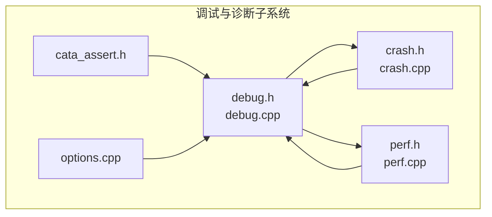
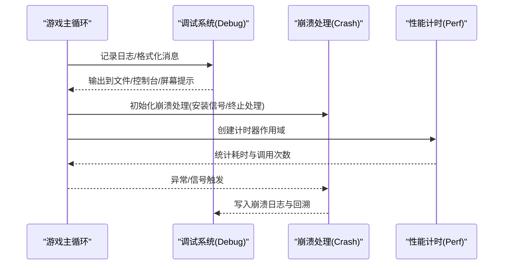
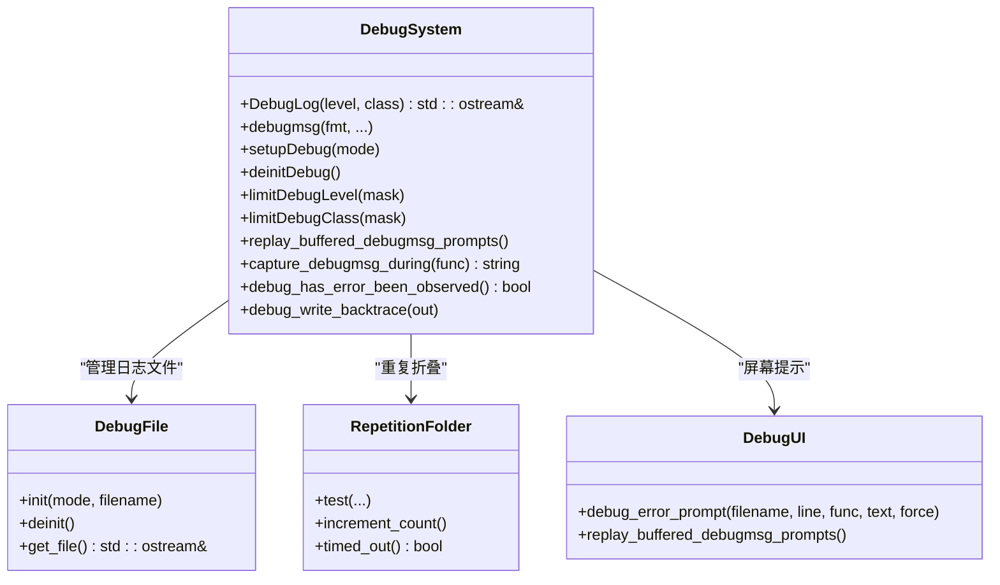
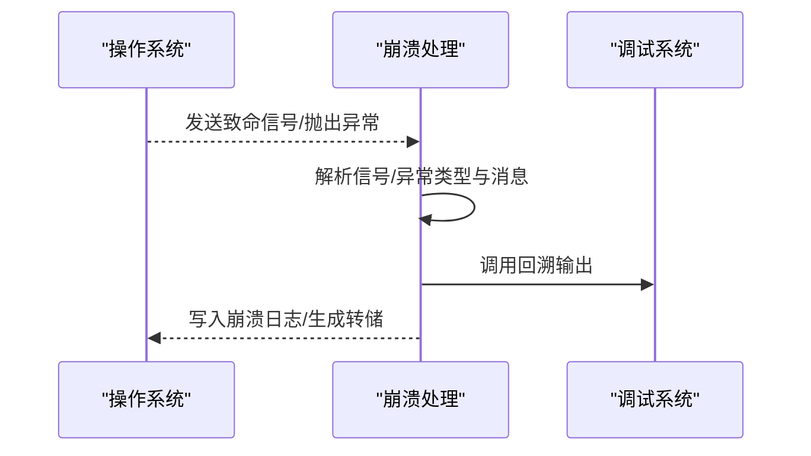
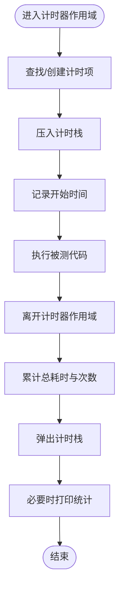
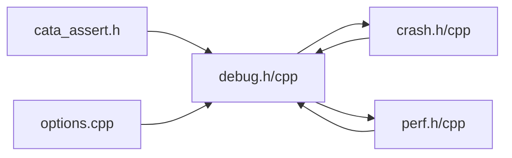

# 调试工具

<cite>
**本文引用的文件**
- src/debug.h
- src/debug.cpp
- src/crash.h
- src/crash.cpp
- src/perf.h
- src/perf.cpp
- src/cata_assert.h
- src/options.cpp
</cite>

## 目录
1. [简介](#简介)
2. [项目结构](#项目结构)
3. [核心组件](#核心组件)
4. [架构总览](#架构总览)
5. [组件详解](#组件详解)
6. [依赖关系分析](#依赖关系分析)
7. [性能与资源监控](#性能与资源监控)
8. [故障排查指南](#故障排查指南)
9. [结论](#结论)
10. [附录](#附录)

## 简介
本文件面向开发者与高级用户，系统化梳理 Cataclysm-DDA 的调试工具与诊断体系，覆盖以下主题：
- 调试信息采集与日志系统：日志级别、分类、输出目标与回溯记录
- 错误跟踪与崩溃报告：信号处理、终止处理、回溯生成与日志落盘
- 性能分析与计时器：高精度计时、统计聚合与打印
- 断点与变量监视：在支持平台上的调试器集成建议
- 常见问题诊断与解决方案：重复错误折叠、缓冲提示、忽略消息
- 开发与生产环境调试配置与排障流程

## 项目结构
围绕调试与诊断的关键源码位于 src 目录，主要文件如下：
- 日志与调试入口：debug.h、debug.cpp
- 崩溃与回溯：crash.h、crash.cpp
- 性能计时：perf.h、perf.cpp
- 断言封装：cata_assert.h
- 配置与选项：options.cpp（含调试相关选项）

**图表来源**
- src/debug.h
- src/debug.cpp
- src/crash.h
- src/crash.cpp
- src/perf.h
- src/perf.cpp
- src/cata_assert.h
- src/options.cpp

**章节来源**
- src/debug.h
- src/debug.cpp
- src/crash.h
- src/crash.cpp
- src/perf.h
- src/perf.cpp
- src/cata_assert.h
- src/options.cpp

## 核心组件
- 调试日志系统：提供多级多类的日志输出、格式化消息、屏幕提示与缓冲重放能力
- 崩溃与回溯：安装信号处理器与终止处理函数，生成崩溃日志与堆栈回溯
- 性能计时器：高分辨率计时、父子层级统计、平均耗时与调用次数汇总
- 断言封装：跨平台断言宏，避免弹窗干扰并统一行为
- 配置与选项：调试相关选项加载与一致性检查，便于运行期调整

**章节来源**
- src/debug.h
- src/debug.cpp
- src/crash.cpp
- src/perf.h
- src/cata_assert.h
- src/options.cpp

## 架构总览
调试与诊断系统由“日志/提示”、“崩溃回溯”、“性能计时”三部分协同构成，并通过断言与配置选项进行补充。

**图表来源**
- src/debug.cpp
- src/crash.cpp
- src/perf.h

## 组件详解

### 调试日志系统（Debug）
- 功能要点
  - 多级日志：信息、警告、错误、冗长信息
  - 多类分类：主模块、地图、地图生成、游戏、NPC、图形等
  - 输出目标：标准错误或文件；Windows 平台可写入系统调试设施
  - 屏幕提示：在可用窗口时弹出错误提示，支持复制、忽略与继续
  - 缓冲与重放：在未初始化窗口时缓冲提示，待窗口就绪后重放
  - 重复折叠：对同一位置的重复错误进行折叠与阈值提示
  - 捕获模式：单元测试中捕获调试消息用于断言
  - 回溯输出：在启用回溯时输出堆栈信息

- 关键接口与数据结构
  - 日志宏与流式接口：DebugLog、debugmsg、cata_fatal
  - 日志级别与分类枚举：DebugLevel、DebugClass
  - 输出目标枚举：DebugOutput
  - 扩展调试模式过滤器：debugmode::debug_filter
  - 回溯输出：debug_write_backtrace

**图表来源**
- src/debug.h
- src/debug.cpp
- src/debug.cpp

**章节来源**
- src/debug.h
- src/debug.cpp
- src/debug.cpp

### 崩溃与回溯（Crash）
- 功能要点
  - 安装信号处理器：针对常见致命信号（如段错误、非法指令、算术异常、中止等）
  - 终止处理：捕获未处理异常，提取类型与消息
  - 崩溃日志：生成包含版本、类型、消息与回溯的文本日志
  - 平台差异：Windows 支持 MiniDump 写入核心转储；Android 通过提示文件触发下次启动提示
  - 回溯输出：调用调试系统回溯输出函数

**图表来源**
- src/crash.cpp
- src/crash.cpp
- src/crash.cpp

**章节来源**
- src/crash.h
- src/crash.cpp

### 性能计时器（Perf）
- 功能要点
  - 高分辨率计时：基于高精度时钟，微秒级统计
  - 层级结构：父子计时器映射，支持嵌套统计
  - 统计聚合：累计总耗时、平均耗时、调用次数
  - 打印输出：递归打印树形统计结果

**图表来源**
- src/perf.h
- src/perf.cpp

**章节来源**
- src/perf.h
- src/perf.cpp

### 断言封装（Assert）
- 功能要点
  - 跨平台断言宏：在非调试构建下避免弹窗与无用开销
  - 统一失败行为：在失败时输出位置信息并中止进程
  - 与 JSON 解析断言兼容：为 FlatBuffers/FlexBuffers 提供可捕获断言替代

**章节来源**
- src/cata_assert.h

### 配置与选项（Options）
- 功能要点
  - 选项一致性检查：在加载与校验阶段输出调试消息，帮助定位配置问题
  - 运行期调试：通过选项系统调整调试行为（如启用扩展调试模式）

**章节来源**
- src/options.cpp

## 依赖关系分析
- 调试系统依赖
  - 日志系统依赖路径信息、版本信息、UI 系统与回溯输出
  - 崩溃处理依赖调试系统以输出回溯
  - 性能计时依赖调试系统进行统计打印
  - 断言封装独立但与调试系统配合使用

**图表来源**
- src/debug.h
- src/debug.cpp
- src/crash.cpp
- src/perf.h
- src/cata_assert.h
- src/options.cpp

**章节来源**
- src/debug.h
- src/debug.cpp
- src/crash.cpp
- src/perf.h
- src/cata_assert.h
- src/options.cpp

## 性能与资源监控
- 使用计时器
  - 在关键路径构造计时器对象，离开作用域自动统计耗时与次数
  - 通过打印接口输出树形统计，定位热点与异常调用
- 日志与回溯
  - 结合调试日志输出上下文信息，辅助定位性能瓶颈
  - 在异常或致命信号发生时，回溯有助于快速定位问题根因
- 断言与一致性检查
  - 在配置加载与状态转换处使用断言，提前暴露逻辑错误

**章节来源**
- src/perf.h
- src/debug.cpp
- src/crash.cpp
- src/cata_assert.h

## 故障排查指南
- 日志与提示
  - 启用更细粒度日志：通过限制日志级别与类别，聚焦问题模块
  - 屏幕提示：在可用窗口时查看错误提示，支持复制与忽略
  - 缓冲提示：若窗口未就绪，错误会缓冲，待就绪后重放
  - 重复折叠：出现大量重复错误时，系统会提示并引导提交问题报告
- 崩溃与回溯
  - 崩溃日志：崩溃时生成包含版本、类型、消息与回溯的文本日志
  - 平台差异：Windows 可能生成核心转储，Android 会在下次启动提示
  - 回溯输出：确保启用回溯功能以便获取完整堆栈
- 断点与变量监视
  - 在支持平台（如 Windows、Linux）下，可在调试消息处理路径设置断点
  - 利用调试器观察关键变量与调用链，结合日志定位问题
- 常见问题
  - 重复错误：系统内置折叠与阈值提示，避免刷屏并引导反馈
  - 忽略消息：可选择忽略特定重复消息，减少干扰
  - 配置问题：通过选项一致性检查输出的调试消息定位配置错误

**章节来源**
- src/debug.cpp
- src/debug.cpp
- src/crash.cpp
- src/options.cpp

## 结论
Cataclysm-DDA 的调试与诊断体系以“可配置、可扩展、可回溯”为核心设计原则：
- 日志系统提供灵活的级别与分类，支持多种输出目标与屏幕提示
- 崩溃处理与回溯确保问题可追踪、可复现
- 性能计时器提供高精度统计，辅助性能优化
- 断言与配置检查提升代码健壮性
结合上述工具与流程，可在开发与生产环境中高效定位与解决问题。

## 附录
- 开发环境建议
  - 启用调试构建，开启回溯支持
  - 使用调试器设置断点于关键路径与日志输出处
  - 在 CI 中保留回溯与日志，便于自动化问题定位
- 生产环境建议
  - 默认关闭冗长日志，仅保留错误与警告
  - 启用崩溃日志与回溯，确保问题可复现
  - 对重复错误进行折叠与阈值提示，避免刷屏