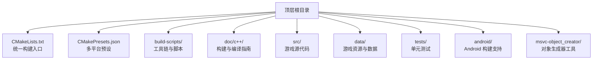
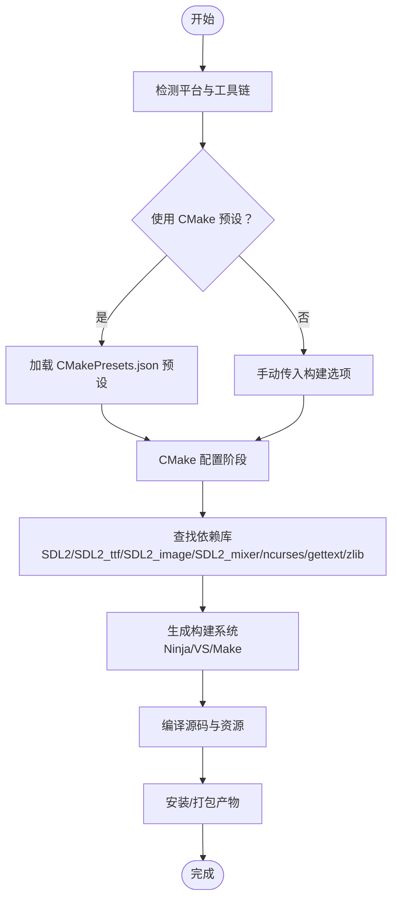
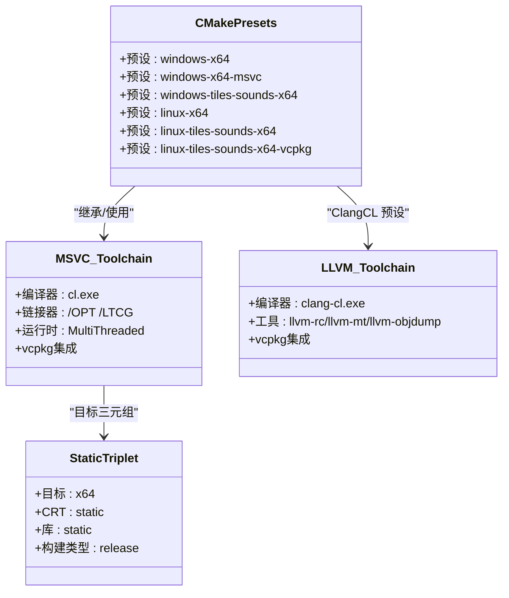
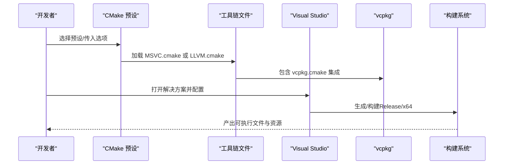
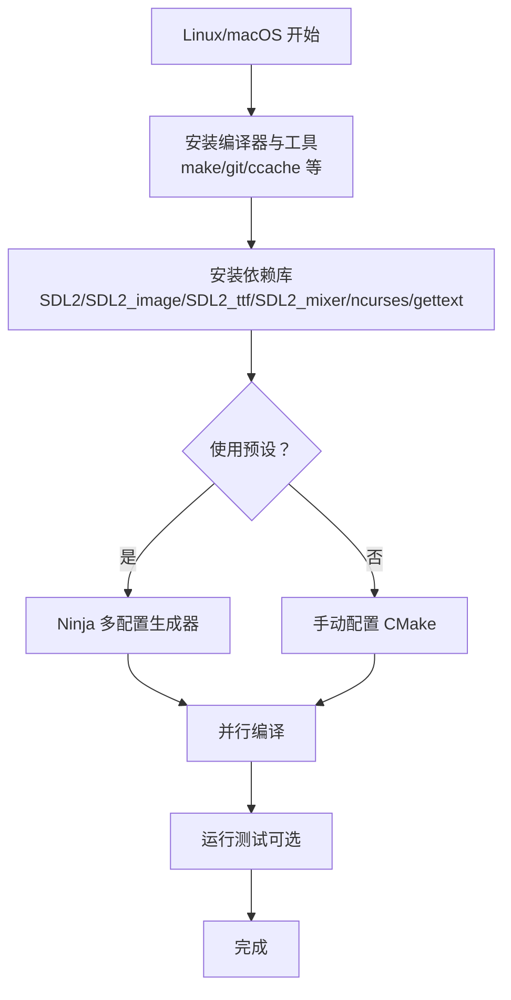
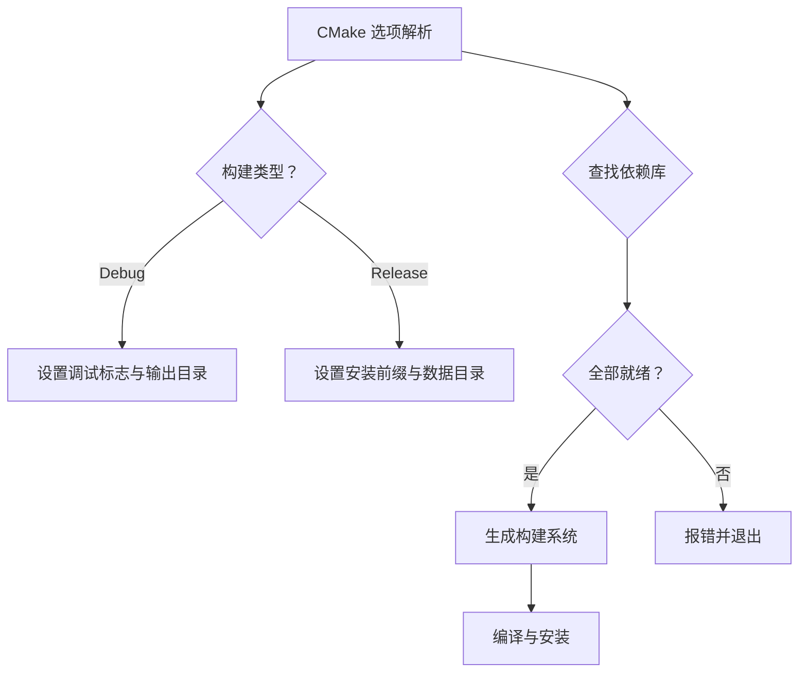
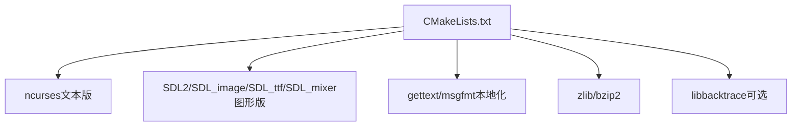

# 快速开始

<cite>
**本文引用的文件**
- README.md
- CMakeLists.txt
- CMakePresets.json
- CMakeUserPresets.json.in
- build.sh
- requirements.sh
- MSVC.cmake
- LLVM.cmake
- x64-windows-static.cmake
- COMPILING.md
- COMPILING-MSYS.md
- COMPILING-VS-VCPKG.md
- COMPILING-CMAKE.md
- Makefile
</cite>

## 目录
1. [简介](#简介)
2. [项目结构](#项目结构)
3. [核心组件](#核心组件)
4. [架构总览](#架构总览)
5. [详细组件分析](#详细组件分析)
6. [依赖关系分析](#依赖关系分析)
7. [性能注意事项](#性能注意事项)
8. [故障排除指南](#故障排除指南)
9. [结论](#结论)
10. [附录](#附录)

## 简介
本“快速开始”面向首次编译与运行 Cataclysm: Dark Days Ahead（CDDA）的用户，覆盖 Windows、Linux、macOS 等主流平台的环境准备、依赖安装、CMake 构建系统使用（含预设与自定义选项）、以及首次运行验证与基础配置建议。文档同时提供常见问题排查与性能优化提示，帮助不同技术背景的用户顺利完成从源码到可执行程序的全流程。

## 项目结构
仓库采用多模块组织方式：顶层通过 CMakeLists.txt 统一管理构建流程；doc/c++ 提供官方与非官方的构建指南；build-scripts 提供跨平台工具链与脚本；data 与 src 分别存放资源与源代码；tests 提供单元测试；android、msvc-object_creator 等目录支持特定平台或工具链。

图示来源
- CMakeLists.txt
- CMakePresets.json
- Makefile

章节来源
- CMakeLists.txt
- CMakePresets.json
- Makefile

## 核心组件
- 构建系统与选项
  - CMake 最低版本要求与常用选项：CURSES/TILES/SOUND/LOCALIZE/DYNAMIC_LINKING/TESTS 等。
  - 预设配置：Windows（MSYS2 MinGW、MSVC、ClangCL）、Linux（GCC）等多套预设，一键生成多配置构建器。
- 平台工具链
  - MSVC.cmake、LLVM.cmake、x64-windows-static.cmake 提供静态链接、编译器标志与 vcpkg 集成。
- 构建脚本
  - build.sh、requirements.sh 提供 CI/本地自动化构建、依赖安装与测试流程。
- 官方与非官方构建指南
  - COMPILING.md（官方）、COMPILING-CMAKE.md（非官方 CMake 指南）、COMPILING-MSYS.md、COMPILING-VS-VCPKG.md（Windows VS + vcpkg）。

章节来源
- CMakeLists.txt
- CMakePresets.json
- MSVC.cmake
- LLVM.cmake
- x64-windows-static.cmake
- build.sh
- requirements.sh
- COMPILING.md
- COMPILING-CMAKE.md
- COMPILING-MSYS.md
- COMPILING-VS-VCPKG.md

## 架构总览
下图展示从源码到可执行程序的关键路径：CMake 配置选择平台与特性，查找依赖库，生成构建系统，最终产出可执行文件与资源。

图示来源
- CMakeLists.txt
- CMakePresets.json

章节来源
- CMakeLists.txt
- CMakePresets.json

## 详细组件分析

### CMake 构建系统与预设
- 预设概览
  - Windows x64（MSYS2 MinGW）：默认文本版（CURSES），可切换图形版（TILES）与音效（SOUND）。
  - Windows x64（MSVC）：静态链接、集成 vcpkg、支持 ClangCL。
  - Linux x64（GCC）：默认文本版，可启用图形版与音效。
  - Linux x64（GCC + vcpkg）：通过工具链文件与环境变量集成 vcpkg。
- 关键缓存变量
  - DYNAMIC_LINKING、CURSES、LOCALIZE、TILES、SOUND、TESTS、CMAKE_INSTALL_MESSAGE 等。
- 工具链文件
  - MSVC.cmake：设置编译/链接标志、运行时库、vcpkg 集成。
  - LLVM.cmake：基于 clang-cl 的 Windows LLVM 工具链。
  - x64-windows-static.cmake：目标架构与静态链接策略。

图示来源
- CMakePresets.json
- MSVC.cmake
- LLVM.cmake
- x64-windows-static.cmake

章节来源
- CMakePresets.json
- MSVC.cmake
- LLVM.cmake
- x64-windows-static.cmake

### 平台构建流程（Windows）
- MSYS2（MinGW）
  - 安装依赖包（git、make、ncurses、SDL2 及其扩展、gettext、ccache 等）。
  - 使用预设或命令行参数进行配置与构建。
- Visual Studio + vcpkg
  - 安装 VS 与 vcpkg，打开解决方案，按需选择配置（Release/x64）。
  - 如需本地化，执行 lang/compile_mo.sh 编译语言文件。
- ClangCL（可选）
  - 通过 CMakePresets.json 的 ClangCL 预设启用 clang-cl 工具链。

图示来源
- COMPILING-MSYS.md
- COMPILING-VS-VCPKG.md
- CMakePresets.json
- MSVC.cmake
- LLVM.cmake

章节来源
- COMPILING-MSYS.md
- COMPILING-VS-VCPKG.md
- CMakePresets.json
- MSVC.cmake
- LLVM.cmake

### 平台构建流程（Linux/macOS）
- Linux（GCC）
  - 使用 Ninja 多配置生成器，按需启用 TILES/SOUND/LOCALIZE/TESTS。
  - 可通过 vcpkg 集成（x64-linux-dynamic）管理依赖。
- macOS（Xcode/Clang）
  - 通过 Homebrew 获取 SDL2/SDL2_image/SDL2_ttf/SDL2_mixer/ncurses/gettext。
  - 支持 FRAMEWORK 方式链接框架或使用包管理器提供的共享库。

图示来源
- COMPILING.md
- COMPILING.md
- CMakePresets.json

章节来源
- COMPILING.md
- COMPILING.md
- CMakePresets.json

### CMake 选项与行为
- 常用选项
  - CURSES/TILES/SOUND/LOCALIZE/DYNAMIC_LINKING/TESTS/USE_XDG_DIR/USE_HOME_DIR/USE_PREFIX_DATA_DIR/LANGUAGES/GIT_BINARY 等。
- 构建类型与输出
  - Debug：开发模式，开启详细符号与警告；Release：优化构建，安装前缀与数据目录策略不同。
- 依赖查找与错误处理
  - SDL2/SDL2_ttf/SDL2_image/SDL2_mixer/ncurses/gettext/zlib 等未找到时会给出明确提示。
- 静态/动态链接
  - DYNAMIC_LINKING 控制动态链接；在 MinGW 下避免依赖运行时 DLL；静态模式下设置链接器标志与库后缀。

图示来源
- CMakeLists.txt
- CMakeLists.txt

章节来源
- CMakeLists.txt
- CMakeLists.txt

## 依赖关系分析
- 组件耦合
  - CMakeLists.txt 作为统一入口，按平台与选项决定是否启用 TILES/SOUND/LOCALIZE/TESTS，并查找对应依赖。
  - 预设文件与工具链文件解耦具体平台细节，便于复用。
- 外部依赖
  - 文本版：ncurses（可选宽字符）。
  - 图形版：SDL2、SDL2_image、SDL2_ttf、SDL2_mixer（可选）。
  - 本地化：gettext/msgfmt（可选）。
  - 其他：zlib、bzip2、libbacktrace（可选）。

图示来源
- CMakeLists.txt

章节来源
- CMakeLists.txt

## 性能注意事项
- 使用 ccache
  - CMake 与脚本均支持 ccache，显著提升增量编译速度。
- 并行编译
  - 预设与脚本默认使用多核并行，可根据 CPU 核数调整并行度。
- 构建类型
  - Release 优化更佳，Debug 更利于调试与回溯。
- 静态链接
  - 在 MinGW 下可减少运行时依赖，但二进制体积增大；静态 CRT 仅在特定工具链中生效。

章节来源
- CMakeLists.txt
- build.sh
- build.sh
- requirements.sh

## 故障排除指南
- 依赖缺失
  - 症状：找不到 SDL2/SDL2_ttf/SDL2_image/SDL2_mixer/ncurses/gettext/zlib。
  - 处理：根据平台指南安装开发包；必要时指定工具链或 vcpkg。
- Git 版本信息
  - 症状：构建版本显示为空或警告。
  - 处理：安装 Git 或通过 -DGIT_BINARY 指定路径。
- 动态/静态链接冲突
  - 症状：MinGW 下出现运行时依赖或链接错误。
  - 处理：尝试 DYNAMIC_LINKING=OFF 或使用 vcpkg 静态三元组。
- Windows 工具链差异
  - MSYS2 与 MSVC 行为差异较大，注意预设与工具链文件的选择。
- 测试失败
  - 症状：测试用例失败或超时。
  - 处理：检查测试前置条件（如语言文件、数据目录），必要时以 Release 运行测试。

章节来源
- CMakeLists.txt
- CMakeLists.txt
- COMPILING.md
- COMPILING-MSYS.md
- COMPILING-VS-VCPKG.md

## 结论
通过本快速开始指南，您可以在 Windows、Linux、macOS 上完成 CDDA 的环境准备、依赖安装、CMake 预设与自定义选项配置，并顺利编译与运行。遇到问题时，可依据“故障排除指南”逐项定位；日常开发建议使用 ccache 与并行编译以提升效率。

## 附录

### 首次运行验证步骤
- Windows
  - MSYS2：在 MSYS2 终端中运行图形版可执行文件，确认界面与音效正常。
  - VS + vcpkg：设置启动项目为 Cataclysm-vcpkg-static，直接运行或调试。
- Linux/macOS
  - 运行 ./cataclysm（文本版）或 ./cataclysm-tiles（图形版），进入主菜单检查渲染与输入。

章节来源
- COMPILING-MSYS.md
- COMPILING-VS-VCPKG.md
- COMPILING.md

### 基础配置建议
- 数据与配置目录
  - 使用 USE_HOME_DIR 将用户数据保存在用户主目录，便于备份与迁移。
  - 使用 USE_XDG_DIR 在 Linux 上遵循 XDG 规范。
- 本地化
  - 启用 LOCALIZE 并指定 LANGUAGES，或在 Release 构建中自动编译语言文件。
- 音效与图形
  - 图形版建议启用 TILES 与 SOUND；文本版适合无显卡或轻量化环境。

章节来源
- CMakeLists.txt
- CMakeLists.txt
- COMPILING-CMAKE.md