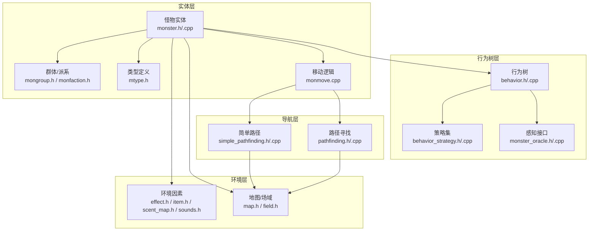
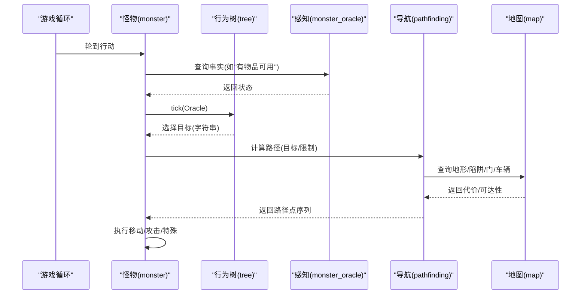
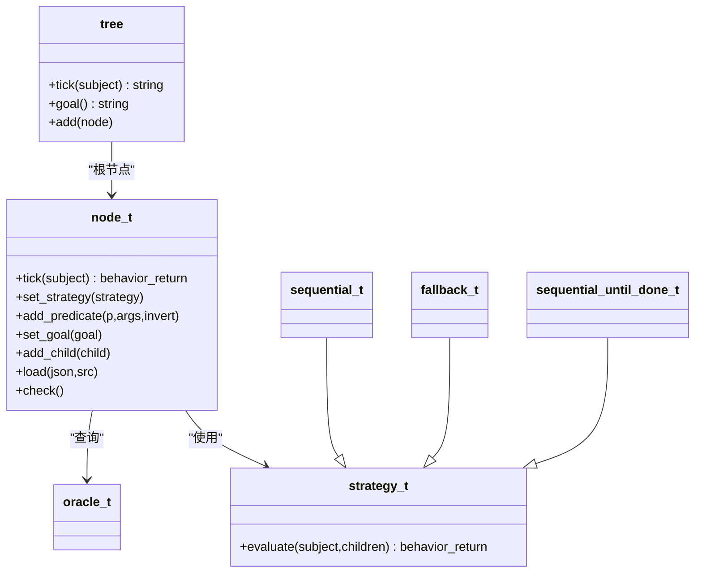
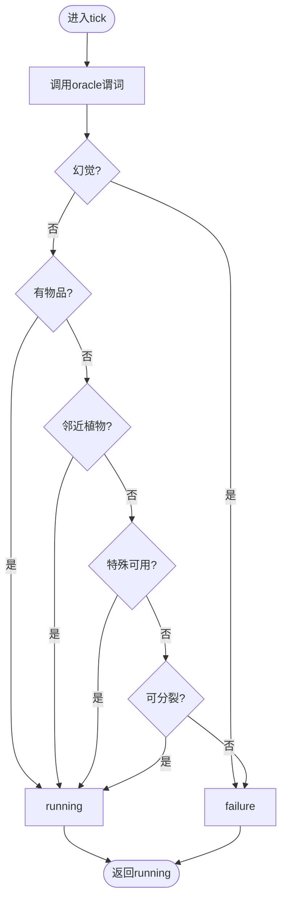
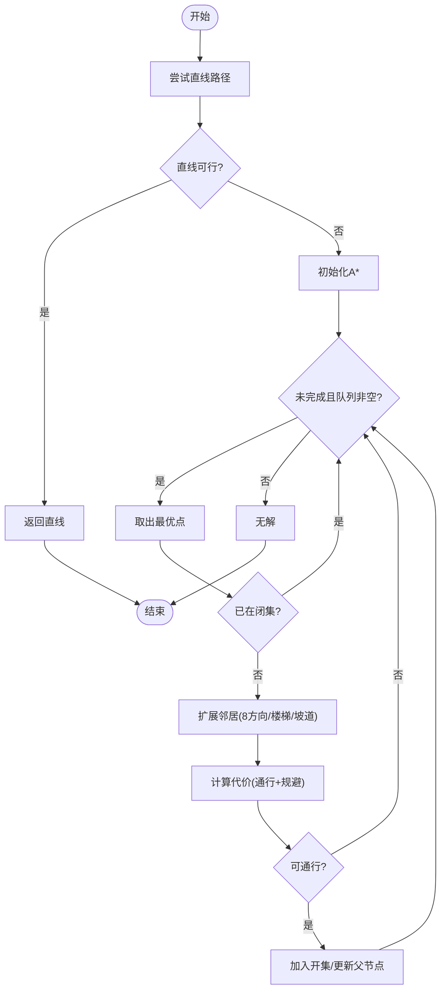
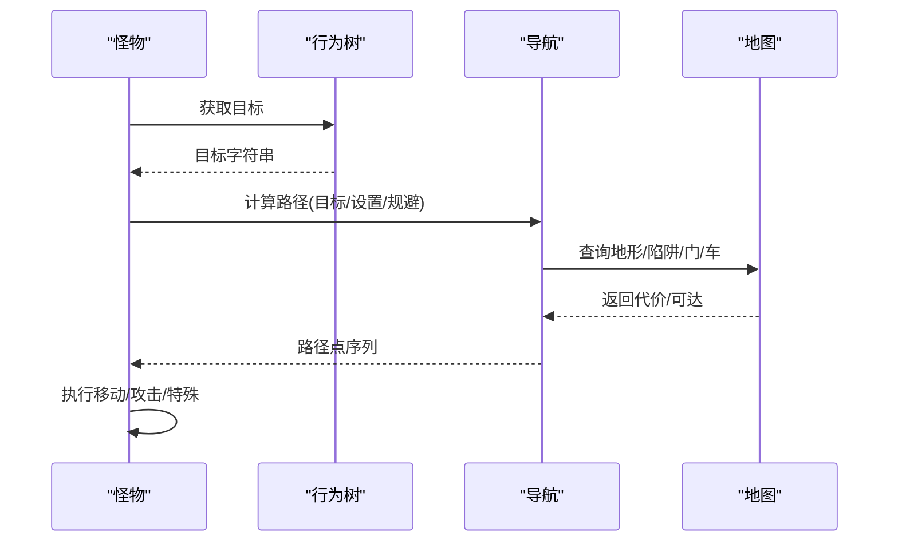
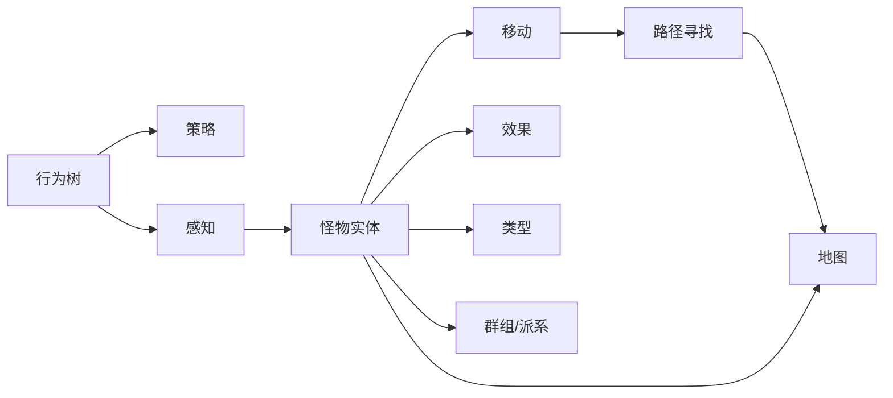

# 怪物AI系统

<cite>
**本文引用的文件**
- behavior.h
- behavior.cpp
- behavior_strategy.h
- behavior_strategy.cpp
- monster_oracle.h
- monster_oracle.cpp
- pathfinding.h
- pathfinding.cpp
- simple_pathfinding.h
- simple_pathfinding.cpp
- monster.h
- monster.cpp
- monmove.cpp
- mtype.h
- mongroup.h
- monfaction.h
- creature.h
- map.h
- field.h
- effect.h
- item.h
- messages.h
- rng.h
- scent_map.h
- sounds.h
- debug.h
- game.h
- options.h
- effect_on_condition.h
</cite>

## 目录
1. [引言](#引言)
2. [项目结构](#项目结构)
3. [核心组件](#核心组件)
4. [架构总览](#架构总览)
5. [详细组件分析](#详细组件分析)
6. [依赖关系分析](#依赖关系分析)
7. [性能考量](#性能考量)
8. [故障排查指南](#故障排查指南)
9. [结论](#结论)
10. [附录：调试与扩展](#附录调试与扩展)

## 引言
本文件面向Cataclysm-DDA的怪物AI系统，聚焦行为树驱动的决策框架、感知与导航子系统、群体行为与威胁评估、学习与适应机制，以及调试与性能优化实践。文档以代码级分析为基础，辅以图示帮助理解从感知到行动的完整闭环。

## 项目结构
怪物AI相关代码主要分布在以下模块：
- 行为树与策略：behavior.h/.cpp、behavior_strategy.h/.cpp
- 事实查询接口（感知）：monster_oracle.h/.cpp
- 导航与寻路：pathfinding.h/.cpp、simple_pathfinding.h/.cpp
- 怪物实体与移动：monster.h/.cpp、monmove.cpp
- 类型与群体：mtype.h、mongroup.h、monfaction.h
- 地图与环境：map.h、field.h
- 其他支撑：effect.h、item.h、messages.h、rng.h、scent_map.h、sounds.h、debug.h、game.h、options.h、effect_on_condition.h

图表来源
- behavior.h
- behavior_strategy.h
- monster_oracle.h
- pathfinding.h
- simple_pathfinding.h
- monster.h
- monmove.cpp
- map.h
- field.h

章节来源
- behavior.h
- behavior_strategy.h
- monster_oracle.h
- pathfinding.h
- simple_pathfinding.h
- monster.h
- monmove.cpp

## 核心组件
- 行为树与策略
  - 行为树tree负责优先级遍历，策略strategy决定兄弟节点的访问顺序；条件predicates用于剪枝与短路。
  - 策略包括sequential、fallback、sequential_until_done三种标准策略。
- 感知接口oracle
  - 提供“非幻觉”“有物品可用”“邻近植物”“特殊可用”“可分裂”等谓词，作为行为树的外部事实来源。
- 导航与寻路
  - 基于A*的复杂寻路（含楼梯/坡道/陷阱规避），以及面向Overmap的贪心/近似A*路径。
- 实体与移动
  - 怪物实体封装属性、效果、阵营与类型；monmove集中处理移动优先级与路径执行。
- 群体与派系
  - mongroup与monfaction影响威胁评估、协同与目标选择。

章节来源
- behavior.h
- behavior_strategy.cpp
- monster_oracle.cpp
- pathfinding.cpp
- simple_pathfinding.cpp
- monster.h
- monmove.cpp

## 架构总览
怪物AI以“行为树决策 + 多源感知 + 导航执行”的分层架构运行。每回合，怪物通过oracle查询当前环境事实，行为树按策略遍历节点，选择最高优先级可行目标；随后由导航子系统计算路径并执行移动或攻击。

图表来源
- monmove.cpp
- behavior.cpp
- monster_oracle.cpp
- pathfinding.cpp

## 详细组件分析

### 行为树与策略
- tree与node_t
  - tree持有根节点，tick返回当前活跃节点的目标字符串；node_t支持添加子节点、设置策略、添加条件谓词。
  - 条件谓词可反转结果，实现“否定”语义；策略决定兄弟节点遍历顺序与短路条件。
- 策略
  - sequential：顺序执行直到失败或running，适合高优先级链。
  - fallback：顺序执行直到成功，适合备选方案。
  - sequential_until_done：无条件顺序执行，适合需要连续完成的一系列步骤。
- 加载与校验
  - 支持JSON加载节点、策略绑定与条件注册；最终化阶段建立父子关系；提供一致性检查。

图表来源
- behavior.h
- behavior_strategy.h
- behavior.cpp

章节来源
- behavior.h
- behavior.cpp
- behavior_strategy.h
- behavior_strategy.cpp

### 感知接口（monster_oracle）
- 提供怪物视角的事实查询：
  - not_hallucination：排除幻觉目标
  - items_available：当前位置是否有可吸收/拾取的物品
  - adjacent_plants：邻近可利用植物
  - special_available：特定特殊能力可用
  - split_possible：可进行分裂
- 这些谓词直接驱动行为树的条件分支，决定目标是否可达成。

图表来源
- monster_oracle.cpp

章节来源
- monster_oracle.h
- monster_oracle.cpp

### 导航与寻路
- 复杂寻路（A*）
  - 支持代价函数：地形/家具/场域/车辆/门/攀爬/破坏/楼梯/坡道/陷阱/危险区域/尖锐地形/尺寸限制等。
  - 含直线优化：若直线上无障碍则直接走直线；否则回退A*。
  - 高层目标：point/adjacent/radius三种目标形式。
- Overmap简单路径
  - 使用贪心/近似A*在三维（X/Y/Z）上搜索，支持方向成本模型与最大半径/成本约束。
- 性能要点
  - 闭集/开集位图、优先队列、启发式裁剪、z层跳转、垂直移动辅助。

图表来源
- pathfinding.cpp
- pathfinding.h

章节来源
- pathfinding.h
- pathfinding.cpp
- simple_pathfinding.h
- simple_pathfinding.cpp

### 实体与移动（monmove）
- 移动优先级
  - 特殊攻击 → 视觉追踪 → 气味追踪 → 声音追踪 → 徘徊/巡逻
- 危险规避
  - 可配置危险规避标志：火焰、坠落、尖锐地形、危险场域、陷阱等
- 路径执行
  - 将行为树目标转换为导航目标，调用route计算路径，逐步移动
- 特殊行为
  - 分裂、吸收、拖拽、眩晕/麻痹/束缚等效果对移动与目标选择的影响

图表来源
- monmove.cpp
- pathfinding.cpp

章节来源
- monmove.cpp
- monmove.cpp

### 群体行为与威胁评估
- 群体/恐慌/蜂拥
  - 通过monster_plan与群组标志控制是否群聚、是否因低血量而恐惧
- 威胁评估
  - 动作智能度、敌友态势、距离权重、火力值归一化
- 目标选择
  - 基于视野、气味、声音、玩家位置与威胁等级选择优先目标

章节来源
- monmove.cpp
- mongroup.h
- monfaction.h

### 学习与适应、状态变化与特殊模式
- 效果与状态
  - 恐惧、眩晕、麻痹、束缚、眩晕感等直接影响行动与路径选择
- 生物学/抗性
  - 对不同场域/伤害类型的抗性改变免疫与移动策略
- 特殊模式
  - 分裂、吸收、拖拽、宠物/驯服状态、派系互动

章节来源
- effect.h
- monster.h
- monster_oracle.cpp

## 依赖关系分析
- 行为树依赖策略与oracle；oracle依赖怪物实体与地图；导航依赖地图与代价函数；怪物实体依赖类型、效果、地图与群组。
- 关键耦合点
  - 行为树与oracle：通过谓词接口解耦环境查询
  - 导航与地图：通过PathfindingFlags与代价函数抽象地形
  - 实体与导航：通过Creature接口与路径设置参数

图表来源
- behavior.h
- monster_oracle.h
- pathfinding.h
- monster.h

章节来源
- behavior.h
- monster_oracle.h
- pathfinding.h
- monster.h

## 性能考量
- 行为树
  - 采用深度优先与策略短路，减少无效遍历；条件谓词可快速剪枝
- 导航
  - 直线路径优化避免不必要的A*；代价函数提前判定不可达；z层跳转与垂直移动缓存
- 内存与数据结构
  - 闭集/开集位图降低空间占用；优先队列按启发式排序
- 参数化
  - max_dist/max_length、尺寸限制、危险规避开关等可调参数平衡性能与行为质量

[本节为通用指导，无需列出具体文件来源]

## 故障排查指南
- 行为树问题
  - 检查节点是否同时具备children与goal；策略是否缺失
  - 使用check_consistency与debug输出定位加载错误
- 导航问题
  - 检查目标越界与不可达；确认代价函数与危险规避设置
  - 使用debug输出路径点与代价
- 怪物行为异常
  - 检查效果状态（眩晕/麻痹/束缚）与抗性
  - 核对感知谓词返回值与目标优先级

章节来源
- behavior.cpp
- pathfinding.cpp
- debug.h

## 结论
CDDA的怪物AI以行为树为核心，结合多源感知与高效寻路，在复杂环境中实现灵活、可扩展的怪物行为。通过策略化节点组织、可配置的导航代价与危险规避、以及基于群体与派系的状态管理，系统在可维护性与性能之间取得良好平衡。进一步的扩展可通过新增谓词、策略与代价项来实现更丰富的AI行为。

[本节为总结性内容，无需列出具体文件来源]

## 附录：调试与扩展

### AI调试工具与方法
- 行为树
  - 使用行为树的goal()与active_node跟踪当前目标
  - 在节点加载时启用check()与一致性检查
- 导航
  - 输出路径点序列与代价，验证目标可达性
  - 调整max_dist/max_length与危险规避参数观察行为变化
- 怪物状态
  - 使用debug输出怪物当前效果、威胁评估与目标选择

章节来源
- behavior.cpp
- pathfinding.cpp
- debug.h

### 性能调优建议
- 行为树
  - 将高成本谓词置于深层或使用缓存；合理使用fallback策略
- 导航
  - 合理设置max_dist/max_length；开启直线路径优化
  - 控制危险规避范围，避免过度惩罚
- 实体
  - 减少不必要的感知扫描；合并相似效果判断

[本节为通用指导，无需列出具体文件来源]

### 扩展开发示例（路径）
- 新增谓词
  - 在monster_oracle中添加新谓词，并在行为JSON中引用
- 新增策略
  - 在strategy_map中注册新策略类，行为JSON中指定strategy
- 新增代价项
  - 在pathfinding_settings中增加新开关；在代价函数中加入新判定

章节来源
- monster_oracle.h
- behavior_strategy.cpp
- pathfinding.h
- pathfinding.cpp