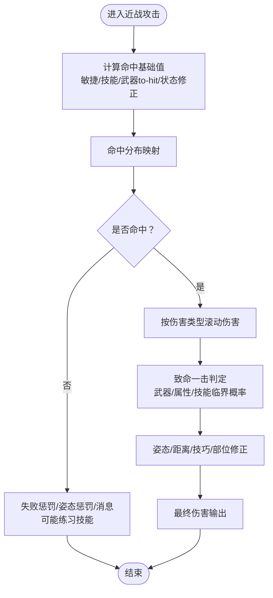

# 战斗与AI系统

<cite>
**本文引用的文件**
- src/melee.cpp
- src/ranged.cpp
- src/ballistics.cpp
- src/dispersion.cpp
- src/damage.cpp
- src/item.cpp
- src/pathfinding.cpp
- src/monmove.cpp
- src/monster.cpp
- src/behavior.cpp
- src/behavior_strategy.cpp
- src/mattack_common.h
- src/do_turn.cpp
- data/json/skills.json
- data/json/recipes/practice/melee.json
</cite>

## 目录
1. [引言](#引言)
2. [项目结构](#项目结构)
3. [核心组件](#核心组件)
4. [架构总览](#架构总览)
5. [详细组件分析](#详细组件分析)
6. [依赖关系分析](#依赖关系分析)
7. [性能考量](#性能考量)
8. [故障排查指南](#故障排查指南)
9. [结论](#结论)
10. [附录：扩展与平衡性建议](#附录扩展与平衡性建议)

## 引言
本文件面向Cataclysm-DDA的回合制战斗系统与AI机制，系统化梳理伤害计算、命中判定、防御机制、武器弹药、近战战斗、远程弹道、AI行为树与路径规划、危险评估等核心内容，并给出可操作的平衡性调整与性能优化建议。文档兼顾技术深度与可读性，既适合开发者扩展，也适合模组制作者与玩家理解机制。

## 项目结构
围绕战斗与AI的关键源码主要分布在以下模块：
- 近战与武器：src/melee.cpp
- 远程与弹药：src/ranged.cpp、src/ballistics.cpp、src/dispersion.cpp
- 护甲与抗性：src/damage.cpp、src/item.cpp
- 路径规划：src/pathfinding.cpp
- 怪物移动与AI：src/monmove.cpp、src/monster.cpp
- 行为树框架：src/behavior.cpp、src/behavior_strategy.cpp
- 特殊攻击接口：src/mattack_common.h
- 游戏主循环与回合推进：src/do_turn.cpp
- 技能与训练数据：data/json/skills.json、data/json/recipes/practice/melee.json

图表来源
- src/melee.cpp
- src/ranged.cpp
- src/ballistics.cpp
- src/dispersion.cpp
- src/damage.cpp
- src/item.cpp
- src/pathfinding.cpp
- src/monmove.cpp
- src/monster.cpp
- src/behavior.cpp
- src/behavior_strategy.cpp
- src/mattack_common.h
- src/do_turn.cpp
- data/json/skills.json
- data/json/recipes/practice/melee.json

章节来源
- src/melee.cpp
- src/ranged.cpp
- src/ballistics.cpp
- src/dispersion.cpp
- src/damage.cpp
- src/item.cpp
- src/pathfinding.cpp
- src/monmove.cpp
- src/monster.cpp
- src/behavior.cpp
- src/behavior_strategy.cpp
- src/mattack_common.h
- src/do_turn.cpp
- data/json/skills.json
- data/json/recipes/practice/melee.json

## 核心组件
- 命中判定与伤害计算：近战与远程分别通过各自的命中函数与伤害滚动完成；护甲抗性在最终阶段生效。
- 散布与弹道：远程射击引入散布来源累加、正态扰动与乘数因子；弹道模拟考虑地形遮挡与目标偏移。
- 防御机制：护甲耐久与抗性共同决定减伤与损坏概率；能量护盾有独立HP机制。
- AI行为树：以节点-策略-条件谓词组织，按优先级选择目标行为；怪物移动结合路径规划与危险评估。
- 路径规划：A*变体，支持楼梯/坡道/陷阱/障碍规避与尺寸限制。
- 回合推进：每回合处理天气、爆炸、声音、视野缓存更新与怪物/NPC行动。

章节来源
- src/melee.cpp
- src/ranged.cpp
- src/ballistics.cpp
- src/damage.cpp
- src/item.cpp
- src/behavior.cpp
- src/behavior_strategy.cpp
- src/pathfinding.cpp
- src/do_turn.cpp

## 架构总览
战斗系统采用“模块化职责分离”：
- 输入层：玩家动作（近战/远程）、怪物/NPC行动请求
- 决策层：命中判定、伤害滚动、抗性计算、AI目标选择
- 执行层：弹道模拟、路径规划、特殊攻击触发
- 反馈层：消息、音效、状态变更、经验/训练

图表来源
- src/do_turn.cpp
- src/melee.cpp
- src/ranged.cpp
- src/ballistics.cpp
- src/pathfinding.cpp

## 详细组件分析

### 近战战斗与命中判定
- 命中基础：基于敏捷、技能、武器to-hit修正与状态影响（俯卧/蹲伏/远视）生成命中值，再经范围映射得到命中分布。
- 伤害滚动：按伤害类型逐项滚动，考虑武器/徒手技能、技巧（technique）与部位弱点；近身距离与姿态进一步影响伤害倍率。
- 致命一击：武器/属性/技能三类临界概率相乘，叠加命中vs闪避优势时出现更高概率的连击临界。
- 练习与反馈：未被幻觉、无法移动/受击标志覆盖时，命中失败会进行技能练习与消息提示。

图表来源
- src/melee.cpp
- src/melee.cpp
- src/melee.cpp

章节来源
- src/melee.cpp
- src/melee.cpp
- src/melee.cpp

### 远程射击与弹道
- 命中与散布：命中由技能、武器精度、移动/驾驶状态、瞄准方法等决定；散布来源包括线性/正态/乘数项，最终角度在3600内截断。
- 弹道模拟：根据初始方向与散布，计算命中目标或墙面偏移；对命中点进行清道夫路径优化以绘制更自然轨迹。
- 武器价值评估：综合伤害、精度、容量（弹夹/弹药）与技能阈值，形成“枪械价值”用于AI选择。

图表来源
- src/ranged.cpp
- src/ballistics.cpp
- src/dispersion.cpp

章节来源
- src/ranged.cpp
- src/ballistics.cpp
- src/dispersion.cpp

### 护甲与抗性机制
- 护甲抗性：按伤害类型设置抗性，最终有效抗性=抗性-穿透-条件乘数，再按无抗性标记处理。
- 耐久与损坏：使用逻辑斯蒂克函数控制损坏概率，考虑护甲自身抗性、脆弱/坚固标志、覆盖部位数量与附魔倍率；能量护盾有独立HP变量与销毁反馈。

图表来源
- src/damage.cpp
- src/item.cpp

章节来源
- src/damage.cpp
- src/item.cpp

### AI行为树与决策
- 结构：节点包含条件谓词、子节点与策略；树按策略顺序遍历，返回running表示可继续推进的目标。
- 策略：sequential（顺序执行至失败）、fallback（顺序执行至成功）、sequential_until_done（强制顺序直到running）。
- 应用：怪物在每回合plan()选择目标行为，结合感知（oracle）与地图状态进行决策。

图表来源
- src/behavior.cpp
- src/behavior_strategy.cpp

章节来源
- src/behavior.cpp
- src/behavior_strategy.cpp

### 怪物移动与路径规划
- 怪物移动：每回合process_turn后plan()制定目标，随后move()执行一步；若被控制则跳过自主计划。
- 路径规划：A*优先队列，支持楼梯/坡道、门/车门/破坏、陷阱/危险场、尺寸限制与粗糙地形规避；直线优化与直连路径优先。
- 危险评估：怪物在smart规划中考虑敌方火力强度与距离评分，避免高风险区域。

图表来源
- src/monmove.cpp
- src/pathfinding.cpp
- src/monster.cpp

章节来源
- src/monmove.cpp
- src/pathfinding.cpp
- src/monster.cpp

### 特殊攻击与行为模式
- 特殊攻击接口：mattack_actor定义了冷却、条件与调用接口；怪物类型可挂载多种特殊攻击。
- 行为模式：怪物具备群体/恐惧/愤怒/结盟等倾向，随AI树选择相应目标与策略。

章节来源
- src/mattack_common.h
- src/monster.cpp

### 技能与训练
- 技能体系：近战/徒手/射击等技能影响命中、伤害与练习权重；练习时间与难度由配方定义。
- 实践训练：命中/未命中均按武器/伤害类型分配XP，提升实战熟练度。

章节来源
- data/json/skills.json
- data/json/recipes/practice/melee.json
- src/melee.cpp

## 依赖关系分析
- 近战依赖：melee.cpp依赖伤害/抗性、武器/徒手、状态与技巧；与do_turn.cpp在回合推进中耦合。
- 远程依赖：ranged.cpp依赖dispersion.cpp与ballistics.cpp；ballistics.cpp依赖地图/投影/陷阱/音效。
- AI依赖：monmove.cpp依赖behavior.cpp与pathfinding.cpp；monster.cpp提供AI状态与类型数据。
- 护甲依赖：item.cpp与damage.cpp双向协作，前者负责损坏判定，后者负责抗性计算。

图表来源
- src/melee.cpp
- src/ranged.cpp
- src/ballistics.cpp
- src/dispersion.cpp
- src/damage.cpp
- src/item.cpp
- src/monmove.cpp
- src/monster.cpp
- src/behavior.cpp
- src/pathfinding.cpp
- src/do_turn.cpp

章节来源
- src/melee.cpp
- src/ranged.cpp
- src/ballistics.cpp
- src/dispersion.cpp
- src/damage.cpp
- src/item.cpp
- src/monmove.cpp
- src/monster.cpp
- src/behavior.cpp
- src/pathfinding.cpp
- src/do_turn.cpp

## 性能考量
- 路径规划：优先队列与位集闭包/开集减少内存与常数开销；直线优化与边界裁剪降低搜索空间。
- 弹道模拟：散布滚动与轨迹绘制在命中后进行，避免重复计算；命中点清道夫路径优化减少无效重算。
- AI树：条件谓词短路与策略顺序保证高优先级快速收敛；节点复用与一次性加载减少运行时开销。
- 回合推进：每回合批量处理怪物/NPC移动与清理，避免频繁状态切换；声音/爆炸/天气等事件集中处理。

[本节为通用性能讨论，不直接分析具体文件]

## 故障排查指南
- 命中异常偏低/偏高：检查命中基础、状态修正（俯卧/蹲伏/远视）、武器to-hit与技能等级；确认命中分布映射参数。
- 远程散布过大：核查散布来源（线性/正态/乘数），尤其是瞄准/驾驶/移动修正；检查武器精度与容量阈值。
- 护甲损坏异常：核对脆弱/坚固标志、覆盖部位数量与附魔倍率；关注能量护盾独立HP逻辑。
- 怪物卡位/无法移动：检查路径规划缓存与障碍标志，确认尺寸限制与危险地形规避；验证怪物can_move_to与impassable判断。
- AI行为树不生效：检查节点条件谓词与策略配置，确保树结构与目标优先级正确；验证oracle提供的状态是否满足条件。

章节来源
- src/melee.cpp
- src/ranged.cpp
- src/ballistics.cpp
- src/item.cpp
- src/pathfinding.cpp
- src/behavior.cpp

## 结论
Cataclysm-DDA的战斗系统以模块化设计实现高可扩展性：近战/远程/弹道/护甲/AI/路径各司其职，通过统一的回合推进与事件总线协同工作。伤害与命中计算清晰可调，AI行为树提供灵活的目标选择与优先级控制，路径规划支持复杂地形与危险规避。建议在扩展新武器/技能或新AI行为时，遵循现有接口与数据驱动方式，确保平衡性与性能稳定。

[本节为总结性内容，不直接分析具体文件]

## 附录：扩展与平衡性建议
- 新武器/弹药
  - 在ranged系统中增加新散布来源与命中修正项；在ballistics中定义弹道效果（如溅射/反弹）。
  - 通过技能与配方控制练习权重，避免单一武器过度强势。
- 新护甲/护盾
  - 使用抗性表与耐久逻辑，合理设定脆弱/坚固标志；能量护盾需独立HP上限与销毁反馈。
- 新AI行为
  - 在behavior树中新增节点与策略组合，利用oracle查询感知状态；确保条件谓词覆盖常见场景。
- 性能优化
  - 对路径规划缓存与命中/伤害滚动进行热点优化；减少重复计算与大对象分配。
- 平衡性校准
  - 以skills.json与melee.json为依据，逐步调整命中/伤害/散布参数；通过测试关卡与数值回归验证。

[本节为通用指导，不直接分析具体文件]