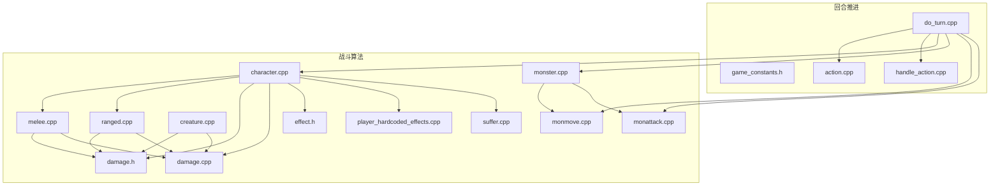
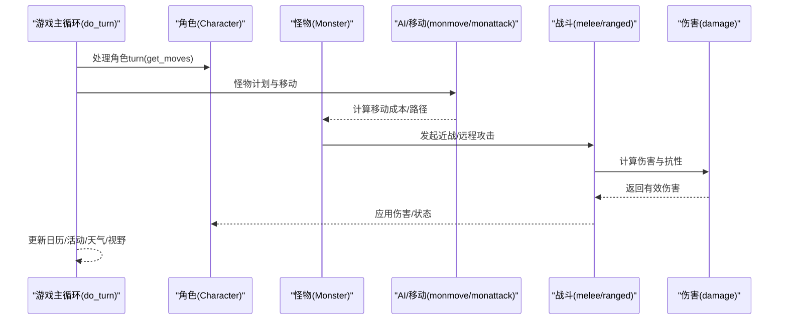
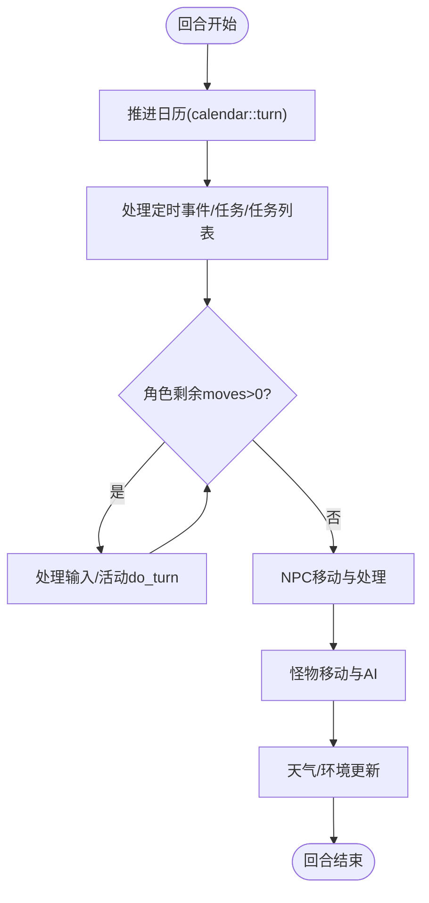
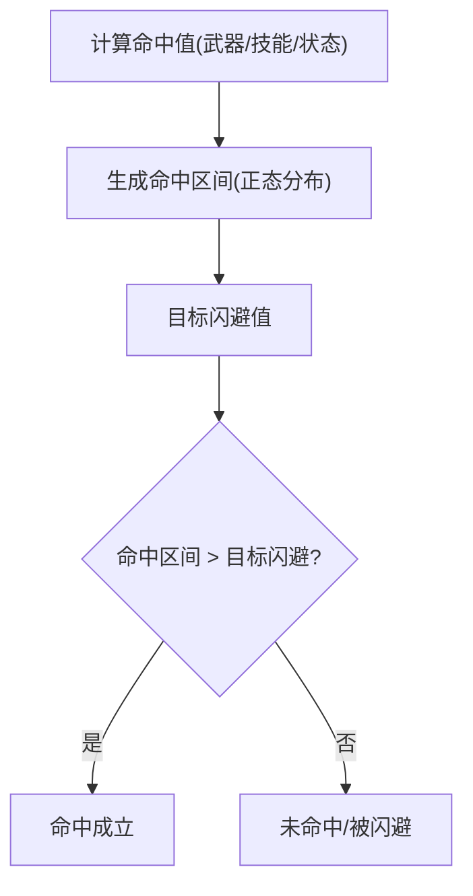
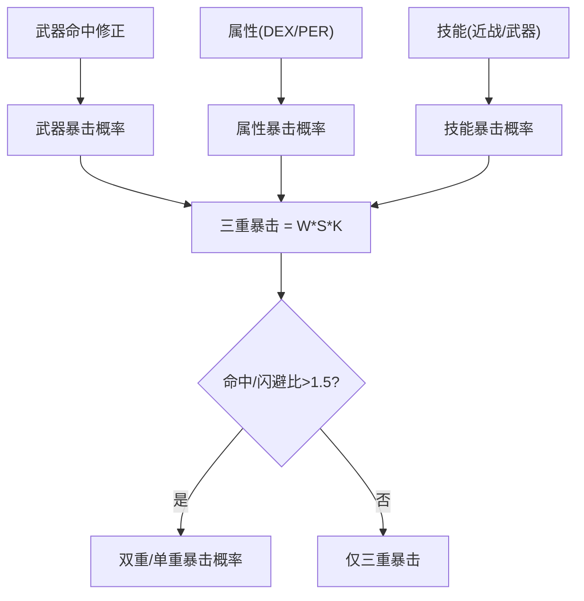
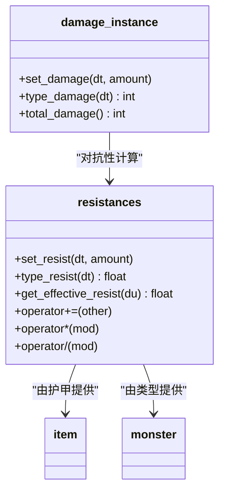
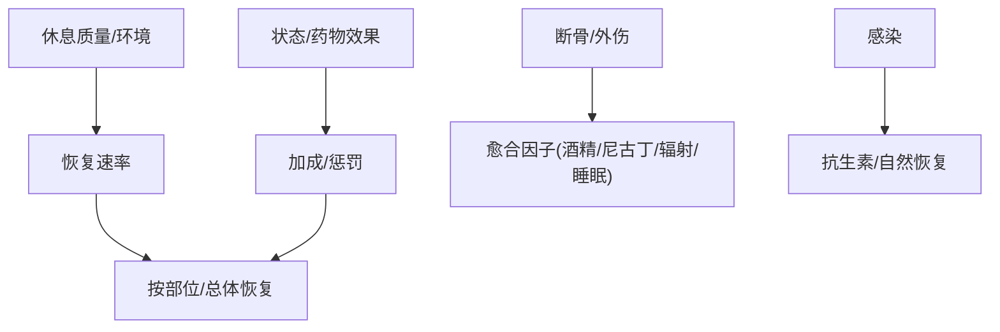
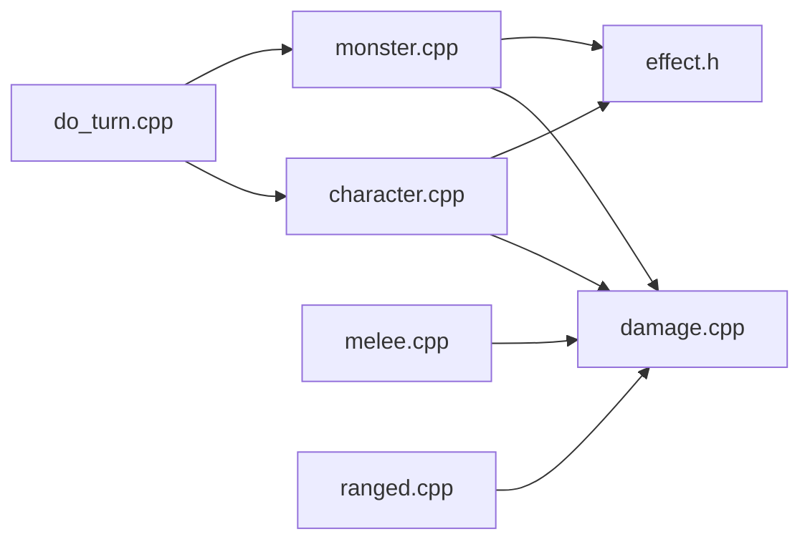

# 战斗机制

<cite>
**本文引用的文件**
- do_turn.cpp
- game_constants.h
- damage.h
- damage.cpp
- melee.cpp
- ranged.cpp
- character.cpp
- character.h
- creature.cpp
- effect.h
- player_hardcoded_effects.cpp
- monster.cpp
- monmove.cpp
- monattack.cpp
- suffer.cpp
- action.cpp
- handle_action.cpp
- game.cpp
- effects.json
</cite>

## 目录
1. [引言](#引言)
2. [项目结构](#项目结构)
3. [核心组件](#核心组件)
4. [架构总览](#架构总览)
5. [详细组件分析](#详细组件分析)
6. [依赖关系分析](#依赖关系分析)
7. [性能考量](#性能考量)
8. [故障排查指南](#故障排查指南)
9. [结论](#结论)
10. [附录：数值设计与平衡建议](#附录数值设计与平衡建议)

## 引言
本文件面向Cataclysm-DDA的回合制战斗系统，系统化梳理行动点数（Moves）推进、命中/闪避/暴击、伤害与抗性、治疗与状态、节奏控制与AI行为等机制，并给出可操作的数值设计指南、平衡性调整方法与性能优化策略。文档以代码为依据，辅以图示帮助理解。

## 项目结构
围绕战斗机制的关键源码分布于以下模块：
- 时间推进与回合循环：do_turn.cpp
- 常量与基础规则：game_constants.h
- 伤害与抗性模型：damage.h, damage.cpp
- 近战与命中/暴击：melee.cpp
- 远程与散布/精度：ranged.cpp
- 角色状态与恢复：character.cpp, effect.h, player_hardcoded_effects.cpp, suffer.cpp
- 怪物AI与移动：monster.cpp, monmove.cpp, monattack.cpp
- 输入与交互：action.cpp, handle_action.cpp
- 游戏主流程：game.cpp

图表来源
- do_turn.cpp
- game_constants.h
- damage.h
- damage.cpp
- melee.cpp
- ranged.cpp
- character.cpp
- effect.h
- player_hardcoded_effects.cpp
- monster.cpp
- monmove.cpp
- monattack.cpp
- suffer.cpp
- action.cpp
- handle_action.cpp
- game.cpp

章节来源
- do_turn.cpp
- game_constants.h

## 核心组件
- 行动点数与回合推进：每回合由do_turn驱动，推进日历、处理活动、怪物与NPC移动、角色处理等；角色与怪物的get_moves()决定其在回合内的行动次数。
- 命中判定与命中范围：近战使用正态分布的命中范围函数，结合命中值与闪避值比较；远程使用散布模型与精度修正。
- 伤害与抗性：damage_instance描述伤害类型集合，resistances提供对各类型的抗性与衍生抗性计算；护甲与装备提供基础抗性。
- 暴击系统：近战武器、属性与技能共同决定三重/双重/单重暴击概率，受命中vs闪避比影响。
- 闪避与格挡：Creature::dodge_check基于正态分布计算闪避概率；部分状态与地形影响闪避有效性。
- 治疗与状态：角色与怪物的自然恢复、药物/状态加成、断骨愈合、感染处理等。
- AI与节奏：怪物移动与攻击决策、玩家活动打断与节奏控制、输入动画节流。

章节来源
- do_turn.cpp
- melee.cpp
- damage.h
- damage.cpp
- character.cpp
- effect.h
- player_hardcoded_effects.cpp
- monster.cpp
- monmove.cpp
- action.cpp
- handle_action.cpp

## 架构总览
回合推进与战斗交互的高层流程如下：

图表来源
- do_turn.cpp
- melee.cpp
- ranged.cpp
- damage.cpp
- monster.cpp
- monmove.cpp

## 详细组件分析

### 行动点数与回合推进
- 日历推进：每回合calendar::turn递增，触发定时事件、NPC移动、天气更新等。
- 角色行动：当u.get_moves()>0时进入输入处理与活动执行；活动结束后继续消耗moves。
- 怪物与NPC：逐个process_turn，按moves执行移动、攻击或特殊行为；NPC有目的地限制与“无限循环”保护。
- 节奏控制：输入动画节流与选项控制（如ANIMATION_DELAY、BLINK_SPEED），避免UI过载。

图表来源
- do_turn.cpp
- handle_action.cpp

章节来源
- do_turn.cpp
- handle_action.cpp
- action.cpp

### 命中判定与命中范围
- 近战命中范围：melee::melee_hit_range使用正态分布生成命中区间，与目标闪避值比较决定是否命中。
- 闪避检查：Creature::dodge_check使用正态分布差值计算闪避概率，考虑“超常闪避”与强制尝试。
- 命中等级阈值：game_constants.h定义了不同命中精度等级对应的阈值，用于头击/要害/普通/擦伤等判定。

图表来源
- melee.cpp
- creature.cpp
- game_constants.h

章节来源
- melee.cpp
- creature.cpp
- game_constants.h

### 暴击系统
- 暴击概率来源：武器命中修正、属性（敏捷/感知）、技能（近战/武器）三者分别贡献概率，再相乘得到三重暴击概率。
- 双重/单重暴击：在命中显著优于闪避时，进一步计算双重或单重暴击概率，受命中vs闪避比例影响。
- 近战特例：徒手攻击与武器命中修正对暴击概率有额外影响；CQB义体可提升最低技能等级。

图表来源
- melee.cpp
- game_constants.h

章节来源
- melee.cpp
- game_constants.h

### 伤害与抗性模型
- damage_instance：记录多种伤害类型的总量与分项伤害，支持按类型查询与总计。
- 抗性系统：resistances提供对damage_type的抗性，支持抗性倍率、穿透、条件抗性；可从护甲、怪物类型、效果等来源叠加。
- 抗性计算：get_effective_resist综合类型抗性、穿透与倍率，确保非负且无抗性标志时返回0。
- 护甲与装备：护甲提供对各伤害类型的抗性；可按部位(sub/bodypart)或整体应用。

图表来源
- damage.h
- damage.cpp

章节来源
- damage.h
- damage.cpp

### 近战与远程战斗
- 近战：命中范围、暴击、移动消耗；命中后扣除相应moves；可触发命中特效。
- 远程：散布、精度、弹道、武器/弹药/熟练度影响命中；可触发命中特效与爆炸。

章节来源
- melee.cpp
- ranged.cpp

### 角色状态与恢复
- 自然恢复：Character::regen按休息质量与治疗速率恢复，支持按部位的额外加成。
- 药物与状态：effect系统提供持续加成/惩罚；特定效果（如睡眠、止痛）影响恢复。
- 断骨愈合：suffer::mend在有利条件下加速骨折愈合，酒精/尼古丁会减慢。
- 感染处理：特定效果可加速/延缓感染恢复，严重时导致死亡。

图表来源
- character.cpp
- effect.h
- player_hardcoded_effects.cpp
- suffer.cpp

章节来源
- character.cpp
- effect.h
- player_hardcoded_effects.cpp
- suffer.cpp

### 怪物AI与移动
- 移动成本：monmove::calc_movecost综合地形、家具、地面效果与字段，考虑攀爬/桥梁/陷阱等。
- 推挤与递归：monster在推挤时根据攻防差与方向/地形惩罚进行滚动，可能引发递归推挤。
- 攻击AI：怪物根据仇恨/距离/视野选择攻击或逃跑；部分AI具备协同/控制能力。

章节来源
- monmove.cpp
- monmove.cpp
- monattack.cpp

## 依赖关系分析
- do_turn依赖输入、活动、怪物/NPC管理、天气与日历；角色与怪物均依赖damage与effect系统。
- melee/ranged依赖damage与伤害类型；melee还依赖命中/闪避逻辑。
- effect系统贯穿角色与怪物，提供持续状态与修饰器。

图表来源
- do_turn.cpp
- character.cpp
- monster.cpp
- damage.cpp
- effect.h
- melee.cpp
- ranged.cpp

章节来源
- do_turn.cpp
- character.cpp
- monster.cpp
- damage.cpp
- effect.h
- melee.cpp
- ranged.cpp

## 性能考量
- 输入节流：handle_action通过时间戳限制动画与闪烁刷新频率，降低UI开销。
- 回合内循环：do_turn对NPC设置“无限循环”保护，避免卡死；怪物移动成本计算尽量避免重复计算。
- 地图缓存：do_turn末尾失效可见性缓存，减少后续渲染压力。
- 状态处理：effect系统按需加载与合并修饰器，避免冗余遍历。

章节来源
- handle_action.cpp
- do_turn.cpp
- do_turn.cpp

## 故障排查指南
- 命中/闪避异常：检查melee命中范围与Creature::dodge_check的正态分布参数；确认命中vs闪避比是否触发双重/单重暴击分支。
- 抗性无效：核对resistances::get_effective_resist是否正确应用穿透与倍率；确认damage_type是否标记为不可抗性。
- 恢复异常：检查rest_quality与healing_rate；确认effect对HEAL_RATE/HEAL_HEAD/HEAL_TORSO的修饰是否生效。
- 怪物卡位：monmove::calc_movecost是否正确过滤字段与家具；推挤递归是否导致栈溢出。
- 输入卡顿：确认ANIMATION_DELAY/BLINK_SPEED选项；检查handle_action的时间节流逻辑。

章节来源
- melee.cpp
- creature.cpp
- damage.cpp
- character.cpp
- monmove.cpp
- handle_action.cpp

## 结论
CDDA的战斗系统以回合制为基础，通过精确的命中/闪避/抗性/恢复与丰富的状态效果构建了深度的战术体验。核心在于：
- 明确的行动点数与回合推进机制；
- 基于正态分布的命中判定与抗性衰减；
- 可组合的伤害类型与抗性系统；
- 丰富的状态与恢复链路；
- 可扩展的AI与节奏控制。

## 附录：数值设计与平衡建议
- 命中/闪避平衡
  - 使用melee_hit_range的正态分布参数与命中vs闪避比控制暴击分支触发概率。
  - 通过命中等级阈值（headshot/critical/goodhit/standard/grazing）区分伤害倍率。
- 抗性设计
  - 为常见伤害类型设定基础抗性，允许护甲/装备/状态按类型或全类型提供加成。
  - 对特殊抗性（如“不可抗性”）明确边界，避免被穿透抵消。
- 暴击与伤害
  - 将武器命中修正、属性与技能的概率相乘，形成稳定的三重暴击基线；在命中优势明显时引入双重/单重分支。
  - 对高伤害武器/技能设置上限或代价（moves消耗），防止破坏回合节奏。
- 治疗与状态
  - 恢复速率与休息质量、部位加成、状态修饰器联动；对负面状态（如感染、断骨）设置明确的自然/药物恢复路径。
- AI与节奏
  - 通过移动成本与推挤递归限制怪物拥挤；合理设置怪物AI的攻击/逃跑阈值，避免“围堵”现象。
- 配置参数
  - ANIMATION_DELAY、BLINK_SPEED等影响UI刷新频率；MAX_AIM_COST、MAX_RECOIL等影响射击体验。
  - 可参考effects.json中的效果修饰器（如speed_mod、stamina_min、str_mod、dex_mod）进行平衡微调。

章节来源
- game_constants.h
- melee.cpp
- damage.cpp
- character.cpp
- effects.json