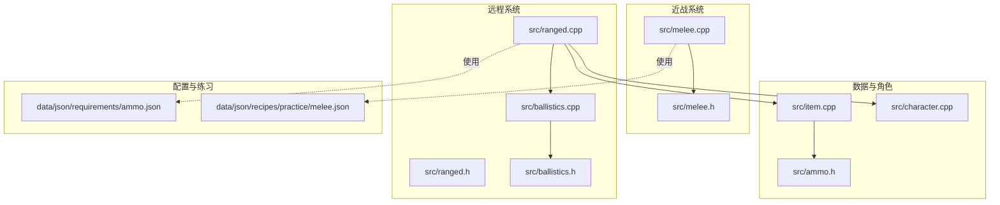
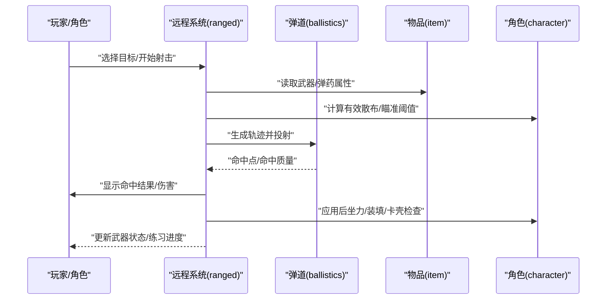
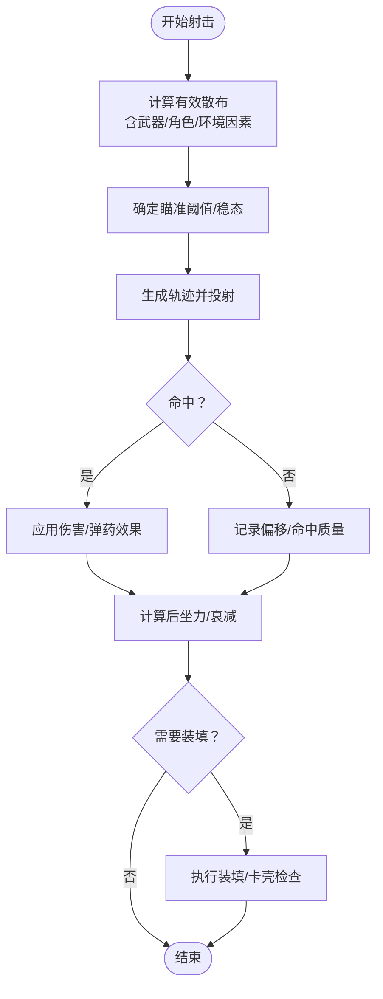
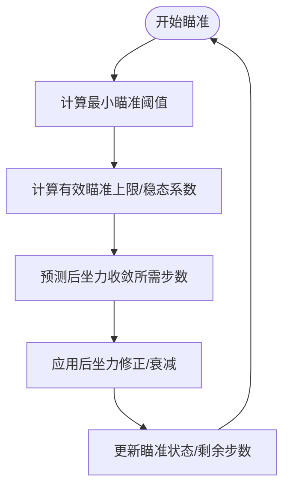
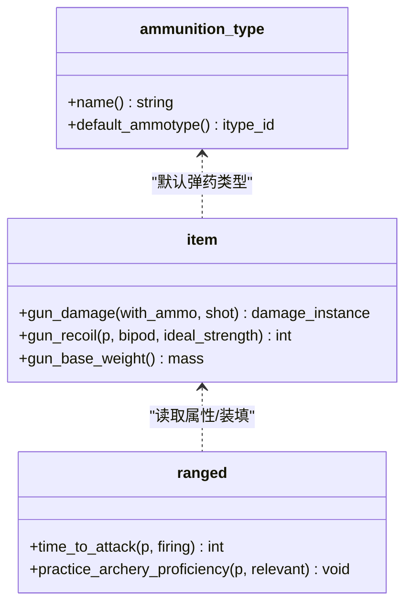
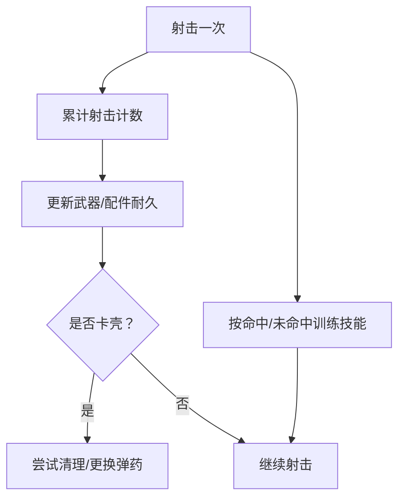
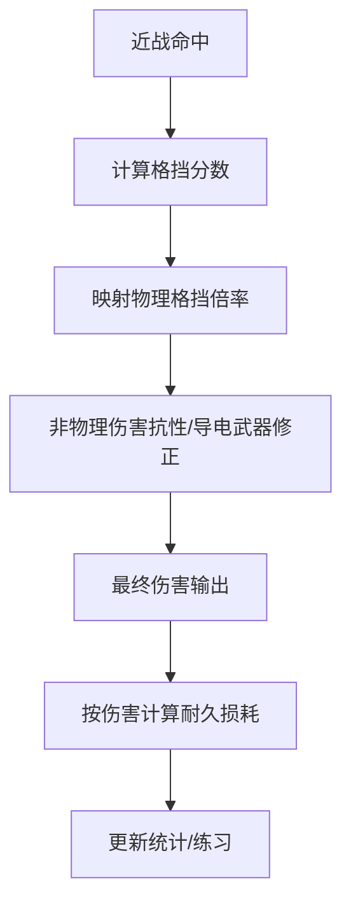
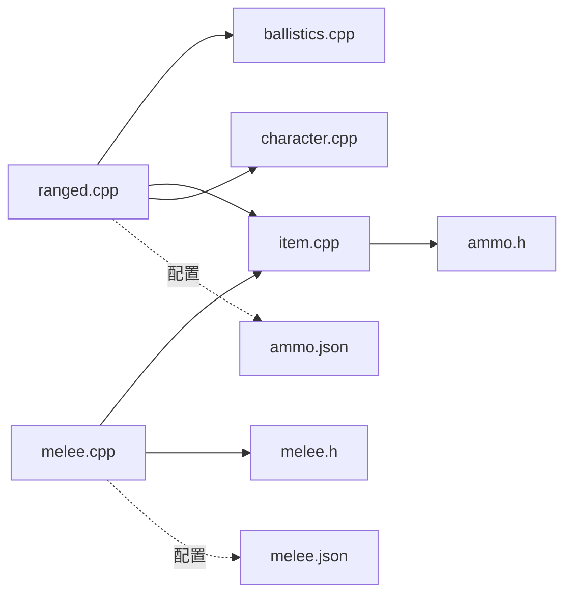

# 武器与弹药系统

<cite>
**本文引用的文件**
- src/ranged.cpp
- src/ranged.h
- src/ballistics.cpp
- src/ballistics.h
- src/melee.cpp
- src/melee.h
- src/item.cpp
- src/character.cpp
- src/ammo.h
- data/json/requirements/ammo.json
- data/json/recipes/practice/melee.json
</cite>

## 目录
1. [引言](#引言)
2. [项目结构](#项目结构)
3. [核心组件](#核心组件)
4. [架构总览](#架构总览)
5. [详细组件分析](#详细组件分析)
6. [依赖关系分析](#依赖关系分析)
7. [性能考量](#性能考量)
8. [故障排查指南](#故障排查指南)
9. [结论](#结论)
10. [附录](#附录)

## 引言
本文件面向Cataclysm-DDA的武器与弹药系统，系统化梳理远程武器的射击机制（弹道轨迹、瞄准、后坐力）、弹药类型与装填、武器状态管理；同时覆盖近战武器的伤害与格挡、耐久度系统，并补充武器技能与射击练习机制、武器平衡参数及扩展开发指南与性能优化建议。内容以源码为依据，配合图示帮助不同背景读者理解。

## 项目结构
武器与弹药相关逻辑主要分布在以下模块：
- 远程射击与瞄准：ranged.cpp/h
- 弹道与命中判定：ballistics.cpp/h
- 近战伤害与格挡：melee.cpp/h
- 武器与弹药数据访问：item.cpp
- 角色与后坐力/瞄准能力：character.cpp
- 弹药类型定义：ammo.h
- 弹药配方与练习配方：data/json/requirements/ammo.json、data/json/recipes/practice/melee.json

图表来源
- src/ranged.cpp
- src/ranged.h
- src/ballistics.cpp
- src/ballistics.h
- src/melee.cpp
- src/melee.h
- src/item.cpp
- src/character.cpp
- src/ammo.h
- data/json/requirements/ammo.json
- data/json/recipes/practice/melee.json

章节来源
- src/ranged.cpp
- src/ballistics.cpp
- src/melee.cpp
- src/item.cpp

## 核心组件
- 远程射击与瞄准：负责目标选择、轨迹生成、命中判定、后坐力与瞄准阈值、装填与练习、武器状态（如卡壳）等。
- 弹道与命中：根据射程、散布、目标大小与可见性，计算实际命中点与命中质量。
- 近战伤害与格挡：计算物理格挡率、护甲耐久度损耗、伤害类型抗性与韧性修正。
- 数据访问与平衡：通过item接口获取武器/弹药属性，结合角色技能与状态进行平衡计算。
- 配置与练习：JSON配方定义弹药制作与近战练习路径线时长、难度与自动学习条件。

章节来源
- src/ranged.h
- src/ballistics.h
- src/melee.h
- src/ammo.h

## 架构总览
远程射击流程从“目标选择”到“弹道计算”，再到“命中与伤害”，最后反馈到“后坐力与装填”。近战则从“命中判定”到“格挡与耐久”，再到“统计与练习”。

图表来源
- src/ranged.cpp
- src/ballistics.cpp
- src/item.cpp
- src/character.cpp

## 详细组件分析

### 远程射击机制与弹道轨迹
- 命中判定与散布
  - 散布由武器/角色/环境共同决定，包含“有效散布”“瞄准阈值”“水下/载具影响”等。
  - 使用抛物线/等腰三角形模型估算“偏离目标的格数”，并据此映射命中质量。
- 轨迹生成与投射
  - 投射体按射程与散布生成轨迹点，处理楼层变化、点到点修正、近身缩放等。
  - 支持“可回收弹药”掉落、自定义爆炸等效果。
- 后坐力与瞄准
  - 后坐力受武器重量、握把/支架、弹药、角色臂力与技能影响，随时间衰减。
  - 瞄准时根据“最小瞄准阈值”“有效瞄准上限”“稳态系数”动态评估所需移动。
- 装填与卡壳
  - 通过弹匣/枪管损伤等级计算卡壳概率；水下未防水武器可能误射。
  - 射击次数与练习量与技能训练挂钩。

图表来源
- src/ranged.cpp
- src/ranged.cpp
- src/ballistics.cpp
- src/character.cpp

章节来源
- src/ranged.cpp
- src/ranged.cpp
- src/ranged.cpp
- src/ballistics.cpp
- src/ballistics.cpp
- src/character.cpp

### 瞄准系统与后坐力控制
- 瞄准阈值与稳态
  - 最小瞄准阈值与有效瞄准上限共同决定“稳态”范围；稳态系数与瞄准速度修正共同影响收敛速度。
- 后坐力建模
  - 后坐力受武器重量、弹药、握把/支架、角色臂力影响；高重武器与良好握持降低后坐力。
  - 后坐力随时间按对数曲线衰减，与瞄准阈值形成动态平衡。
- 水下/载具影响
  - 水下或与枪械特性相反的水下状态会显著增加散布并降低射程有效性。

图表来源
- src/character.cpp
- src/ranged.cpp
- src/ranged.cpp

章节来源
- src/character.cpp
- src/ranged.cpp
- src/ranged.cpp

### 弹药类型与装填机制
- 弹药类型
  - 通过ammunition_type定义弹药族默认弹药类型，支持多口径/弹头类型切换。
- 装填与装填时间
  - 装填耗时与武器射速、夹弹数量、手部负担相关；短弹容量武器在单发补弹时有额外惩罚。
- 可恢复弹药
  - 部分弹药命中后可回收，受命中效果与爆炸/点燃等状态影响。

图表来源
- src/ammo.h
- src/item.cpp
- src/ranged.cpp

章节来源
- src/ammo.h
- src/item.cpp
- src/ranged.cpp

### 武器状态管理（卡壳、耐久、练习）
- 卡壳概率
  - 枪械与弹匣的损伤等级映射为卡壳概率；水下未防水武器可能误射。
- 耐久与损坏
  - 发射次数累计于武器与配件变量；部分弹药命中后可回收。
- 练习与技能
  - 命中/未命中均训练基础枪械技能；发射次数训练武器专项技能；练习配方提供时间、难度与自动学习条件。

图表来源
- src/ranged.cpp
- src/ranged.cpp
- src/ranged.cpp

章节来源
- src/ranged.cpp
- src/ranged.cpp
- src/ranged.cpp

### 近战武器伤害与格挡
- 格挡机制
  - 根据部位、盾牌覆盖、角色力量与技能，计算“格挡分数”，映射为对物理伤害的阻隔倍率。
  - 对非物理伤害（如电/火）存在抗性差异，导电武器对电伤有特殊效果。
- 耐久度系统
  - 通过材料与部件芯片抗性、穿戴部位体积等因子综合计算耐久损耗。
- 统计与练习
  - 提供近战统计结构用于测试；练习配方定义不同武器类型的训练路径与时长。

图表来源
- src/melee.cpp
- src/melee.cpp
- src/melee.h
- data/json/recipes/practice/melee.json

章节来源
- src/melee.cpp
- src/melee.cpp
- src/melee.h
- data/json/recipes/practice/melee.json

### 武器技能与射击练习机制
- 技能训练
  - 基础枪械技能按命中次数训练；专项技能（如步枪/手枪/弓箭）按发射次数训练。
- 练习配方
  - 通过JSON配方定义练习类别、所需工具/质量、时间、难度与自动学习门槛。
- 弹药制作
  - 弹药配方定义所需组件与数量，支持多种口径与弹头类型。

章节来源
- src/ranged.cpp
- data/json/recipes/practice/melee.json
- data/json/requirements/ammo.json

## 依赖关系分析
- 远程系统依赖弹道模块进行轨迹与命中判定；依赖物品模块读取武器/弹药属性；依赖角色模块计算散布、瞄准阈值与后坐力。
- 近战系统依赖角色与装备耐久度计算，依赖统计结构进行测试与分析。
- 配置层通过JSON文件提供弹药制作与练习路径，驱动数值平衡与玩法引导。

图表来源
- src/ranged.cpp
- src/ballistics.cpp
- src/melee.cpp
- src/item.cpp
- src/character.cpp
- src/ammo.h
- data/json/requirements/ammo.json
- data/json/recipes/practice/melee.json

章节来源
- src/ranged.cpp
- src/ballistics.cpp
- src/melee.cpp
- src/item.cpp
- src/character.cpp
- src/ammo.h
- data/json/requirements/ammo.json
- data/json/recipes/practice/melee.json

## 性能考量
- 弹道轨迹计算
  - 轨迹长度与射程相关，采用跳点策略减少渲染与碰撞开销；近身距离跳过散布计算。
- 散布与命中判定
  - 使用弧分与等腰三角形模型快速估算偏离；命中质量映射采用对数曲线，兼顾性能与可玩性。
- 后坐力与瞄准
  - 后坐力衰减按对数曲线，避免高频浮点运算；稳态系数与瞄准阈值组合减少无效迭代。
- 装填与卡壳
  - 卡壳概率查表映射，避免复杂分支判断；水下误射仅作外观与命中修正，不引入额外计算。

章节来源
- src/ballistics.cpp
- src/ranged.cpp
- src/character.cpp

## 故障排查指南
- 射击无命中
  - 检查散布是否过大（武器/角色/水下/载具）；确认目标可见性与尺寸；核对轨迹点是否被地形/楼层阻挡。
- 后坐力异常
  - 核查武器重量、握把/支架、弹药与角色臂力；确认瞄准阈值与稳态系数设置。
- 卡壳频繁
  - 检查枪械/弹匣损伤等级；确认是否处于水下且未防水；评估装填速度与弹药类型。
- 近战格挡失效
  - 检查部位覆盖与盾牌材料；确认角色力量与技能等级；核对伤害类型是否受抗性影响。

章节来源
- src/ranged.cpp
- src/melee.cpp
- src/ballistics.cpp

## 结论
CDDA的武器与弹药系统通过“远程射击—弹道—命中—后坐力—装填—练习”的闭环实现高可玩性与平衡性。近战系统以“格挡—抗性—耐久—统计—练习”构成完整链路。JSON配置与数值参数为扩展与调优提供了清晰入口。建议在扩展新武器/弹药时，优先完善JSON配置与练习配方，再在必要处微调核心算法参数。

## 附录
- 关键实现路径参考
  - 弹道命中与轨迹：src/ballistics.cpp, src/ballistics.cpp
  - 远程瞄准与后坐力：src/ranged.cpp, src/ranged.cpp, src/character.cpp
  - 装填与卡壳：src/ranged.cpp, src/ranged.cpp
  - 近战格挡与耐久：src/melee.cpp, src/melee.cpp
  - 弹药类型与装填接口：src/ammo.h, src/item.cpp
  - 练习与弹药配方：data/json/recipes/practice/melee.json, data/json/requirements/ammo.json