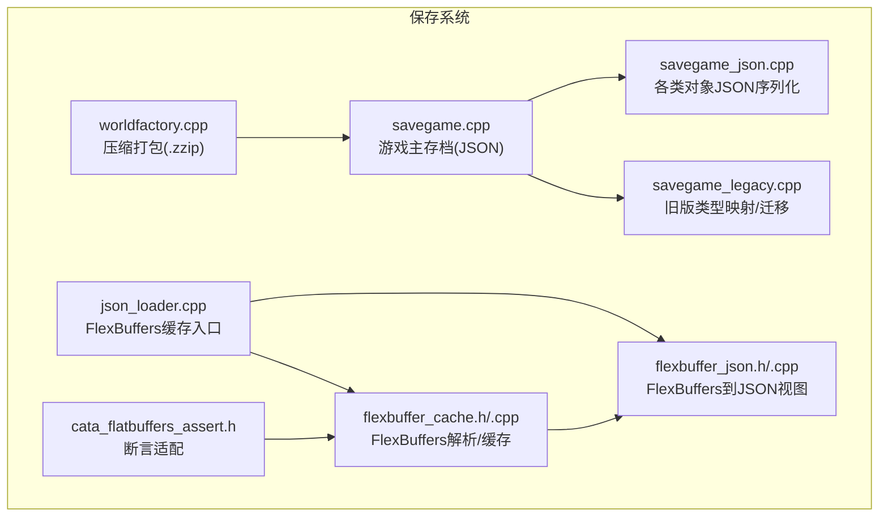
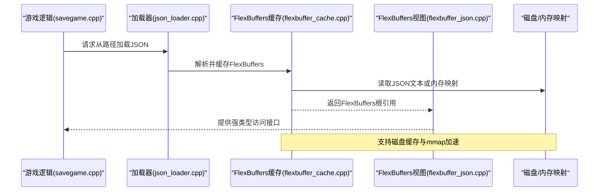
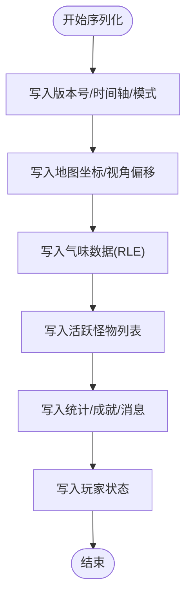
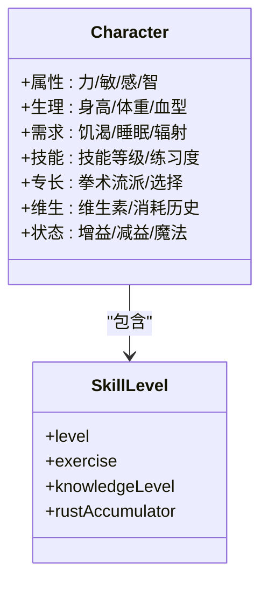
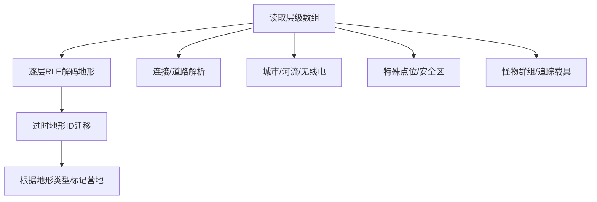
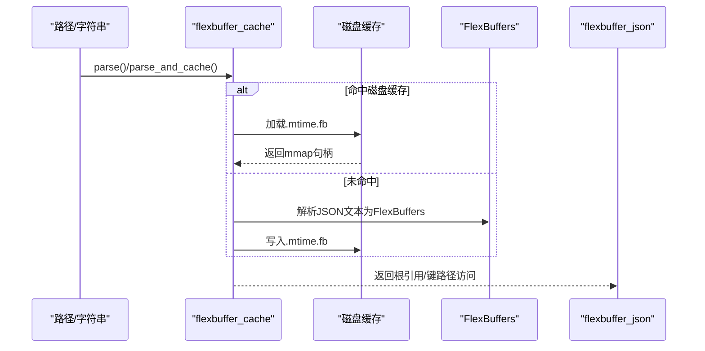
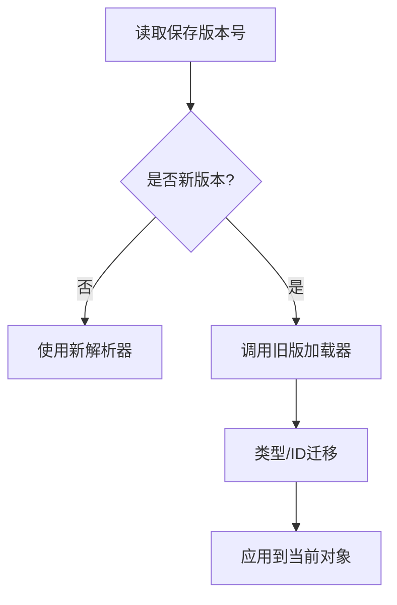
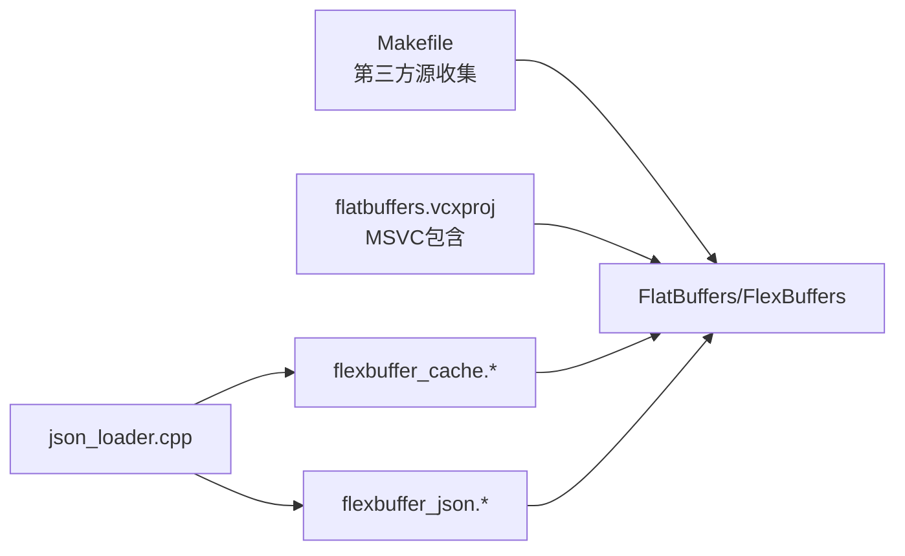

# 保存系统

<cite>
**本文引用的文件**
- savegame.cpp
- savegame_json.cpp
- savegame_legacy.cpp
- flexbuffer_cache.h
- flexbuffer_cache.cpp
- json_loader.cpp
- flexbuffer_json.h
- flexbuffer_json.cpp
- cata_flatbuffers_assert.h
- worldfactory.cpp
- Makefile
- flatbuffers.vcxproj
</cite>

## 目录
1. [引言](#引言)
2. [项目结构](#项目结构)
3. [核心组件](#核心组件)
4. [架构总览](#架构总览)
5. [详细组件分析](#详细组件分析)
6. [依赖关系分析](#依赖关系分析)
7. [性能考量](#性能考量)
8. [故障排查指南](#故障排查指南)
9. [结论](#结论)
10. [附录](#附录)

## 引言
本文件面向Cataclysm-DDA的保存系统，系统性阐述其基于FlatBuffers/FlexBuffers的序列化与反序列化实现，覆盖以下关键主题：
- 数据结构定义与序列化/反序列化流程
- 存档文件组织结构、压缩与存储优化
- 版本兼容性与数据迁移机制
- 错误恢复、数据完整性校验与异常处理策略
- 典型保存/加载场景（游戏状态、地图数据、角色信息）的实现路径
- 性能优化与存储空间管理最佳实践

## 项目结构
保存系统由“传统JSON保存”与“FlexBuffers缓存解析”两套并行机制构成：
- 传统JSON保存：用于玩家进度、世界状态等，采用标准JSON序列化/反序列化。
- FlexBuffers缓存解析：将JSON文本转换为FlexBuffers二进制，以提升读取性能与内存占用，并支持磁盘缓存。

**图表来源**
- savegame.cpp
- savegame_json.cpp
- savegame_legacy.cpp
- json_loader.cpp
- flexbuffer_cache.h
- flexbuffer_cache.cpp
- flexbuffer_json.h
- flexbuffer_json.cpp
- cata_flatbuffers_assert.h
- worldfactory.cpp

**章节来源**
- savegame.cpp
- json_loader.cpp

## 核心组件
- 游戏主存档（JSON）
  - 版本号与时间轴、视角偏移、统计追踪器、成就追踪器、消息系统、全局变量等。
  - 参考路径：游戏序列化头，反序列化实现。
- 角色与NPC持久化
  - 玩家属性、技能、内脏、活动历史、增益/减益、魔法、体液等。
  - 参考路径：角色序列化片段。
- 地图与超图（JSON）
  - 层级地形RLE编码、城市/河流/连接/营地/特殊点位等。
  - 参考路径：超图反序列化。
- FlexBuffers缓存与解析
  - 将JSON文本解析为FlexBuffers二进制，支持磁盘缓存与内存映射。
  - 参考路径：缓存接口，解析与缓存。
- JSON加载器与FlexBuffers桥接
  - 提供从路径/字符串解析为FlexBuffers视图的能力。
  - 参考路径：加载器入口，字符串解析。
- 断言适配
  - 将FlatBuffers/FlexBuffers断言替换为项目自定义断言。
  - 参考路径：断言适配。

**章节来源**
- savegame.cpp
- savegame_json.cpp
- savegame.cpp
- flexbuffer_cache.h
- flexbuffer_cache.cpp
- json_loader.cpp
- cata_flatbuffers_assert.h

## 架构总览
保存系统在运行时通过“JSON文本 → FlexBuffers二进制 → 内存视图”的链路加速读取；同时保留传统JSON写入路径以兼容旧版与跨平台需求。世界工厂负责将地图记忆与超图等资源打包为.zzip归档，减少碎片与IO开销。

**图表来源**
- json_loader.cpp
- flexbuffer_cache.cpp
- flexbuffer_json.cpp

**章节来源**
- json_loader.cpp
- flexbuffer_cache.cpp
- flexbuffer_json.cpp

## 详细组件分析

### 组件A：游戏主存档（JSON）
- 版本号与头部信息
  - 保存版本号、时间戳、初始季节、自动旅行模式、安全模式等。
  - 参考路径：头部序列化。
- 地图坐标与视角
  - 当前子图坐标、超图坐标、视角偏移。
  - 参考路径：坐标与视角。
- 气味与怪物追踪
  - RLE编码的气味数据、活跃怪物列表。
  - 参考路径：气味序列化，怪物追踪。
- 全局状态与消息
  - 统计追踪器、成就追踪器、消息系统、全局变量。
  - 参考路径：状态与消息。

**图表来源**
- savegame.cpp

**章节来源**
- savegame.cpp

### 组件B：角色与NPC持久化（JSON）
- 角色基础属性
  - 力量/敏捷/感知/智力、身高体重、血型、每日睡眠/连续睡眠等。
  - 参考路径：角色加载。
- 技能与专长
  - 技能等级、练习度、知识等级、拳术流派与选择。
  - 参考路径：技能序列化，拳术数据。
- 维生素与消耗历史
  - 每日维生素摄入、消费事件历史。
  - 参考路径：维生素与消耗。
- 遗传与变异
  - 变异数据、变种信息、是否带电/供电等。
  - 参考路径：变异序列化。

**图表来源**
- savegame_json.cpp
- savegame_json.cpp

**章节来源**
- savegame_json.cpp
- savegame_json.cpp

### 组件C：超图与地图持久化（JSON）
- 层级地形与RLE
  - 地形层按Z/Y/X扫描，使用RLE压缩存储，支持过时地形ID迁移与营地放置。
  - 参考路径：层级解析。
- 连接与道路
  - 连接外域的连接类型、本地道路迁移至连接体系。
  - 参考路径：连接与道路。
- 城市/河流/无线电塔/载具追踪
  - 城市结构、河流节点、无线电塔、追踪载具等。
  - 参考路径：城市/河流/无线电，载具追踪。
- 怪物群组与特殊点位
  - 怪物群组位置与目标、营地/安全区标记、特殊点位放置。
  - 参考路径：怪物群组，特殊点位。

**图表来源**
- savegame.cpp

**章节来源**
- savegame.cpp

### 组件D：FlexBuffers缓存与解析
- 缓存接口
  - 支持从路径解析、从缓冲区解析、带偏移解析；可选磁盘缓存。
  - 参考路径：缓存类接口。
- 解析与磁盘缓存
  - 优先尝试mmap读取与磁盘缓存命中；否则解析JSON文本并落盘缓存。
  - 参考路径：解析与缓存，磁盘缓存保存。
- FlexBuffers到JSON视图
  - 提供键路径访问、成员遍历、错误定位与未访问字段报告。
  - 参考路径：类型映射，错误定位。

**图表来源**
- flexbuffer_cache.cpp
- flexbuffer_json.cpp

**章节来源**
- flexbuffer_cache.h
- flexbuffer_cache.cpp
- flexbuffer_json.cpp

### 组件E：版本兼容性与数据迁移
- 版本号与加载版本
  - 主存档版本号与加载版本号分离，便于跨版本兼容。
  - 参考路径：版本常量。
- 旧版类型映射
  - 活动类型、对话主题等枚举值迁移。
  - 参考路径：活动类型映射，对话主题映射。
- 地形/预decessors修复
  - 对线性道路的过度叠加进行去重与回退。
  - 参考路径：预decessors修复。

**图表来源**
- savegame.cpp
- savegame_legacy.cpp

**章节来源**
- savegame.cpp
- savegame_legacy.cpp

### 组件F：错误恢复与数据完整性
- 断言适配
  - 将FlatBuffers/FlexBuffers断言替换为项目断言，确保可捕获与统一处理。
  - 参考路径：断言适配。
- JSON解析错误定位
  - 通过键路径与原始流定位错误，提供友好报错。
  - 参考路径：错误抛出。
- 磁盘缓存一致性
  - 基于mtime校验缓存有效性，过期则删除并重新生成。
  - 参考路径：缓存一致性检查。

**章节来源**
- cata_flatbuffers_assert.h
- flexbuffer_json.cpp
- flexbuffer_cache.cpp

## 依赖关系分析
- 外部依赖
  - FlatBuffers/FlexBuffers头文件与IDL解析器。
  - 参考路径：第三方源收集，MSVC工程包含。
- 内部耦合
  - json_loader依赖flexbuffer_cache与flexbuffer_json，后者提供FlexBuffers到JSON视图的桥接。
  - 参考路径：加载器依赖，视图接口。

**图表来源**
- Makefile
- flatbuffers.vcxproj
- json_loader.cpp
- flexbuffer_cache.cpp
- flexbuffer_json.h

**章节来源**
- Makefile
- flatbuffers.vcxproj
- json_loader.cpp

## 性能考量
- FlexBuffers解析与缓存
  - 通过磁盘缓存与mmap减少重复解析与IO开销；对热路径（地图/超图）显著提速。
  - 参考路径：磁盘缓存保存，mmap加载。
- JSON到FlexBuffers转换
  - 将频繁读取的JSON文本转换为二进制结构，降低解析成本。
  - 参考路径：解析入口。
- 压缩归档
  - 世界工厂将地图记忆与超图打包为.zzip，减少文件碎片与目录层级。
  - 参考路径：压缩流程。

[本节为通用性能建议，不直接分析具体文件]

## 故障排查指南
- JSON解析失败
  - 使用键路径定位错误位置，结合原始流输出定位问题字段。
  - 参考路径：错误抛出。
- FlexBuffers缓存失效
  - 检查mtime一致性，必要时清理缓存文件后重建。
  - 参考路径：缓存一致性检查。
- 版本不匹配
  - 确认savegame_loading_version与存档头部一致，必要时启用旧版加载器。
  - 参考路径：版本读取，旧版映射。

**章节来源**
- flexbuffer_json.cpp
- flexbuffer_cache.cpp
- savegame.cpp
- savegame_legacy.cpp

## 结论
Cataclysm-DDA的保存系统通过“JSON持久化 + FlexBuffers加速”的双轨设计，在保证跨版本兼容与可移植性的前提下，显著提升了读取性能与内存效率。配合磁盘缓存与.zzip压缩，系统在大规模地图与复杂角色数据场景下仍能保持稳定与高效。

[本节为总结性内容，不直接分析具体文件]

## 附录
- 术语
  - JSON：人类可读的文本格式，适合调试与跨平台。
  - FlexBuffers：轻量级二进制序列化，适合高性能读取。
  - mtime：文件最后修改时间，用于缓存一致性校验。
  - .zzip：压缩归档格式，用于打包地图与记忆文件。
- 实现路径速查
  - 游戏主存档序列化：savegame.cpp
  - 角色序列化：savegame_json.cpp
  - 超图反序列化：savegame.cpp
  - FlexBuffers解析与缓存：flexbuffer_cache.cpp
  - JSON加载器入口：json_loader.cpp
  - 断言适配：cata_flatbuffers_assert.h
  - 压缩打包：worldfactory.cpp