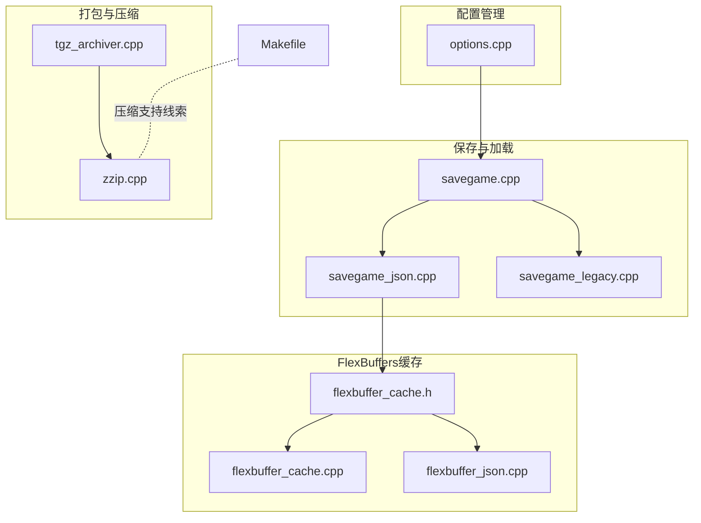
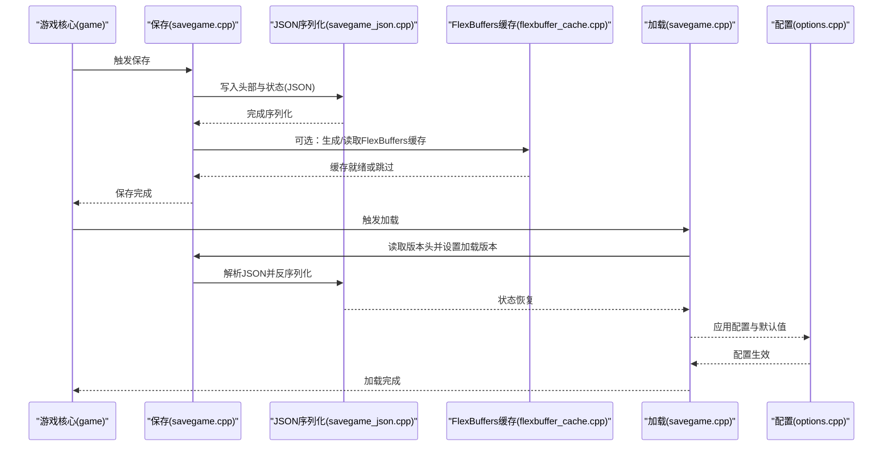
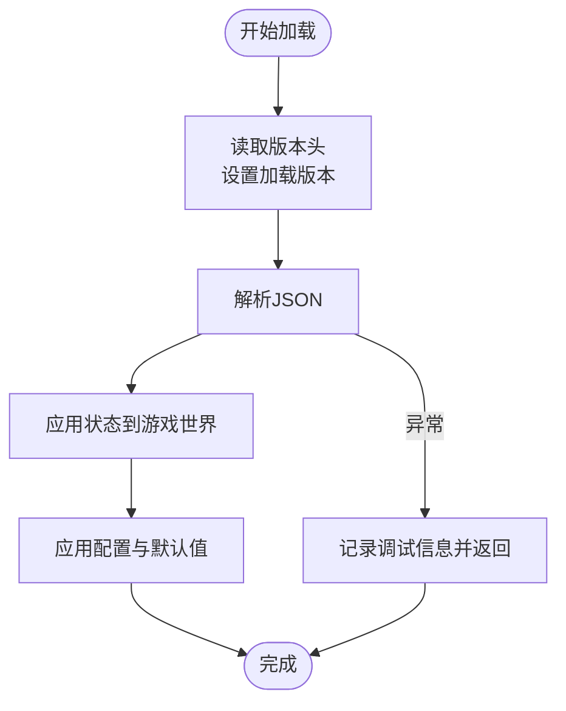
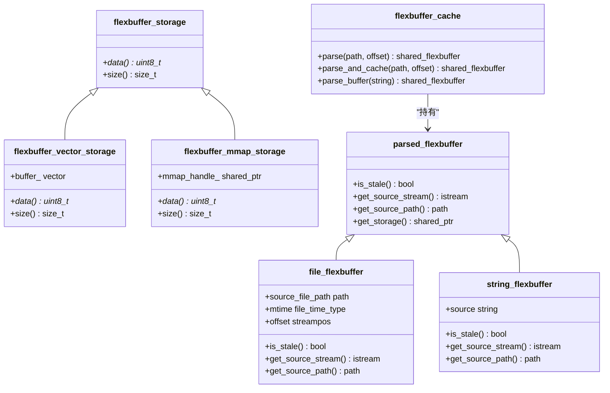
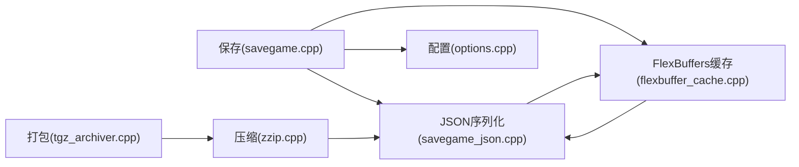

# 数据持久化

<cite>
**本文引用的文件**
- savegame.cpp
- savegame_json.cpp
- savegame_legacy.cpp
- flexbuffer_cache.h
- flexbuffer_cache.cpp
- flexbuffer_json.cpp
- options.cpp
- tgz_archiver.cpp
- zzip.cpp
- Makefile
</cite>

## 目录
1. [引言](#引言)
2. [项目结构](#项目结构)
3. [核心组件](#核心组件)
4. [架构总览](#架构总览)
5. [详细组件分析](#详细组件分析)
6. [依赖关系分析](#依赖关系分析)
7. [性能考量](#性能考量)
8. [故障排查指南](#故障排查指南)
9. [结论](#结论)
10. [附录](#附录)

## 引言
本文件面向Cataclysm-DDA的数据持久化体系，系统性梳理其保存与加载机制、版本兼容与迁移策略、错误恢复与数据完整性保障，并结合当前实现（JSON为主、辅以FlexBuffers缓存与Zstandard压缩）给出性能优化与存储管理建议。文档同时覆盖配置管理的架构与默认值处理，以及打包归档的结构与校验。

## 项目结构
围绕数据持久化的相关模块主要分布在以下路径：
- 保存/加载：src/savegame.cpp、src/savegame_json.cpp、src/savegame_legacy.cpp
- 持久化格式缓存与FlexBuffers：src/flexbuffer_cache.*、src/flexbuffer_json.cpp
- 配置管理：src/options.cpp
- 打包归档：src/tgz_archiver.cpp、src/zzip.cpp
- 压缩支持线索：Makefile 中提及“未来可能用于保存游戏压缩”的注释与zstd第三方源码

图示来源
- savegame.cpp
- savegame_json.cpp
- savegame_legacy.cpp
- flexbuffer_cache.h
- flexbuffer_cache.cpp
- flexbuffer_json.cpp
- options.cpp
- tgz_archiver.cpp
- zzip.cpp
- Makefile

章节来源
- savegame.cpp
- savegame_json.cpp
- flexbuffer_cache.h
- flexbuffer_cache.cpp
- flexbuffer_json.cpp
- options.cpp
- tgz_archiver.cpp
- zzip.cpp
- Makefile

## 核心组件
- 保存版本号与兼容控制
  - 全局保存版本号常量与加载时版本号变量，用于跨版本兼容与降级处理。
  - 版本号在保存头中写入，并在加载时读取，驱动后续迁移逻辑。
- JSON保存/加载管线
  - 游戏主状态、地图、NPC、怪物、消息等通过JSON序列化/反序列化。
  - 提供从流、字符串、路径等多种加载入口，并带基础错误捕获。
- FlexBuffers缓存与转换
  - 将JSON解析为FlexBuffers二进制，提供快速随机访问与错误定位能力。
  - 支持磁盘缓存、内存映射、字符串缓冲等存储形态，具备过期检测。
- 配置管理系统
  - 统一的选项注册、页面分组、默认值与范围约束、运行时修改与持久化。
- 打包与压缩
  - TGZ归档封装；ZZIP容器内嵌Zstandard压缩与校验帧，支持元数据索引与按需解压。

章节来源
- savegame.cpp
- savegame.cpp
- savegame_json.cpp
- flexbuffer_cache.h
- flexbuffer_cache.cpp
- flexbuffer_json.cpp
- options.cpp
- tgz_archiver.cpp
- zzip.cpp

## 架构总览
下图展示从保存到加载的关键路径，以及FlexBuffers与Zstandard的辅助角色：

图示来源
- savegame.cpp
- savegame.cpp
- savegame_json.cpp
- flexbuffer_cache.cpp
- options.cpp

## 详细组件分析

### 保存/加载子系统（JSON）
- 版本头与加载版本
  - 保存时写入版本号；加载时读取并设置全局加载版本，驱动后续迁移分支。
  - 支持从路径偏移加载，便于混合头部与正文的文件布局。
- 主要对象序列化
  - 头部时间线、视图偏移、玩家状态、怪物列表、消息、成就与统计等。
  - 场景中包含针对旧字段的兼容处理与临时占位。
- 错误处理
  - 捕获JSON解析异常并记录调试信息，避免崩溃导致数据丢失。

图示来源
- savegame.cpp
- savegame.cpp
- options.cpp

章节来源
- savegame.cpp
- savegame.cpp
- savegame.cpp
- savegame.cpp

### FlexBuffers缓存与JSON桥接
- 缓存策略
  - 将JSON解析为FlexBuffers二进制，支持磁盘缓存、内存映射与字符串缓冲。
  - 通过源文件mtime与缓存文件名关联，自动判定是否过期。
- 错误定位
  - 在FlexBuffers基础上回溯原始JSON位置，提供精确的行列与路径定位。
- 存储抽象
  - 统一的flexbuffer_storage接口，适配不同来源与生命周期。

图示来源
- flexbuffer_cache.h
- flexbuffer_cache.cpp
- flexbuffer_json.cpp

章节来源
- flexbuffer_cache.h
- flexbuffer_cache.cpp
- flexbuffer_json.cpp

### 配置管理与默认值
- 单例管理器
  - 通过单例options_manager集中注册与维护所有选项，支持页面分组与动态枚举。
- 默认值与范围
  - 为每项选项设定默认值、最小/最大值与步长，运行时修改后可持久化。
- JSON集成
  - 支持在JSON加载后进行二次校验与值注入，保证外部资源枚举的一致性。

章节来源
- options.cpp
- options.cpp
- options.cpp

### 打包与压缩（TGZ/ZZIP）
- TGZ归档
  - 生成符合USTAR规范的tar头，支持目录与文件归档，使用gzip压缩。
- ZZIP容器
  - 容器内嵌Zstandard压缩与可寻址校验帧，提供条目元数据索引与安全边界。
  - 支持字典上下文缓存以提升压缩/解压性能。

章节来源
- tgz_archiver.cpp
- zzip.cpp
- zzip.cpp

## 依赖关系分析
- 保存/加载对JSON序列化强依赖，且通过版本号实现向后兼容。
- FlexBuffers作为可选加速层，服务于需要快速随机访问与错误精确定位的场景。
- 配置管理贯穿保存/加载流程，确保用户设置与默认值正确应用。
- 打包归档与压缩为外部工具链与资源组织服务，与核心保存流程互补。

图示来源
- savegame.cpp
- savegame_json.cpp
- flexbuffer_cache.cpp
- options.cpp
- tgz_archiver.cpp
- zzip.cpp

章节来源
- savegame.cpp
- savegame_json.cpp
- flexbuffer_cache.cpp
- options.cpp
- tgz_archiver.cpp
- zzip.cpp

## 性能考量
- JSON到FlexBuffers的预解析缓存
  - 通过磁盘缓存与mtime校验减少重复解析开销；内存映射适配大文件。
- Zstandard上下文缓存
  - 字典与编解码上下文复用，降低频繁压缩/解压的CPU消耗。
- 建议
  - 对热路径（频繁加载/保存）启用FlexBuffers缓存。
  - 合理设置压缩级别与字典，平衡存储与CPU占用。
  - 使用内存映射读取大型JSON/FlexBuffers，避免全量拷贝。

章节来源
- flexbuffer_cache.cpp
- zzip.cpp
- Makefile

## 故障排查指南
- 保存/加载失败
  - 检查版本头是否匹配；确认JSON语法与字段是否存在；查看调试日志中的错误位置。
- FlexBuffers定位错误
  - 利用错误报告函数提供的路径与偏移，回溯到原始JSON对应位置。
- 配置异常
  - 核对选项默认值与范围；确认页面分组与动态枚举是否正确加载。

章节来源
- savegame.cpp
- flexbuffer_json.cpp
- options.cpp

## 结论
Cataclysm-DDA的数据持久化以JSON为核心，配合FlexBuffers缓存与Zstandard压缩，形成兼顾易读性与性能的方案。版本号与迁移逻辑确保跨版本兼容，配置管理提供灵活的用户设置与默认值处理。打包归档与压缩为资源组织与传输提供支撑。建议在生产环境中启用FlexBuffers缓存与字典上下文缓存，并结合调试日志与错误定位工具提升稳定性与可观测性。

## 附录

### 版本兼容与迁移要点
- 保存版本号写入与读取
  - 保存头写入版本号；加载时读取并设置加载版本，驱动后续迁移分支。
- 迁移示例
  - 人物属性单位换算、活动类型映射、地形/家具ID迁移表等。

章节来源
- savegame.cpp
- savegame.cpp
- savegame_json.cpp
- savegame_legacy.cpp

### 存档文件结构与完整性
- TGZ归档
  - USTAR头、权限、时间戳、校验和，支持长路径前缀。
- ZZIP容器
  - 可寻址校验帧、条目元数据索引、内容结束标记与总大小，提供安全边界。

章节来源
- tgz_archiver.cpp
- zzip.cpp
- zzip.cpp