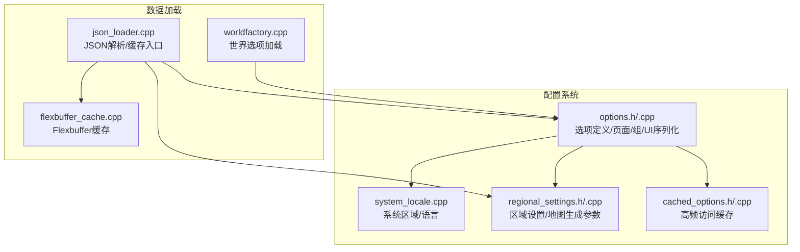
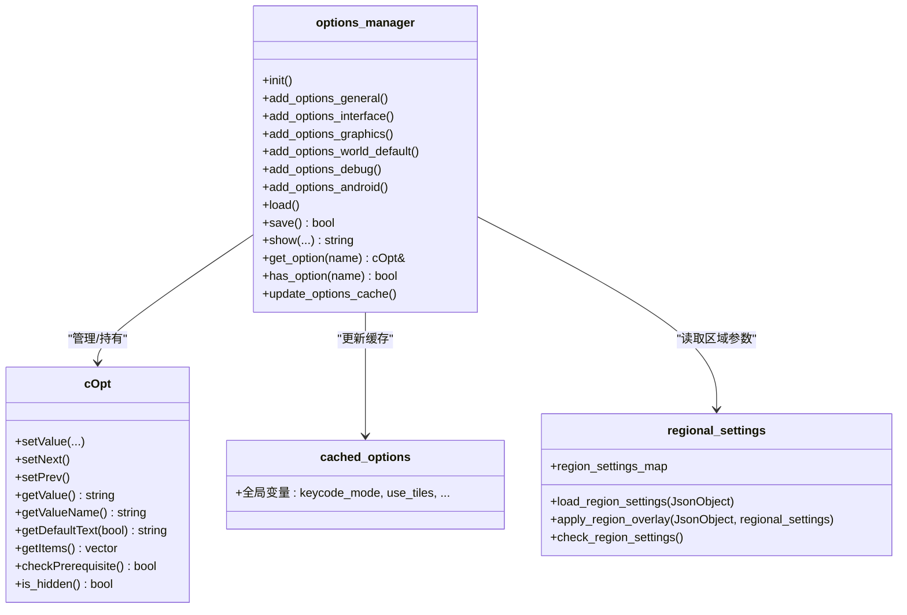
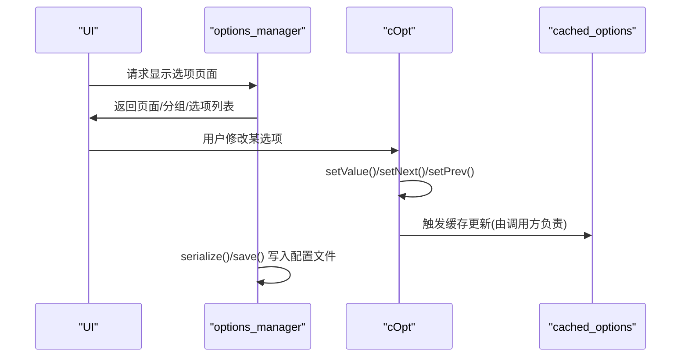
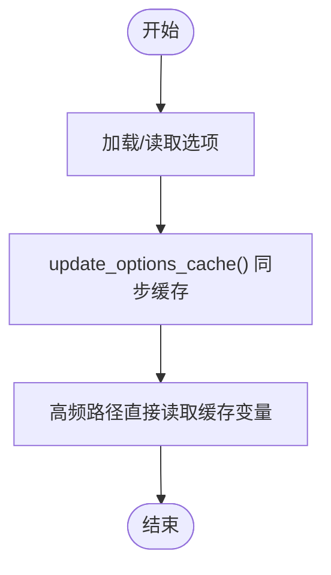
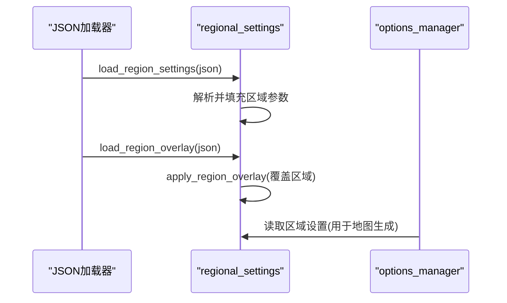
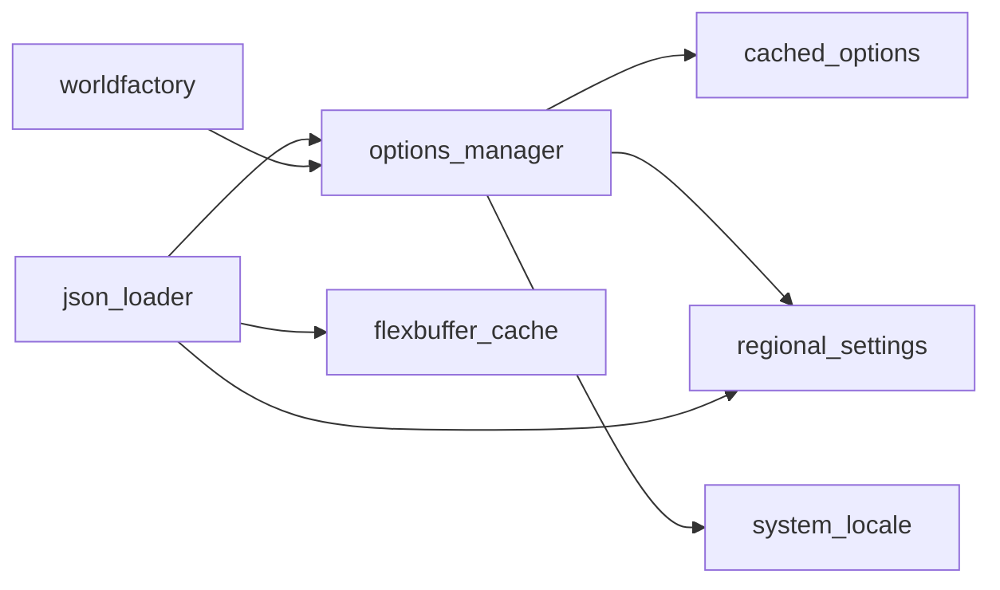

# 配置管理

<cite>
**本文引用的文件**
- src/options.h
- src/options.cpp
- src/cached_options.h
- src/cached_options.cpp
- src/regional_settings.h
- src/regional_settings.cpp
- src/system_locale.cpp
- src/json_loader.cpp
- src/flexbuffer_cache.cpp
- src/worldfactory.cpp
</cite>

## 目录
- [配置管理](#配置管理)
  - [目录](#目录)
  - [简介](#简介)
  - [项目结构](#项目结构)
  - [核心组件](#核心组件)
  - [架构总览](#架构总览)
  - [详细组件分析](#详细组件分析)
    - [选项系统架构与生命周期](#选项系统架构与生命周期)
    - [缓存选项系统（性能优化与传播）](#缓存选项系统性能优化与传播)
    - [区域设置管理（本地化、时区与货币格式化）](#区域设置管理本地化时区与货币格式化)
    - [系统区域与本地化](#系统区域与本地化)
    - [配置文件读写与验证](#配置文件读写与验证)
    - [世界选项加载与迁移](#世界选项加载与迁移)
  - [依赖关系分析](#依赖关系分析)
  - [性能考量](#性能考量)
  - [故障排查指南](#故障排查指南)
  - [结论](#结论)
  - [附录：配置扩展开发指南](#附录配置扩展开发指南)

## 简介
本文件系统性梳理 Cataclysm-DDA 的配置管理系统，覆盖选项系统架构（配置项定义、默认值处理、运行时修改）、缓存选项系统（性能优化与传播机制）、区域设置管理（本地化、时区与货币格式化）、配置文件读写与验证、错误处理策略，以及面向扩展开发者的配置新增与迁移方案。

## 项目结构
配置管理相关代码主要分布在以下模块：
- 选项系统与UI：options.h/.cpp
- 运行时缓存选项：cached_options.h/.cpp
- 区域设置与地图生成参数：regional_settings.h/.cpp
- 语言与系统区域：system_locale.cpp
- JSON加载与缓存：json_loader.cpp、flexbuffer_cache.cpp
- 世界选项加载：worldfactory.cpp

图表来源
- src/options.cpp
- src/cached_options.h
- src/regional_settings.cpp
- src/system_locale.cpp
- src/json_loader.cpp
- src/flexbuffer_cache.cpp
- src/worldfactory.cpp

章节来源
- src/options.h
- src/options.cpp

## 核心组件
- 选项管理器 options_manager：集中注册、组织、序列化/反序列化选项；维护页面与分组；提供运行时修改接口；支持前置条件与隐藏规则。
- 选项类型 cOpt：封装单个配置项的类型、取值、默认值、UI显示文本、可选值列表、范围与步进等。
- 缓存选项 cached_options：将高频访问的布尔/整数/浮点选项复制到全局变量，避免每次查找字符串键的开销。
- 区域设置 regional_settings：按区域聚合地图生成、天气、地貌、道路、河流、湖泊、海洋等参数，支持覆盖与校验。
- 系统区域 SystemLocale：提供语言、度量单位、时间格式等系统级偏好查询。
- JSON加载与缓存：统一从路径解析JSON，使用flexbuffer缓存提升加载性能。

章节来源
- src/options.h
- src/options.cpp
- src/cached_options.h
- src/cached_options.cpp
- src/regional_settings.h
- src/system_locale.cpp

## 架构总览
选项系统采用“声明式注册 + 页面/分组组织 + 运行时修改 + 缓存访问”的分层设计。初始化阶段通过 add_options_* 系列函数注册所有选项，随后在UI中按页展示；运行时通过 cOpt 的 setValue 等方法修改当前值；高频读取通过 cached_options 直接访问，减少哈希查找成本；区域设置与系统区域为配置提供上下文环境。

图表来源
- src/options.h
- src/options.cpp
- src/cached_options.h
- src/regional_settings.h

## 详细组件分析

### 选项系统架构与生命周期
- 初始化：options_manager::init 清空旧状态，调用 add_options_* 注册通用、界面、图形、世界默认、调试、Android 等页面。
- 页面与分组：Page/Group 结构用于在UI中组织选项；支持空行与分组头；支持移除重复空行以优化显示。
- 选项注册：提供多种 add 重载，分别对应 bool/string_select/string_input/int/int_map/float 等类型；自动设置默认值与范围；支持隐藏规则（如平台/构建特性）。
- 值修改：cOpt::setValue/setNext/setPrev 支持运行时修改；对字符串输入会截断至最大长度；对数值类型进行边界检查并回退到默认值。
- 序列化：options_manager::serialize/deserialize 将选项容器写入/读取 JSON；支持外部选项（add_external）与世界选项（worldfactory 加载）。

图表来源
- src/options.cpp
- src/options.cpp
- src/options.cpp

章节来源
- src/options.cpp
- src/options.cpp
- src/options.cpp

### 缓存选项系统（性能优化与传播）
- 设计目标：将频繁读取的选项复制到全局变量，避免每次通过字符串键查找。
- 更新机制：options_manager 提供 update_options_cache 静态方法，遍历已注册选项，将当前值同步到 cached_options 中的全局变量。
- 影响范围：游戏主循环或渲染前调用该方法，确保缓存与当前选项一致；典型场景包括渲染、日志、鼠标行为等高频分支判断。

图表来源
- src/options.cpp
- src/cached_options.h
- src/cached_options.cpp

章节来源
- src/options.cpp
- src/cached_options.h
- src/cached_options.cpp

### 区域设置管理（本地化、时区与货币格式化）
- 数据模型：regional_settings 聚合城市布局、森林地形、河流/湖泊/海洋/峡谷、高速公路、连接关系、地面覆盖等；支持按区域覆盖（overlay）。
- 加载流程：load_region_settings 解析 JSON，填充 regional_settings；load_region_overlay 对指定区域应用覆盖；check_region_settings 校验权重有效性。
- 使用场景：地图生成、天气模拟、地貌分布等；通过 get_option 访问相关布尔/数值选项控制具体行为。

图表来源
- src/regional_settings.cpp
- src/regional_settings.cpp
- src/regional_settings.cpp

章节来源
- src/regional_settings.h
- src/regional_settings.cpp
- src/regional_settings.cpp
- src/regional_settings.cpp

### 系统区域与本地化
- 语言选择：options_manager::get_lang_options 提供可用语言列表，结合系统区域偏好（SystemLocale::UseMetricSystem）设置默认单位。
- 语言切换：setlocale 全局设置 C/C++ 本地化，确保数字/货币/日期等格式符合目标语言环境。
- 度量单位：根据系统区域返回值动态设置温度、速度、质量、体积、距离等单位的默认值。

章节来源
- src/options.cpp
- src/system_locale.cpp
- src/options.cpp

### 配置文件读写与验证
- JSON加载：json_loader.cpp 统一从路径解析 JSON，使用 flexbuffer_cache.cpp 缓存解析结果，避免重复解析。
- 配置写入：options_manager::serialize/deserialize 将选项容器序列化为 JSON；save() 调用序列化后写盘。
- 错误处理：解析失败抛出异常；校验不合法权重/覆盖区域时报错；调试信息输出帮助定位问题。

章节来源
- src/json_loader.cpp
- src/flexbuffer_cache.cpp
- src/options.cpp
- src/options.cpp

### 世界选项加载与迁移
- 世界选项：worldfactory.cpp 提供 load_world_option，批量启用某些选项作为世界默认。
- 外部选项：load_external_option 支持从 JSON 动态添加外部选项并赋值，兼容迁移场景。
- 选项迁移：options_manager 提供 migrateOptionName/migrateOptionValue 机制，映射旧名称与旧值到新名称/值。

章节来源
- src/worldfactory.cpp
- src/options.cpp

## 依赖关系分析
- options_manager 依赖 cached_options（更新缓存）、regional_settings（读取区域参数）、system_locale（语言/单位偏好）。
- JSON加载链路：json_loader.cpp -> flexbuffer_cache.cpp -> 业务模块（选项/区域设置）。
- 世界工厂依赖 options_manager 获取/设置选项。

图表来源
- src/options.cpp
- src/json_loader.cpp
- src/flexbuffer_cache.cpp
- src/worldfactory.cpp

章节来源
- src/options.cpp
- src/json_loader.cpp
- src/flexbuffer_cache.cpp
- src/worldfactory.cpp

## 性能考量
- 缓存访问：高频读取通过 cached_options 直接访问全局变量，避免哈希查找与字符串比较。
- JSON缓存：flexbuffer_cache 将解析后的 JSON 结果缓存到磁盘，按修改时间与偏移快速命中，显著降低启动与切换配置的延迟。
- 选项更新批处理：集中调用 update_options_cache，在关键帧或切换场景一次性同步，避免分散更新带来的重复计算。
- UI渲染优化：页面/分组结构在初始化时整理，移除重复空行，减少渲染负担。

## 故障排查指南
- 选项未生效：确认是否调用了 update_options_cache；检查前置条件 checkPrerequisite 是否满足；核对隐藏规则（平台/构建特性）。
- 语言/单位异常：检查 SystemLocale 返回值与 USE_LANG 选项；确认 setlocale 设置成功。
- 区域设置无效：检查 load_region_settings/apply_region_overlay 是否正确执行；使用 check_region_settings 定位权重问题。
- JSON加载失败：查看 json_loader/flexbuffer_cache 抛出的错误；确认文件存在且格式正确；检查缓存目录权限。
- 世界选项未加载：确认 worldfactory 的 load_world_option 调用路径；检查 JSON 中 options 数组是否为空。

章节来源
- src/options.cpp
- src/options.cpp
- src/regional_settings.cpp
- src/json_loader.cpp
- src/flexbuffer_cache.cpp
- src/worldfactory.cpp

## 结论
CDDA 的配置系统以 options_manager 为核心，结合页面/分组组织、类型安全的 cOpt、运行时修改与缓存访问，形成高可维护、高性能的配置生态。区域设置与系统区域为复杂玩法提供上下文支持。通过 JSON 缓存与集中更新策略，系统在功能丰富的同时保持良好的性能表现。

## 附录：配置扩展开发指南
- 新增选项
  - 在 add_options_* 中注册：根据类型选择对应的 add 重载；设置默认值、范围/步进、UI 文本与提示。
  - 可选：设置隐藏规则（如平台/构建特性）；设置前置条件（依赖其他选项的值）。
  - 参考路径：src/options.cpp
- 运行时修改
  - 通过 get_options().get_option(name).setValue(...) 修改；必要时调用 update_options_cache 同步缓存。
  - 参考路径：src/options.cpp, src/options.cpp
- 世界默认选项
  - 在 worldfactory 中使用 load_world_option 批量启用；或通过外部选项机制 add_external + load_external_option 注入。
  - 参考路径：src/worldfactory.cpp
- 配置文件格式
  - 选项序列化为 JSON；区域设置/覆盖为独立对象；外部选项支持 float/int/bool 类型。
  - 参考路径：src/options.cpp, src/regional_settings.cpp
- 配置迁移
  - 使用 migrateOptionName/migrateOptionValue 映射旧名/旧值；外部选项支持 stub 模式避免覆盖已有设置。
  - 参考路径：src/options.cpp, src/worldfactory.cpp
- 性能与验证
  - 使用 cached_options 减少热点读取；利用 flexbuffer_cache 与 JSON 缓存；在加载后调用 check_* 校验数据有效性。
  - 参考路径：src/cached_options.h, src/json_loader.cpp, src/regional_settings.cpp