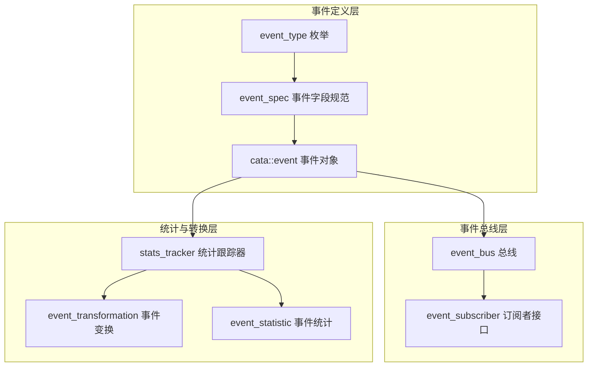
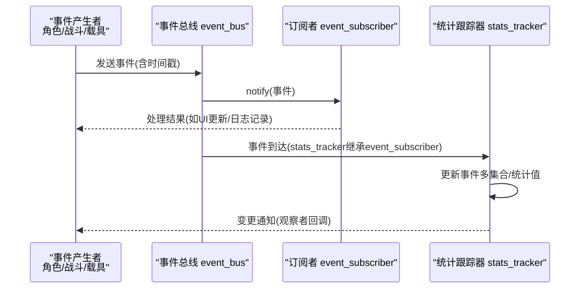
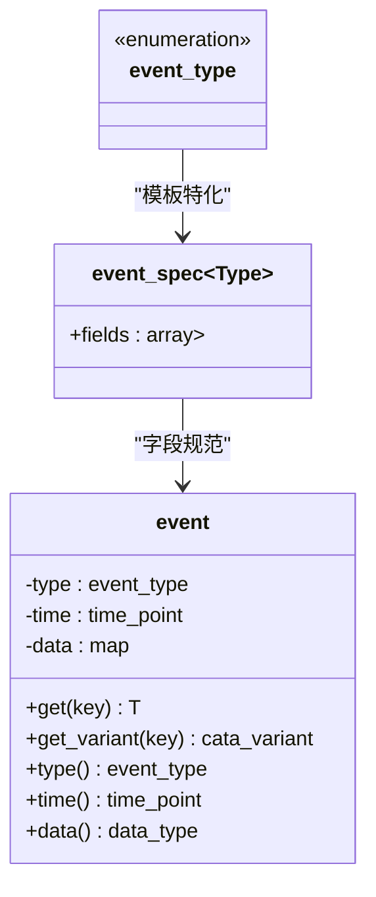
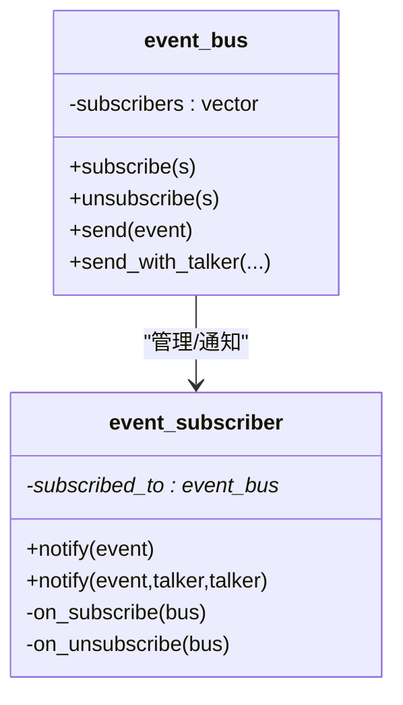
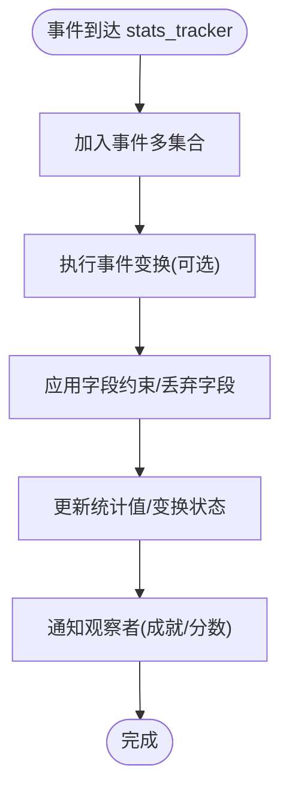
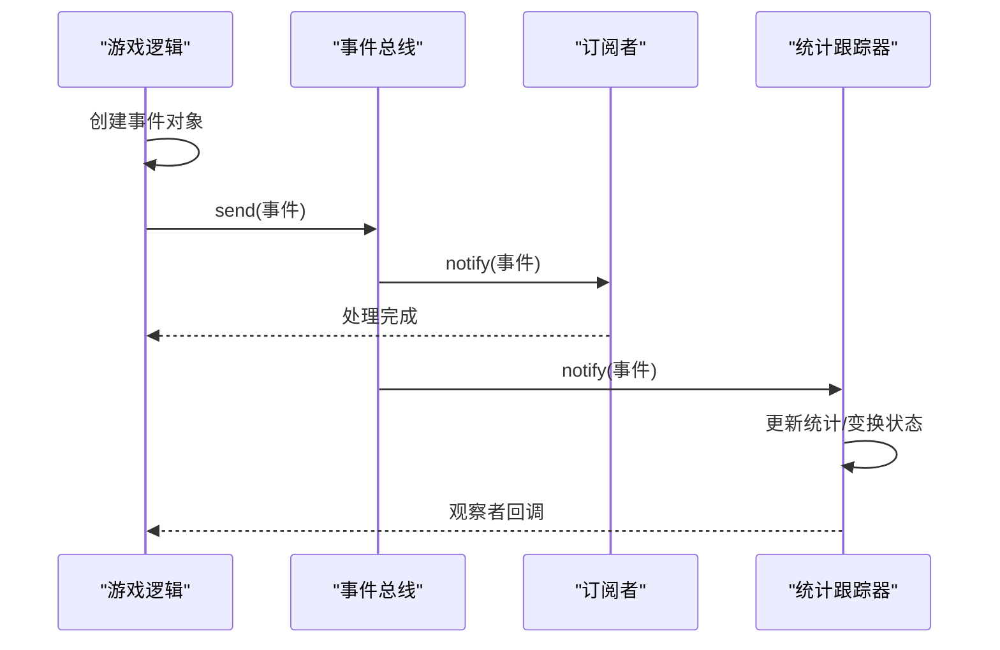
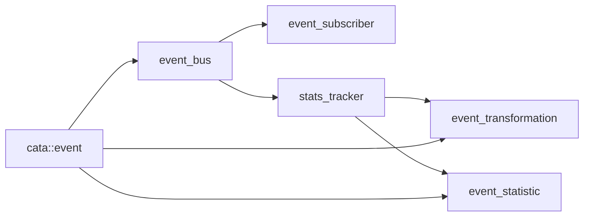

# 事件驱动架构与通信机制

<cite>
**本文引用的文件**
- event.h
- event.cpp
- event_bus.h
- event_bus.cpp
- event_subscriber.h
- event_statistics.h
- event_statistics.cpp
- stats_tracker.h
- stats_tracker.cpp
- event_test.cpp
- character.cpp
- ranged.cpp
- melee.cpp
- monster.cpp
- vehicle.cpp
- savegame_json.cpp
- npctalk.cpp
- memorial_logger.cpp
</cite>

## 目录
1. [引言](#引言)
2. [项目结构](#项目结构)
3. [核心组件](#核心组件)
4. [架构总览](#架构总览)
5. [详细组件分析](#详细组件分析)
6. [依赖关系分析](#依赖关系分析)
7. [性能考量](#性能考量)
8. [故障排查指南](#故障排查指南)
9. [结论](#结论)
10. [附录：事件类型与使用示例](#附录事件类型与使用示例)

## 引言
本文件面向Cataclysm-DDA（CDDA）的事件驱动架构与通信机制，系统化阐述事件总线的设计理念、事件类型定义、订阅者注册与事件分发策略；并结合游戏场景说明事件在用户输入、状态变更通知与模组事件触发中的应用。文档同时给出事件生命周期、异步处理思路、性能优化策略与常见问题排查方法，帮助开发者快速理解并扩展事件系统。

## 项目结构
事件系统主要由以下模块构成：
- 事件定义与数据模型：事件类型枚举、事件字段规范、事件数据容器
- 事件总线与订阅者：事件发布/订阅接口、分发策略、talker上下文传递
- 统计与转换：基于事件的统计计算、事件变换、成就/分数系统
- 使用示例：角色伤害、战斗、载具移动、存档加载等场景中的事件触发

**图表来源**
- event.h
- event.cpp
- event_bus.h
- event_subscriber.h
- stats_tracker.h
- event_statistics.h

**章节来源**
- event.h
- event.cpp
- event_bus.h
- event_bus.cpp
- event_subscriber.h
- stats_tracker.h
- event_statistics.h

## 核心组件
- 事件类型与字段规范
  - 通过枚举定义事件类型集合，并以模板特化为每种事件类型声明字段键值与类型
  - 字段类型统一由变体类型系统承载，保证跨事件类型的类型安全
- 事件对象
  - 封装事件类型、发生时间与字段数据映射
  - 提供类型安全的字段访问接口与动态构造能力
- 事件总线
  - 管理订阅者列表，负责事件广播与talker上下文注入
  - 支持按事件类型直接发送与动态构造后发送两种方式
- 订阅者接口
  - 定义事件回调入口，支持带talker参数的重载
  - 生命周期管理：订阅/退订时自动维护关联关系
- 统计与转换
  - 基于事件的多集合统计、变换与实时观察
  - 通过工厂模式加载JSON配置，支持成就与分数系统

**章节来源**
- event.h
- event.cpp
- event_bus.h
- event_bus.cpp
- event_subscriber.h
- stats_tracker.h
- event_statistics.h

## 架构总览
事件驱动架构采用“发布-订阅”模式，事件从产生点封装为事件对象，经事件总线广播给所有订阅者。统计与转换层可作为订阅者参与事件流，形成“事件→统计/变换→观察者”的闭环。

**图表来源**
- event_bus.cpp
- stats_tracker.h
- stats_tracker.cpp

## 详细组件分析

### 事件类型与字段规范
- 设计要点
  - 事件类型集中定义于枚举，便于统一管理与序列化
  - 每个事件类型通过模板特化声明其字段键与类型，确保编译期约束
  - 通过静态断言提示新增事件类型时补充字段特化
- 数据模型
  - 事件对象包含类型、时间戳与字段映射
  - 提供类型安全的字段获取接口与错误处理

**图表来源**
- event.h
- event.h
- event.cpp

**章节来源**
- event.h
- event.cpp

### 事件总线与订阅者
- 总线职责
  - 维护订阅者列表，提供订阅/退订与事件发送接口
  - 支持带talker上下文的事件发送，便于对话/交互系统集成
  - 对非法事件进行过滤，避免空事件进入分发链
- 订阅者接口
  - 定义纯虚回调，支持带talker重载
  - 生命周期钩子：订阅/退订时自动维护关联

**图表来源**
- event_bus.h
- event_subscriber.h
- event_bus.cpp

**章节来源**
- event_bus.h
- event_bus.cpp
- event_subscriber.h

### 统计与事件变换
- 统计跟踪器
  - 维护事件多集合与统计状态，支持观察者模式
  - 提供按条件聚合、求和、最值等查询接口
- 事件变换
  - 将事件多集合转换为新的事件多集合，支持字段新增、约束过滤与字段丢弃
  - 通过工厂加载JSON配置，支持运行时校验与一致性检查
- 成就/分数
  - 基于统计值或变换后的事件集合生成分数与成就

**图表来源**
- stats_tracker.h
- event_statistics.cpp
- event_statistics.cpp

**章节来源**
- stats_tracker.h
- stats_tracker.cpp
- event_statistics.h
- event_statistics.cpp

### 异步事件处理流程
- 事件生命周期
  - 事件创建：在业务逻辑中构造事件对象（类型、时间、字段）
  - 事件发送：通过事件总线广播，或带talker上下文发送
  - 订阅者处理：订阅者接收事件并执行相应逻辑（UI更新、日志、统计）
  - 统计与变换：统计跟踪器作为订阅者参与，更新内部状态并通知观察者
- 异步建议
  - 当前实现为同步广播；若需异步，可在订阅者侧引入任务队列或后台线程
  - 对高频事件（如载具移动）可考虑批处理合并，降低回调次数

**图表来源**
- event_bus.cpp
- stats_tracker.h

**章节来源**
- event_bus.cpp
- stats_tracker.h

## 依赖关系分析
- 组件耦合
  - 事件对象与事件类型解耦，通过模板特化实现字段规范
  - 总线与订阅者通过接口解耦，支持多路订阅
  - 统计层通过订阅者接口接入事件流，形成观察者网络
- 外部依赖
  - 时间系统用于事件时间戳
  - JSON工厂用于统计/变换/分数的配置加载
  - talker系统用于事件上下文（人物/物品/载具）

**图表来源**
- event_bus.h
- event_subscriber.h
- stats_tracker.h
- event_statistics.h

**章节来源**
- event_bus.h
- event_subscriber.h
- stats_tracker.h
- event_statistics.h

## 性能考量
- 事件队列与批处理
  - 高频事件（如载具移动）建议在订阅者侧进行批处理，减少UI刷新与状态更新频率
  - 合并相同字段的事件，仅保留最新状态，降低存储与遍历成本
- 分发策略
  - 严格过滤非法事件，避免无效回调
  - 对大字段数据采用延迟解析或共享缓存
- 内存与拷贝
  - 事件对象字段使用变体类型，避免频繁类型转换开销
  - 统计层使用多集合结构，按需聚合，避免重复扫描

[本节为通用指导，无需特定文件引用]

## 故障排查指南
- 常见问题
  - 订阅者重复订阅/未正确退订：检查生命周期钩子调用
  - 发送非法事件：总线会拒绝空事件，需确认事件构造参数
  - 字段缺失/类型不匹配：事件字段规范与实际数据不一致会导致异常
- 调试建议
  - 在订阅者回调中打印事件类型与关键字段，定位异常事件
  - 使用统计跟踪器的观察者功能，验证事件是否被正确接收与处理

**章节来源**
- event_bus.cpp
- event_subscriber.h

## 结论
CDDA的事件系统以清晰的类型与字段规范为基础，通过事件总线实现松耦合的发布/订阅机制，并借助统计与变换层构建了强大的事件分析与成就体系。该架构既满足游戏内高频事件的实时处理需求，又为模组扩展与动态配置提供了良好基础。未来可在订阅者侧引入异步与批处理机制，进一步提升性能与用户体验。

[本节为总结性内容，无需特定文件引用]

## 附录：事件类型与使用示例

### 事件类型概览
- 事件类型覆盖角色行为、战斗、载具、游戏生命周期等多个维度
- 新增事件类型时需补充字段特化与静态断言提示

**章节来源**
- event.h
- event.cpp

### 典型使用场景与代码路径
- 角色受伤事件
  - 触发位置：角色受到伤害时
  - 发送方式：带talker上下文发送
  - 示例路径：character.cpp
- 远程/近战攻击事件
  - 触发位置：射击/近战命中时
  - 示例路径：ranged.cpp, melee.cpp
- 怪物受伤/击杀事件
  - 触发位置：怪物血量变化/死亡时
  - 示例路径：monster.cpp, monster.cpp
- 载具移动事件
  - 触发位置：载具移动时
  - 示例路径：vehicle.cpp
- 存档/新角色事件
  - 触发位置：加载/新建角色时
  - 示例路径：savegame_json.cpp
- 动态事件构造
  - 触发位置：模组/脚本需要构造事件时
  - 示例路径：npctalk.cpp
- 日志/纪念记录
  - 触发位置：事件发生时的日志输出
  - 示例路径：memorial_logger.cpp

**章节来源**
- character.cpp
- ranged.cpp
- melee.cpp
- monster.cpp
- monster.cpp
- vehicle.cpp
- savegame_json.cpp
- npctalk.cpp
- memorial_logger.cpp

### 测试用例参考
- 事件构造与字段访问
  - 示例路径：event_test.cpp
- 订阅者回调与总线分发
  - 示例路径：event_test.cpp

**章节来源**
- event_test.cpp
- event_test.cpp