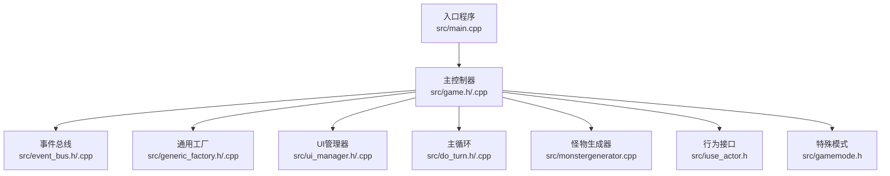
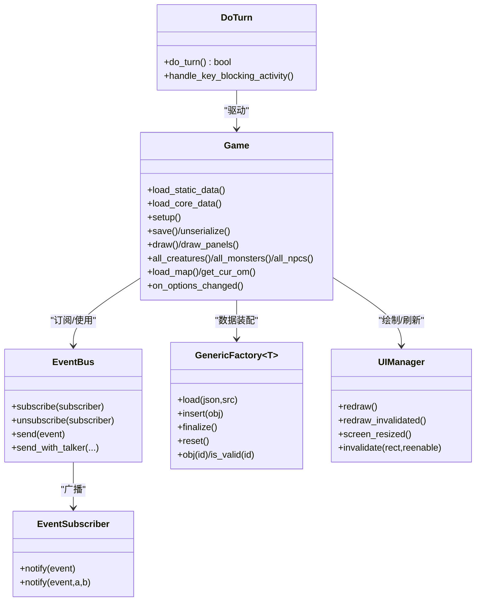
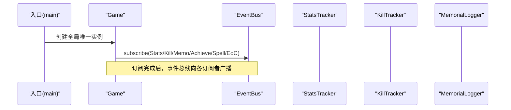
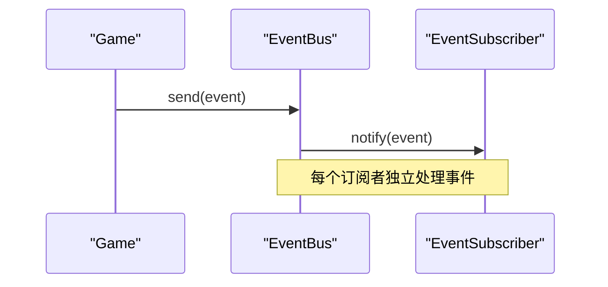
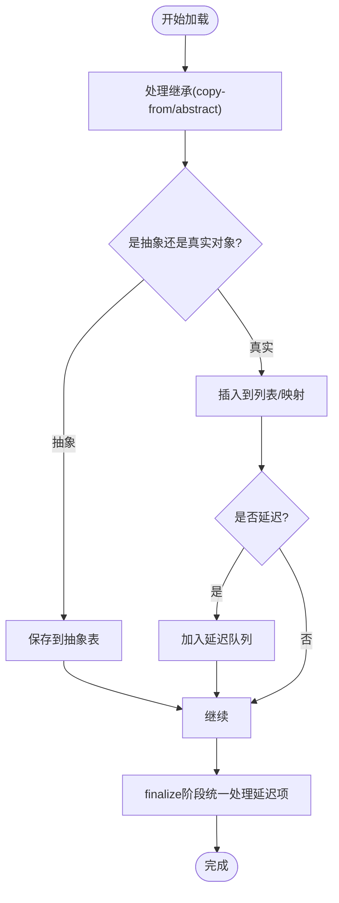
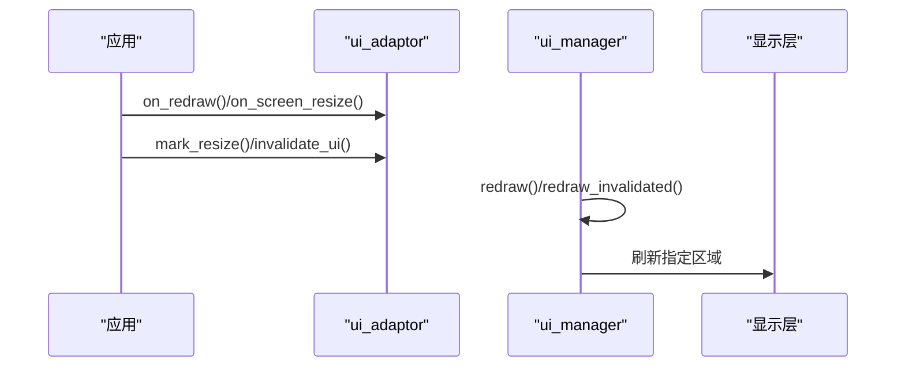
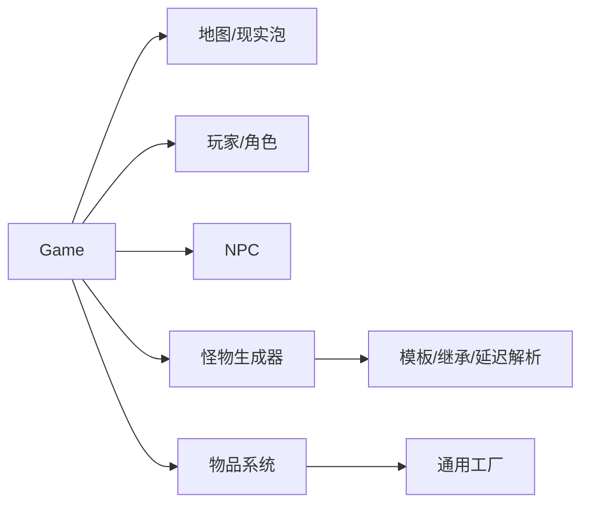
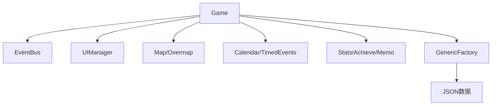

# 核心架构设计

<cite>
**本文档引用的文件**
- main.cpp
- game.h
- game.cpp
- do_turn.h
- do_turn.cpp
- event_bus.h
- event_bus.cpp
- event_subscriber.h
- generic_factory.h
- generic_factory.cpp
- ui_manager.h
- ui_manager.cpp
- sdltiles.cpp
- monstergenerator.cpp
- iuse_actor.h
- gamemode.h
</cite>

## 目录
1. [引言](#引言)
2. [项目结构](#项目结构)
3. [核心组件](#核心组件)
4. [架构总览](#架构总览)
5. [详细组件分析](#详细组件分析)
6. [依赖关系分析](#依赖关系分析)
7. [性能考虑](#性能考虑)
8. [故障排除指南](#故障排除指南)
9. [结论](#结论)

## 引言
本文件面向Cataclysm-DDA（CDDA）的核心架构，聚焦于游戏主控制器、事件驱动架构与数据加载体系，系统化阐述单例模式、工厂模式、观察者模式在代码中的具体应用，并结合游戏循环、UI管理、地图与角色系统等模块，给出架构决策的技术考量、性能优化策略与可扩展性设计建议。目标读者既包括希望快速理解系统设计的开发者，也包括需要把握整体脉络的非技术读者。

## 项目结构
CDDA采用以“功能域”为主的分层组织方式：入口程序负责初始化与启动流程；核心逻辑集中在game类及其子系统中；事件总线提供松耦合的消息传递；通用工厂负责JSON数据的加载与管理；UI管理器统一处理渲染与输入；do_turn实现主游戏循环。



**图表来源**
- main.cpp
- game.h
- event_bus.h
- generic_factory.h
- ui_manager.h
- do_turn.h
- monstergenerator.cpp
- iuse_actor.h
- gamemode.h

**章节来源**
- main.cpp
- game.h

## 核心组件
- 单一游戏实例（单例）
  - 全局唯一的游戏对象通过全局指针持有，贯穿整个生命周期，提供静态数据加载、世界数据加载、保存/读取、主循环调度等能力。
- 事件总线（观察者模式）
  - 提供订阅/发布机制，支持带说话者上下文的事件发送，用于解耦模块间通信。
- 通用工厂（工厂模式）
  - 统一管理JSON数据的加载、继承、抽象定义与延迟解析，提供类型安全的查询接口。
- 主控制器（game）
  - 聚合地图、角色、NPC、怪物、天气、计时等子系统，协调UI绘制与输入处理。
- 主循环（do_turn）
  - 驱动每回合逻辑，处理输入、更新状态、触发事件与UI刷新。
- UI管理器
  - 管理UI栈、重绘区域、窗口尺寸变化回调，确保不同渲染后端的一致行为。

**章节来源**
- game.h
- event_bus.h
- generic_factory.h
- do_turn.h
- ui_manager.h

## 架构总览
CDDA采用“主控制器 + 松耦合事件 + 工厂加载 + 分层UI”的架构风格。主控制器集中管理游戏状态与子系统，事件总线承载跨模块通知，通用工厂负责运行期数据装配，UI管理器屏蔽底层渲染差异。



**图表来源**
- game.h
- event_bus.h
- event_subscriber.h
- generic_factory.h
- ui_manager.h
- do_turn.h

## 详细组件分析

### 主控制器（game）设计
- 设计理念
  - 作为“上帝视角”的聚合器，集中管理地图缓冲、角色/NPC/怪物跟踪、天气、计时事件、成就/统计/墓志铭等子系统，提供统一的查询与操作接口。
  - 通过友元函数与静态访问器暴露内部子系统，避免过度耦合。
- 关键职责
  - 数据生命周期：静态数据加载、核心数据加载、世界与模组数据加载、保存/读取。
  - 地图与现实泡：管理当前地图、现实泡范围、过载图与子地图的切换。
  - 视觉与UI：绘制地形、面板、覆盖动画、闪烁效果；提供绘制回调与UI适配器。
  - 行为与交互：角色移动、拾取、使用物品、对话、任务、基地等。
- 与事件总线协作
  - 在构造阶段订阅统计、击杀、成就、法术事件与EoC事件，实现跨模块联动。



**图表来源**
- main.cpp
- game.cpp
- event_bus.h

**章节来源**
- game.h
- game.cpp

### 事件驱动架构（观察者模式）
- 结构
  - 事件总线维护订阅者列表，提供发送事件与带说话者上下文的发送方法。
  - 订阅者基类提供通知接口与生命周期钩子，确保重复订阅与错误退订的诊断。
- 使用场景
  - 游戏结束事件、统计更新、击杀记录、成就解锁、法术事件、EoC事件等。
- 性能与健壮性
  - 发送前校验事件有效性，拒绝空事件；退订时查找并移除，避免悬挂指针。



**图表来源**
- event_bus.cpp
- event_subscriber.h

**章节来源**
- event_bus.h
- event_bus.cpp
- event_subscriber.h

### 工厂模式与JSON数据装配（generic_factory）
- 设计要点
  - 统一的工厂模板，支持继承复制、抽象定义、延迟解析与版本失效缓存。
  - 加载流程：继承处理 → 抽象/真实对象判定 → 插入或延迟 → finalize统一处理。
  - 查询接口：string_id/int_id双向转换，带版本校验的缓存失效。
- 复杂度与性能
  - 查找：哈希表O(1)平均；插入：数组尾部追加，必要时版本递增导致缓存失效。
  - 延迟解析：Deferred JSON队列在finalize阶段统一处理，避免循环依赖。
- 可扩展性
  - 通过注册DynamicDataLoader与string_id包装，新增类型只需遵循约定接口。



**图表来源**
- generic_factory.h
- generic_factory.h
- generic_factory.h

**章节来源**
- generic_factory.h
- generic_factory.cpp

### 主游戏循环（do_turn）
- 循环职责
  - 接收输入、处理活动、更新角色状态、推进时间、触发事件、刷新UI。
  - 在关键时间点（如死亡）清理并保存相关数据，触发游戏结束事件。
- 输入与阻塞
  - 提供按键阻塞活动的处理函数，保证某些动作期间的输入一致性。
- 与UI的协同
  - 在调试菜单中演示了“无效化→泵事件→重绘无效区域→刷新显示”的典型帧循环。

```mermaid
sequenceDiagram
    participant Loop as "do_turn循环"
    participant Input as "输入管理"
    participant Game as "Game"
    participant UI as "UI管理器"
    participant Disp as "显示层"
    Loop->>Input: "获取输入"
    Loop->>Game: "更新状态/推进回合"
    Loop->>UI: "invalidate/redraw_invalidated"
    UI->>Disp: "刷新显示"
    alt "死亡/退出"
        Loop->>Game: "保存/清理/事件广播"
    end
```

**图表来源**
- do_turn.cpp
- do_turn.cpp
- debug_menu.cpp
- sdltiles.cpp

**章节来源**
- do_turn.h
- do_turn.cpp
- do_turn.cpp
- debug_menu.cpp
- sdltiles.cpp

### UI管理器（ui_manager）
- 设计目标
  - 屏蔽TUI与TILES两种渲染后端差异，统一管理UI栈、重绘区域、窗口尺寸变化与光标定位。
- 关键机制
  - ui_adaptor封装位置、回调与失效标记；ui_manager维护全局栈与批量重绘。
  - 支持禁用下方UI、调试消息UI的特殊处理，保证重绘一致性。
- 与渲染后端
  - TILES路径下与SDL渲染器配合，按需刷新显示；TUI路径下与curses集成。



**图表来源**
- ui_manager.h
- ui_manager.cpp
- ui_manager.cpp

**章节来源**
- ui_manager.h
- ui_manager.cpp
- ui_manager.cpp

### 地图与角色系统（概览）
- 地图管理
  - game聚合地图缓冲、现实泡、过载图与子地图，提供加载、绘制与坐标转换。
- 角色与怪物
  - 通过工厂与生成器装配怪物模板，支持随机生成、特定放置与范围生成。
- 物品系统
  - 与工厂模式结合，物品类型由JSON定义并通过string_id访问，支持继承与延迟解析。



**图表来源**
- game.h
- monstergenerator.cpp
- generic_factory.h

**章节来源**
- game.h
- monstergenerator.cpp
- generic_factory.h

### 特殊模式与行为接口
- 特殊模式
  - 通过special_game接口定义特殊玩法，支持每回合前/后、预处理/后处理、游戏结束等钩子。
- 行为接口
  - iuse_actor定义可使用的物品行为，如召唤怪物等，体现“行为即插拔”的扩展点。

**章节来源**
- gamemode.h
- iuse_actor.h

## 依赖关系分析
- 模块耦合
  - game对事件总线、UI管理器、地图/过载图、计时事件、统计/成就/墓志铭等存在直接依赖，但通过订阅/查询接口降低耦合度。
  - 通用工厂被广泛使用，形成“数据装配中心”，避免各模块直接解析JSON。
- 外部依赖
  - TILES路径依赖SDL渲染器；TUI路径依赖curses；跨平台路径包含Android/Windows特定处理。
- 潜在风险
  - 事件总线的订阅/退订必须成对，否则会产生悬挂指针或重复订阅警告。
  - UI栈的生命周期管理需严格遵循RAII语义，避免重绘异常。



**图表来源**
- game.cpp
- generic_factory.h

**章节来源**
- game.cpp
- generic_factory.h

## 性能考虑
- 事件总线
  - 发送前进行事件有效性检查，避免空事件广播；订阅者遍历成本低，适合高频事件。
- UI重绘
  - 仅重绘标记为无效的区域，减少全屏刷新；在TILES路径下按需刷新显示，避免无意义调用。
- 工厂缓存
  - string_id缓存通过版本号失效，避免重复查找；finalize阶段统一处理延迟项，降低运行时开销。
- 主循环
  - 在调试模式下进行帧率基准测试，指导渲染参数调整（如着色器、纹理混合等）。

**章节来源**
- event_bus.cpp
- ui_manager.cpp
- generic_factory.h
- debug_menu.cpp

## 故障排除指南
- 事件总线
  - 重复订阅会触发调试告警；退订失败会提示“不在订阅列表”。请确保订阅/退订成对出现。
- UI管理
  - 若出现界面闪烁或光标错位，检查ui_adaptor的回调是否越界绘制或未正确设置位置；确认在回调中不执行可能改变UI栈的操作。
- 工厂加载
  - 若对象缺失或继承链断裂，检查copy-from/abstract字段与延迟解析日志；确保finalize阶段被调用。
- 主循环
  - 出现卡顿或崩溃，优先检查输入泵与UI重绘的调用顺序；在TILES路径下注意刷新时机。

**章节来源**
- event_bus.cpp
- ui_manager.cpp
- generic_factory.cpp
- sdltiles.cpp

## 结论
CDDA的核心架构以“单一主控制器 + 事件总线 + 通用工厂 + 分层UI”为核心，通过观察者模式实现模块解耦，通过工厂模式实现运行期数据装配，通过主循环驱动状态演进与渲染刷新。该设计在可扩展性与可维护性方面表现良好，同时在性能上通过缓存失效、按需刷新与延迟解析等策略实现了平衡。建议在后续开发中继续强化事件契约与UI回调约束，完善数据装配的错误报告与回滚机制，以进一步提升稳定性与可诊断性。