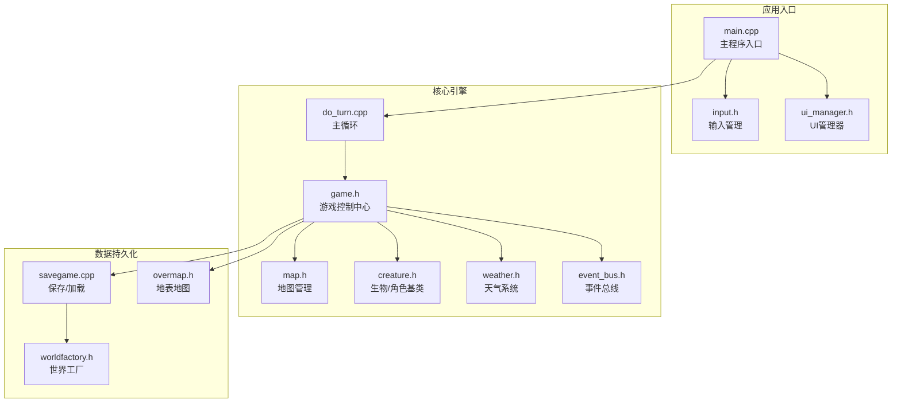
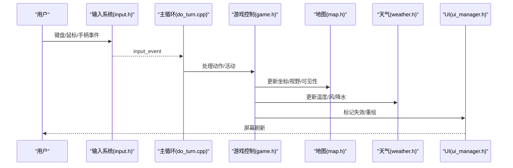
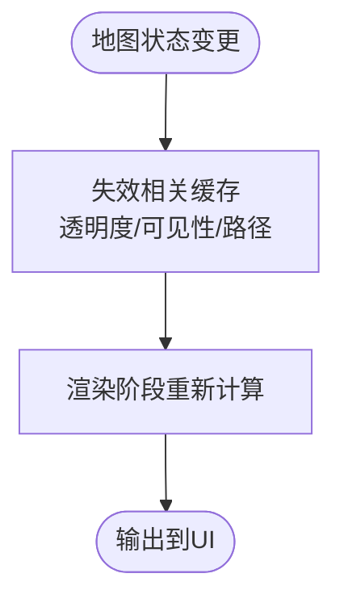
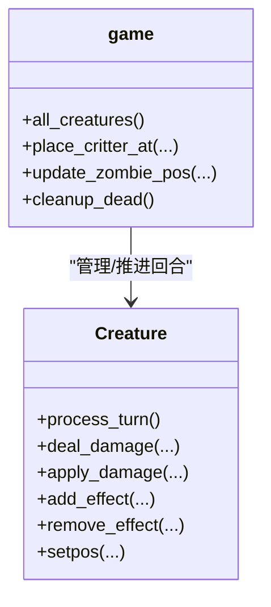
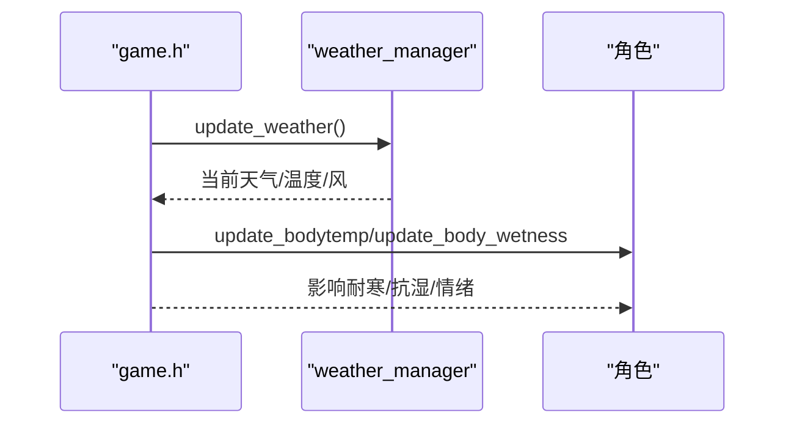
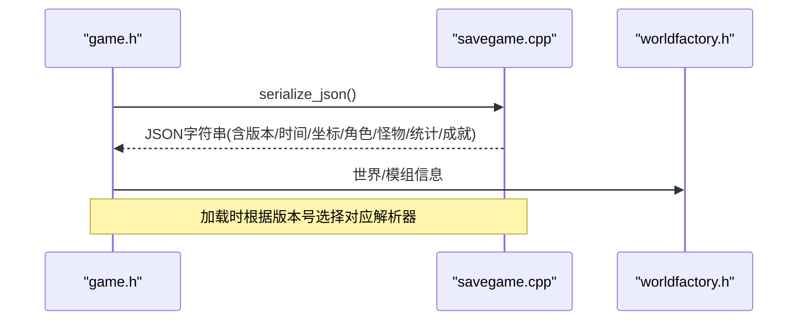
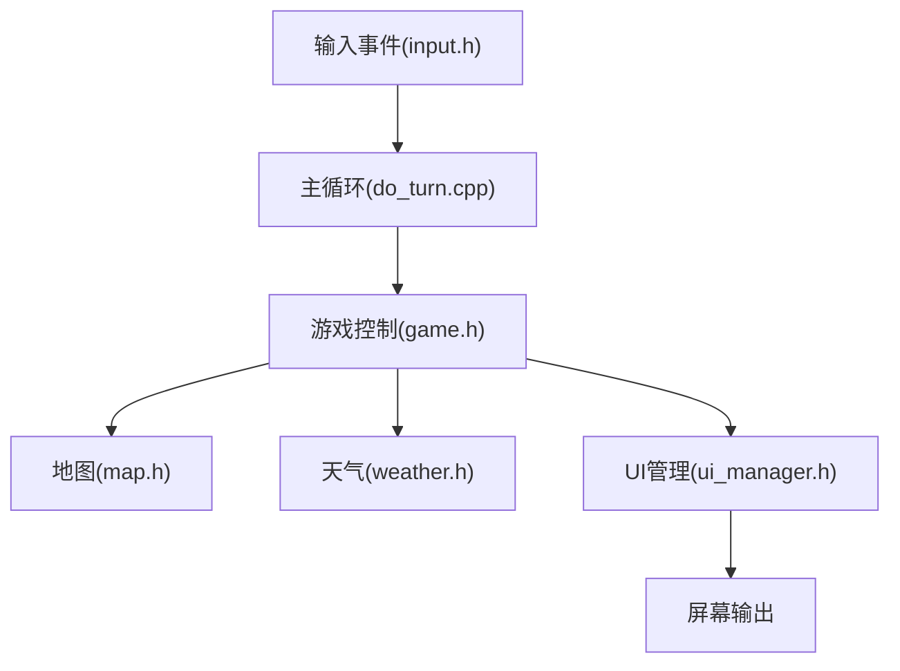
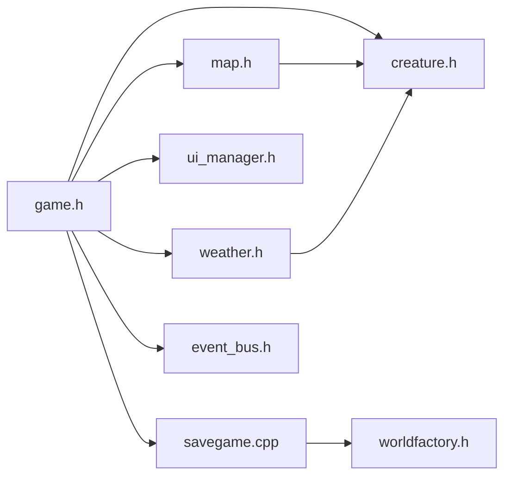

# 核心组件交互与数据流

<cite>
**本文档引用的文件**
- src/game.h
- src/map.h
- src/creature.h
- src/weather.h
- src/savegame.cpp
- src/worldfactory.h
- src/overmap.h
- src/main.cpp
- src/do_turn.cpp
- src/input.h
- src/event_bus.h
- src/ui_manager.h
</cite>

## 目录
1. [引言](#引言)
2. [项目结构](#项目结构)
3. [核心组件](#核心组件)
4. [架构总览](#架构总览)
5. [详细组件分析](#详细组件分析)
6. [依赖关系分析](#依赖关系分析)
7. [性能考量](#性能考量)
8. [故障排除指南](#故障排除指南)
9. [结论](#结论)

## 引言
本技术文档聚焦于Cataclysm-DDA（简称CDDA）核心组件的交互关系与数据流，涵盖地图管理、角色系统、天气系统、保存系统等模块的协作方式。文档旨在帮助开发者理解从用户输入到屏幕显示的完整数据处理链路，解释组件间的接口设计与依赖注入策略，并通过系统架构图与数据流图辅助定位性能瓶颈。

## 项目结构
CDDA采用分层与模块化结合的组织方式：顶层由主程序入口负责事件泵与渲染调度；核心逻辑集中在游戏主循环中，协调地图、角色、天气、UI等子系统；数据持久化通过统一的保存/加载流程完成；世界工厂负责世界与模组的初始化与管理。

**图表来源**
- src/main.cpp
- src/do_turn.cpp
- src/game.h
- src/map.h
- src/creature.h
- src/weather.h
- src/event_bus.h
- src/savegame.cpp
- src/worldfactory.h
- src/overmap.h

**章节来源**
- src/main.cpp
- src/do_turn.cpp

## 核心组件
- 游戏控制中心（game.h）：全局单例，负责加载静态/动态数据、保存/加载、绘制、输入回调注册、角色/怪物管理、地图切换等。
- 地图管理（map.h）：管理子地图网格、可见性缓存、路径规划、光照计算、场效应传播、载具管理等。
- 生物/角色基类（creature.h）：定义所有可行动实体的通用接口，包括位置、移动、效果、伤害、命中判定等。
- 天气系统（weather.h）：温度、风速、降水、紫外线等环境参数的更新与查询，以及对角色的影响。
- 保存系统（savegame.cpp）：统一的JSON序列化/反序列化流程，包含时间、坐标、角色、怪物、统计、成就等。
- 世界工厂（worldfactory.h）：世界与模组的生成、选择、删除、选项加载/保存。
- 输入系统（input.h）：键鼠/手柄输入事件的定义与管理。
- 事件总线（event_bus.h）：跨模块松耦合通信机制。
- UI管理（ui_manager.h）：窗口失效标记、重绘队列、ImGui集成等。

**章节来源**
- src/game.h
- src/map.h
- src/creature.h
- src/weather.h
- src/savegame.cpp
- src/worldfactory.h
- src/input.h
- src/event_bus.h
- src/ui_manager.h

## 架构总览
CDDA采用“主循环驱动 + 模块化子系统”的架构。主循环在每回合内处理输入、推进时间、更新角色与怪物状态、执行AI与行为、刷新天气与环境、触发事件、最后进行UI重绘。各子系统通过game.h提供的全局访问点协同工作，同时通过事件总线实现解耦通信。

**图表来源**
- src/do_turn.cpp
- src/game.h
- src/map.h
- src/weather.h
- src/ui_manager.h

## 详细组件分析

### 地图管理（map.h）
- 责任边界：子地图网格管理、可见性与光照缓存、路径规划、场效应传播、载具缓存与移动。
- 关键接口：
  - 加载/移位/垂直切换：load/shift/vertical_shift
  - 可见性与光照：draw/drawsq、apparent_light_at、get_visibility
  - 移动成本与可达性：move_cost/passable/combined_movecost
  - 路径规划：route/find_clear_path/reachable_flood_steps
  - 载具：get_vehicles/add_vehicle_to_cache/vehmove
- 数据流：地图状态变更（如地形/陷阱/场）会触发缓存失效（透明度/可见性/路径），随后在渲染阶段重新计算。

**图表来源**
- src/map.h
- src/map.h
- src/map.h

**章节来源**
- src/map.h
- src/map.h

### 角色系统（creature.h + game.h）
- 责任边界：角色/玩家/怪物的共同行为与状态管理，包括移动、效果、伤害、命中、属性重算等。
- 关键接口：
  - 基类接口：process_turn/reset_bonuses/deal_damage/apply_damage
  - 位置与移动：setpos/move_to/gravity_check
  - 效果系统：add_effect/remove_effect/clear_effects
  - 可视范围与命中：sight_range/hit_roll/dodge_roll
- 协作关系：game.h持有角色集合与怪物追踪器，负责在主循环中推进每个实体的回合。

**图表来源**
- src/creature.h
- src/game.h

**章节来源**
- src/creature.h
- src/creature.h
- src/game.h

### 天气系统（weather.h + game.h）
- 责任边界：当前天气模式、温度、风向/速度、降水强度、紫外线等环境参数的更新与查询。
- 关键接口：
  - 天气管理器：update_weather/set_nextweather/get_temperature
  - 环境影响函数：incident_sunlight/incident_sun_irradiance/wet_character
- 协作关系：天气变化影响角色体温、湿度、能见度与移动成本，game.h在主循环中调用天气更新与环境影响处理。

**图表来源**
- src/weather.h
- src/do_turn.cpp

**章节来源**
- src/weather.h
- src/do_turn.cpp

### 保存系统（savegame.cpp + game.h + worldfactory.h）
- 责任边界：统一的JSON保存/加载流程，包含时间、坐标、角色、怪物、统计、成就、全局变量等。
- 关键流程：
  - 保存：serialize_json写入turn、坐标、角色、怪物列表、统计、成就、全局变量等。
  - 加载：unserialize/unserialize_master解析版本与数据，重建场景与对象。
  - 世界管理：worldfactory负责世界创建/选择/删除与模组加载顺序。
- 版本兼容：通过savegame_version与loading_version实现向前/向后兼容。

**图表来源**
- src/savegame.cpp
- src/worldfactory.h

**章节来源**
- src/savegame.cpp
- src/worldfactory.h

### 输入到屏幕显示的数据流（main.cpp + do_turn.cpp + ui_manager.h）
- 用户输入通过input.h进入主循环do_turn.cpp，主循环推进时间、处理活动、更新角色与怪物、刷新天气与环境。
- game.h负责绘制（draw/draw_ter/draw_panels）与UI回调注册，ui_manager.h维护失效区域与重绘队列，最终将帧输出到屏幕。

**图表来源**
- src/input.h
- src/do_turn.cpp
- src/game.h
- src/ui_manager.h

**章节来源**
- src/main.cpp
- src/do_turn.cpp
- src/ui_manager.h

## 依赖关系分析
- 组件耦合与内聚：
  - game.h作为控制中心，聚合了地图、角色、天气、UI等子系统的访问点，但通过友元/全局函数降低直接耦合。
  - 地图与角色之间存在强关联（位置、移动成本、可见性），但通过坐标转换与缓存机制降低频繁计算开销。
  - 天气系统与角色系统通过环境影响函数解耦，避免直接依赖。
- 外部依赖与集成点：
  - 事件总线用于跨模块通信（如死亡、战斗、任务），避免循环依赖。
  - 保存系统依赖JSON序列化框架与文件系统，版本号确保兼容性。
- 潜在环形依赖：
  - 地图与载具缓存相互影响，通过缓存失效与延迟重建避免环形更新。

**图表来源**
- src/game.h
- src/map.h
- src/creature.h
- src/weather.h
- src/savegame.cpp
- src/worldfactory.h
- src/event_bus.h
- src/ui_manager.h

**章节来源**
- src/game.h
- src/map.h
- src/creature.h
- src/weather.h
- src/savegame.cpp
- src/worldfactory.h
- src/event_bus.h
- src/ui_manager.h

## 性能考量
- 缓存与惰性计算：地图的透明度、可见性、路径等缓存需在相关状态变更时失效，避免重复计算。
- 批量更新：主循环中按实体类型批量处理（怪物、NPC），限制单次迭代次数以防止无限循环。
- UI重绘优化：通过失效区域与遮挡检测减少不必要的重绘，结合帧率基准测试定位瓶颈。
- 环境影响：天气更新与角色状态变更在固定频率触发，避免每回合高频计算。

[本节为通用指导，无需特定文件引用]

## 故障排除指南
- 主循环卡死或无限循环：
  - 检查NPC/怪物移动循环中的moves消耗与destination判断，必要时启用认知暂停。
- 地图渲染异常：
  - 确认缓存失效调用（透明度/可见性/路径），检查渲染参数（高亮/物品显示/光照）。
- 保存/加载失败：
  - 核对版本号与字段兼容性，确认JSON序列化/反序列化流程完整性。
- 输入无响应：
  - 检查输入泵与事件处理，确认UI重绘是否被遮挡或失效未刷新。

**章节来源**
- src/do_turn.cpp
- src/map.h
- src/savegame.cpp
- src/ui_manager.h

## 结论
CDDA通过“主循环驱动 + 模块化子系统 + 事件总线”的架构实现了清晰的职责划分与低耦合的组件交互。地图、角色、天气、保存与UI等核心模块围绕game.h协同工作，配合缓存与批处理策略在保证功能复杂度的同时维持了较好的运行效率。理解从输入到屏幕显示的完整数据流，有助于快速定位问题与优化性能。