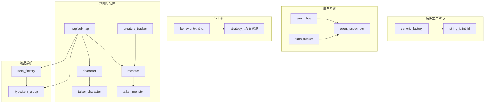
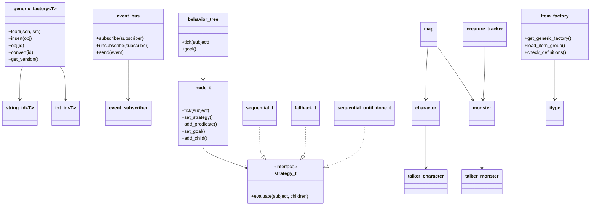
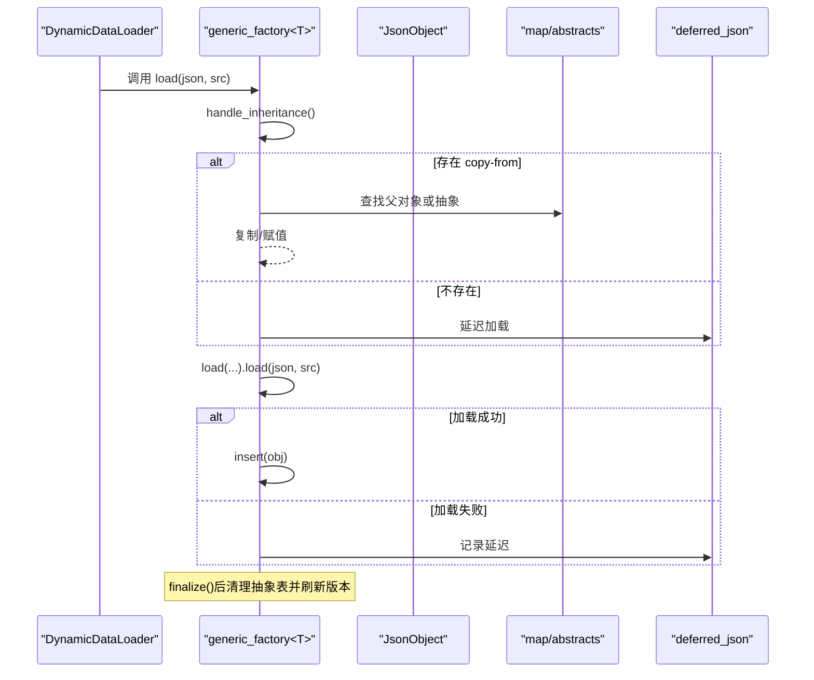
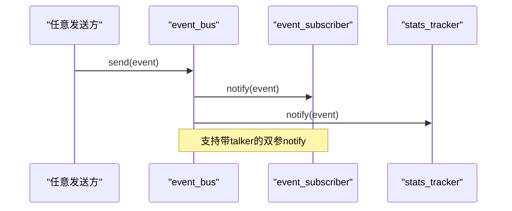
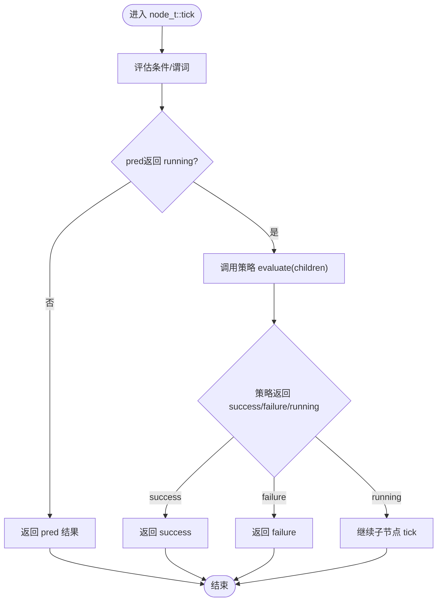
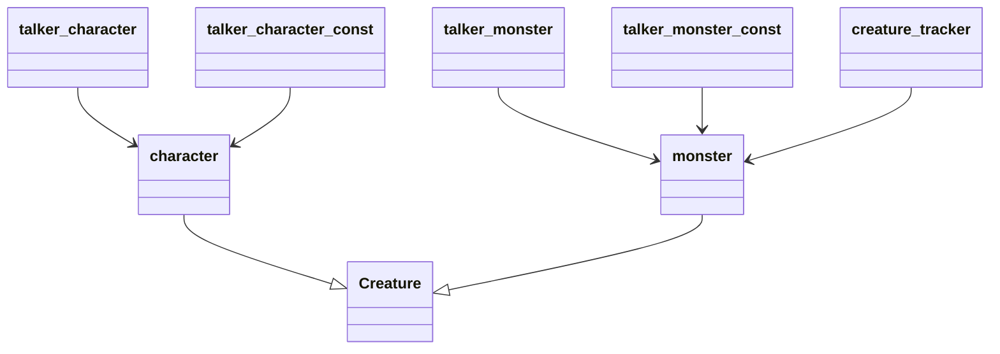
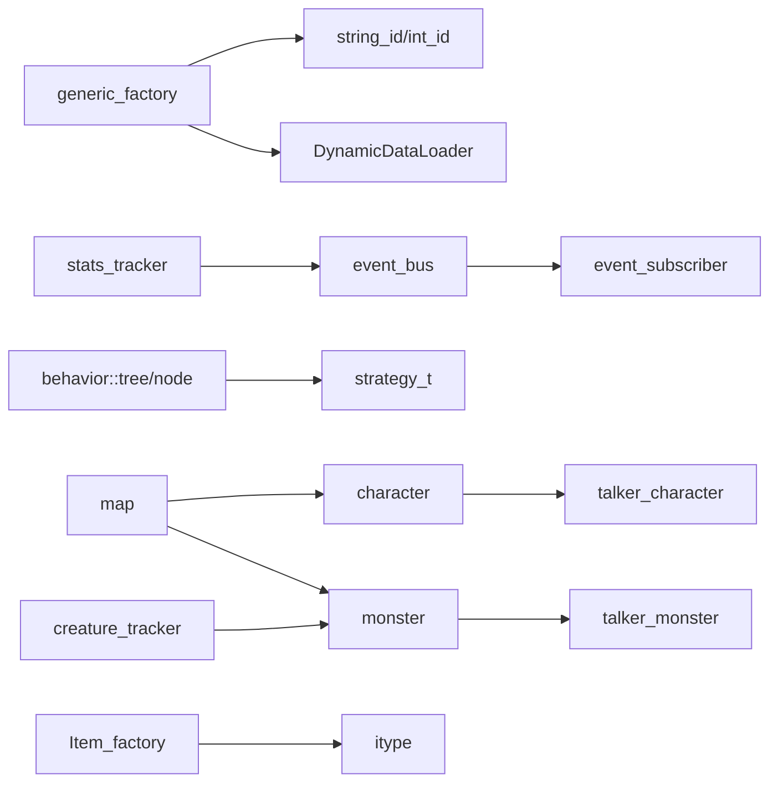

# 模块化设计与设计模式

<cite>
**本文引用的文件**
- generic_factory.h
- ordered_static_globals.cpp
- event_subscriber.h
- event_bus.cpp
- behavior_strategy.h
- behavior_strategy.cpp
- behavior.h
- behavior.cpp
- stats_tracker.h
- map.h
- item_factory.h
- itype.h
- monster.h
- character.h
- talker_character.h
- talker_character.cpp
- talker_monster.cpp
- creature_tracker.h
- character.cpp
</cite>

## 目录
1. [引言](#引言)
2. [项目结构](#项目结构)
3. [核心组件](#核心组件)
4. [架构总览](#架构总览)
5. [详细组件分析](#详细组件分析)
6. [依赖分析](#依赖分析)
7. [性能考量](#性能考量)
8. [故障排查指南](#故障排查指南)
9. [结论](#结论)
10. [附录](#附录)

## 引言
本文件面向Cataclysm-DDA（CDDA）项目的模块化设计与设计模式应用，系统梳理其在运行时数据加载、事件通信、行为树决策、以及核心实体（地图、角色、物品、怪物）之间的边界与交互协议。重点覆盖以下设计模式与机制：
- 工厂模式：通用泛型工厂generic_factory及其与字符串ID体系的协作，支撑JSON驱动的类型注册与继承。
- 观察者模式：事件总线event_bus与事件订阅者event_subscriber的发布/订阅模型。
- 策略模式：行为树节点的执行策略（顺序、回退、直到完成），通过策略映射进行配置化选择。
- 单例模式：通过静态全局初始化与版本号机制，确保工厂与全局对象的有序构造与失效。
- 抽象接口与多态：talker系列接口统一不同实体的对话/信息访问；Creature派生体系实现角色与怪物的共同能力。

## 项目结构
CDDA采用“按功能域分层”的组织方式，核心模块位于src目录：
- 数据工厂与ID系统：generic_factory、string_id/int_id、DynamicDataLoader注册流程
- 事件系统：event_subscriber、event_bus、stats_tracker
- 行为树：behavior_strategy、behavior
- 地图与子地图：map、submap、item_stack、field等
- 实体与交互：character、monster、talker_*、creature_tracker
- 物品系统：item_factory、itype、item_group

图表来源
- generic_factory.h
- event_subscriber.h
- event_bus.cpp
- behavior_strategy.h
- behavior.h
- map.h
- item_factory.h
- itype.h
- character.h
- monster.h
- talker_character.h
- talker_monster.cpp
- creature_tracker.h

章节来源
- generic_factory.h
- map.h
- item_factory.h
- itype.h
- behavior.h
- behavior_strategy.h
- event_subscriber.h
- event_bus.cpp
- stats_tracker.h
- character.h
- monster.h
- talker_character.h
- talker_character.cpp
- talker_monster.cpp
- creature_tracker.h

## 核心组件
- 通用工厂`generic_factory<T>`：负责从JSON加载、继承复制、抽象定义、延迟加载、版本控制与缓存失效，提供string_id/int_id到对象实例的查询接口。
- 事件系统：event_subscriber定义订阅接口，event_bus管理订阅者集合并广播事件；stats_tracker继承event_subscriber以统计事件。
- 行为树：strategy_t定义策略接口，sequential_t/fallback_t/sequential_until_done_t提供不同遍历策略；behavior树封装节点、条件、目标与tick流程。
- 地图系统：map承载地形、家具、物品栈、路径、视野、场等；与submap、item_stack、field等协作。
- 角色与怪物：character与monster均继承Creature，使用talker_*适配器统一对话/位置/状态访问；creature_tracker维护临时ID与位置更新。
- 物品系统：Item_factory集中管理itype与item_group，配合generic_factory实现物品模板与随机掉落组。

章节来源
- generic_factory.h
- event_subscriber.h
- event_bus.cpp
- stats_tracker.h
- behavior_strategy.h
- behavior.h
- map.h
- character.h
- monster.h
- item_factory.h
- itype.h

## 架构总览
CDDA通过“工厂+ID+事件+行为树+实体”五条主线实现模块化：
- 数据工厂与ID：所有可配置类型（如物品、怪物、地图生成参数等）经由generic_factory注册，使用string_id作为稳定标识，支持继承与延迟加载。
- 事件系统：全局事件总线对游戏内各类事件进行广播，订阅者（含统计追踪器）按需响应。
- 行为树：行为树节点通过策略组合实现优先级与短路逻辑，便于配置化行为。
- 地图与实体：地图作为容器聚合实体与物品；角色与怪物共享Creature基类能力并通过talker适配器暴露统一接口。
- 物品系统：Item_factory集中管理物品模板与掉落组，与地图/角色交互。

图表来源
- generic_factory.h
- event_subscriber.h
- event_bus.cpp
- behavior_strategy.h
- behavior.h
- map.h
- character.h
- monster.h
- item_factory.h
- itype.h

## 详细组件分析

### 工厂模式：generic_factory 与 JSON 驱动的数据加载
- 继承与抽象：支持“copy-from”继承与“abstract”抽象定义，延迟加载deferred_json在finalize阶段统一处理。
- 版本与缓存：内部版本version与string_id缓存协同，插入新对象会递增版本，使旧缓存失效，保证查询一致性。
- 查询接口：提供string_id/int_id双向转换、有效性检查、范围迭代与一次性finalization。
- 使用建议：类型T需实现load/检查/可选check，配合string_id重定向至工厂load/reset/finalize。

图表来源
- generic_factory.h
- generic_factory.h

章节来源
- generic_factory.h
- generic_factory.h
- generic_factory.h

### 观察者模式：事件总线与订阅者
- 接口契约：event_subscriber定义notify回调；event_bus维护订阅列表，支持普通事件与带talker的事件广播。
- 生命周期：订阅者析构时自动取消订阅；重复订阅与错误退订有保护与调试提示。
- 扩展点：stats_tracker继承event_subscriber，聚合事件并提供统计查询。

图表来源
- event_subscriber.h
- event_bus.cpp
- stats_tracker.h

章节来源
- event_subscriber.h
- event_bus.cpp
- stats_tracker.h

### 策略模式：行为树策略与执行流程
- 策略接口：strategy_t定义evaluate(subject, children)，具体策略包括顺序执行、回退执行、顺序直到成功。
- 行为树：tree.tick返回当前目标，node_t根据策略与谓词决定子节点遍历顺序与短路条件。
- 配置化：strategy_map提供名称到策略实例的映射，便于JSON配置。

图表来源
- behavior.h
- behavior.cpp
- behavior_strategy.h
- behavior_strategy.cpp

章节来源
- behavior.h
- behavior.cpp
- behavior_strategy.h
- behavior_strategy.cpp

### 单例模式与全局初始化
- 全局初始化：ordered_static_globals在启动时调用若干工厂/类型初始化函数，确保静态全局对象的有序构造。
- 版本失效：generic_factory通过版本号使string_id缓存失效，避免脏读。

章节来源
- ordered_static_globals.cpp
- generic_factory.h

### 地图系统：模块边界与交互协议
- 边界：map作为容器聚合terrain/furniture/items/fields/vehicles；与submap、item_stack、field等协作。
- 交互：地图提供坐标系转换、越界裁剪、可见性变量、路径规划设置等；与角色/怪物交互通过位置与状态查询。
- 接口：地图提供abs/bub/omt坐标转换、边界检查、clip_to_bounds等工具方法。

章节来源
- map.h
- map.h

### 角色系统：接口抽象与多态
- 抽象接口：talker_character/talker_character_const统一角色的状态/位置/属性访问；talker_monster/talker_monster_const同理。
- 继承体系：character与monster均继承Creature，共享基础能力；creature_tracker提供临时ID与位置更新。
- 交互：角色与怪物均可作为talker参与对话/状态查询；地图与NPC/玩家交互通过talker适配器。

图表来源
- character.h
- monster.h
- talker_character.h
- talker_character.cpp
- talker_monster.cpp
- creature_tracker.h

章节来源
- character.h
- monster.h
- talker_character.h
- talker_character.cpp
- talker_monster.cpp
- creature_tracker.h

### 物品系统：模板与掉落组
- Item_factory：集中管理itype与item_group，提供初始化、重置、一致性检查、黑名单加载、查找与筛选等接口。
- itype：物品模板，包含槽位、使用函数、计数动作、掉落前/后动作等；通过generic_factory注册。
- 交互：地图/角色通过Item_factory获取模板与随机掉落组，生成实际物品。

章节来源
- item_factory.h
- item_factory.h
- itype.h

## 依赖分析
- 工厂与ID：generic_factory依赖string_id/int_id、DynamicDataLoader、mod_tracker；通过版本号与缓存协同。
- 事件系统：event_bus依赖event_subscriber、talker；stats_tracker依赖event_multiset与cata_variant。
- 行为树：behavior依赖behavior_strategy与behavior_oracle；strategy_map提供策略实例映射。
- 地图与实体：map依赖character/monster/item_stack/field等；creature_tracker依赖monster与临时ID。
- 物品系统：Item_factory依赖generic_factory<itype>与item_group；itype依赖use_function与slot类型。

图表来源
- generic_factory.h
- event_bus.cpp
- behavior.h
- behavior_strategy.h
- map.h
- character.h
- monster.h
- item_factory.h
- itype.h

章节来源
- generic_factory.h
- event_bus.cpp
- behavior.h
- behavior_strategy.h
- map.h
- character.h
- monster.h
- item_factory.h
- itype.h

## 性能考量
- 工厂版本与缓存：通过版本号递增使string_id缓存失效，避免重复查找成本；finalize阶段统一刷新ID映射，减少后续查询开销。
- 延迟加载：deferred_json在一次批量加载后统一处理，降低多次解析与插入的抖动。
- 事件广播：订阅者列表线性遍历，建议控制订阅数量与事件频率；必要时在订阅侧做本地过滤。
- 行为树策略：策略evaluate按配置顺序短路，合理组织节点优先级可减少无效计算。
- 地图与实体：item_stack限制每格最大物品数，避免过量堆叠导致的渲染与碰撞检测开销。

## 故障排查指南
- 工厂加载失败：检查JSON是否同时指定abstract与id；确认copy-from引用是否存在；查看was_loaded与deferred记录。
- 事件未送达：确认订阅者是否已加入event_bus；检查notify签名匹配；关注重复订阅与错误退订的调试消息。
- 行为树无输出：核对策略映射与节点条件；验证tick返回值与active_node切换。
- 地图坐标异常：使用inbounds/clip_to_bounds校验坐标；确认abs/bub/omt转换链路。
- 物品掉落异常：检查item_group权重与黑名单；确认itype槽位与使用函数配置。

章节来源
- generic_factory.h
- generic_factory.h
- event_bus.cpp
- behavior.cpp
- map.h
- item_factory.h

## 结论
CDDA通过工厂+ID+事件+行为树+实体的模块化架构，实现了高度可扩展与可配置的游戏系统。工厂模式统一了JSON驱动的数据加载与继承；观察者模式提供了松耦合的事件传播；策略模式让行为树具备灵活的执行策略；抽象接口与多态保证了角色/怪物的统一交互。上述设计模式与模块边界共同构成了CDDA可扩展、可维护的核心骨架。

## 附录
- 最佳实践
  - 类型T实现load/check，并在string_id中转发至工厂；在reset/finalize中清理缓存与连接。
  - 事件订阅者应避免重复订阅；在析构时确保退订。
  - 行为树节点按优先级组织，策略按场景选择；条件谓词尽量短小明确。
  - 地图操作前后校验坐标与边界；物品掉落组权重与黑名单需定期审查。