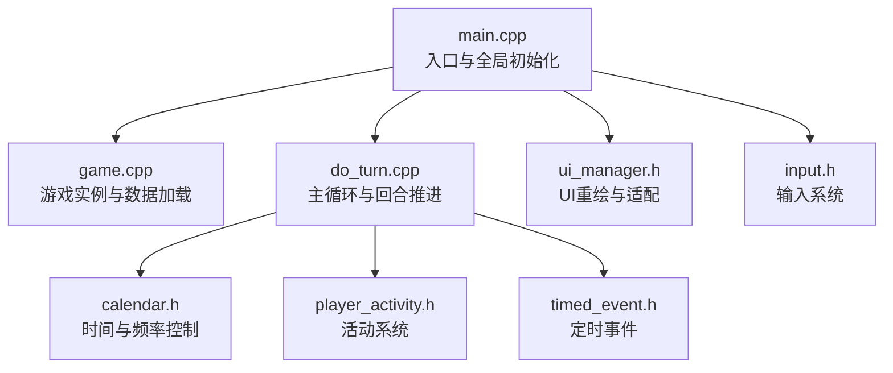
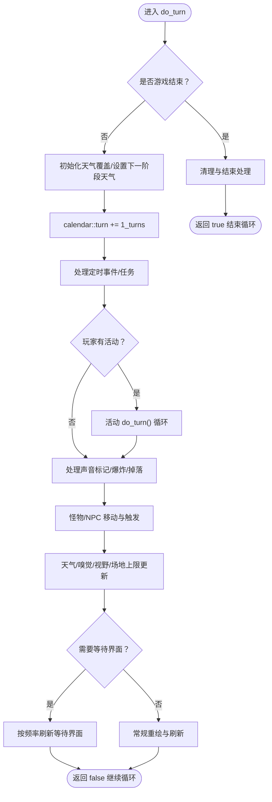
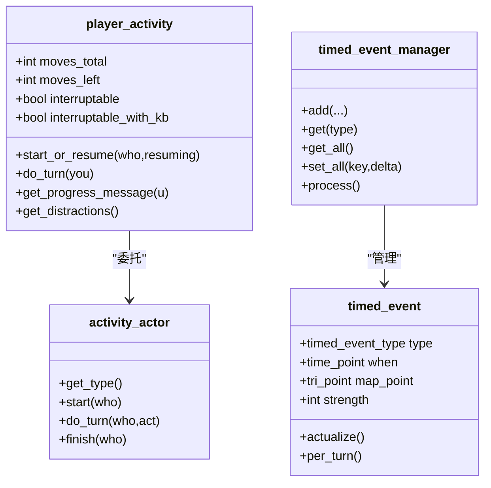
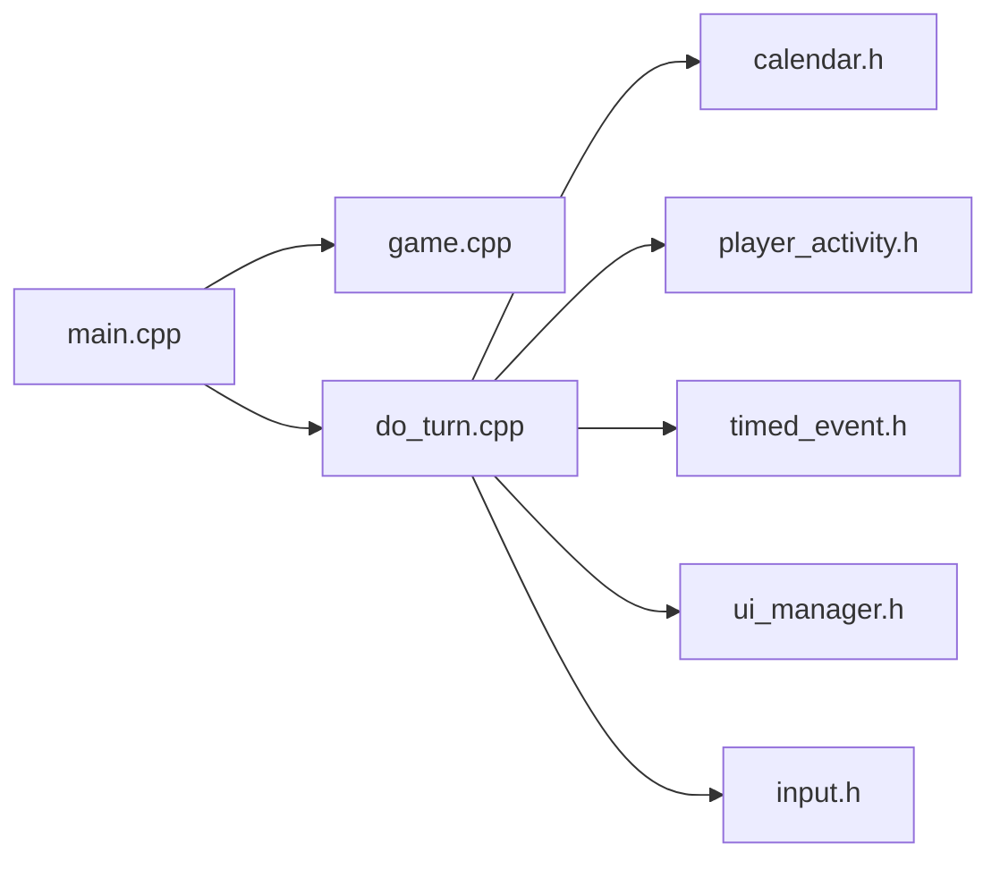

# 游戏主循环与生命周期

<cite>
**本文档引用的文件**
- main.cpp
- game.cpp
- do_turn.cpp
- game.h
- calendar.h
- player_activity.h
- timed_event.h
- input.h
- ui_manager.h
</cite>

## 目录
1. [引言](#引言)
2. [项目结构](#项目结构)
3. [核心组件](#核心组件)
4. [架构总览](#架构总览)
5. [详细组件分析](#详细组件分析)
6. [依赖关系分析](#依赖关系分析)
7. [性能考量](#性能考量)
8. [故障排查指南](#故障排查指南)
9. [结论](#结论)

## 引言
本文件面向Cataclysm-DDA（CDDA）的游戏主循环系统，聚焦于游戏主控制器的设计理念与实现细节，涵盖以下主题：
- 游戏生命周期管理：从启动、加载、进入主循环到退出的完整流程
- 回合制时间推进机制：基于“行动点数”（moves）与“时间轮转”的调度
- 帧率控制策略：通过输入轮询、等待界面刷新与事件驱动的渲染
- 主循环执行流程：初始化、运行、结束清理的全过程
- 时间管理系统：日历系统、定时事件、异步事件处理
- 状态转换与错误恢复：死亡、退出、观察模式等状态切换
- 关键函数调用关系与数据流：以图示方式呈现

## 项目结构
围绕主循环的关键源文件与职责如下：
- main.cpp：程序入口、命令行解析、全局初始化、主菜单与主循环入口
- game.cpp：游戏实例管理、静态数据加载、世界与模组数据加载、UI初始化
- do_turn.cpp：主游戏循环（do_turn）、回合推进、AI与NPC移动、天气与环境更新、活动与定时事件处理
- game.h：游戏类定义、状态枚举、前置声明与友元接口
- calendar.h：时间度量、频率判定工具、回合计数
- player_activity.h：玩家活动系统（含活动演员模型）
- timed_event.h：定时事件队列与处理
- input.h：输入系统与按键常量
- ui_manager.h：UI适配器与重绘管理



图表来源
- main.cpp
- game.cpp
- do_turn.cpp
- calendar.h
- player_activity.h
- timed_event.h
- ui_manager.h
- input.h

章节来源
- main.cpp
- game.cpp

## 核心组件
- 游戏实例（game）：持有地图、角色、天气、定时事件等核心状态；负责数据加载与世界生成
- 主循环（do_turn）：单次回合的完整处理流程，包含输入处理、活动推进、AI/NPC移动、环境更新
- 日历系统（calendar）：提供回合计数、频率判定（once_every）、时间换算
- 活动系统（player_activity）：封装玩家正在进行的活动，按回合消耗moves并可中断
- 定时事件（timed_event）：在特定时间点触发的事件队列，如爆炸、特殊天气等
- 输入系统（input）：按键与组合键映射，支持键盘与手柄
- UI管理（ui_manager）：统一的UI绘制与窗口管理，保证重绘一致性

章节来源
- game.h
- do_turn.cpp
- calendar.h
- player_activity.h
- timed_event.h
- input.h
- ui_manager.h

## 架构总览
主循环采用“回合驱动”的架构：每次循环推进一个回合（calendar::turn += 1_turns），随后按顺序处理玩家输入、活动、AI/NPC、环境与天气、定时事件等。输入与渲染通过UI管理器协调，确保在不同终端与图形后端下的一致性。

```mermaid
sequenceDiagram
participant Main as "main.cpp"
participant Menu as "主菜单"
participant Game as "game.cpp"
participant Loop as "do_turn.cpp"
participant Cal as "calendar.h"
participant Act as "player_activity.h"
participant Tim as "timed_event.h"
participant UI as "ui_manager.h"
Main->>Menu : 打开开始界面
Menu-->>Main : 返回选择
Main->>Game : 创建或获取UI适配器
Game-->>Main : 初始化完成
loop 主循环
Main->>Loop : 调用 do_turn()
Loop->>Cal : 日历推进 calendar : : turn += 1_turns
Loop->>Act : 处理玩家活动 do_turn()
Loop->>Tim : 处理定时事件 process()
Loop->>Loop : 处理爆炸/声音/视野/掉落/移动
Loop->>UI : 触发重绘与刷新
end
```

图表来源
- main.cpp
- do_turn.cpp
- calendar.h
- player_activity.h
- timed_event.h
- ui_manager.h

## 详细组件分析

### 组件A：主循环与回合推进（do_turn）
- 设计要点
  - 单回合推进：每次循环增加日历回合，触发天气更新、定时事件处理与各类一次性频率事件
  - 行动点数（moves）驱动：玩家与NPC的移动与行为由moves决定，活动完成后自动消耗
  - 输入优先级：在有活动或睡眠状态下，限制高频输入轮询，避免卡顿
  - 等待界面：当存在活动或睡眠时，显示进度提示并按频率刷新
- 关键流程
  - 新游戏初始化天气覆盖与下一阶段天气设定
  - 处理定时事件与任务
  - 玩家活动推进（可能多次）
  - 声音标记处理、爆炸处理、掉落与掉落物处理
  - 怪物与NPC移动、嗅觉与视野缓存更新
  - 天气效果、体力与湿气、情绪更新
  - 等待界面与重绘控制
- 数据流
  - 日历时间 → moves消耗 → 活动推进 → AI/NPC移动 → 环境更新 → UI重绘



图表来源
- do_turn.cpp
- calendar.h
- player_activity.h
- timed_event.h

章节来源
- do_turn.cpp

### 组件B：游戏生命周期与启动序列（main.cpp 与 game.cpp）
- 启动流程
  - 命令行参数解析与路径初始化
  - 全局选项加载与语言设置
  - 初始化UI与终端尺寸
  - 创建游戏实例并加载静态数据
  - 进入主菜单循环，每次菜单结束后创建UI适配器并启动主循环
- 生命周期节点
  - 静态数据加载（不依赖模组）
  - 模组数据校验与加载
  - 世界生成与地图缓冲区准备
  - 主循环入口与退出清理

```mermaid
sequenceDiagram
participant OS as "操作系统"
participant Main as "main.cpp"
participant Game as "game.cpp"
participant Menu as "主菜单"
participant Loop as "do_turn.cpp"
OS->>Main : 启动进程
Main->>Main : 解析命令行/设置路径/语言
Main->>Game : 创建游戏实例 g
Game->>Game : load_static_data()
loop 主菜单循环
Main->>Menu : opening_screen()
Menu-->>Main : 选择结果
Main->>Game : create_or_get_main_ui_adaptor()
Main->>Loop : do_turn() 循环
end
Main->>Main : 退出处理 exit_handler()
```

图表来源
- main.cpp
- game.cpp
- do_turn.cpp

章节来源
- main.cpp
- game.cpp

### 组件C：时间管理与频率控制（calendar.h）
- 时间度量
  - time_point/ time_duration：封装回合、秒、分钟、小时、天等单位
  - once_every：按频率触发的谓词，用于周期性事件（如每日、每小时、每2.5分钟）
- 行动点数与时间
  - 行动点数（moves）作为回合内可用资源，活动消耗moves，AI/NPC亦受moves限制
  - 等待界面根据活动类型与频率动态调整刷新速率

章节来源
- calendar.h
- do_turn.cpp

### 组件D：活动系统与异步事件（player_activity.h 与 timed_event.h）
- 活动系统
  - player_activity：封装活动类型、总耗时、剩余耗时、可中断性、打断提示等
  - activity_actor：活动的具体实现者，支持新式活动模型
  - do_turn：按回合推进活动，完成后执行收尾逻辑
- 定时事件
  - timed_event：在特定时间点触发的事件，携带位置、强度、类型等信息
  - timed_event_manager：事件队列管理，提供添加、查询、批量处理与序列化



图表来源
- player_activity.h
- timed_event.h

章节来源
- player_activity.h
- timed_event.h

### 组件E：输入与UI（input.h 与 ui_manager.h）
- 输入系统
  - 键码常量与平台无关的按键映射
  - 动作属性与组合键绑定
- UI管理
  - ui_adaptor：UI栈管理、重绘回调、屏幕尺寸变化回调
  - 在主循环中通过重绘与刷新保证界面一致性

章节来源
- input.h
- ui_manager.h

## 依赖关系分析
- 主循环对日历系统的依赖：回合推进与频率判定
- 主循环对活动系统的依赖：玩家活动的推进与中断
- 主循环对定时事件的依赖：按时间点触发的事件处理
- 主循环对UI管理的依赖：重绘与刷新控制
- 启动序列对游戏实例的依赖：静态数据加载与世界生成



图表来源
- main.cpp
- game.cpp
- do_turn.cpp
- calendar.h
- player_activity.h
- timed_event.h
- ui_manager.h
- input.h

章节来源
- main.cpp
- do_turn.cpp

## 性能考量
- 行动点数限制：通过moves限制AI/NPC与玩家的单回合行为次数，避免过长的单次循环
- 频率控制：使用once_every减少每回合重复计算（如每日、每小时、每2.5分钟事件）
- 输入轮询节流：在等待界面或睡眠状态下降低输入轮询频率，减少CPU占用
- 缓存与预计算：天气温度缓存、视野缓存、地板缓存等，减少重复计算
- UI重绘批处理：通过UI管理器统一重绘，避免频繁刷新导致的闪烁与性能损耗

## 故障排查指南
- 死亡/退出状态
  - 游戏结束时进行清理：移除怪物、保存派系/任务、保存地图、成就与纪念文件
  - 世界保留策略：根据配置决定删除、重置或保留
- 无限循环保护
  - NPC决策循环中检测无进展并强制重启，防止卡死
- 输入异常
  - 使用输入管理器处理按键与组合键，确保跨平台一致性
- UI闪烁与错位
  - 通过UI适配器的重绘回调与屏幕尺寸回调，确保在窗口大小变化时正确刷新

章节来源
- do_turn.cpp
- do_turn.cpp
- input.h
- ui_manager.h

## 结论
CDDA的主循环以回合制为核心，结合行动点数、日历频率与活动系统，实现了稳定而灵活的游戏节奏。通过定时事件与AI/NPC的协同推进，配合输入与UI的节流与批处理，系统在多平台环境下保持一致的体验与性能表现。理解主循环的数据流与状态转换，有助于进一步优化与扩展游戏功能。