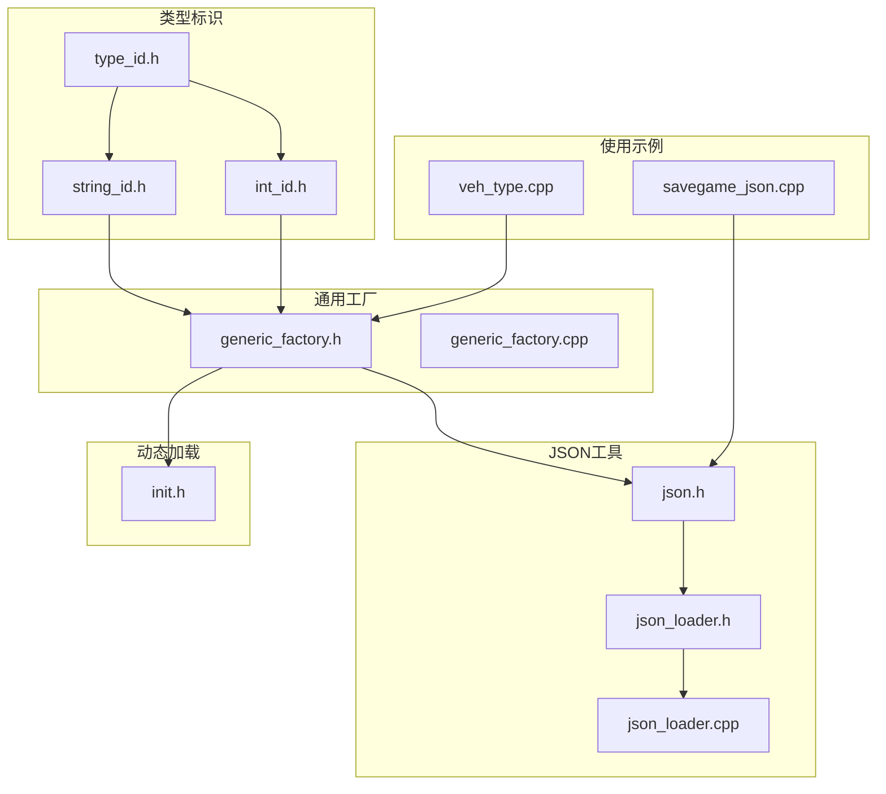
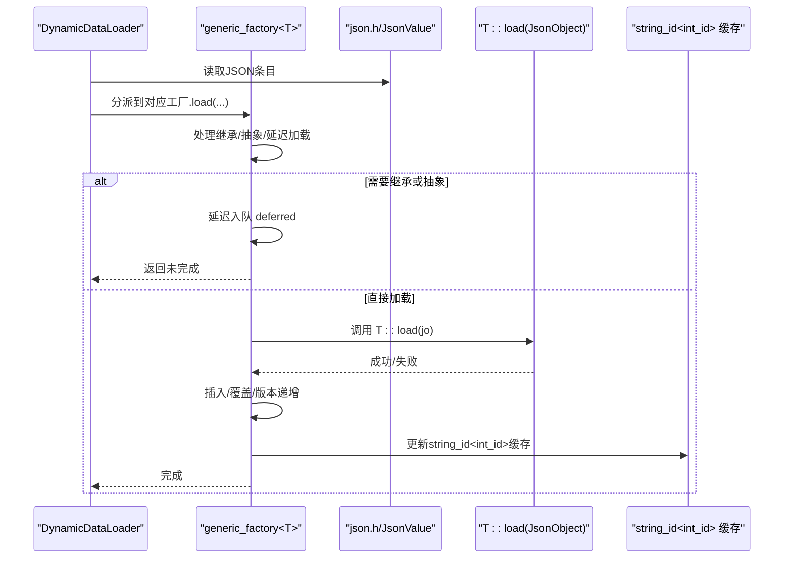
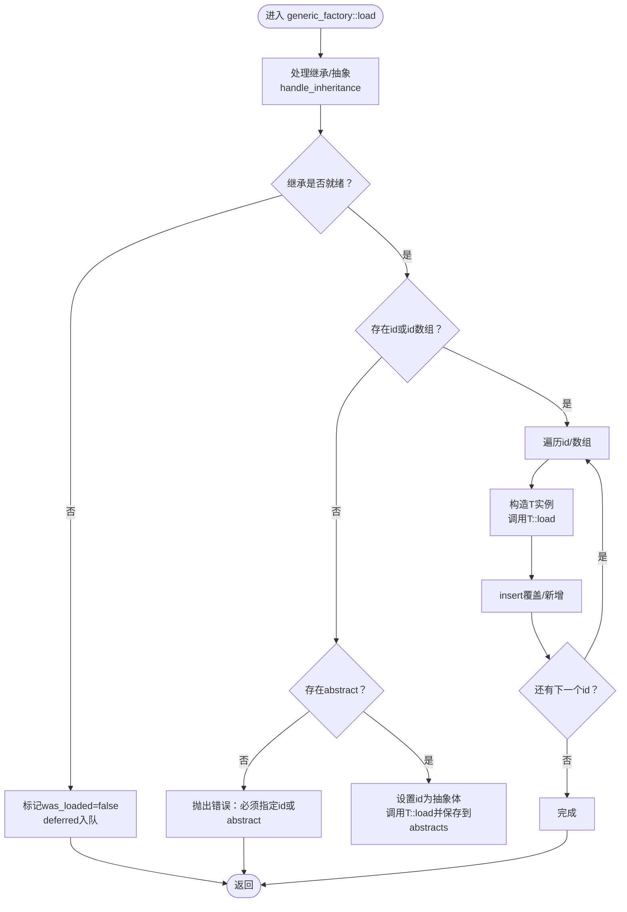
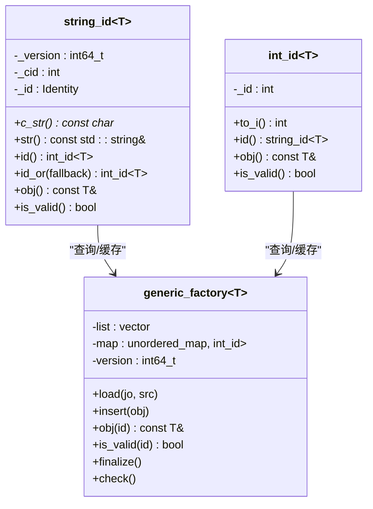
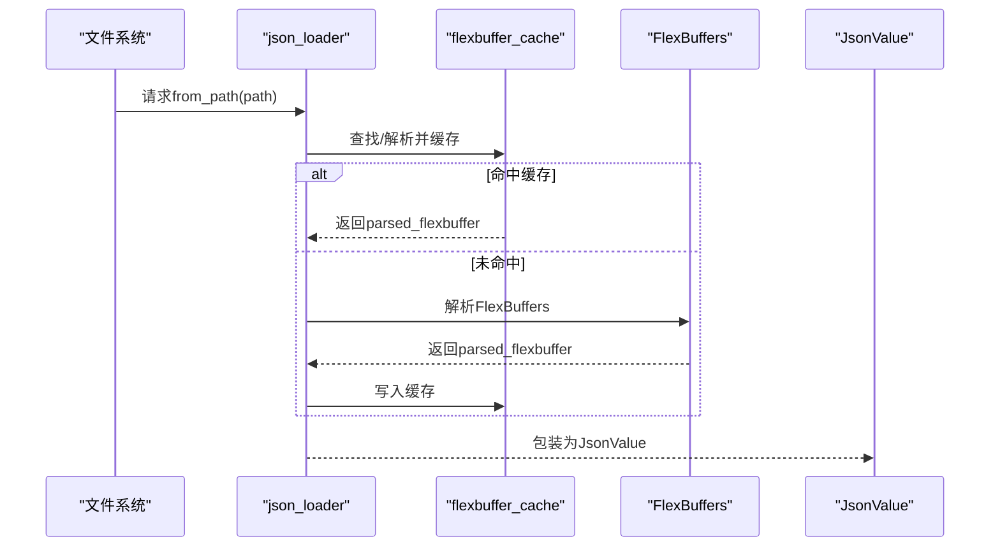
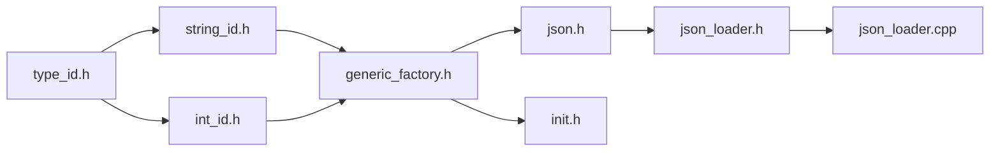

# 数据系统

<cite>
**本文引用的文件**
- generic_factory.h
- generic_factory.cpp
- type_id.h
- string_id.h
- int_id.h
- json.h
- json_loader.h
- json_loader.cpp
- init.h
- veh_type.cpp
- savegame_json.cpp
</cite>

## 目录
1. [简介](#简介)
2. [项目结构](#项目结构)
3. [核心组件](#核心组件)
4. [架构总览](#架构总览)
5. [详细组件分析](#详细组件分析)
6. [依赖关系分析](#依赖关系分析)
7. [性能考量](#性能考量)
8. [故障排查指南](#故障排查指南)
9. [结论](#结论)
10. [附录](#附录)

## 简介
本文件面向Cataclysm-DDA的数据系统，系统性阐述以下主题：
- JSON配置文件格式与加载流程
- 通用工厂模式（generic_factory）的设计与实现
- 类型系统（string_id/int_id/type_id）的协作机制
- 数据解析、类型安全与验证规则
- 类型注册、数据继承与合并策略
- 冲突解决与版本控制
- 最佳实践与性能优化建议

目标是帮助开发者在不深入源码细节的前提下，理解并正确使用数据系统；同时为高级用户提供可操作的优化与扩展指导。

## 项目结构
数据系统由“类型标识体系 + 通用工厂 + JSON解析器 + 动态加载器”构成，核心文件分布如下：
- 类型标识：string_id.h、int_id.h、type_id.h
- 通用工厂：generic_factory.h/.cpp
- JSON工具：json.h、json_loader.h/.cpp
- 动态加载：init.h
- 使用示例：veh_type.cpp（车辆类型/部件）、savegame_json.cpp（存档序列化）

图表来源
- string_id.h
- int_id.h
- type_id.h
- generic_factory.h
- generic_factory.cpp
- json.h
- json_loader.h
- json_loader.cpp
- init.h
- veh_type.cpp
- savegame_json.cpp

章节来源
- generic_factory.h
- json.h

## 核心组件
- 类型标识体系
  - string_id<T>：强类型字符串标识，支持静态/动态两种内部实现，具备缓存与版本控制，便于跨模组安全复用。
  - int_id<T>：强类型整数标识，适合运行时快速访问；不保证跨游戏重启一致性。
  - type_id.h：集中声明各类别标识类型，避免重复定义。
- 通用工厂 generic_factory<T>
  - 统一管理对象生命周期：加载、覆盖、查询、版本失效、最终化。
  - 支持“抽象体/具体体/继承”三态模型与延迟加载。
  - 提供mandatory/optional辅助读取函数，统一错误处理。
- JSON解析与加载
  - json.h：TextJsonIn/TextJsonObject等，提供流式与对象式读取，支持自定义反序列化。
  - json_loader.*：基于FlexBuffer缓存的高性能JSON加载器，支持路径/字符串两种输入。
- 动态加载器 DynamicDataLoader
  - 负责扫描资源、建立类型到加载函数的映射、分发加载、最终化与一致性检查。

章节来源
- string_id.h
- int_id.h
- type_id.h
- generic_factory.h
- json.h
- json_loader.h
- json_loader.cpp
- init.h

## 架构总览
数据系统采用“类型标识 + 工厂 + JSON解析 + 动态加载”的分层架构：
- 类型标识层：确保不同类别ID互斥且可比较，提供稳定跨重启的字符串ID。
- 工厂层：封装对象集合、索引、版本、继承与合并逻辑。
- 解析层：提供灵活的JSON读取能力与错误定位。
- 加载层：按类型注册加载器，统一调度加载、最终化与校验。

图表来源
- init.h
- generic_factory.h
- json.h

## 详细组件分析

### 通用工厂模式 generic_factory<T>
- 设计要点
  - 统一容器：vector<T>存储对象，unordered_map<string_id<T>, int_id<T>>提供索引。
  - 版本控制：version字段与string_id中的_version配合，实现缓存失效与一致性。
  - 继承与抽象：支持“copy-from”继承与“abstract”抽象体，抽象体仅用于被继承。
  - 延迟加载：当依赖未就绪时，将JSON加入deferred列表，最终化阶段重试。
  - 辅助读取：mandatory/optional统一处理缺失与类型错误，并尊重was_loaded标志。
- 关键流程
  - handle_inheritance：解析copy-from与abstract，必要时延迟加载。
  - load：根据id或id数组批量加载，调用T::load并插入容器。
  - insert：覆盖同名ID，触发版本递增以失效旧缓存。
  - finalize：加载延迟项、清理抽象体、刷新缓存版本。
  - check：遍历调用T::check进行一致性校验。
- 错误处理
  - 必填字段缺失、类型不匹配、非法比例因子等均通过JsonError抛出，包含精确位置信息。

图表来源
- generic_factory.h
- generic_factory.h

章节来源
- generic_factory.h
- generic_factory.cpp

### 类型系统：string_id/int_id/type_id
- `string_id<T>`
  - 强类型字符串ID，支持静态（interned）与动态两种实现，内部以Identity承载。
  - 提供缓存：_cid/_version，首次查找后缓存至string_id实例，后续O(1)命中。
  - 与generic_factory协作：find_id通过map查找并写回缓存，版本不一致则重新解析。
- `int_id<T>`
  - 强类型整数ID，适合运行时快速访问；不保证跨重启一致性。
  - 提供集合优化：int_id_set，小范围用bitset，大范围用哈希集。
- type_id.h
  - 集中声明各领域ID类型（如mtype_id、itype_id、vpart_id等），避免重复定义。

图表来源
- string_id.h
- int_id.h
- generic_factory.h

章节来源
- string_id.h
- int_id.h
- type_id.h

### JSON解析与加载
- json.h
  - TextJsonIn/TextJsonObject：提供流式与对象式读取，支持枚举、容器、自定义类型反序列化。
  - read重载丰富，自动处理数组/对象/位集/对等编码，异常包含行号与偏移。
- json_loader.*
  - 基于FlexBuffer缓存，加速重复读取；按路径根类型选择不同缓存目录。
  - 支持从文件路径与内存字符串加载，返回JsonValue包装的flexbuffers引用。

图表来源
- json_loader.cpp
- json_loader.h

章节来源
- json.h
- json_loader.h
- json_loader.cpp

### 动态加载器 DynamicDataLoader
- 职责
  - 初始化类型到加载函数的映射。
  - 扫描资源、分发加载、执行最终化与一致性检查。
  - 协调generic_factory::finalize与deferred重试。
- 与工厂协作
  - 每个类型注册其string_id<T>::load函数，由DynamicDataLoader统一调度。
  - 加载完成后调用各工厂finalize，触发延迟加载与缓存刷新。

章节来源
- init.h
- generic_factory.h

### 使用示例：车辆类型与部件
- 车辆原型与部件使用generic_factory进行管理，支持继承与变体。
- 在veh_type.cpp中可见工厂实例与类型注册，以及JSON中id/variant等字段的处理。

章节来源
- veh_type.cpp
- veh_type.cpp

### 存档序列化：JSON写入
- savegame_json.cpp展示如何将复杂对象（如vehicle_part）序列化为JSON，包括迁移、变体与嵌套结构。
- 体现了JSON读写的对称性与一致性要求。

章节来源
- savegame_json.cpp
- savegame_json.cpp

## 依赖关系分析
- 组件耦合
  - string_id/int_id与generic_factory双向协作：前者提供缓存与版本，后者提供索引与版本递增。
  - generic_factory依赖json.h进行数据读取与错误报告。
  - DynamicDataLoader负责编排加载顺序与最终化。
- 外部依赖
  - FlexBuffer缓存提升JSON加载性能。
  - 各类型通过type_id.h集中声明，降低头文件污染。

图表来源
- string_id.h
- int_id.h
- type_id.h
- generic_factory.h
- json.h
- json_loader.h
- json_loader.cpp
- init.h

章节来源
- generic_factory.h
- json.h
- json_loader.cpp
- init.h

## 性能考量
- string_id缓存
  - 首次查找会进行哈希表与数组访问，后续通过缓存直接O(1)命中。
  - 版本递增会失效所有string_id缓存，避免脏读，但可能带来短暂抖动。
- int_id_set优化
  - 小范围使用bitset，大范围回退哈希集，兼顾空间与时间。
- JSON加载
  - FlexBuffer缓存显著减少重复解析成本；按根路径选择缓存目录，避免IO争用。
- 工厂插入
  - insert触发版本递增与map重算，应尽量批量化插入以减少版本变更次数。

章节来源
- string_id.h
- int_id.h
- generic_factory.h
- json_loader.cpp

## 故障排查指南
- 常见错误与定位
  - 必填字段缺失：mandatory/optional会在缺失时抛错，包含成员名与上下文。
  - 类型不匹配：read系列函数在类型不符时抛错，定位到具体成员。
  - 继承依赖未就绪：copy-from引用不存在时，对象被延迟加载，最终化阶段重试。
- 排查步骤
  - 检查JSON中id/abstract/copy-from字段是否符合规范。
  - 确认类型注册是否正确，DynamicDataLoader是否已初始化。
  - 观察版本变化与缓存失效时机，避免在版本切换期间做假设性断言。
- 相关实现参考
  - JSON错误抛出与定位：json.h中的throw_error与line_number。
  - 延迟加载与重试：generic_factory.h中的deferred与finalize。

章节来源
- json.h
- generic_factory.h
- generic_factory.h

## 结论
Cataclysm-DDA的数据系统通过“强类型标识 + 通用工厂 + JSON解析 + 动态加载”的组合，实现了高可维护性与高性能的数据管理：
- 类型安全：string_id/int_id严格区分，避免跨类别误用。
- 可扩展：generic_factory统一了加载、继承、合并与最终化流程。
- 可靠性：完善的错误报告与延迟加载机制，保障数据完整性。
- 可优化：缓存、版本控制与FlexBuffer缓存共同提升性能。

## 附录

### JSON配置文件格式与最佳实践
- 字段规范
  - 必须字段：id或abstract二选一；若为数组id，表示批量定义。
  - 继承字段：copy-from引用另一个具体体或抽象体，支持链式继承。
  - 抽象体：仅作为模板，不可直接出现id。
- 建议
  - 优先使用抽象体组织共性属性，再以具体体覆盖差异。
  - 对于可变参数，使用proportional/relative辅助读取，保持一致性。
  - 将大型数据拆分为多个文件，按功能域组织，便于维护与增量加载。

章节来源
- generic_factory.h
- generic_factory.h

### 数据继承与合并策略
- 继承链
  - copy-from → 抽象体/具体体 → 具体体
  - 若引用不存在，对象被延迟，最终化阶段重试。
- 合并规则
  - 字段覆盖：具体体字段覆盖抽象体字段。
  - 数值类：支持proportional（缩放）与relative（叠加）两类修饰，按支持类型生效。
- 冲突解决
  - 同名字段：具体体优先。
  - 未就绪依赖：延迟加载，最终化阶段统一处理。

章节来源
- generic_factory.h
- generic_factory.h
- generic_factory.cpp