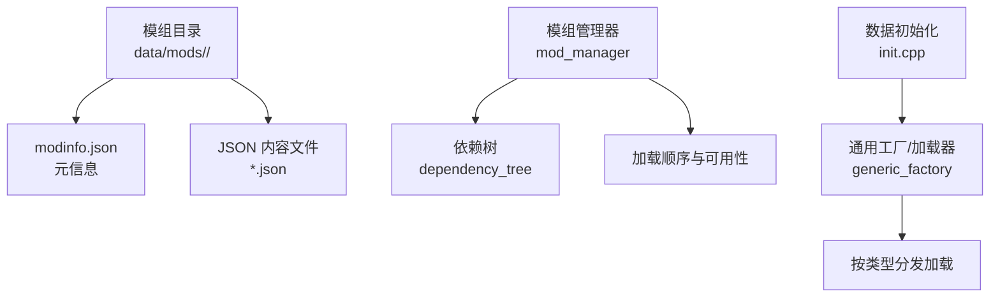
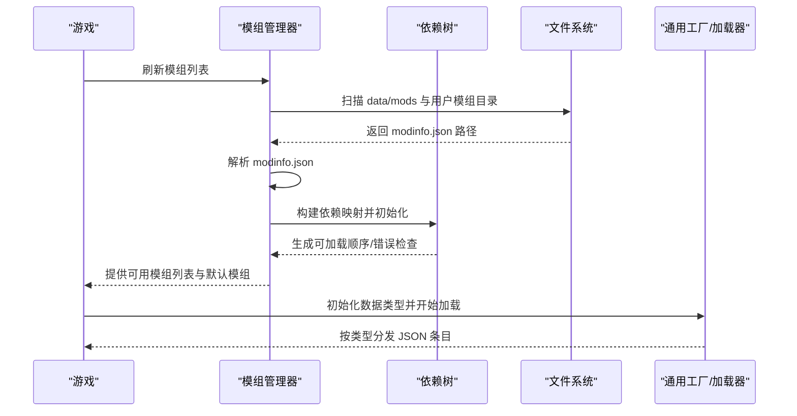
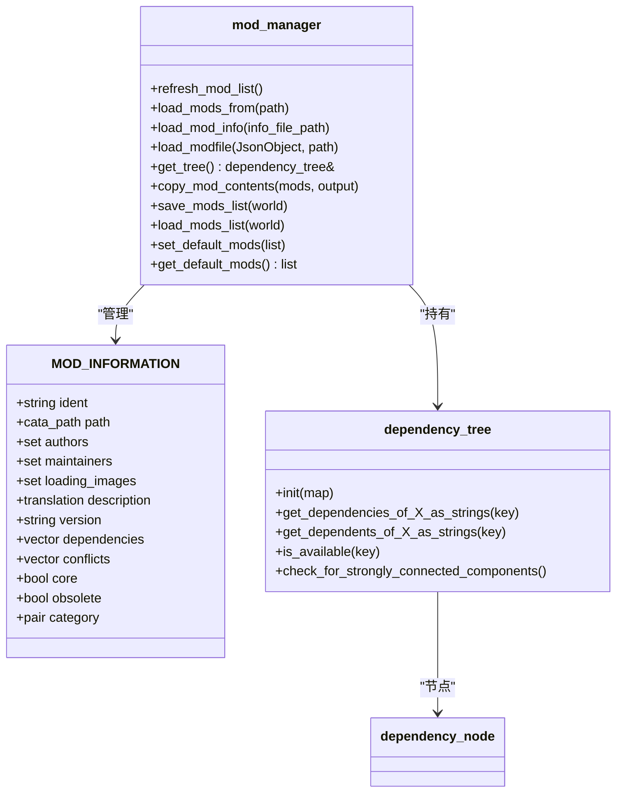
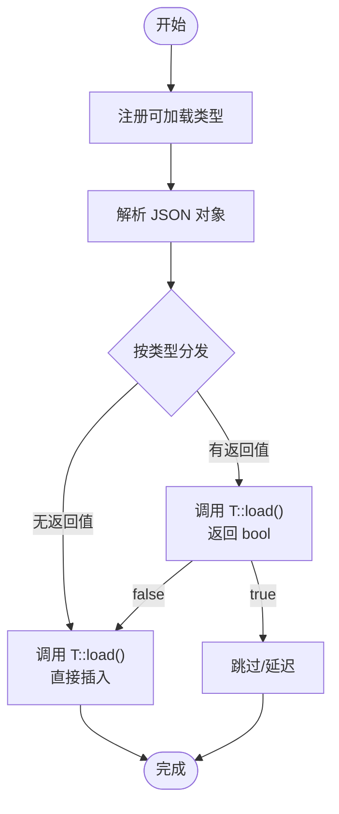
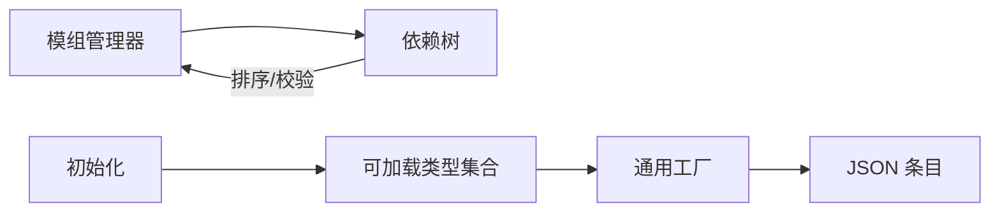

# 模组开发

<cite>
**本文引用的文件**
- doc/MODDING.md
- doc/MOD_COMPATIBILITY.md
- doc/JSON/JSON_INFO.md
- doc/TESTING_YOUR_CHANGES.md
- doc/CONTRIBUTING.md
- src/mod_manager.h
- src/mod_manager.cpp
- src/dependency_tree.h
- src/generic_factory.h
- src/loading_ui.h
- src/loading_ui.cpp
- src/init.cpp
- src/debug.cpp
- tools/format/format_main.cpp
</cite>

## 目录
1. [简介](#简介)
2. [项目结构](#项目结构)
3. [核心组件](#核心组件)
4. [架构总览](#架构总览)
5. [详细组件分析](#详细组件分析)
6. [依赖关系分析](#依赖关系分析)
7. [性能考量](#性能考量)
8. [故障排查指南](#故障排查指南)
9. [结论](#结论)
10. [附录](#附录)

## 简介
本指南面向希望为 Cataclysm: Dark Days Ahead（CDDA）开发模组（Mod）的创作者，系统讲解模组开发环境搭建、工具链与调试技术；深入解析模组API（以JSON数据定义为主）、扩展点与限制；覆盖模组发布流程、版本管理与兼容性保障；并提供测试策略、性能优化建议、常见问题解决方案、开发模板与最佳实践，以及社区支持与贡献流程。

## 项目结构
- 模组元数据与内容组织
  - 模组通过在指定目录下放置包含元信息的文件来被游戏识别与加载。
  - 核心元信息文件为 modinfo.json，用于声明模组标识、名称、作者、描述、分类、依赖等。
  - 模组内容由多个 JSON 文件组成，分布在模组根目录或其子目录中，游戏会递归扫描这些文件。
- 数据加载与类型注册
  - 游戏在启动阶段初始化各类“可加载类型”，并将 JSON 中的条目按类型分发到对应的工厂或加载器进行处理。
- 模组管理与加载顺序
  - 模组管理器负责发现、读取、校验 modinfo，并基于依赖关系构建加载树，决定加载顺序与可用性。
- 动态交互内容
  - 某些模组可通过“交互目录”在特定其他模组激活时才加载额外内容，实现动态联动。

图表来源
- src/mod_manager.cpp
- src/dependency_tree.h
- src/init.cpp
- src/generic_factory.h

章节来源
- doc/MODDING.md
- src/mod_manager.cpp
- src/init.cpp

## 核心组件
- 模组元信息与分类
  - modinfo.json 是模组的“名片”，包含 id、name、authors、description、category、dependencies、loading_images、version、core、obsolete、path 等字段。
  - 分类用于在模组选择界面中归类展示，如 content、total_conversion、items、creatures、misc_additions、buildings、vehicles、rebalance、magical、item_exclude、monster_exclude、graphical 等。
- 模组管理器
  - 负责刷新模组列表、解析 modinfo、建立依赖树、设置默认模组、保存/加载世界内活动模组列表、复制模组内容等。
- 依赖树
  - 基于 Tarjan 强连通分量算法检测循环依赖，确保加载顺序合理且无冲突。
- JSON 数据加载管线
  - 初始化阶段注册可加载类型，随后将 JSON 对象分发给对应类型的加载器（如 effect_on_condition、field_type 等），由工厂统一处理插入或跳过逻辑。
- 加载界面与调试
  - 在图形版加载时显示随机加载图（来自 mod 的 loading_images），调试菜单可用于快速验证改动。

章节来源
- doc/MODDING.md
- src/mod_manager.h
- src/mod_manager.cpp
- src/dependency_tree.h
- src/init.cpp
- src/loading_ui.cpp

## 架构总览
模组从“发现与解析”到“加载与运行”的整体流程如下：

图表来源
- src/mod_manager.cpp
- src/dependency_tree.h
- src/init.cpp

## 详细组件分析

### 组件一：模组元信息与文件结构
- 元信息字段要点
  - id：唯一标识，不可含特定非法字符；需对跨模组兼容友好。
  - name：显示名称。
  - authors/description/version：便于传播与追踪。
  - category：影响模组列表中的分类与标签页。
  - dependencies/conflicts：声明前置与互斥关系，驱动加载顺序与冲突检测。
  - core/obsolete：核心模组优先加载；旧模组仅保留兼容性。
  - path：限定 JSON 文件所在相对路径，避免无关文件被误读。
  - loading_images：图形版加载时的随机展示图。
- 文件组织建议
  - 将不同类别内容拆分到独立 JSON 文件，便于维护与回滚。
  - 使用 copy-from/abstract 技术复用与抽象相似定义，减少重复。

章节来源
- doc/MODDING.md
- doc/MODDING.md
- doc/JSON/JSON_INFO.md

### 组件二：模组管理器与加载顺序
- 发现与解析
  - 遍历模组根目录，查找 modinfo.json 并读取为 MOD_INFORMATION。
  - 支持自定义 JSON 目录（path），或自身即为完整数据文件（当 modinfo.json 位于目标目录时）。
- 依赖树与可用性
  - 基于依赖映射构建节点，Tarjan 算法检测环依赖；提供查询父/子节点、继承错误、可用性判断等能力。
- 默认模组与世界模组
  - 可写入用户默认模组列表；每个世界可保存当前活动模组顺序，加载时自动恢复。
- 复制导出
  - 将选定模组的 JSON 结构复制到输出目录，保留层级，便于打包或对比。

图表来源
- src/mod_manager.h
- src/mod_manager.h
- src/dependency_tree.h
- src/dependency_tree.h

章节来源
- src/mod_manager.cpp
- src/mod_manager.cpp
- src/mod_manager.cpp
- src/mod_manager.cpp
- src/mod_manager.cpp
- src/mod_manager.cpp

### 组件三：动态交互内容与多模组合成
- 交互目录规则
  - 仅在特定其他模组已激活时才加载该模组的交互内容。
  - 交互内容文件夹命名必须与已加载模组的 id 完全一致（区分大小写），不支持多级嵌套。
  - 交互内容在所有常规模组加载完成后按相同顺序加载。
- 开发者注意
  - 交互定义的来源会被记录为“基础模组#交互模组”的组合 id，便于定位与调试。

章节来源
- doc/MOD_COMPATIBILITY.md

### 组件四：JSON 数据加载与工厂模式
- 类型注册
  - 启动时注册多种可加载类型（如 WORLD_OPTION、EXTERNAL_OPTION、option_slider、effect_on_condition、field_type 等），并绑定相应加载函数。
- 工厂加载
  - 通用工厂支持两种加载路径：返回 bool 的类型可延迟加载或跳过；否则直接加载并插入。
  - 支持 copy-from/abstract 等继承特性，简化定义与复用。

图表来源
- src/init.cpp
- src/generic_factory.h

章节来源
- src/init.cpp
- src/generic_factory.h

### 组件五：加载界面与调试工具
- 图形版加载界面
  - 在 TILES 构建下，加载时可随机展示模组提供的 loading_images，提升沉浸感。
- 调试菜单
  - 提供快速生成物品、传送、地图编辑、怪物生成等能力，适合验证模组内容与平衡性。
  - 建议在本地使用最新版本游戏与对应 JSON 处理逻辑，避免因版本差异导致的不一致。

章节来源
- src/loading_ui.cpp
- doc/TESTING_YOUR_CHANGES.md

## 依赖关系分析
- 模组间耦合
  - 通过 dependencies/conflicts 明确耦合关系；依赖树负责排序与环检测。
- 类型加载耦合
  - init 注册的类型彼此独立，但都依赖通用工厂的加载机制。
- 运行期耦合
  - 交互内容仅在特定模组激活时生效，降低全局耦合度。

图表来源
- src/mod_manager.cpp
- src/dependency_tree.h
- src/init.cpp

章节来源
- src/dependency_tree.h
- src/init.cpp

## 性能考量
- JSON 数量与体积
  - 合理拆分 JSON 文件，避免单文件过大；利用 copy-from/abstract 减少冗余。
- 加载顺序与依赖
  - 正确声明 dependencies，避免不必要的循环依赖与多次重载。
- 资源加载
  - loading_images 仅在图形版启用，注意图片尺寸与数量，避免加载卡顿。
- 测试与验证
  - 使用调试菜单快速验证效果，减少反复存档/读档成本。

## 故障排查指南
- JSON 语法与字符
  - 特殊字符（如引号、括号、逗号）缺失会导致启动失败；建议使用具备配对检查与转义提示的编辑器。
- 模组冲突与循环依赖
  - 依赖树会报告错误；根据提示调整 dependencies 或拆分功能。
- 交互内容未生效
  - 确认交互目录命名与已加载模组 id 完全一致，且未使用多级嵌套。
- 版本不匹配
  - 保持游戏版本与 JSON 处理逻辑同步，避免因更新导致的定义变更失效。

章节来源
- doc/MODDING.md
- doc/MOD_COMPATIBILITY.md
- src/debug.cpp

## 结论
模组开发以 JSON 为核心，辅以清晰的元信息与严格的依赖管理。通过规范的文件结构、合理的类型加载与交互机制，开发者可以高效地扩展游戏内容。遵循本文的工具链、测试策略与最佳实践，可显著提升开发效率与模组质量。

## 附录

### 开发环境与工具链
- 文本编辑与格式化
  - 推荐使用具备 JSON 配对检查与转义提示的编辑器；仓库提供 JSON 格式化工具，可在 CI/本地执行。
- 编译与测试
  - C++ 变更需要自行编译；单元测试可作为回归保障的一部分。
- 调试菜单
  - 本地验证改动时，优先使用调试菜单生成对象、传送与编辑地图。

章节来源
- doc/CONTRIBUTING.md
- doc/CONTRIBUTING.md
- doc/TESTING_YOUR_CHANGES.md
- tools/format/format_main.cpp

### 模组发布与版本管理
- 版本号与描述
  - 使用 version 字段标注版本；description 用于说明变更与注意事项。
- 依赖与兼容
  - 通过 dependencies 与 conflicts 控制兼容范围；必要时提供迁移策略。
- 交互内容
  - 使用交互目录实现“按需加载”，避免对非目标玩家造成负担。

章节来源
- doc/MODDING.md
- doc/MOD_COMPATIBILITY.md

### 模组开发示例与模板
- 基础模组
  - 创建 modinfo.json，至少包含 type、id、name；可选添加 authors、description、category、dependencies、loading_images、version、core、obsolete、path。
- 添加内容
  - 场景、职业、物品、怪物、建筑、车辆、配方等均可通过 JSON 定义；参考 JSON 文档中的各类型字段说明。
- 黑/白名单
  - 使用 MONSTER_BLACKLIST/MONSTER_WHITELIST、SCENARIO_BLACKLIST、profession_blacklist 等控制出现与禁用。

章节来源
- doc/MODDING.md
- doc/MODDING.md
- doc/JSON/JSON_INFO.md

### 社区支持与贡献流程
- 贡献须知
  - 遵循许可证与作者归属要求；PR 需包含摘要与变更类别；使用推荐工作流与分支策略。
- 测试与验证
  - JSON 变更建议本地验证；C++ 变更需编译并通过测试。
- 调试与反馈
  - 使用调试菜单与日志定位问题；在 PR 中附带测试结果与复现步骤。

章节来源
- doc/CONTRIBUTING.md
- doc/CONTRIBUTING.md
- doc/CONTRIBUTING.md
- doc/TESTING_YOUR_CHANGES.md