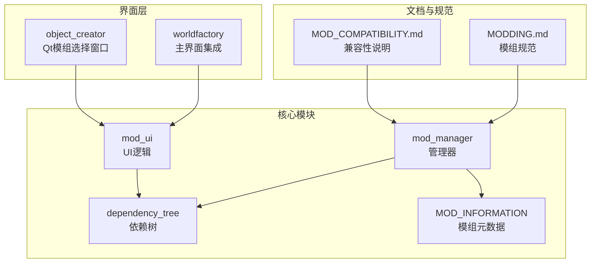
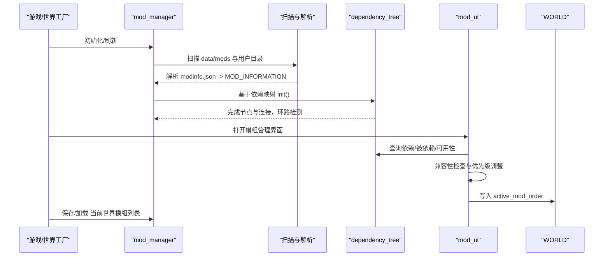
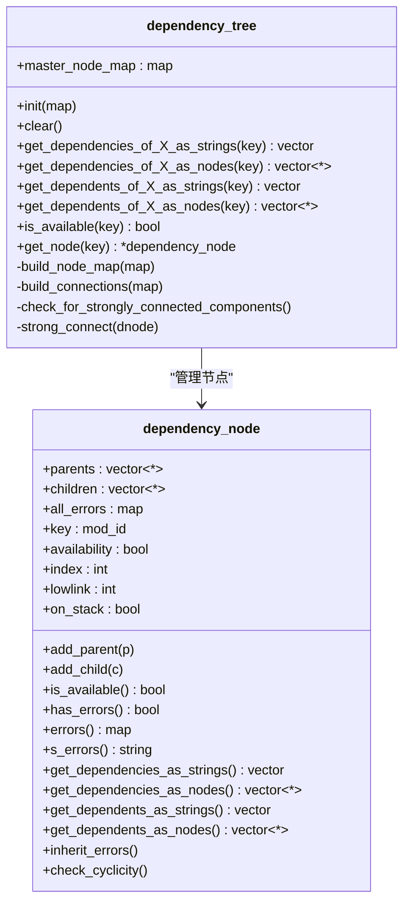
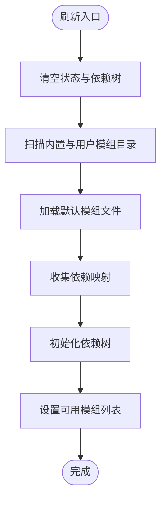
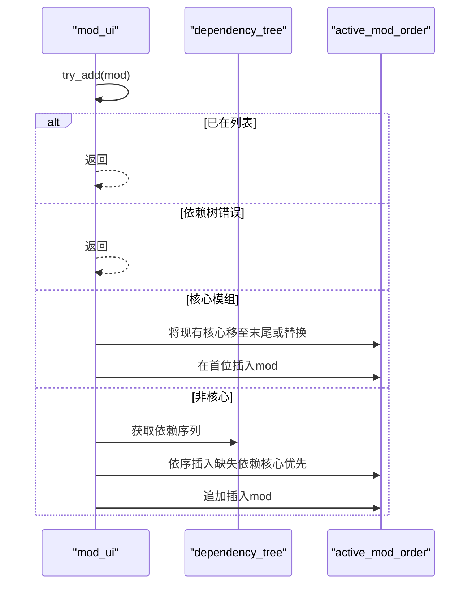
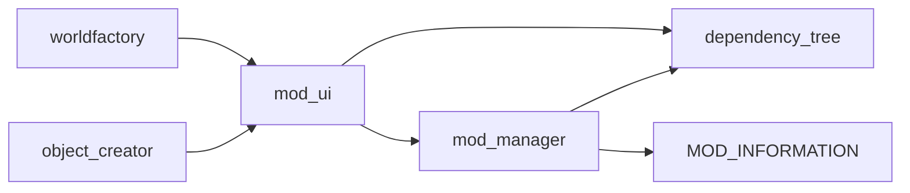

# 模组管理器

<cite>
**本文引用的文件**
- mod_manager.h
- mod_manager.cpp
- dependency_tree.h
- dependency_tree.cpp
- mod_manager_ui.cpp
- worldfactory.cpp
- mod_selection_window.h
- mod_selection_window.cpp
- MODDING.md
- MOD_COMPATIBILITY.md
</cite>

## 目录
1. [简介](#简介)
2. [项目结构](#项目结构)
3. [核心组件](#核心组件)
4. [架构总览](#架构总览)
5. [组件详解](#组件详解)
6. [依赖关系分析](#依赖关系分析)
7. [性能与复杂度](#性能与复杂度)
8. [故障排查](#故障排查)
9. [结论](#结论)
10. [附录：API与最佳实践](#附录api与最佳实践)

## 简介
本文件面向Cataclysm-DDA（CDDA）的模组管理器，系统化阐述其模组加载机制、MOD_INFORMATION数据结构、依赖树构建与校验、模组启用/禁用与优先级排序、冲突检测、默认模组与持久化、UI交互逻辑、兼容性验证与错误处理策略，并提供API使用示例与最佳实践。

## 项目结构
围绕模组管理的关键代码位于src目录下的mod_manager.*、dependency_tree.*与mod_manager_ui.*，以及世界工厂(worldfactory)中的模组选择界面集成；对象生成器(object_creator)中包含一个Qt版的模组选择窗口，用于保存用户选择到本地INI配置。

图表来源
- mod_manager.h
- dependency_tree.h
- mod_manager_ui.cpp
- worldfactory.cpp
- mod_selection_window.cpp
- MODDING.md
- MOD_COMPATIBILITY.md

章节来源
- mod_manager.h
- mod_manager.cpp
- dependency_tree.h
- mod_manager_ui.cpp
- worldfactory.cpp
- mod_selection_window.cpp
- MODDING.md
- MOD_COMPATIBILITY.md

## 核心组件
- MOD_INFORMATION：描述单个模组的元数据，包括标识、路径、作者、维护者、描述、版本、依赖、冲突、是否为核心或废弃等。
- mod_manager：负责扫描模组、解析modinfo.json、建立依赖树、设置可用模组列表、默认模组、持久化当前世界激活列表。
- dependency_tree：以节点为中心的有向图，支持向上/向下遍历、环路检测（Tarjan）、错误聚合与继承。
- mod_ui：封装UI侧的模组增删、移动、兼容性检查、信息展示等交互逻辑。
- worldfactory：在世界创建流程中集成模组管理器UI，支持从已有active_mod_order重建依赖顺序。
- object_creator：提供Qt模组选择窗口，将用户选择持久化到本地INI。

章节来源
- mod_manager.h
- mod_manager.cpp
- dependency_tree.h
- mod_manager_ui.cpp
- worldfactory.cpp
- mod_selection_window.cpp

## 架构总览
模组管理器采用“扫描解析—依赖建模—校验排序—UI交互—持久化”的流水线式设计。核心流程如下：

图表来源
- mod_manager.cpp
- dependency_tree.cpp
- mod_manager_ui.cpp
- worldfactory.cpp

## 组件详解

### MOD_INFORMATION 数据模型
- 字段要点：标识(ident)、显示名(name)、相对JSON根路径(path)、作者(authors)、维护者(maintainers)、描述(description)、版本(version)、依赖(dependencies)、冲突(conflicts)、核心(core)、废弃(obsolete)、分类(category)。
- 名称延迟初始化：通过字符串ID访问时才进行翻译，避免早期国际化未就绪问题。
- 分类与标签：提供预定义分类与标签映射，便于UI分组展示。

章节来源
- mod_manager.h
- mod_manager.cpp
- mod_manager.cpp

### 依赖树 dependency_tree
- 节点结构：包含父子边、可用性标记、错误集合(all_errors)、Tarjan变量(index/lowlink/on_stack)。
- 构建流程：
  - build_node_map：基于键值映射创建节点。
  - build_connections：建立父子连接，记录缺失依赖错误。
  - check_for_strongly_connected_components：Tarjan算法检测强连通分量（环），并标记循环依赖错误。
  - inherit_errors：自子向父传播错误。
- 查询接口：
  - 向上遍历：get_dependencies_of_X_as_strings/nodes
  - 向下遍历：get_dependents_of_X_as_strings/nodes
  - 可用性：is_available/get_node

图表来源
- dependency_tree.h
- dependency_tree.h
- dependency_tree.cpp
- dependency_tree.cpp

章节来源
- dependency_tree.h
- dependency_tree.h
- dependency_tree.cpp

### 模组管理器 mod_manager
- 刷新与扫描：refresh_mod_list会清理旧状态，扫描内置与用户模组目录，加载默认模组集，收集依赖映射并初始化依赖树。
- 默认模组：set_default_mods支持按标识或直接列表设置；默认文件以“user:default”标识写入/读取。
- 可用模组排序：set_usable_mods对非废弃模组按分类+名称排序，核心模组置于末尾（保证加载顺序）。
- 模组复制：copy_mod_contents将指定模组的JSON内容复制到输出目录，保留相对路径结构。
- 世界持久化：save_mods_list/load_mods_list在世界目录下保存/加载active_mod_order；迁移与移除记录由mod_migrations维护。

图表来源
- mod_manager.cpp
- mod_manager.cpp

章节来源
- mod_manager.cpp
- mod_manager.cpp
- mod_manager.cpp
- mod_manager.cpp
- mod_manager.cpp
- mod_manager.cpp
- mod_manager.cpp

### UI交互与优先级排序 mod_ui
- 信息展示：get_information汇总作者/维护者/依赖/版本/描述与依赖树错误提示。
- 兼容性检查：confirm_mod_compatibility遍历已激活模组的conflicts，阻止冲突组合。
- 添加流程：try_add
  - 若已是激活列表则忽略；
  - 若依赖树存在错误则拒绝；
  - 核心模组：若已有核心且非当前候选，则先移除再插入开头；
  - 非核心：先按依赖顺序插入所有缺失依赖（核心优先），最后插入目标模组。
- 删除流程：try_rem移除选中模组及其下游依赖（被其他模组依赖）。
- 移动流程：try_shift在满足“不能移动到核心位置、不能破坏依赖链”的前提下交换相邻元素。
- 可移动判断：can_shift_up/can_shift_down分别检查上/下邻位是否为依赖或核心。

图表来源
- mod_manager_ui.cpp
- mod_manager_ui.cpp
- mod_manager_ui.cpp
- mod_manager_ui.cpp

章节来源
- mod_manager_ui.cpp
- mod_manager_ui.cpp
- mod_manager_ui.cpp
- mod_manager_ui.cpp
- mod_manager_ui.cpp

### 世界工厂集成与模组选择
- 世界创建时，从WORLD.active_mod_order重建UI列表，确保依赖顺序与实际一致。
- 支持键盘/鼠标导航、切换标签页、确认激活/停用、上下移动、保存默认模组、查看描述、过滤等操作。

章节来源
- worldfactory.cpp
- worldfactory.cpp
- worldfactory.cpp

### Qt模组选择窗口（object_creator）
- 从全局mod_manager枚举所有可用模组，排除废弃与特定核心标识，填充双列表框。
- 使用QSettings将“包含列表”持久化到用户INI，重启后可恢复上次选择。

章节来源
- mod_selection_window.cpp
- mod_selection_window.h

### 兼容性与动态加载
- 动态加载规则：在mod_interactions目录下，仅加载与当前已激活模组ID同名的子目录内容，且仅支持单层嵌套。
- 开发者注意：交互定义的src会以“基础模组#交互模组”的形式保存，便于来源追踪。

章节来源
- MOD_COMPATIBILITY.md

## 依赖关系分析
- 模块耦合
  - mod_manager依赖dependency_tree进行依赖建模与校验。
  - mod_ui依赖mod_manager与dependency_tree进行交互与决策。
  - worldfactory依赖mod_ui进行世界创建时的模组选择。
  - object_creator依赖mod_manager与mod_ui进行Qt界面的模组选择与持久化。
- 外部依赖
  - 文件系统扫描与JSON解析（modinfo.json）。
  - 国际化与UI绘制（颜色、文本格式化、弹窗）。

图表来源
- mod_manager.h
- mod_manager_ui.cpp
- worldfactory.cpp
- mod_selection_window.cpp

章节来源
- mod_manager.h
- mod_manager_ui.cpp
- worldfactory.cpp
- mod_selection_window.cpp

## 性能与复杂度
- 依赖树构建
  - 时间复杂度：O(N+E)，N为节点数，E为边数，Tarjan算法线性增长。
  - 空间复杂度：O(N+E)，存储节点与边。
- 模组扫描
  - 递归扫描modinfo.json文件，时间取决于模组数量与层级深度。
- UI交互
  - 添加/删除/移动为线性遍历，依赖查询为树遍历，整体在合理范围内。

章节来源
- dependency_tree.h
- mod_manager.cpp
- mod_manager_ui.cpp

## 故障排查
- 依赖缺失
  - 现象：节点记录缺失依赖错误。
  - 排查：检查modinfo.json的dependencies字段是否正确拼写与存在。
- 循环依赖
  - 现象：Tarjan检测到强连通分量，节点报告CYCLIC错误。
  - 排查：梳理相互依赖链条，打破闭环或拆分模组。
- 冲突模组
  - 现象：尝试添加触发conflicts的模组被拒绝。
  - 排查：移除或替换冲突模组，或调整依赖顺序。
- 无效ID或非法字符
  - 现象：日志提示非法'#'字符或重复ID。
  - 排查：确保mod_id唯一且不包含'#'。
- 世界模组列表异常
  - 现象：加载时出现迁移或移除提示。
  - 排查：根据提示选择保留/移除，必要时手动编辑mods.json。

章节来源
- dependency_tree.cpp
- dependency_tree.cpp
- mod_manager_ui.cpp
- mod_manager.cpp
- mod_manager.cpp

## 结论
该模组管理器以清晰的数据模型与依赖树为核心，结合严格的冲突与环路检测，在UI层面提供直观的优先级与顺序控制，并通过世界级持久化实现跨会话一致性。其设计兼顾易用性与扩展性，适合大型模组生态的长期演进。

## 附录：API与最佳实践

### 关键API与调用路径
- 初始化与刷新
  - mod_manager.refresh_mod_list()
  - 作用：扫描目录、加载默认、构建依赖树、设置可用模组
  - 参考：mod_manager.cpp
- 依赖树查询
  - dependency_tree.init()/get_dependencies_of_X_as_strings()/get_dependents_of_X_as_strings()/is_available()
  - 参考：dependency_tree.h
- UI交互
  - mod_ui.try_add()/try_rem()/try_shift()/confirm_mod_compatibility()
  - 参考：mod_manager_ui.cpp
- 世界持久化
  - mod_manager.save_mods_list()/load_mods_list()
  - 参考：mod_manager.cpp
- 默认模组
  - mod_manager.set_default_mods()/get_default_mods()
  - 参考：mod_manager.cpp, mod_manager.cpp

### 最佳实践
- 模组元数据
  - 使用唯一的mod_id，避免'#'字符；明确dependencies与conflicts；合理设置core与obsolete。
  - 参考：MODDING.md
- 依赖设计
  - 保持扁平化与最小化依赖；避免循环依赖；核心模组仅用于基础框架。
  - 参考：dependency_tree.h
- UI与体验
  - 在添加新模组时优先加载其依赖；禁止将核心模组置于可能被移动到中间的位置；冲突必须显式声明。
  - 参考：mod_manager_ui.cpp, mod_manager_ui.cpp
- 兼容性
  - 使用mod_interactions单层目录结构，避免多模组组合路径；交互定义src采用“基础#交互”格式。
  - 参考：MOD_COMPATIBILITY.md
- 持久化
  - 世界启动前加载active_mod_order，必要时自动迁移或移除失效条目；保存时去重并保持顺序。
  - 参考：mod_manager.cpp