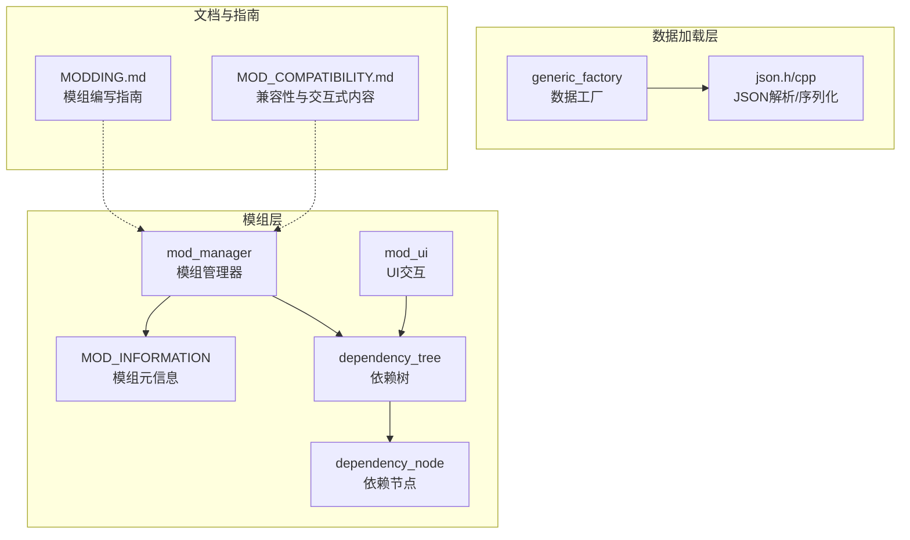
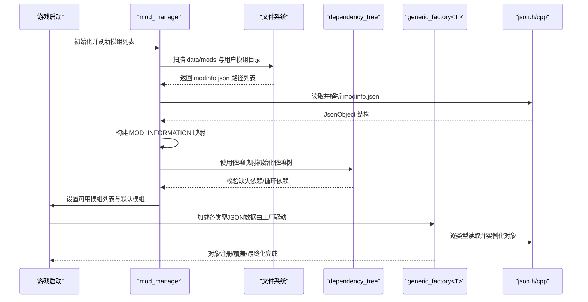
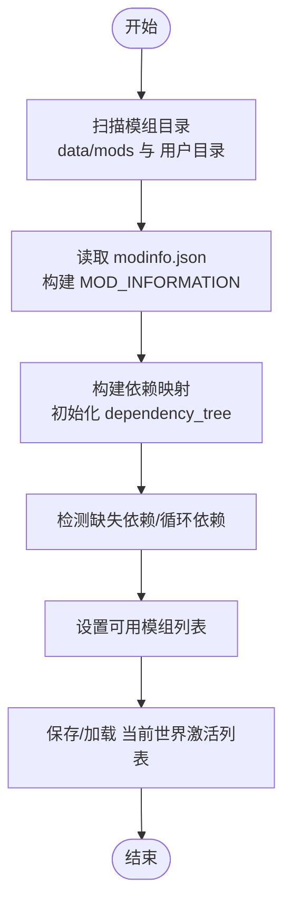
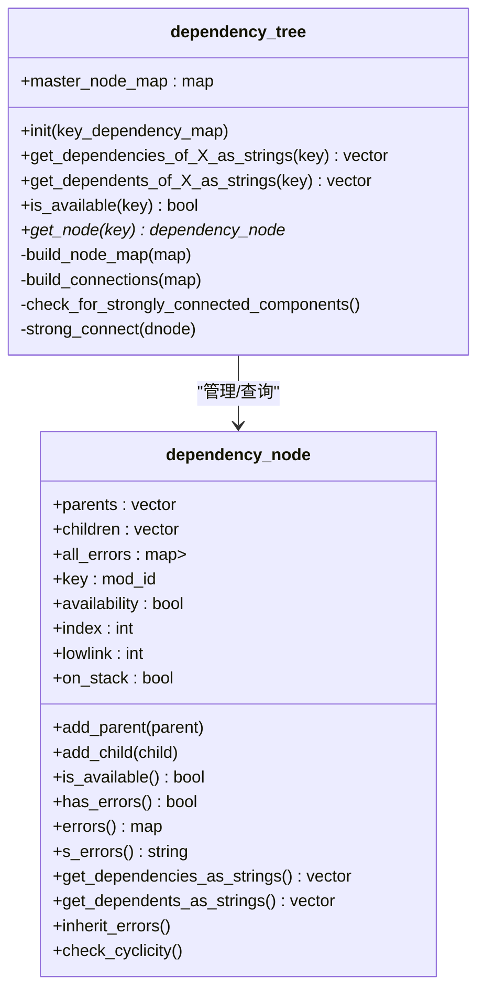
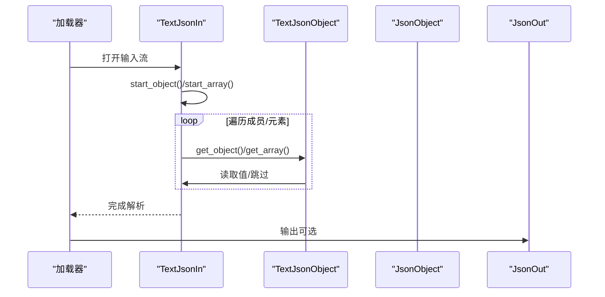
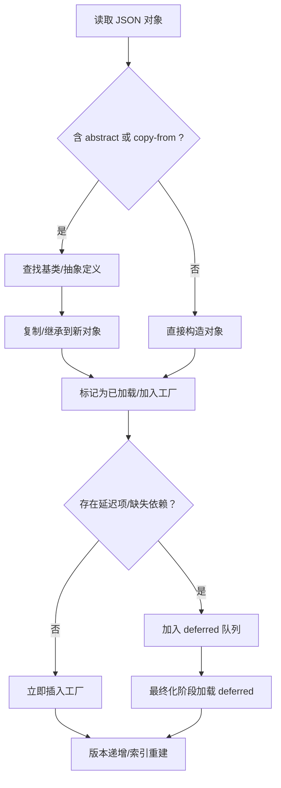
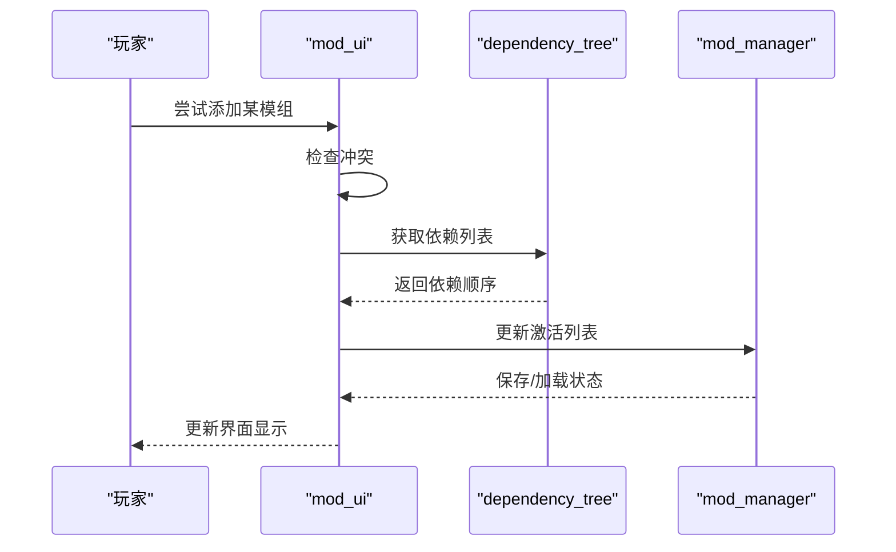
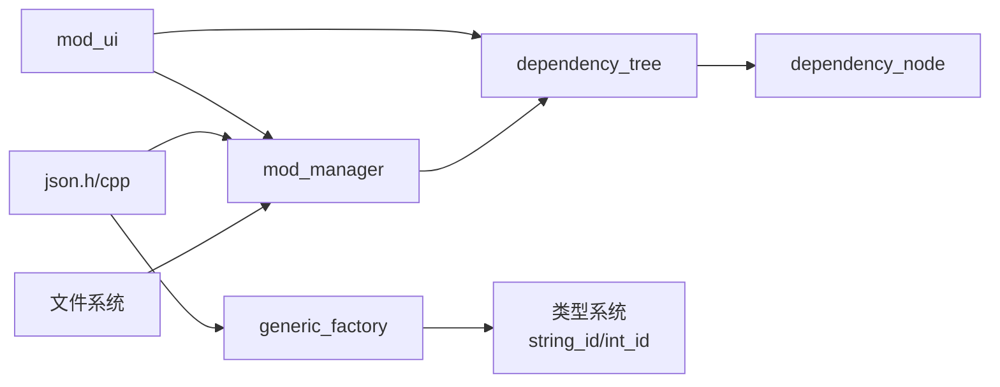

# 模组系统

<cite>
**本文引用的文件**
- src/mod_manager.h
- src/mod_manager.cpp
- src/mod_manager_ui.cpp
- src/dependency_tree.h
- src/dependency_tree.cpp
- src/generic_factory.h
- src/generic_factory.cpp
- src/json.h
- src/json.cpp
- doc/MODDING.md
- doc/MOD_COMPATIBILITY.md
</cite>

## 目录
1. [简介](#简介)
2. [项目结构](#项目结构)
3. [核心组件](#核心组件)
4. [架构总览](#架构总览)
5. [详细组件分析](#详细组件分析)
6. [依赖关系分析](#依赖关系分析)
7. [性能考量](#性能考量)
8. [故障排查指南](#故障排查指南)
9. [结论](#结论)
10. [附录](#附录)

## 简介
本文件面向Cataclysm-DDA（CDDA）模组系统的开发者与维护者，系统化阐述模组加载机制、数据优先级与冲突检测策略、JSON配置体系、数据工厂与类型系统设计、开发工具链与测试流程、模组API使用与扩展点、发布与社区支持流程，并给出版本兼容性与向后兼容保障机制说明。文档以代码为依据，辅以图示帮助理解。

## 项目结构
围绕模组系统的关键代码位于src目录下，文档与指南位于doc目录。核心模块包括：
- 模组管理器：负责扫描、解析modinfo.json、构建可用模组列表、持久化激活列表、迁移与兼容性检查
- 依赖树：基于依赖声明进行拓扑排序、循环依赖检测、错误继承传播
- JSON系统：文本解析、对象/数组封装、序列化输出、错误定位与报告
- 数据工厂：通用对象工厂，支持继承、抽象定义、延迟加载、覆盖与替换、最终化阶段
- 文档指南：模组编写基础、JSON字段说明、交互式内容动态加载规则

**图表来源**
- src/mod_manager.h
- src/mod_manager.cpp
- src/mod_manager_ui.cpp
- src/dependency_tree.h
- src/dependency_tree.cpp
- src/generic_factory.h
- src/json.h
- doc/MODDING.md
- doc/MOD_COMPATIBILITY.md

**章节来源**
- src/mod_manager.h
- src/mod_manager.cpp
- src/dependency_tree.h
- src/generic_factory.h
- src/json.h
- doc/MODDING.md
- doc/MOD_COMPATIBILITY.md

## 核心组件
- 模组管理器（mod_manager）
  - 扫描模组目录，读取modinfo.json，构建MOD_INFORMATION映射
  - 维护默认模组列表与用户可选模组列表
  - 构建依赖树，保存/加载当前世界激活的模组顺序
  - 提供复制模组内容到输出目录的能力（用于打包或导出）
- 依赖树（dependency_tree/dependency_node）
  - 基于依赖声明建立父子关系
  - 检测缺失依赖与循环依赖（Tarjan强连通分量算法）
  - 错误继承：自依赖向上传播
- JSON系统（TextJsonIn/TextJsonObject/TextJsonArray/JsonOut）
  - 单次遍历加载、成员位置缓存、错误定位
  - 支持容器自动序列化/反序列化、枚举读写、RLE优化等
- 数据工厂（generic_factory<T>）
  - 统一的对象注册、覆盖与替换
  - 支持“copy-from”继承与抽象定义
  - 延迟加载与最终化阶段，确保跨类型连接与一致性检查
- 模组UI（mod_ui）
  - 可视化展示模组信息、作者/维护者、依赖、版本、描述
  - 冲突检测与添加/移除/上下移动逻辑
- 文档与指南
  - MODDING.md：模组编写基础、JSON字段、示例
  - MOD_COMPATIBILITY.md：交互式内容动态加载与多模组交互限制

**章节来源**
- src/mod_manager.h
- src/mod_manager.cpp
- src/dependency_tree.h
- src/dependency_tree.cpp
- src/json.h
- src/generic_factory.h
- src/mod_manager_ui.cpp
- doc/MODDING.md
- doc/MOD_COMPATIBILITY.md

## 架构总览
模组系统采用“配置驱动 + 工厂模式 + 依赖图”的组合架构：
- 配置驱动：通过modinfo.json声明模组元信息、路径、依赖、冲突、核心标记等
- 工厂模式：generic_factory统一管理各类游戏数据对象的加载、覆盖、最终化
- 依赖图：dependency_tree在激活阶段进行依赖校验与冲突检测，保证加载顺序与一致性

**图表来源**
- src/mod_manager.cpp
- src/dependency_tree.cpp
- src/generic_factory.h
- src/json.h

**章节来源**
- src/mod_manager.cpp
- src/dependency_tree.cpp
- src/generic_factory.h
- src/json.h

## 详细组件分析

### 模组管理器（mod_manager）
职责与行为
- 刷新模组列表：扫描内置与用户模组目录，读取modinfo.json，构建MOD_INFORMATION映射
- 默认模组：支持从特定标识（如user:default）读取默认依赖集合
- 依赖树：将依赖映射交由dependency_tree初始化，生成可用/不可用状态
- 激活模组持久化：按世界保存/加载激活顺序，支持迁移与兼容性提示
- 复制内容：将指定模组的JSON文件复制到输出目录，保留相对路径结构

关键接口与流程
- 刷新列表：调用load_mods_from递归搜索modinfo.json，再调用load_mod_info读取
- 解析modinfo.json：load_modfile读取type/id/name/dependencies/conflicts等字段，校验非法字符与自依赖
- 依赖树：build_node_map/build_connections，缺失依赖记录到节点错误；随后Tarjan检测循环依赖
- 激活持久化：save_mods_list/load_mods_list，支持迁移映射与被移除模组提示

**图表来源**
- src/mod_manager.cpp
- src/mod_manager.cpp
- src/mod_manager.cpp
- src/dependency_tree.cpp

**章节来源**
- src/mod_manager.h
- src/mod_manager.cpp
- src/mod_manager.cpp
- src/mod_manager.cpp

### 依赖树（dependency_tree/dependency_node）
职责与行为
- 节点模型：每个mod对应一个dependency_node，维护父/子关系、可用性标志、错误集合
- 依赖解析：根据mod的dependencies建立父子边；对缺失依赖记录错误
- 循环检测：Tarjan算法识别强连通分量，标记循环依赖
- 错误继承：自依赖向上传播，保证上层可见所有错误
- 查询接口：向上/向下遍历依赖与被依赖，返回有序列表

**图表来源**
- src/dependency_tree.h
- src/dependency_tree.h
- src/dependency_tree.cpp
- src/dependency_tree.cpp
- src/dependency_tree.cpp

**章节来源**
- src/dependency_tree.h
- src/dependency_tree.h
- src/dependency_tree.cpp
- src/dependency_tree.cpp
- src/dependency_tree.cpp

### JSON系统（TextJsonIn/TextJsonObject/TextJsonArray/JsonOut）
职责与行为
- TextJsonIn：单次遍历解析，成员/元素位置缓存，错误定位精确到偏移与行号
- TextJsonObject/TextJsonArray：封装访问，支持has_*、get_*、迭代读取、类型测试
- JsonOut：自动处理分隔符与缩进，支持pretty打印与序列化重载
- 错误报告：统一的错误输出颜色策略、字符串错误定位、异常抛出

**图表来源**
- src/json.h
- src/json.h
- src/json.cpp

**章节来源**
- src/json.h
- src/json.h
- src/json.cpp

### 数据工厂（generic_factory<T>）
职责与行为
- 注册与覆盖：按id插入或替换已有对象，版本计数用于失效缓存
- 继承与抽象：支持“copy-from”与“abstract”定义，延迟加载与deferred队列
- 最终化：加载完成后清理抽象表、重建索引、触发check与finalize
- 类型系统：通过模板约束与静态断言，确保对象具备load/reset/check/finalize等接口

**图表来源**
- src/generic_factory.h
- src/generic_factory.h
- src/generic_factory.h
- src/generic_factory.cpp

**章节来源**
- src/generic_factory.h
- src/generic_factory.h
- src/generic_factory.h
- src/generic_factory.cpp

### 模组UI（mod_ui）
职责与行为
- 展示：作者/维护者、依赖、版本、描述、错误信息
- 添加：校验冲突、依赖注入、核心模组优先、保持顺序正确
- 移除：删除选中并清理其下游依赖
- 上下移动：受依赖约束，核心模组不可上移，依赖关系不可破坏

**图表来源**
- src/mod_manager_ui.cpp
- src/mod_manager_ui.cpp
- src/mod_manager_ui.cpp

**章节来源**
- src/mod_manager_ui.cpp
- src/mod_manager_ui.cpp
- src/mod_manager_ui.cpp

### 模组API与扩展点
- JSON类型系统：通过generic_factory与JSON读写接口，统一对象生命周期与数据绑定
- 动态加载扩展：MODDING.md定义了大量JSON类型（场景、职业、物品、怪物、区域覆盖等），均可由模组扩展
- 交互式内容：MOD_COMPATIBILITY.md定义了“mod_interactions”目录下的动态加载规则，仅在目标模组激活时加载

**章节来源**
- src/generic_factory.h
- doc/MODDING.md
- doc/MOD_COMPATIBILITY.md

## 依赖关系分析
- 模组管理器依赖文件系统扫描、JSON解析与依赖树
- 依赖树依赖mod_id与错误类型枚举，向上游传播错误
- 数据工厂依赖JSON系统与string_id/int_id类型系统
- 模组UI依赖依赖树与mod_manager提供的状态

**图表来源**
- src/mod_manager.cpp
- src/dependency_tree.h
- src/generic_factory.h
- src/mod_manager_ui.cpp

**章节来源**
- src/mod_manager.cpp
- src/dependency_tree.h
- src/generic_factory.h
- src/mod_manager_ui.cpp

## 性能考量
- 单次遍历加载：TextJsonIn避免二次扫描，显著降低I/O与内存占用
- 版本计数与缓存失效：generic_factory通过版本号使string_id缓存失效，保证一致性同时减少重复查找成本
- 依赖树复杂度：Tarjan算法O(N+E)，线性增长，适合大规模模组依赖图
- 文件复制：按需复制，保留目录结构，避免冗余拷贝

[本节为通用指导，无需具体文件分析]

## 故障排查指南
- JSON语法错误
  - 现象：加载失败、报错定位到具体偏移与行号
  - 排查：核对括号/逗号匹配、转义字符、枚举值拼写
  - 参考：TextJsonIn/TextJsonObject的错误报告与定位能力
- 缺失依赖/循环依赖
  - 现象：依赖树节点标记缺失或循环错误
  - 排查：检查modinfo.json的dependencies字段，避免自依赖与环形依赖
  - 参考：dependency_tree的check_for_strongly_connected_components与错误继承
- 模组冲突
  - 现象：添加模组时报冲突
  - 排查：确认active列表中的conflicts字段，调整顺序或移除冲突模组
  - 参考：mod_ui的冲突检测与提示
- 迁移与移除
  - 现象：旧模组ID不存在或被移除
  - 排查：查看迁移映射与移除原因，按提示选择保留或移除
  - 参考：mod_manager的迁移检查与提示逻辑

**章节来源**
- src/json.cpp
- src/dependency_tree.cpp
- src/mod_manager_ui.cpp
- src/mod_manager.cpp

## 结论
CDDA模组系统以JSON配置为入口，结合依赖树与数据工厂，实现了高扩展、可维护、可诊断的模组生态。通过严格的依赖校验、错误继承与最终化阶段，系统在保证加载稳定性的同时，提供了灵活的扩展点与强大的交互式内容支持。遵循本文档的开发与测试流程，可高效构建高质量模组并融入社区生态。

[本节为总结，无需具体文件分析]

## 附录
- 开发工具链与测试
  - 使用JSON解析器与错误定位功能进行本地验证
  - 在不同模组组合下运行单元测试，重点覆盖依赖与冲突场景
  - 使用copy_mod_contents导出测试包，便于CI与社区复现
- 发布与社区支持
  - 在modinfo.json中完善作者、维护者、描述、分类、版本等字段
  - 遵循MODDING.md与MOD_COMPATIBILITY.md的规范
  - 提供清晰的README与变更日志，便于维护者与用户协作

**章节来源**
- src/mod_manager.cpp
- doc/MODDING.md
- doc/MOD_COMPATIBILITY.md