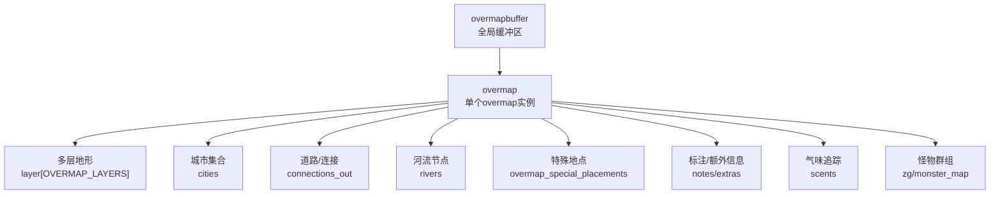
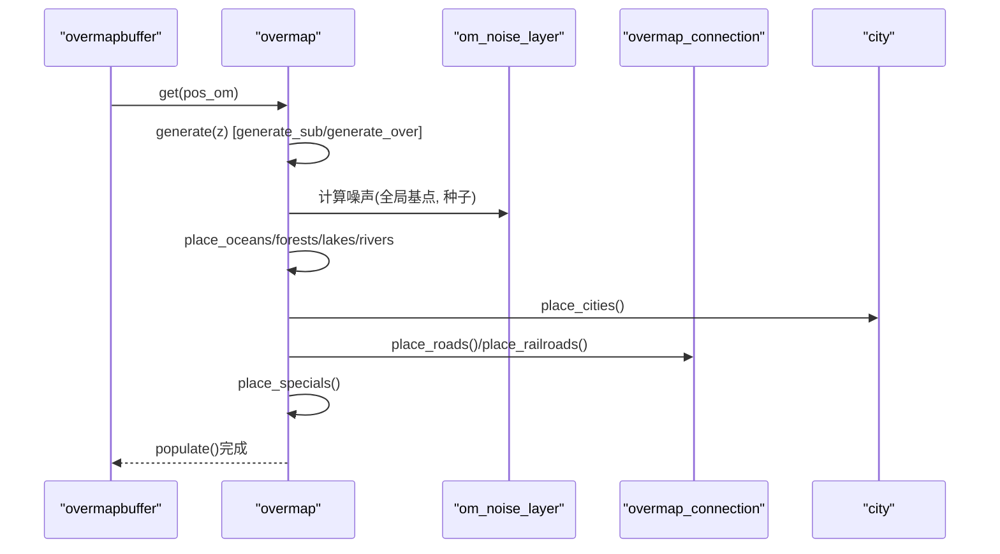
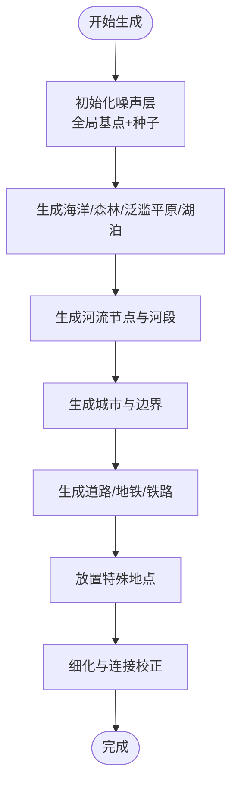
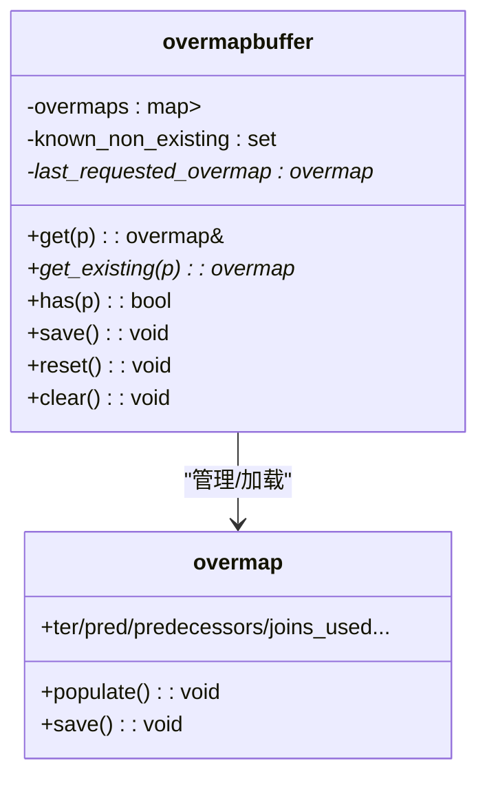
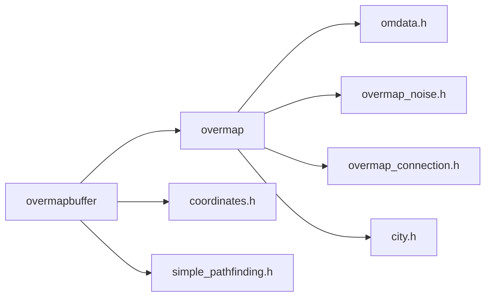

# Overmap生成

<cite>
**本文引用的文件**
- overmap.h
- overmap.cpp
- overmapbuffer.h
- overmapbuffer.cpp
- omdata.h
- overmap_types.h
- overmap_noise.h
- overmap_noise.cpp
- overmap_connection.h
- city.h
</cite>

## 目录
1. [引言](#引言)
2. [项目结构](#项目结构)
3. [核心组件](#核心组件)
4. [架构总览](#架构总览)
5. [详细组件分析](#详细组件分析)
6. [依赖关系分析](#依赖关系分析)
7. [性能考量](#性能考量)
8. [故障排查指南](#故障排查指南)
9. [结论](#结论)
10. [附录](#附录)

## 引言
本文件系统性梳理Cataclysm-DDA中“Overmap（世界地图）”的生成体系，覆盖数据结构、坐标系统与存储机制；城市生成、道路/连接网络、河流水系与特殊地点放置；以及overmapbuffer的缓存与内存管理策略。同时给出配置参数、自定义生成规则与调试工具的使用建议，并通过图示展示关键流程。

## 项目结构
- overmap系统由overmap类承载单个overmap实例的生成与状态，overmapbuffer作为全局缓冲区管理多个overmap实例及其查询接口。
- overmap地形类型、连接类型、特殊建筑等在omdata.h中定义，配合overmap.cpp实现具体生成逻辑。
- 噪声层用于生成自然地貌（森林、泛滥平原、湖泊、海洋），提升自然感与连续性。
- 城市信息在city.h中定义，参与城市生成与街道布局。

图表来源
- overmapbuffer.h
- overmap.h

章节来源
- overmapbuffer.h
- overmap.h

## 核心组件
- overmap：负责单个overmap的生成、保存、查询与状态维护（城市、道路、河流、特殊地点、怪物群组、标注等）。
- overmapbuffer：管理overmap实例的生命周期、按需加载/生成、跨overmap的查询与路径规划、全局状态记录。
- overmap地形与连接：通过oter_t/oter_type_t与overmap_connection描述地形类型、连接类型及可放置条件。
- 特殊地点overmap_special：定义可放置的固定/可变特殊建筑、约束与评分策略。
- 噪声层om_noise_layer：为自然地貌生成提供连续噪声，确保跨overmap边界平滑过渡。
- 城市city：描述城市位置、规模、人口与距离计算。

章节来源
- overmap.h
- overmapbuffer.h
- omdata.h
- overmap_noise.h
- city.h

## 架构总览
overmap生成遵循“分层+分块”的设计：每个overmap独立生成其地形、城市、道路、河流与特殊地点；overmapbuffer统一调度加载、查询与全局状态维护；overmap_types.h提供嗅觉追踪等基础类型支持。

图表来源
- overmapbuffer.cpp
- overmap.cpp
- overmap_noise.cpp
- overmap_connection.h
- city.h

## 详细组件分析

### overmap数据结构与坐标系统
- 多层地形结构：每个overmap包含若干层（OVERMAP_LAYERS），每层以多维数组存储地形、可见度与探索状态，并维护notes与extras列表。
- 坐标体系：
  - overmap坐标：全局整数坐标(point_abs_om)，用于定位与缓冲区索引。
  - overmap terrain坐标：OMT坐标(tripoint_abs_omt)，以OMT为单位。
  - submap坐标：SM坐标，用于与地图子图关联。
  - 通过投影/转换函数在不同坐标间映射（如project_remain/project_to）。
- 可见度与探索：om_vision_level枚举控制“模糊/轮廓/细节/全知”四个层级，分别影响UI显示与视野判定。

章节来源
- overmap.h
- overmapbuffer.cpp
- overmap_types.h

### overmap生成流程与算法
- 分层生成：
  - generate_sub/generate_over分别处理地下与地表层，按z层顺序生成。
  - 自然地貌：oceans/forests/lakes/river先于城市与道路生成，保证地形连续性。
- 河流生成：
  - place_rivers根据邻接overmap的河流边界与噪声层生成河流节点与河段，支持主干流与支流。
  - polish_river与build_river_shores进一步细化河岸与连接。
- 城市与道路：
  - place_cities基于城市数据库与噪声分布生成城市中心与边界。
  - place_roads/place_railroads依据overmap_connection与地面类型选择合适地形进行铺设。
- 特殊地点：
  - place_specials按扇区划分，优先满足最小出现次数，必要时在相邻overmap追加生成。
  - 支持固定/可变特殊建筑，按约束（城市距离/大小、出现次数）与评分策略放置。

图表来源
- overmap.cpp
- overmap.cpp
- overmap.cpp
- overmap.cpp
- overmap.cpp

章节来源
- overmap.cpp
- overmap.cpp
- overmap.cpp
- overmap.cpp
- overmap.cpp

### overmapbuffer缓存机制与内存管理
- 缓存策略：
  - last_requested_overmap缓存最近一次请求，减少重复查找开销。
  - known_non_existing集合记录不存在的overmap坐标，避免重复文件系统检查。
  - overmaps以point_abs_om为键存储已加载实例。
- 生命周期管理：
  - get：若不存在则构造新overmap并populate，随后修复跨overmap的怪物群组与NPC归属。
  - get_existing：仅返回已存在overmap，不创建。
  - reset/clear：清空缓冲区与全局计数器。
- 跨overmap查询：
  - get_om_global/get_existing_om_global将绝对OMT坐标转换为所属overmap与局部坐标，便于调用overmap接口。

图表来源
- overmapbuffer.h
- overmapbuffer.cpp
- overmapbuffer.cpp

章节来源
- overmapbuffer.h
- overmapbuffer.cpp
- overmapbuffer.cpp

### overmap地形与连接系统
- 地形类型oter_type_t/oter_t：
  - 定义符号、颜色、可见度等级、旅行成本、是否可旋转/线性绘制、连接组等。
  - 线性地形（道路/下水道等）通过om_lines::type与后缀映射到不同子块与旋转。
- 连接系统overmap_connection：
  - 描述道路/铁路/下水道等连接类型，支持正交/垂直交叉等标志。
  - pick_subtype_for根据地面类型自动选择合适的连接子类型。

章节来源
- omdata.h
- omdata.h
- overmap_connection.h

### 特殊地点overmap_special系统
- overmap_special：
  - 固定/可变两种子类型，支持优先级、旋转性、EoC、怪物生成、地图参数等。
  - 支持默认位置集合与覆盖位置集合，按overmap_location测试可放置性。
- 放置策略：
  - place_specials按OMSPEC_FREQ划分扇区，先满足最小出现次数，再尝试可选特殊。
  - can_place_special/check_overmap_special_type确保合法性与唯一性。

章节来源
- omdata.h
- overmap.cpp
- overmap.cpp

### 噪声层与自然地貌生成
- om_noise_layer系列：
  - om_noise_layer_forest：森林密度噪声，结合多次降噪与幂次函数形成分布。
  - om_noise_layer_floodplain：泛滥平原噪声，强调大尺度平坦区域。
  - om_noise_layer_lake/ocean：湖泊/海洋噪声，与地形连续性保持一致。
- 连续性保证：
  - 通过global_omt_pos将本地OMT坐标映射到全局，结合种子确保跨边界连续。

章节来源
- overmap_noise.h
- overmap_noise.cpp

### 城市生成与街道布局
- 城市city：
  - 存储位置、规模、人口与名称，提供距离计算接口。
- 街道布局：
  - build_city_street根据连接类型与方向生成街区与街道，支持block宽度与训练场等扩展。

章节来源
- city.h
- overmap.cpp

## 依赖关系分析
- overmap依赖：
  - omdata.h：地形类型、连接类型、特殊地点定义。
  - overmap_noise.h：自然地貌噪声层。
  - overmap_connection.h：连接类型与子类型选择。
  - city.h：城市数据。
- overmapbuffer依赖：
  - overmap：提供生成与查询接口。
  - coordinates.h：坐标投影与转换。
  - simple_pathfinding.h：overmap级路径规划参数。

图表来源
- overmap.h
- overmapbuffer.h
- omdata.h
- overmap_noise.h
- overmap_connection.h
- city.h

章节来源
- overmap.h
- overmapbuffer.h

## 性能考量
- 缓存命中优化：
  - last_requested_overmap减少重复查找。
  - known_non_existing避免重复文件系统探测。
- 局部生成与延迟加载：
  - 仅在需要时生成overmap，避免一次性加载全部overmap。
- 扇区化放置：
  - OMSPEC_FREQ扇区划分降低特殊地点放置的搜索范围。
- 噪声层复用：
  - 全局基点+种子确保跨边界连续，减少重复计算。

[本节为通用指导，无需特定文件引用]

## 故障排查指南
- 常见问题与定位：
  - 特殊地点未放置：检查最小出现次数与扇区划分，确认must_be_unexplored与唯一性约束。
  - 路径规划异常：核对overmap_path_params的旅行成本与允许穿越类型。
  - 噪声导致的地形断层：确认全局基点与种子一致，避免不同种子导致的不连续。
- 调试工具与接口：
  - overmapbuffer提供find_closest/find_all/find_random等查询接口，便于定位目标。
  - overmap::check_ot/check_overmap_special_type可用于验证地形与特殊类型匹配。
  - overmapbuffer::reveal/reveal_route辅助可视化生成结果。

章节来源
- overmapbuffer.h
- overmapbuffer.h
- overmap.h

## 结论
overmap生成系统通过分层、分块与噪声驱动的方式，实现了自然地貌、城市、道路与特殊地点的协同生成；overmapbuffer提供了高效的缓存与查询能力，支撑大规模世界的运行。合理利用配置参数与调试接口，可有效提升生成质量与性能。

[本节为总结性内容，无需特定文件引用]

## 附录

### 配置参数与自定义规则
- overmap地形参数（来自oter_type_t/oter_t）：
  - 符号、颜色、可见度等级、旅行成本类型、是否可旋转/线性绘制、连接组、land_use_code等。
- overmap连接参数（来自overmap_connection）：
  - 正交/垂直交叉标志、基础成本、允许的地面类型。
- overmap特殊地点参数（来自overmap_special）：
  - 子类型（固定/可变）、优先级、旋转性、约束（城市距离/大小、出现次数）、地图参数与怪物生成。

章节来源
- omdata.h
- omdata.h
- omdata.h

### 数据结构示例（代码片段路径）
- overmap多层地形结构：overmap.h
- overmap特殊批量放置容器：overmap.h
- overmap特殊批处理迭代器：overmap.h
- overmap特殊节点与河流节点结构：overmap.h
- overmap地形匹配与旋转：omdata.h
- overmap连接子类型选择：overmap_connection.h
- 噪声层森林噪声实现：overmap_noise.cpp
- 城市结构与距离计算：city.h