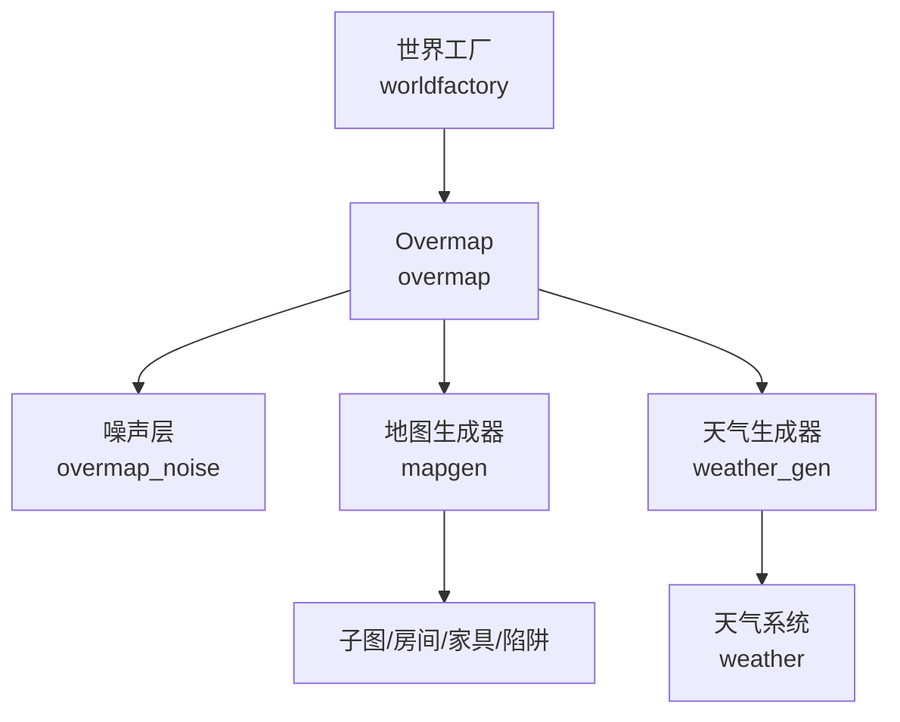
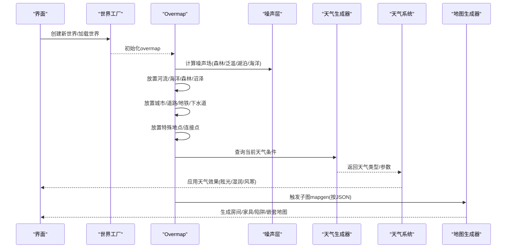
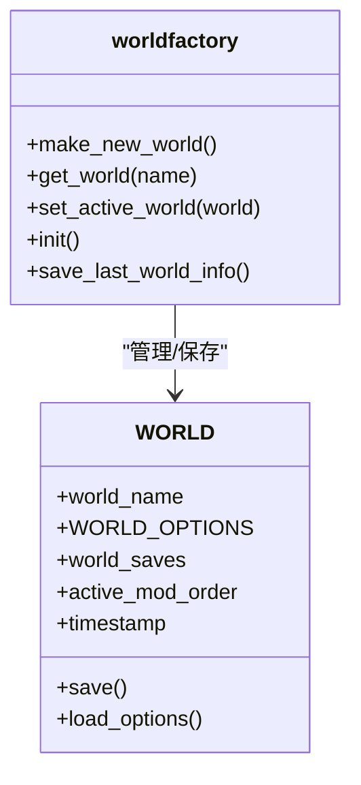
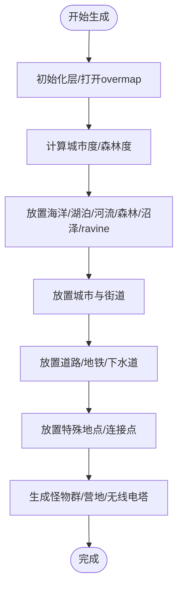
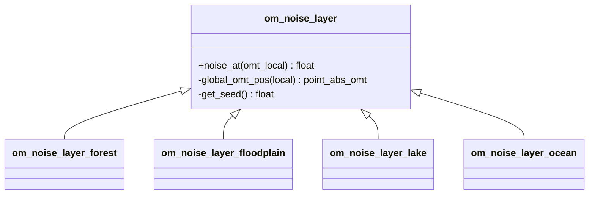
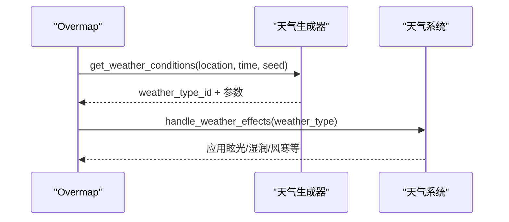
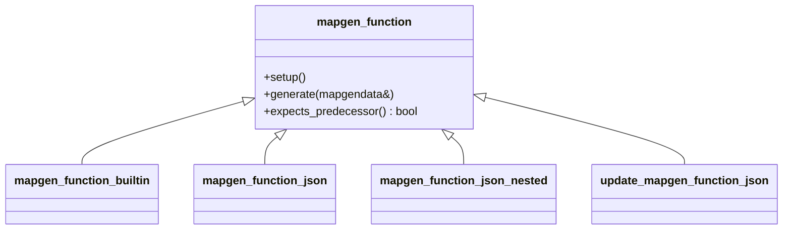
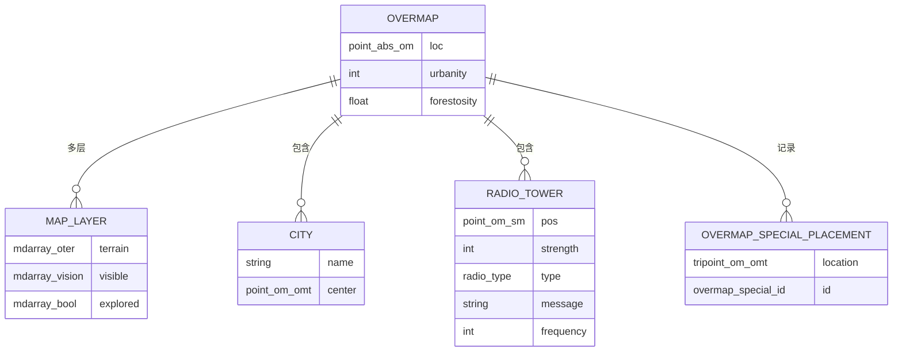
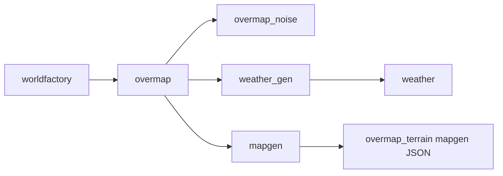

# 世界生成系统

<cite>
**本文引用的文件**
- worldfactory.cpp
- worldfactory.h
- overmap.cpp
- overmap.h
- overmap_noise.h
- weather.cpp
- weather_gen.h
- mapgen.h
- overmap_types.h
</cite>

## 目录
1. [简介](#简介)
2. [项目结构](#项目结构)
3. [核心组件](#核心组件)
4. [架构总览](#架构总览)
5. [详细组件分析](#详细组件分析)
6. [依赖关系分析](#依赖关系分析)
7. [性能考量](#性能考量)
8. [故障排查指南](#故障排查指南)
9. [结论](#结论)
10. [附录](#附录)

## 简介
本文件系统性梳理 Cataclysm-DDA 的世界生成体系，覆盖程序化世界生成、种子系统、overmap 地形与城市/道路/特殊地点生成、天气与季节机制、以及地图生成（mapgen）与资源分布规则。文档同时提供参数调优建议、性能优化策略与自定义世界开发指南，并通过图示展示关键流程。

## 项目结构
世界生成相关代码主要分布在以下模块：
- 世界工厂与世界选项：负责世界生命周期、选项持久化与UI交互
- Overmap 生成：负责大世界（overmap）层面的地形、河流、海洋、城市、道路、特殊地点等
- 天气与季节：负责天气类型、风向、光照、降水等环境影响
- 地图生成（Mapgen）：负责具体子图（submap）内的房间、家具、陷阱、嵌套/更新式生成等
- 噪声层：为 overmap 提供连续的噪声场（森林、泛滥平原、湖泊、海洋）

图表来源
- worldfactory.cpp
- overmap.cpp
- overmap_noise.h
- mapgen.h
- weather_gen.h
- weather.cpp

章节来源
- worldfactory.h
- overmap.h
- overmap_noise.h
- mapgen.h
- weather_gen.h
- weather.cpp

## 核心组件
- 世界工厂（worldfactory）
  - 负责世界创建、选项加载/保存、模组选择与兼容性检查、世界切换与持久化
- Overmap（overmap）
  - 负责 overmap 层面的生成：地形、水体、森林、沼泽、河流、海洋、城市、道路/地铁/下水道、特殊地点、连接点、怪物群等
- 噪声层（overmap_noise）
  - 提供连续噪声场，用于驱动 overmap 生态与地貌分布
- 天气生成器（weather_gen）
  - 定义基础气候参数、季节修正、风向/风速、天气类型排序与条件判定
- 天气系统（weather）
  - 实时处理天气对角色的影响（眩光、湿润、风寒等），汇总天气效应
- 地图生成器（mapgen）
  - 提供 JSON 驱动的地图生成框架，支持内置函数、JSON 片段、嵌套/更新式生成、参数合并与约束校验

章节来源
- worldfactory.cpp
- overmap.cpp
- overmap_noise.h
- weather_gen.h
- weather.cpp
- mapgen.h

## 架构总览
世界生成从“世界工厂”开始，依据世界选项与模组决定生成策略；随后进入 overmap 生成阶段，结合噪声层与区域设置生成地形与生态；在 overmap 层完成城市、道路、特殊地点布局后，进入子图（submap）级的 mapgen 阶段，按 JSON 描述进行房间、家具、陷阱与嵌套地图的放置；最后由天气系统根据时间与位置动态影响环境与角色状态。

图表来源
- worldfactory.cpp
- overmap.cpp
- overmap_noise.h
- weather_gen.h
- weather.cpp
- mapgen.h

## 详细组件分析

### 世界工厂与世界选项
- 世界工厂负责：
  - 世界创建与命名、模组选择与兼容性验证
  - 世界选项的加载/保存（含隐藏选项跳过保存）
  - 世界列表管理、活动世界切换、持久化存储
- WORLD 结构包含：
  - 世界名称、选项容器、存档列表、激活模组顺序、时间戳、压缩开关等

图表来源
- worldfactory.h
- worldfactory.cpp

章节来源
- worldfactory.h
- worldfactory.cpp

### Overmap 生成与地形算法
- Overmap 生成流程要点：
  - 初始化层、打开/生成 overmap
  - 计算城市度（urbanity）、森林度（forestosity）
  - 放置海洋、湖泊、河流、森林、沼泽、 ravine
  - 放置城市与街道、连接点与道路/地铁/下水道
  - 放置特殊地点（overmap_special），并记录放置位置
  - 生成怪物群、无线电塔、营地等
- 关键接口：
  - populate()/generate()：生成入口
  - place_oceans()/place_lakes()/place_rivers()/place_forests()/place_swamps()/place_ravines()
  - place_cities()/build_city_street()/place_building()
  - place_roads()/place_railroads()
  - place_specials()/place_special()/can_place_special()/random_special_rotation()

图表来源
- overmap.cpp
- overmap.cpp
- overmap.cpp
- overmap.cpp

章节来源
- overmap.h
- overmap.cpp

### 种子系统与噪声层
- 种子使用：
  - 天气查询与天气生成器使用游戏种子（seed）作为随机源
  - overmap 噪声层构造时传入全局 overmap 坐标与种子，保证跨 overmap 边界的连续性
- 噪声层类型：
  - 森林噪声层、泛滥平原噪声层、湖泊噪声层、海洋噪声层
- 使用场景：
  - 驱动 overmap 的生态分布（如森林密度、泛滥平原概率、湖泊/海洋边界）

图表来源
- overmap_noise.h
- overmap_noise.h

章节来源
- overmap_noise.h
- weather.cpp

### 天气系统与季节机制
- 天气生成器（weather_generator）：
  - 维护基础温度/湿度/气压/风速与季节修正
  - 白名单/黑名单控制天气类型排序
  - 提供按位置与时间查询天气类型与参数的能力
- 天气系统（weather）：
  - 处理眩光（glare/snow_glare）、湿润（drench）、风寒（wind chill）等影响
  - 汇总降水、日照、辐射暴露等环境数据
  - 生成天气预报文本（基于未来时段统计）

图表来源
- weather_gen.h
- weather.cpp
- weather.cpp

章节来源
- weather_gen.h
- weather.cpp
- weather.cpp
- weather.cpp

### 地图生成（Mapgen）与资源分布
- Mapgen 框架：
  - 支持内置函数指针与 JSON 片段两种生成方式
  - 分阶段执行（移除/地形/家具/默认/嵌套/变换/派系归属/区域/收尾）
  - 参数合并、权重计算、一致性校验、预decessor 支持
- 资源分布规则：
  - 通过 overmap_terrain 的 mapgen 字段绑定到 JSON 生成片段
  - JSON 中可定义权重、参数、约束、嵌套/更新式生成
  - 子图生成时按 JSON 描述放置房间、家具、陷阱、辐射、物品等

图表来源
- mapgen.h
- mapgen.h
- mapgen.h
- mapgen.h

章节来源
- mapgen.h

### Overmap 类型与数据模型
- Overmap 内部数据结构：
  - 多层地形（terrain）、可见度（visible）、探索状态（explored）
  - 笔记（notes）、额外标记（extras）、无线电塔（radios）、营地（camps）、城市（cities）、河流节点（rivers）
  - 特殊地点放置记录（overmap_special_placements）、安全区（safe_at_worldgen）
  - 各层级 mapgen 参数缓存（mapgen_arg_storage、omt_stack_arguments_map）
- 过程性数据：
  - 城市网格（city_tiles）、城市距离估算（distance_to_city/approx_distance_to_city）
  - 河流节点（overmap_river_node）、相邻河段（overmap_river_border）

图表来源
- overmap.h
- overmap.h
- overmap.h
- overmap_types.h

章节来源
- overmap.h
- overmap.h
- overmap.h
- overmap_types.h

## 依赖关系分析
- 世界工厂依赖选项系统与模组管理，负责世界生命周期与持久化
- Overmap 依赖噪声层、区域设置、天气生成器与地图生成器
- 地图生成器依赖 overmap_terrain 的 mapgen 定义与 JSON 数据
- 天气系统依赖天气生成器与 overmap 地形类型（森林/水域等）

图表来源
- worldfactory.cpp
- overmap.cpp
- overmap_noise.h
- weather_gen.h
- mapgen.h

章节来源
- worldfactory.cpp
- overmap.cpp
- mapgen.h

## 性能考量
- Overmap 生成
  - 噪声层跨 overmap 边界连续性通过全局坐标与种子保证，避免重复计算
  - 河流/海洋/森林等大规模特征采用批量放置与边界处理，减少逐点判断
  - 城市/道路/地铁/下水道采用分层与连接点策略，降低路径规划开销
- 地图生成
  - JSON 片段按阶段执行，先粗后细，减少无效操作
  - 嵌套/更新式生成支持增量修改，避免全量重建
- 天气系统
  - 天气查询按时间步长自适应调整采样粒度，降低高频计算成本
  - 眩光/湿润/风寒等效果按需触发，避免每 tick 全量扫描

## 故障排查指南
- 世界无法保存/加载
  - 检查世界目录权限与路径有效性
  - 确认选项保存逻辑未遗漏隐藏项
- Overmap 生成异常
  - 检查噪声层种子与全局坐标是否一致
  - 核对 overmap_terrain 的 mapgen 权重与参数是否正确
- 天气显示异常
  - 校验天气生成器的基础参数与季节修正
  - 确认天气类型排序与白/黑名单配置
- 地图生成冲突
  - 检查 JSON 片段的 bounds 与车辆碰撞检测
  - 确认嵌套/更新式生成的参数合并与一致性校验

章节来源
- worldfactory.cpp
- overmap.cpp
- weather_gen.h
- mapgen.h

## 结论
Cataclysm-DDA 的世界生成系统以 overmap 为核心，结合噪声层、区域设置与天气生成器，形成从宏观生态到微观子图的完整生成链路。通过 JSON 驱动的地图生成框架，开发者可以灵活扩展地形、建筑与资源分布规则。合理利用种子系统与参数化配置，可在保证可重现性的同时实现高度定制化的世界体验。

## 附录
- 世界生成参数调优建议
  - Overmap：调整城市度/森林度阈值、河流/湖泊/海洋的噪声权重，平衡生态多样性
  - 地图生成：为常用房间/家具设定合理权重，避免极端稀疏或拥挤
  - 天气：根据模组需求调整季节修正与风向分布，确保昼夜与季节差异明显
- 自定义世界开发指南
  - 在 overmap_terrain 中添加 mapgen 片段，定义权重与参数
  - 使用嵌套/更新式生成实现复杂建筑群与可变布局
  - 通过 overmap_special 扩展特殊地点与任务触发点
  - 利用噪声层与区域设置实现地理与生态差异化