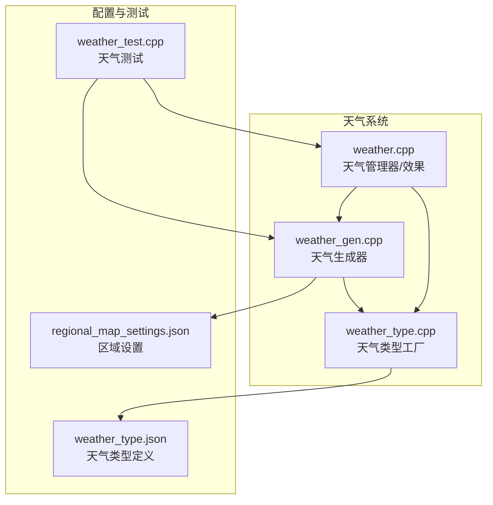
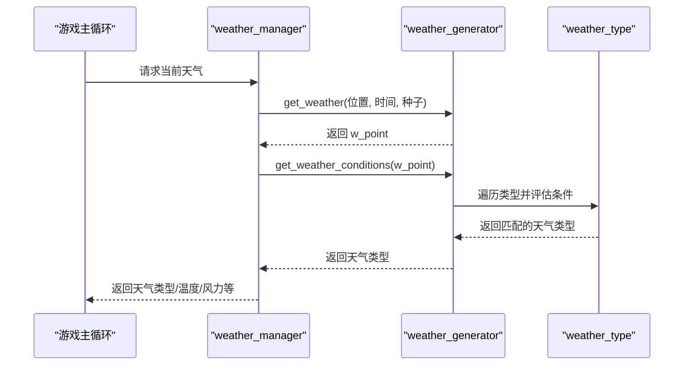
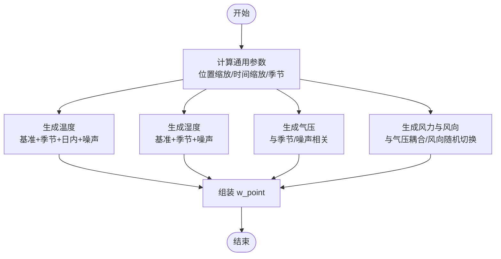
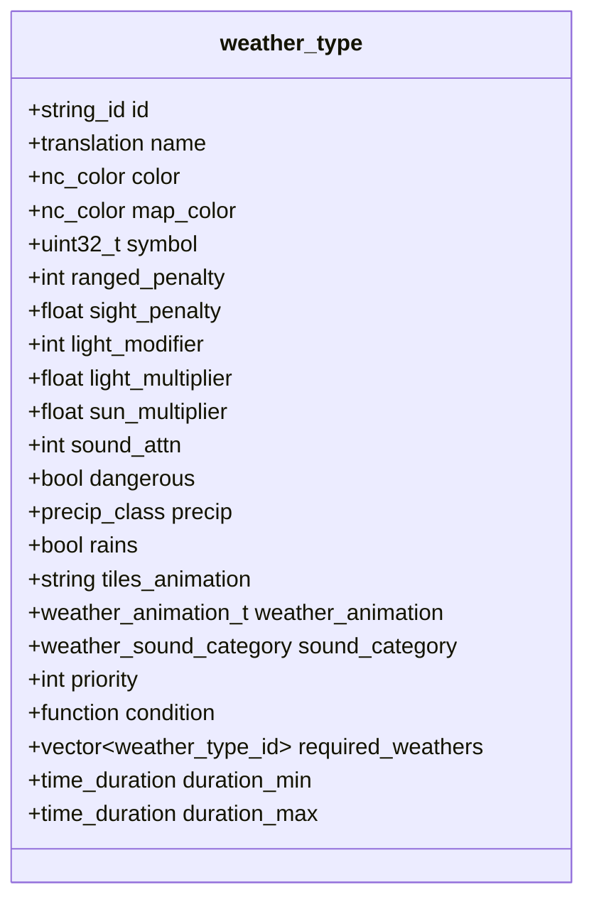
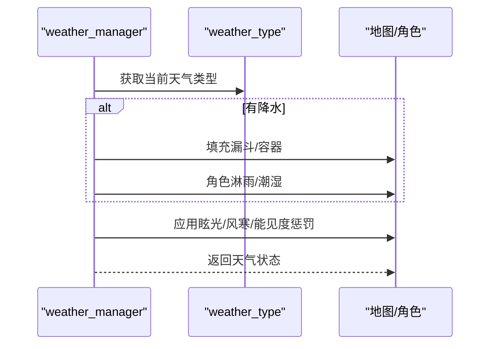
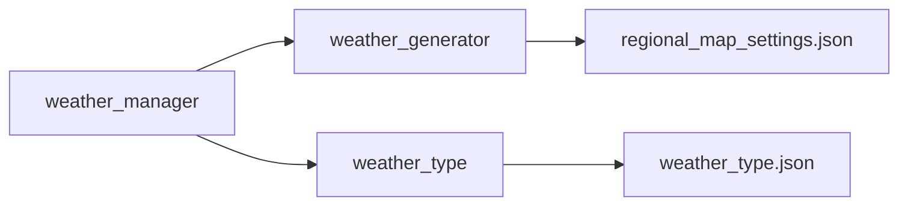

# 天气系统

<cite>
**本文引用的文件**
- weather.h
- weather.cpp
- weather_gen.h
- weather_gen.cpp
- weather_type.h
- weather_type.cpp
- weather_test.cpp
- weather_type.json
- regional_map_settings.json
</cite>

## 目录
1. [简介](#简介)
2. [项目结构](#项目结构)
3. [核心组件](#核心组件)
4. [架构总览](#架构总览)
5. [详细组件分析](#详细组件分析)
6. [依赖关系分析](#依赖关系分析)
7. [性能考量](#性能考量)
8. [故障排查指南](#故障排查指南)
9. [结论](#结论)
10. [附录](#附录)

## 简介
本文件系统化梳理 Cataclysm-DDA 的天气系统，覆盖天气生成算法、气候区域划分与天气变化机制；解释天气对游戏玩法的影响（能见度、移动速度、温度调节等）；给出天气类型定义、持续时间与强度计算方法；提供配置参数说明、自定义天气效果与平衡性调整建议，并附带具体算法与配置示例路径。

## 项目结构
天气系统由“天气生成器”“天气类型定义”“天气管理器”三部分组成，配合测试用例与区域配置文件共同工作：
- 天气生成器：基于位置、时间与随机种子，生成温度、湿度、气压、风力与风向等基础气象要素，并据此判定当前天气类型。
- 天气类型：通过 JSON 定义天气名称、颜色、符号、能见度与射程惩罚、降水强度、动画与音效等属性，并以条件表达式决定触发时机。
- 天气管理器：缓存当前天气、温度、风向与风速，负责天气切换、光照与风寒计算、降水收集等运行时逻辑。

图示来源
- weather_gen.cpp
- weather_type.cpp
- weather.cpp
- weather_type.json
- regional_map_settings.json
- weather_test.cpp

章节来源
- weather_gen.h
- weather_type.h
- weather.h

## 核心组件
- 天气生成器 weather_generator
  - 输入：绝对坐标、时间点、随机种子
  - 输出：w_point（温度、湿度、气压、风速、风向、光照修正等）
  - 关键能力：季节性温度/湿度扰动、气压与风力噪声模型、风向随风力变化
- 天气类型 weather_type
  - 定义：名称、颜色、符号、射程/能见度惩罚、降水强度、动画与音效、优先级、触发条件、持续时间范围
  - 加载：从 JSON 读取并校验一致性
- 天气管理器 weather_manager
  - 缓存：当前天气、温度、风向/风速、下次切换时间
  - 运行：处理降水/潮湿、眩光、风寒、降水收集、天气预报文本生成

章节来源
- weather_gen.cpp
- weather_type.cpp
- weather.cpp
- weather.h

## 架构总览
天气系统采用“生成器 + 类型 + 管理器”的分层设计：
- 生成器负责全局气象场的连续模拟，输出瞬时 w_point
- 类型系统根据 w_point 与条件表达式选择当前天气
- 管理器在运行时应用天气效果、维护缓存与UI反馈

图示来源
- weather_gen.cpp
- weather.cpp

## 详细组件分析

### 天气生成器：算法与参数
- 基础要素生成
  - 温度：基准温度 + 季节性扰动 + 日内扰动 + 噪声扰动
  - 湿度：基准湿度 + 季节性修正 + 噪声扰动
  - 气压：与季节性/噪声相关
  - 风力/风向：风力分布与气压耦合，低风力时风向易变
- 关键参数
  - 基准温度、湿度、气压、平均风速、风向分布峰值、季节性温度/湿度修正、风季变化因子
- 算法要点
  - 使用四维噪声函数生成空间与时间上的连续扰动
  - 将风向离散分布映射为角度，随风力变化进行随机切换
  - 水温按年/日周期计算，用于水域交互

图示来源
- weather_gen.cpp
- weather_gen.cpp
- weather_gen.cpp

章节来源
- weather_gen.h
- weather_gen.h
- weather_gen.cpp
- weather_gen.cpp

### 天气类型：定义、条件与效果
- 属性字段
  - 名称、颜色、地图符号、射程惩罚、能见度惩罚、光照修正、降水强度、是否降雨、动画与音效类别、优先级、触发条件、持续时间范围
- 触发条件
  - 使用条件表达式（如湿度/气压/温度/风力阈值、昼夜、距离等），支持 required_weathers 实现天气链式演化
- 动画与音效
  - 通过 tiles_animation 与 weather_animation 定义粒子效果；sound_category 控制环境音效

图示来源
- weather_type.h
- weather_type.cpp

章节来源
- weather_type.h
- weather_type.cpp
- weather_type.json

### 天气管理器：运行时效果与UI
- 效果处理
  - 降水：填充漏斗/容器、角色淋雨、气味衰减
  - 眩光：根据太阳辐照度与季节判定是否产生眩光或雪地眩光
  - 风寒：根据温度、湿度与风速计算风寒效应
  - 能见度/射程惩罚：依据天气类型施加
- UI与缓存
  - 缓存温度、风向/风速、当前天气类型、下次切换时间
  - 提供天气预报文本生成、风向/风速描述与颜色

图示来源
- weather.cpp
- weather.cpp
- weather.cpp

章节来源
- weather.h
- weather.cpp
- weather.cpp

### 区域设置与气候分区
- 区域设置
  - 通过 regional_map_settings.json 定义默认地形、植被、水系与城市连接等，间接影响天气生成的地理背景
- 天气白/黑名单
  - 可在区域设置中限制可用天气类型，实现不同生态/模组下的天气多样性

章节来源
- regional_map_settings.json
- weather_gen.cpp

### 天气对玩法的影响
- 能见度与射程
  - 不同天气类型具有不同的 sight_penalty 与 ranged_penalty，影响远程战斗精度与视野
- 温度与风寒
  - get_local_windchill 计算风寒差值，结合角色保暖与装备影响体感温度
- 降水与潮湿
  - 降水导致地面潮湿、气味衰减、角色淋湿；可被容器/漏斗收集为雨水
- 眩光
  - 强光下（尤其是冬季雪面）可能造成眩光，降低命中或视野

章节来源
- weather_type.json
- weather.cpp
- weather.cpp
- weather.cpp

## 依赖关系分析
- weather_manager 依赖 weather_generator 与 weather_type
- weather_generator 依赖 JSON 中的区域设置与天气类型定义
- weather_type 由 JSON 加载并通过工厂注册，供生成器评估

图示来源
- weather.h
- weather_gen.cpp
- weather_type.cpp
- weather_type.json
- regional_map_settings.json

章节来源
- weather.h
- weather_gen.cpp
- weather_type.cpp

## 性能考量
- 天气生成
  - 使用四维噪声函数，时间复杂度与采样步长相关；测试用例显示一年数据生成耗时可控
- 条件评估
  - 对 sorted_weather 进行线性扫描，优先级排序有助于快速裁剪候选集
- 运行时开销
  - 降水收集与角色淋湿按固定频率触发，避免每帧高频检查

章节来源
- weather_test.cpp
- weather_gen.cpp
- weather.cpp

## 故障排查指南
- 天气异常
  - 检查 weather_type.json 中的条件表达式是否正确引用了 weather('...') 变量
  - 确认 required_weathers 顺序与依赖关系
- 风寒/眩光不生效
  - 核对 get_local_windchill 与 incident_sun_irradiance 的调用与参数
- 降水收集无效
  - 检查漏斗/容器是否满足 add_rain_to_container 的容量与类型要求
- 区域天气不符预期
  - 检查区域设置中的天气白/黑名单与季节性修正参数

章节来源
- weather_type.json
- weather.cpp
- weather.cpp
- weather_gen.cpp

## 结论
Cataclysm-DDA 的天气系统通过“连续噪声生成 + 条件驱动 + 运行时效果”的组合，实现了真实且可定制的天气体验。其模块化设计便于扩展新天气类型与区域特性，同时测试用例验证了温度与降水分布的合理性。通过合理配置天气类型与区域参数，可实现多样化的生态与挑战体验。

## 附录

### 天气类型定义与配置示例
- 常见天气类型
  - 晴天、多云、小雨、阵雨、暴雨、雷暴、闪电、小雪、降雪、雪暴、薄雾、大雾、传送风暴等
- 关键字段说明
  - ranged_penalty：远程攻击命中惩罚
  - sight_penalty：每格视野透明度惩罚
  - light_modifier/sun_multiplier：光照修正
  - sound_attn：声音衰减
  - precip + rains：降水强度与是否降雨
  - tiles_animation + weather_animation：粒子效果
  - sound_category：环境音效类别
  - priority：优先级
  - condition：触发条件（数学表达式）
  - required_weathers：前置天气链
  - duration_min/duration_max：持续时间范围

章节来源
- weather_type.json
- weather_type.cpp

### 天气生成参数与平衡性调整建议
- 参数位置
  - 基准温度/湿度/气压/风速、风向分布峰值、季节性修正、风季变化因子
- 平衡性建议
  - 通过 regional_map_settings.json 的天气白/黑名单控制生态差异
  - 在 weather_type.json 中微调降水强度与能见度惩罚，确保可玩性
  - 使用测试用例收集统计数据，验证温度与降水分布是否符合预期

章节来源
- weather_gen.cpp
- weather_test.cpp