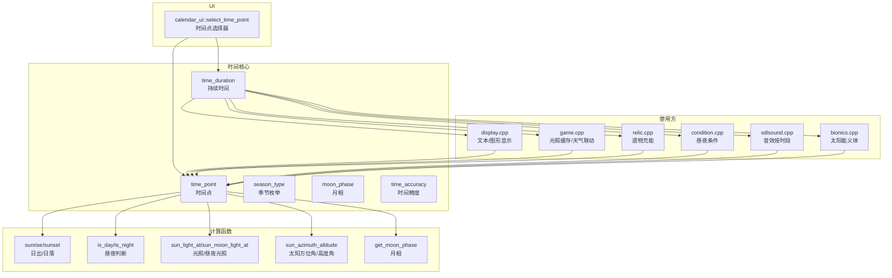
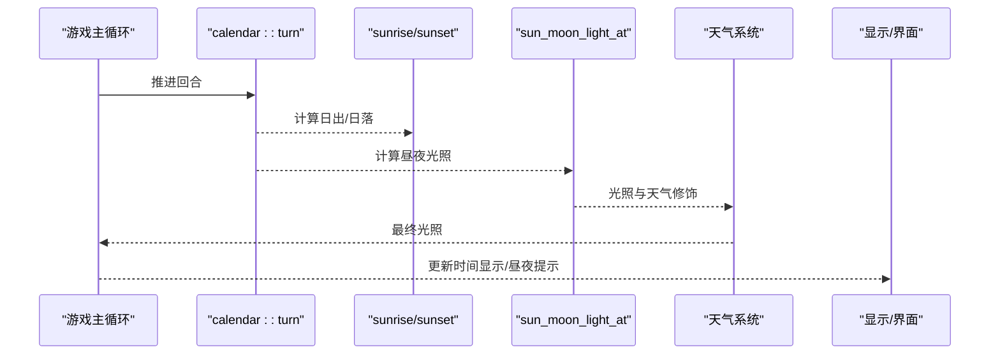
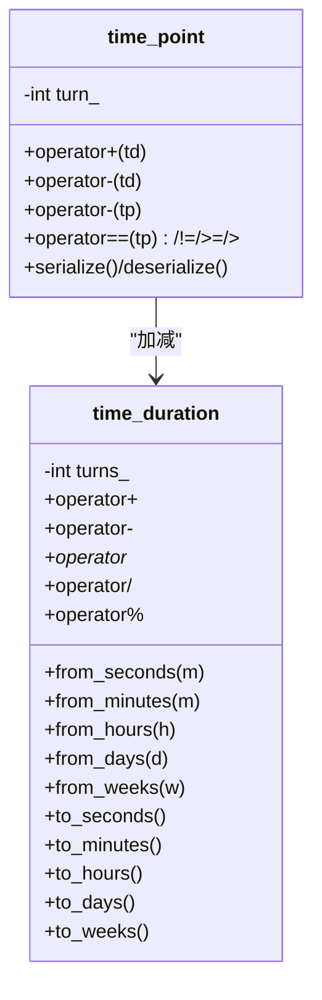
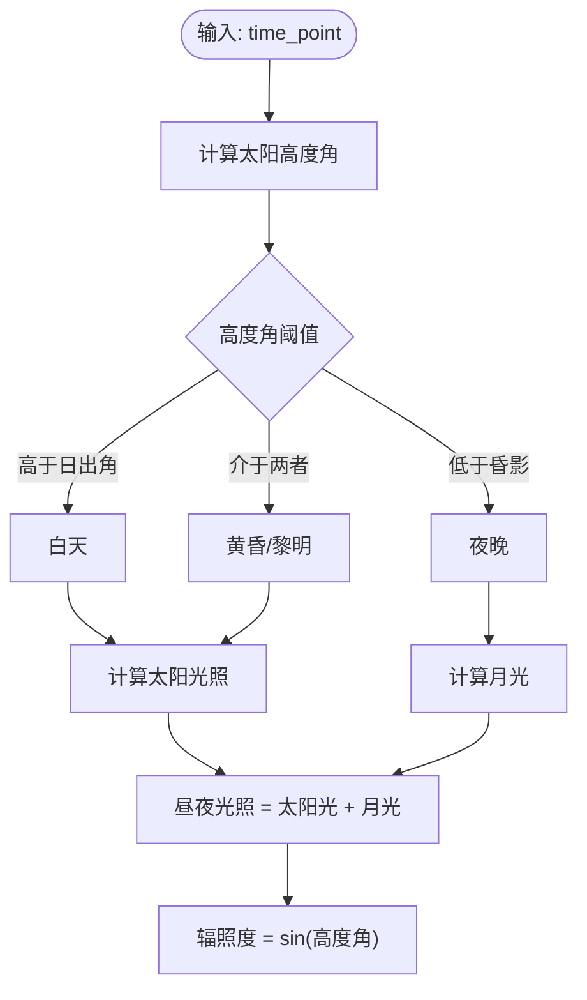
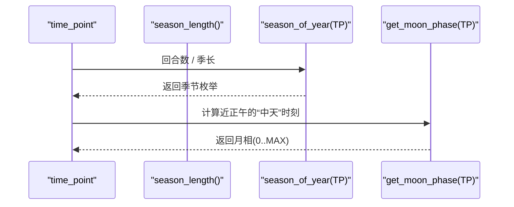
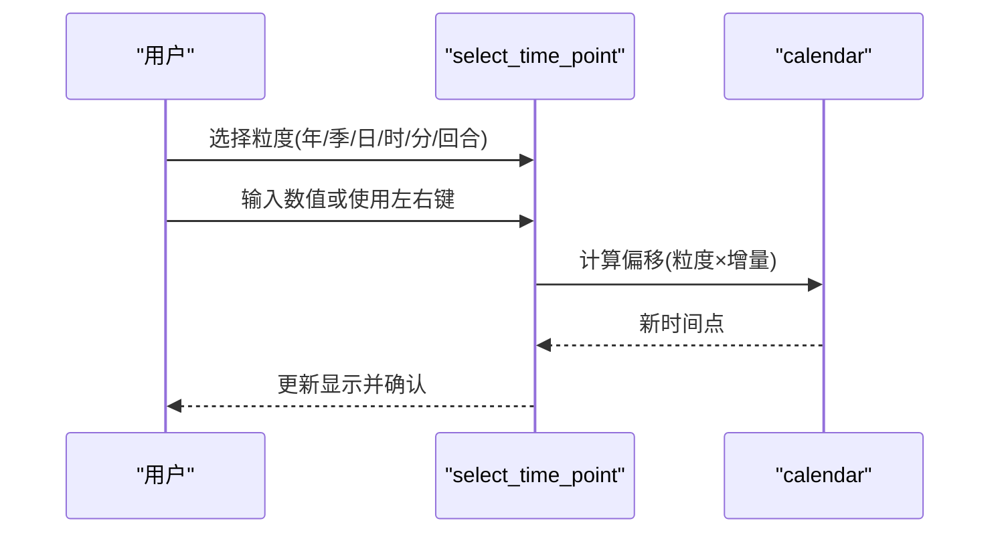
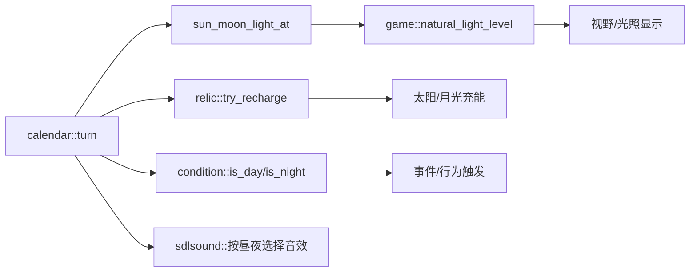
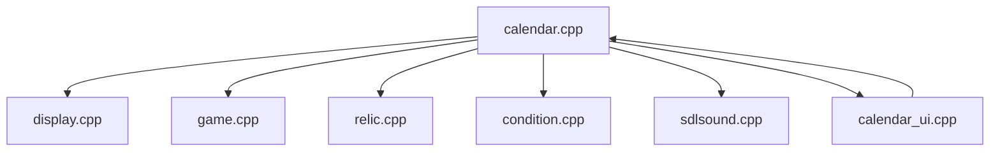

# 时间与日历

<cite>
**本文引用的文件**
- calendar.h
- calendar.cpp
- calendar_ui.h
- calendar_ui.cpp
- calendar_test.cpp
- display.cpp
- game.cpp
- relic.cpp
- condition.cpp
- sdlsound.cpp
- bionics.cpp
</cite>

## 目录
1. [简介](#简介)
2. [项目结构](#项目结构)
3. [核心组件](#核心组件)
4. [架构总览](#架构总览)
5. [详细组件分析](#详细组件分析)
6. [依赖关系分析](#依赖关系分析)
7. [性能考量](#性能考量)
8. [故障排查指南](#故障排查指南)
9. [结论](#结论)
10. [附录](#附录)

## 简介
本文件系统化梳理 Cataclysm-DDA 的时间与日历系统，覆盖以下主题：
- 时间推进机制：以“回合”为最小单位，支持秒、分钟、小时、天、周、季、年等复合单位换算与显示。
- 昼夜循环与光照：基于太阳/月亮高度角计算日出日落、黄昏黎明、光照亮度与辐照度，考虑天气与永恒日夜/季节选项。
- 季节变化：可配置季长，支持永恒季节模式；根据纬度与年长推导日照时长与太阳位置。
- 对游戏元素的影响：光照影响视野、天气事件、遗物充能（太阳/月光）、生物活动条件、NPC行为与昼夜偏好。
- 日历配置与历史记录：世界设置项控制季长、永恒日夜/季节；UI 提供时间点选择；日记与时间估算用于玩家记录。

## 项目结构
时间与日历系统主要由以下模块组成：
- 核心类与接口：时间点、持续时间、季节枚举、月相、时间精度等级。
- 计算函数：日出日落、昼夜判断、光照/辐照度、太阳方位角/高度角、月相。
- UI：交互式时间点选择器。
- 使用方：显示层（文本/图形）、游戏主循环（光照缓存/天气联动）、物品/遗物（充能条件）、条件表达式（昼夜判定）。

**图表来源**
- calendar.h
- calendar.cpp
- calendar_ui.h
- calendar_ui.cpp
- display.cpp
- game.cpp
- relic.cpp
- condition.cpp
- sdlsound.cpp
- bionics.cpp

**章节来源**
- calendar.h
- calendar.cpp
- calendar_ui.h
- calendar_ui.cpp

## 核心组件
- 时间点与持续时间
  - time_point：封装回合数，支持加减持续时间、比较、序列化。
  - time_duration：封装整数“回合数”，提供从秒/分/时/天/周到回合的转换与运算。
  - 单位字面量：支持 _turns/_seconds/_minutes/_hours/_days/_weeks。
- 季节与月相
  - season_type：春/夏/秋/冬/末日。
  - moon_phase：新月/上弦/盈凸/满月/亏凸/下弦/残月。
- 昼夜与光照
  - is_day/is_night/is_dawn/is_dusk：基于太阳高度角与天文昏影阈值判断。
  - sun_light_at/sun_moon_light_at/sun_irradiance：太阳光/昼夜光/辐照度计算。
  - sun_azimuth_altitude/sunlight_angle：太阳方位角/高度角与光线方向。
  - get_moon_phase：基于“朔望月”周期与近正午对齐的月相切换。
- 世界选项
  - eternal_season/eternal_day/eternal_night：永恒季节/昼/夜。
  - season_length/year_length/set_location：季长、年长、经纬度。
- UI
  - calendar_ui::select_time_point：按年/季/日/时/分/回合粒度选择时间点。

**章节来源**
- calendar.h
- calendar.cpp
- calendar_ui.h
- calendar_ui.cpp

## 架构总览
时间系统采用“回合制推进 + 天文模型”的设计：
- 回合推进：全局时间指针 calendar::turn 每次行动/周期推进一个回合。
- 天文计算：根据当前时间、经纬度、年长与季长，计算太阳/月亮位置与光照。
- 世界选项：通过 eternal_* 与 season_length 控制天文与季节表现。
- 使用方：显示层、游戏光照缓存、天气联动、物品/遗物充能、条件表达式等。

**图表来源**
- calendar.cpp
- calendar.cpp
- game.cpp
- display.cpp

## 详细组件分析

### 时间点与持续时间类
- 设计要点
  - time_duration 以整数回合存储，避免浮点误差；提供 from_* 与 to_* 转换。
  - time_point 与 time_duration 支持四则运算与取模，便于“某日/某季/某年”的周期计算。
  - 提供“裁剪显示”与“约估显示”，兼顾精确与可读性。
- 关键算法
  - 周期取模：time_past_midnight/time_past_new_year/day_of_season 等。
  - 约估显示：to_string_approx，按分钟/小时/天粒度给出“多于/少于/约”提示。
- 性能特性
  - 所有计算为纯数学与三角函数，常数时间复杂度；裁剪显示避免多余字符串拼接。

**图表来源**
- calendar.h

**章节来源**
- calendar.h
- calendar.cpp

### 昼夜循环与光照模型
- 太阳位置与日出日落
  - 基于年长与季长推导太阳周年运动；经度转换为时区偏移；使用恒星时与黄道坐标系转换至地平坐标。
  - 日出/日落通过太阳高度角阈值迭代求解，支持黄昏/黎明边界。
- 昼夜与光照
  - is_day/is_night 基于太阳高度角阈值；is_dawn/is_dusk 基于“正午前后”与阈值。
  - sun_light_at 分段指数/线性函数模拟不同昏影阶段的光照强度；sun_moon_light_at 综合太阳与月光。
  - sun_irradiance 仅太阳辐照度，sin(高度角) 归一化。
- 永恒模式
  - eternal_day/eternal_night 将太阳高度固定在昼或夜阈值之下；eternal_season 将太阳位置与季节解耦，保持同一“有效时间”。

**图表来源**
- calendar.cpp
- calendar.cpp
- calendar.cpp
- calendar.cpp
- calendar.cpp

**章节来源**
- calendar.cpp
- calendar.cpp
- calendar.cpp

### 季节与月相
- 季节
  - season_length 可配置；year_length = 4 × season_length；season_of_year 基于回合数与季长取模。
  - eternal_season 模式下，季相不随时间变化，太阳位置与天气保持稳定。
- 月相
  - lunar_month 以“朔望月”为基准；月相在“正午”对齐切换，避免夜间漂移。

**图表来源**
- calendar.cpp
- calendar.cpp
- calendar.cpp

**章节来源**
- calendar.cpp
- calendar.cpp
- calendar.cpp

### UI：时间点选择器
- 功能
  - 支持按年/季/日/时/分/回合逐级调整；支持左右键自动增减与重置。
  - 限制最大/最小时间范围，防止溢出。
- 使用场景
  - 调试/修改器、日记/历史记录标记、任务/事件触发时间设定。

**图表来源**
- calendar_ui.cpp

**章节来源**
- calendar_ui.h
- calendar_ui.cpp

### 对游戏元素的影响
- 视野与光照
  - 游戏根据 sun_moon_light_at 与天气修饰计算自然光照，缓存于 latest_lightlevels，避免重复计算。
- 遗物充能
  - 太阳充能：白天且天气晴朗；月光充能：夜晚且特定月相；满月/新月专属充能。
- 条件表达式
  - is_day/is_night 条件用于判定生物活动、NPC 行为与触发事件。
- 音效与时序
  - 音效系统根据 is_night 与时段选择昼夜音效。

**图表来源**
- game.cpp
- relic.cpp
- condition.cpp
- sdlsound.cpp

**章节来源**
- game.cpp
- relic.cpp
- condition.cpp
- sdlsound.cpp

## 依赖关系分析
- 内部依赖
  - calendar.cpp 实现所有天文与光照计算，被 display.cpp、game.cpp、relic.cpp、condition.cpp、sdlsound.cpp 广泛调用。
  - calendar_ui.cpp 依赖 calendar.h 的时间类型与函数。
- 外部依赖
  - units/数学库：角度/三角函数与单位换算。
  - RNG：随机持续时间与概率事件。
  - 选项系统：世界选项（季长、永恒模式、经纬度）。

**图表来源**
- calendar.cpp
- display.cpp
- game.cpp
- relic.cpp
- condition.cpp
- sdlsound.cpp
- calendar_ui.cpp

**章节来源**
- calendar.cpp
- calendar_ui.cpp

## 性能考量
- 计算复杂度
  - 天文计算为常数时间（三角函数与线性变换），日出/日落通过迭代收敛，通常步数有限。
- 缓存策略
  - game.cpp 中对自然光照进行 z 层缓存，减少重复计算。
- 优化建议
  - 在高频 UI 场景（如时间选择器）避免频繁格式化字符串，优先使用裁剪显示。
  - 对光照与天气修饰的组合计算，尽量批量处理并复用中间结果。
  - 永恒模式下可跳过季长与太阳位置更新，直接返回固定值。

[本节为通用性能指导，无需特定文件引用]

## 故障排查指南
- 现象：光照异常或昼夜切换不正确
  - 检查 set_location 是否正确设置经纬度；检查 eternal_day/eternal_night/eternal_season 选项是否启用。
  - 核对 season_length 与 year_length 的设置是否符合预期。
- 现象：时间显示不一致
  - 确认 to_string_time_of_day 的 24 小时选项；检查裁剪显示逻辑与本地化字符串。
- 现象：遗物无法充能
  - 检查 is_day/is_night 与月相判断；确认天气修饰（晴/多云）与持有状态。
- 现象：UI 时间选择无效
  - 检查 set_turn 的偏移计算与边界限制；确认最大/最小时间点约束。

**章节来源**
- calendar.cpp
- calendar.cpp
- calendar.cpp
- calendar_ui.cpp
- relic.cpp

## 结论
Cataclysm-DDA 的时间与日历系统以回合为核心，结合天文模型与世界选项，实现了真实感与可配置性的平衡。其关键优势在于：
- 精确的昼夜与光照计算，支持天气与月相联动。
- 可配置的季长与永恒模式，满足多样化玩法需求。
- 完整的 UI 与使用方集成，覆盖显示、光照、物品与条件表达式等场景。

建议在自定义模组中谨慎调整季长与永恒选项，确保与光照、天气与生物活动的平衡一致。

[本节为总结性内容，无需特定文件引用]

## 附录

### 时间单位与换算
- 基本单位：1 回合 ≈ 1 秒（在持续时间中以回合计）。
- 常用换算：1 分钟 = 60 回合；1 小时 = 60 分钟；1 天 = 24 小时；1 周 = 7 天；1 季 = season_length(天)；1 年 = 4 季。
- 单位字面量：_turns/_seconds/_minutes/_hours/_days/_weeks。

**章节来源**
- calendar.h
- calendar.cpp

### 世界选项与配置
- eternal_season：启用后季相与太阳位置固定，适合“无季节”体验。
- eternal_day/eternal_night：强制昼/夜恒定，适合特殊主题地图。
- season_length：季长（天），默认约等于现实 91 天。
- set_location：经纬度，决定日出日落与太阳高度。

**章节来源**
- calendar.cpp

### 测试与验证
- 测试覆盖：持续时间字符串化、永恒季模式下的显示差异。
- 建议：新增测试用例覆盖极端经纬度、极昼/极夜、永恒日夜/季节组合。

**章节来源**
- calendar_test.cpp