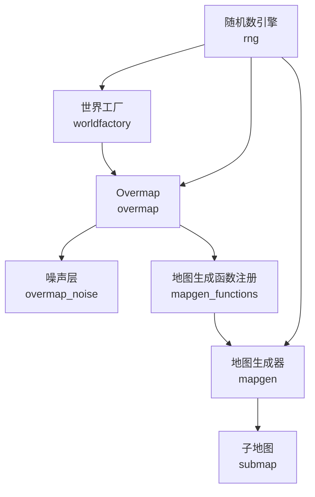
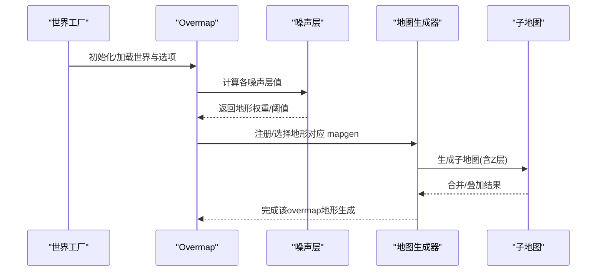
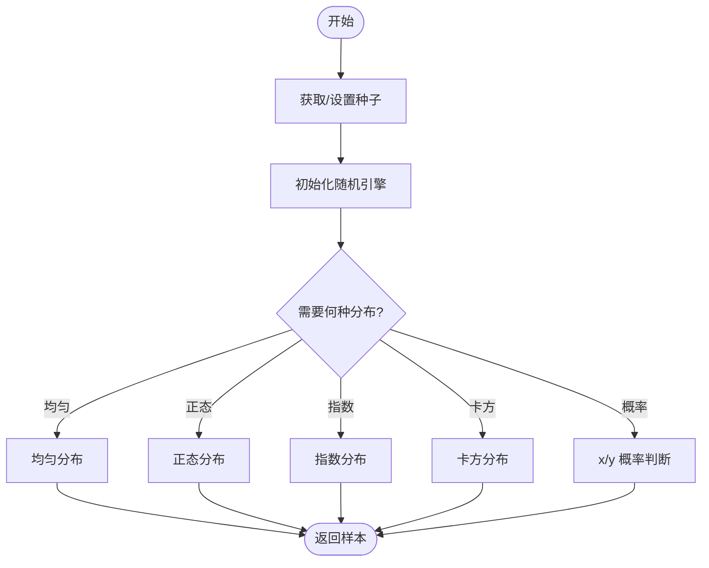
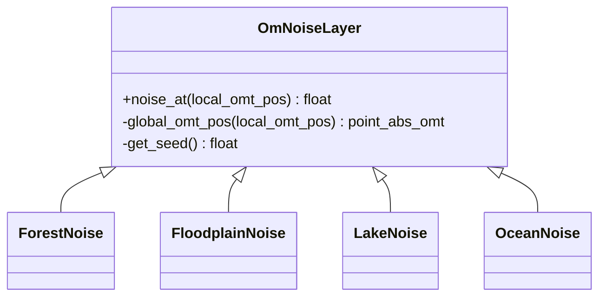
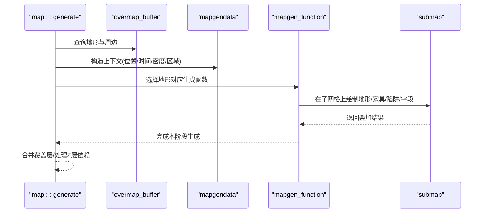
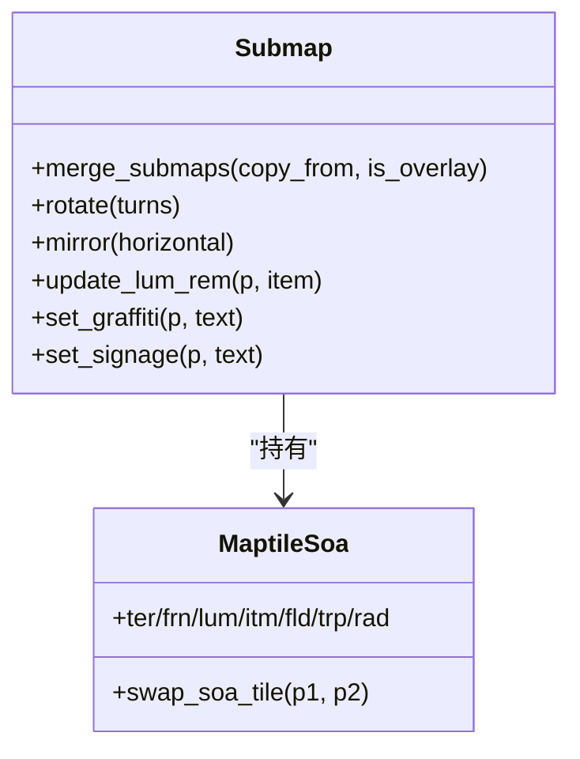
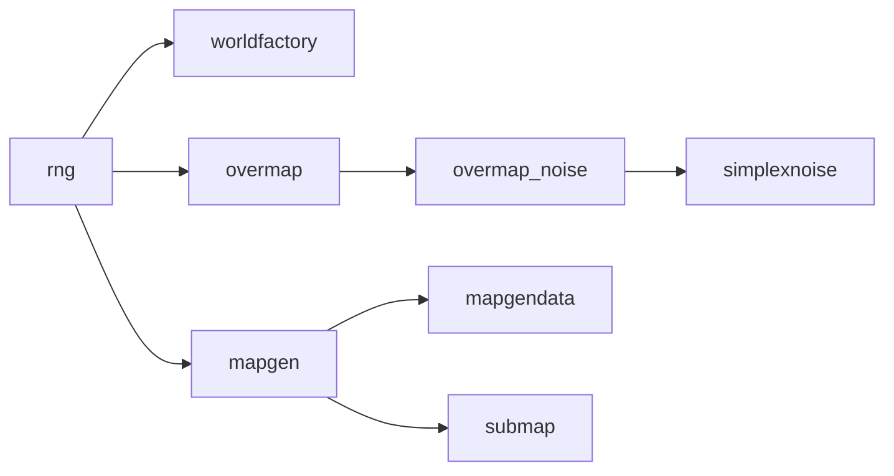

# 程序化生成

<cite>
**本文引用的文件**
- src/worldfactory.cpp
- src/worldfactory.h
- src/rng.cpp
- src/rng.h
- src/mapgen.cpp
- src/mapgen.h
- src/mapgen_functions.cpp
- src/mapgen_functions.h
- src/mapgendata.cpp
- src/mapgendata.h
- src/overmap.cpp
- src/overmap_noise.h
- src/overmap_noise.cpp
- src/simplexnoise.cpp
- src/submap.cpp
</cite>

## 目录
1. [简介](#简介)
2. [项目结构](#项目结构)
3. [核心组件](#核心组件)
4. [架构总览](#架构总览)
5. [详细组件分析](#详细组件分析)
6. [依赖关系分析](#依赖关系分析)
7. [性能考量](#性能考量)
8. [故障排查指南](#故障排查指南)
9. [结论](#结论)
10. [附录](#附录)

## 简介
本文件系统性梳理 Cataclysm-DDA 的程序化生成体系，覆盖世界种子与随机数生成、确定性算法、overmap 地形与噪声层、子地图与地图生成、资源与物品生成、以及可扩展的生成器框架。文档以循序渐进的方式呈现，既适合初学者快速上手，也为高级开发者提供深入的技术细节与优化建议。

## 项目结构
围绕“世界—overmap—子地图—地图”的层级，程序化生成由以下模块协同完成：
- 世界工厂：负责世界初始化、选项加载与保存、模组管理。
- 随机数与确定性：统一的 PRNG 引擎、时间种子、哈希种子与确定性序列。
- Overmap 生成：基于噪声层与地形类型规则，生成大世界地形、河流、湖泊、海洋、道路等。
- 地图生成：在 overmap 基础上，按地形类型选择 mapgen 函数，生成子地图与内部布局。
- 子地图与空间索引：子地图合并、旋转镜像、场与光源维护、车辆与生物生成。
- 资源与物品：基于物品组与生成率的确定性生成策略。

图表来源
- src/worldfactory.cpp
- src/overmap.cpp
- src/mapgen_functions.cpp
- src/mapgen.cpp
- src/submap.cpp
- src/rng.cpp

章节来源
- src/worldfactory.cpp
- src/overmap.cpp
- src/mapgen_functions.cpp
- src/mapgen.cpp
- src/submap.cpp
- src/rng.cpp

## 核心组件
- 世界工厂与世界选项
  - 世界保存、加载、模组列表管理；世界选项通过 options 系统持久化。
- 随机数与确定性
  - 默认使用线性同余引擎，首次调用以高精度时间作为种子；支持外部设置种子；提供均匀/正态/指数/卡方等分布与确定性序列。
- Overmap 与噪声层
  - 多种噪声层（森林、冲积平原、湖泊、海洋）组合生成地形；支持连续跨 overmap 的噪声。
- 地图生成器
  - JSON 与内置函数双轨并行；按地形类型选择 mapgen 函数；分阶段执行（移除、地形、家具、默认、嵌套、变换、势力归属、区域）。
- 子地图与空间索引
  - 子地图合并、旋转镜像、场与光源维护、车辆与生物生成缓存。

章节来源
- src/worldfactory.h
- src/rng.h
- src/overmap_noise.h
- src/mapgen.h
- src/submap.cpp

## 架构总览
下图展示从世界到地图生成的关键交互路径与职责边界：

图表来源
- src/worldfactory.cpp
- src/overmap.cpp
- src/overmap_noise.cpp
- src/mapgen.cpp
- src/submap.cpp

## 详细组件分析

### 世界种子系统与随机数生成
- 种子来源
  - 首次调用随机函数时，使用高精度时钟作为种子；可通过接口显式设置种子，确保可复现。
  - djb2 哈希用于世界名等字符串到整型的映射，便于作为部分随机源的种子输入。
- 确定性序列
  - 提供独立于全局状态的确定性整数序列生成，便于测试与调试。
- 分布与概率
  - 均匀、正态、指数、卡方分布；概率判断与骰子模拟；带小数的“概率取整”策略保证期望正确。

图表来源
- src/rng.cpp
- src/rng.cpp
- src/rng.cpp
- src/rng.cpp
- src/rng.cpp

章节来源
- src/rng.cpp
- src/rng.cpp
- src/rng.cpp
- src/rng.cpp
- src/rng.cpp

### Overmap 生成与地形类型分布
- 噪声层
  - 森林噪声、冲积平原噪声、湖泊噪声、海洋噪声分别控制不同地表特征的分布与连续性。
  - 通过多频次叠加与缩放，形成自然过渡与局部细节。
- 地形类型与连接规则
  - 基于 overmap 本地坐标与全局 base 点，保证跨 overmap 的噪声连续。
  - 道路/地铁/河流等线性地形根据方向数组与连接规则生成。
- 河流/湖泊/海洋
  - 使用噪声层与阈值判定；结合路径生成算法构建蜿蜒水系。

图表来源
- src/overmap_noise.h
- src/overmap_noise.cpp

章节来源
- src/overmap_noise.h
- src/overmap_noise.cpp
- src/overmap.cpp

### 地图生成算法与确定性流程
- 生成入口与上下文
  - map::generate 接收 overmap 坐标、时间点、是否保存结果等参数；为每个子网格准备子地图，必要时填充统一地形。
- 地图生成阶段
  - 阶段顺序：移除、地形、家具、默认、嵌套、变换、势力归属、区域。
  - 每个阶段对 mapgendata 中的 map、地形、家具、陷阱、辐射、字段、生物、物品等进行操作。
- 地形函数与内置生成器
  - 通过注册表将 overmap  terrain 类型映射到具体生成函数（如森林、河流、地铁、海岸、峡谷边缘等）。
  - 支持 JSON 描述的地图片段（jmapgen），按阶段应用到地图。

图表来源
- src/mapgen.cpp
- src/mapgen.h
- src/mapgen_functions.cpp

章节来源
- src/mapgen.cpp
- src/mapgen.h
- src/mapgen_functions.cpp

### 子地图创建与空间索引机制
- 子地图生命周期
  - 生成前先填充统一地形（若 overmap 指定），再绘制具体布局；支持覆盖层合并与叠加。
- 空间索引与数据结构
  - 子地图内部采用 SoA 结构存储地形、家具、光源、物品、场、陷阱、辐射等；提供旋转镜像与合并逻辑。
- 字段与光源
  - 维护场数量与光源计数，合并时累加或覆盖；支持物品发光项的光源更新。

图表来源
- src/submap.cpp
- src/submap.cpp

章节来源
- src/submap.cpp
- src/submap.cpp

### 资源与物品生成规则
- 物品组与生成率
  - 基于物品组（item_group）与生成率（spawn_rate）进行概率判定；类别生成率小于1时按概率取样，大于等于1时至少一次，并额外按次数取样。
- 生成位置与有效性
  - 在指定矩形范围内随机采样有效位置；对不可放置区域（如无地板、破坏项、密封容器）进行过滤。
- 生成器示例
  - 地图生成器中对“道路缺陷”“土壤”等场景使用随机分布与物品组生成。

章节来源
- src/map_extras.cpp
- src/mapgen.cpp

## 依赖关系分析
- 低耦合高内聚
  - RNG 与地图生成解耦，通过接口注入；overmap 与 mapgen 通过注册表解耦。
- 关键依赖链
  - worldfactory → overmap → mapgen → submap
  - overmap → overmap_noise → simplexnoise
  - mapgen → mapgendata → map

图表来源
- src/rng.cpp
- src/worldfactory.cpp
- src/overmap.cpp
- src/overmap_noise.cpp
- src/simplexnoise.cpp
- src/mapgen.cpp
- src/mapgendata.cpp
- src/submap.cpp

章节来源
- src/rng.cpp
- src/worldfactory.cpp
- src/overmap.cpp
- src/overmap_noise.cpp
- src/simplexnoise.cpp
- src/mapgen.cpp
- src/mapgendata.cpp
- src/submap.cpp

## 性能考量
- 噪声计算
  - 多层噪声叠加与缩放会增加计算量；建议在 overmap 初始化时缓存噪声结果，避免重复计算。
- 地图生成阶段
  - 分阶段执行减少一次性复杂度；尽量将昂贵操作（如路径/连通性检查）限制在必要区域。
- 子地图合并
  - 合并时逐格扫描与字段累加是主要开销；可考虑批量更新与惰性求值。
- 随机数
  - 频繁调用随机函数会引入抖动；对确定性要求高的场景应集中播种与重用随机序列。

## 故障排查指南
- 生成不一致
  - 检查是否显式设置了种子；确认世界名与模组列表未改变；核对 overmap 生成参数与噪声层配置。
- 过程卡顿
  - 关注噪声层与路径生成的循环次数；适当降低噪声层数或采样频率。
- 地图异常
  - 检查 mapgen 阶段顺序与参数一致性；验证覆盖层合并逻辑与 Z 层依赖。
- 物品未生成
  - 核对生成率与类别生成率；确认目标区域可放置且未被过滤。

章节来源
- src/overmap.cpp
- src/mapgen.cpp
- src/submap.cpp

## 结论
CDDA 的程序化生成体系以“确定性 + 可扩展 + 渐进式阶段化”为核心设计，通过噪声层与地形函数的组合实现自然感地形，借助 JSON 与内置函数的双轨机制满足多样化的生成需求。配合子地图的空间索引与合并策略，系统在可维护性与性能之间取得平衡。建议在实际开发中优先保证种子与参数稳定，合理利用噪声缓存与阶段化生成，以获得最佳体验。

## 附录
- 生成参数配置要点
  - overmap 噪声层参数（层数、持续性、缩放）影响地貌细节与连续性。
  - 地图生成器阶段权重与条件需与地形类型匹配，避免冲突。
  - 物品生成率与类别生成率需结合游戏节奏调整。
- 自定义生成器开发指南
  - 新增地形类型：在 overmap 与 mapgen 注册表中添加映射。
  - 新增 JSON 地图片段：遵循 jmapgen 规范，按阶段声明操作与条件。
  - 新增内置生成函数：实现 mapgen_function 接口并在注册表中绑定。
  - 测试与验证：使用确定性序列与固定种子进行回归测试。

章节来源
- src/mapgen.h
- src/mapgen_functions.h
- src/overmap.cpp