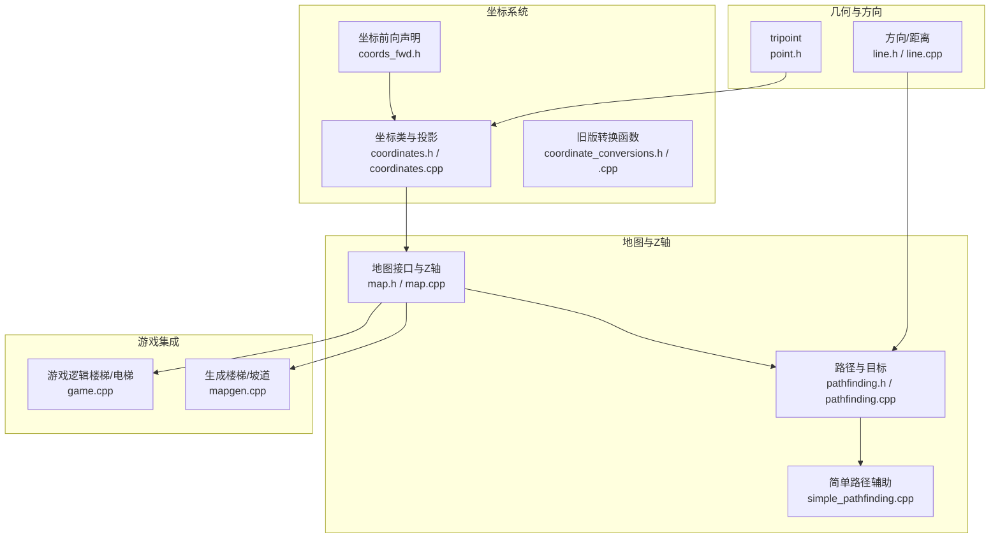
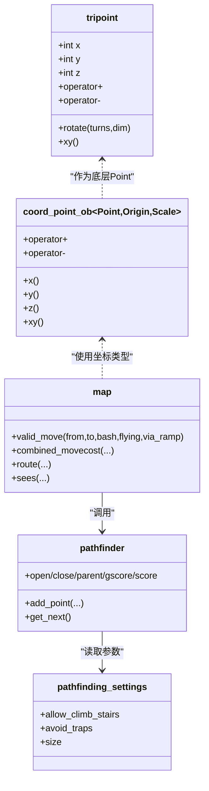
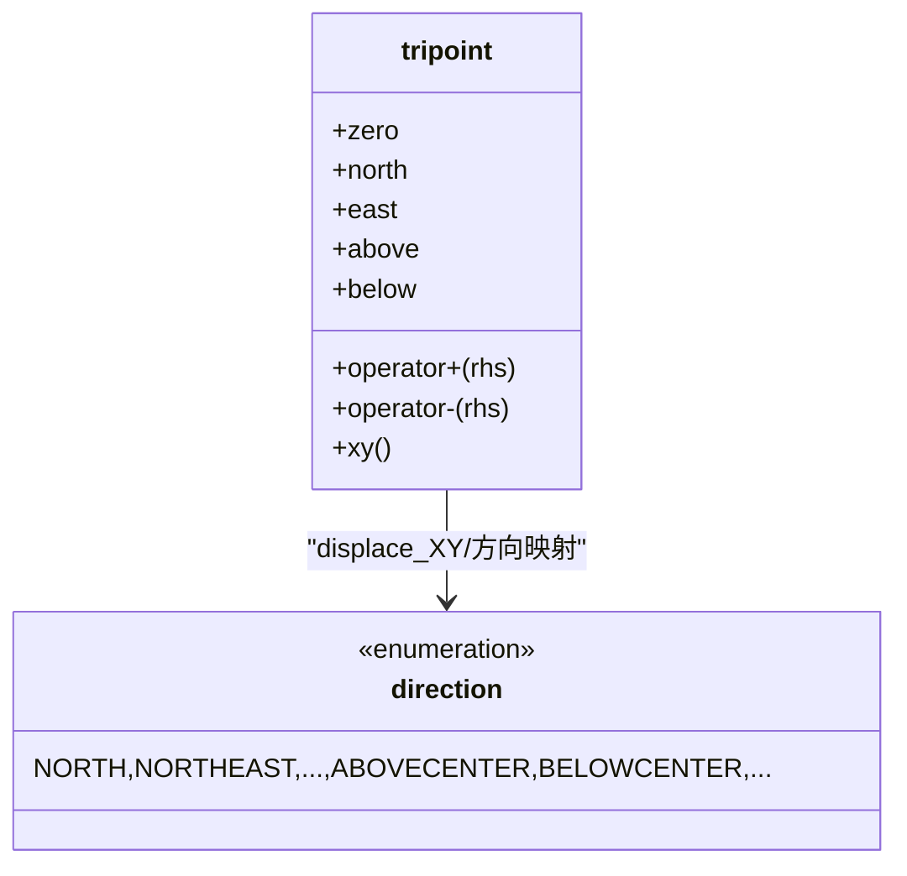
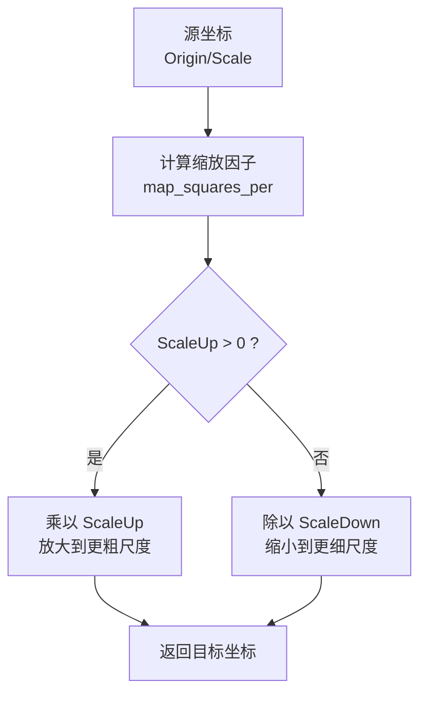
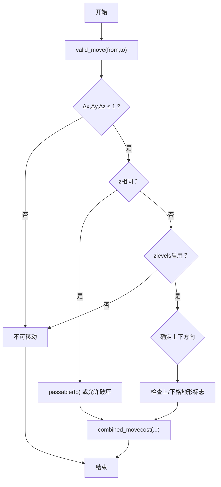
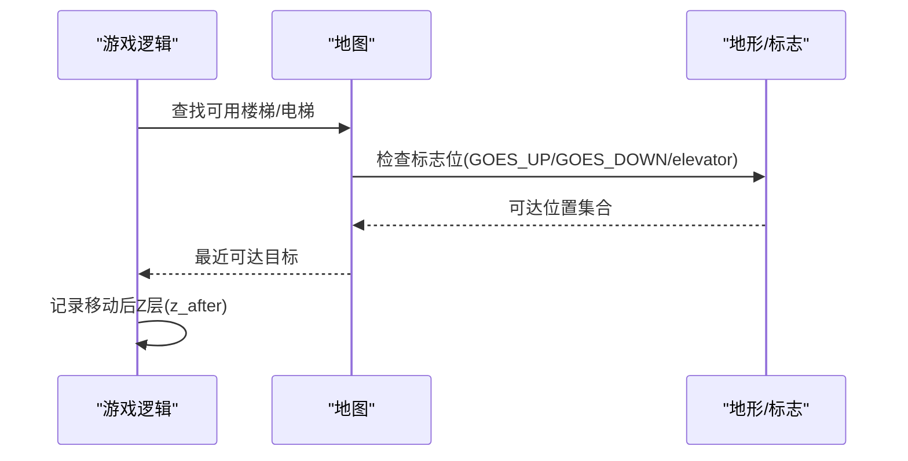
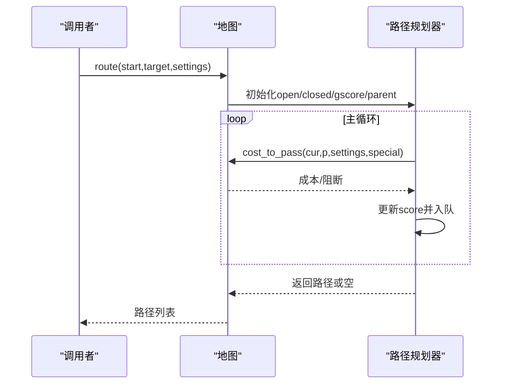
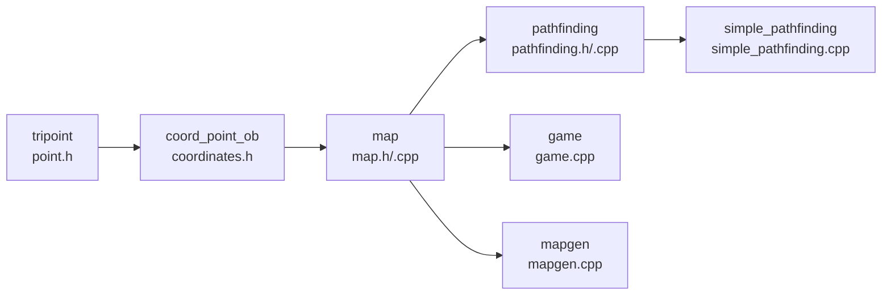

# 三维空间管理

<cite>
**本文引用的文件**
- point.h
- point.cpp
- coords_fwd.h
- coordinates.h
- coordinates.cpp
- coordinate_conversions.h
- coordinate_conversions.cpp
- line.h
- line.cpp
- map.h
- map.cpp
- pathfinding.h
- pathfinding.cpp
- simple_pathfinding.cpp
- game.cpp
- mapgen.cpp
- zlvels_transition.json
</cite>

## 目录
1. [简介](#简介)
2. [项目结构](#项目结构)
3. [核心组件](#核心组件)
4. [架构总览](#架构总览)
5. [详细组件分析](#详细组件分析)
6. [依赖关系分析](#依赖关系分析)
7. [性能考量](#性能考量)
8. [故障排查指南](#故障排查指南)
9. [结论](#结论)
10. [附录](#附录)

## 简介
本文件系统化梳理 Cataclysm-DDA 的三维空间管理体系，围绕 tripoint 坐标系统、三维数学模型与坐标转换机制展开；并结合地图 Z 轴层级管理、垂直移动成本、楼梯与坡道连接、碰撞检测、路径规划与视野计算等主题，提供可操作的实现参考与优化建议。文档同时给出面向开发者的代码级图示与路径指引，帮助快速定位到具体实现位置。

## 项目结构
三维空间管理涉及以下关键模块：
- 基础几何与坐标：tripoint 定义、方向枚举、距离度量
- 坐标系统与投影：多尺度（地图方格、子图、超地形、超图、段）与多原点（相对/绝对/子图/超地形/现实气泡）的坐标类型与投影函数
- 地图与Z轴：地图网格、Z层开关、垂直移动合法性、移动成本
- 路径与视野：A*路径规划、直线/射线算法、视野遮挡与覆盖

图表来源
- point.h
- line.h
- coords_fwd.h
- coordinates.h
- coordinates.cpp
- map.h
- map.cpp
- pathfinding.h
- pathfinding.cpp
- simple_pathfinding.cpp
- game.cpp
- mapgen.cpp

章节来源
- point.h
- coords_fwd.h
- coordinates.h
- coordinates.cpp
- map.h
- map.cpp
- pathfinding.h
- pathfinding.cpp
- simple_pathfinding.cpp
- game.cpp
- mapgen.cpp

## 核心组件
- tripoint 坐标与方向
  - tripoint 提供三维整数坐标与单位步长（上下、八方向），支持加减、旋转、哈希等基础运算
  - 方向枚举覆盖水平与垂直组合，用于路径与移动
- 坐标系统与投影
  - 多原点（相对/绝对/子图/超地形/现实气泡）与多尺度（地图方格、子图、超地形、段、超图）的坐标类型
  - 投影/取整/余数分解函数，实现不同尺度间的坐标换算
- 地图与Z轴
  - 地图类维护二维网格与Z层开关，提供移动合法性检查、移动成本计算、可见性与覆盖
- 路径与视野
  - A*路径规划器，支持目标区域、障碍规避、尺寸限制、车辆与危险场
  - 直线/射线算法与斜率归一化，用于视线与直线路径

章节来源
- point.h
- line.h
- coords_fwd.h
- coordinates.h
- map.h
- pathfinding.h

## 架构总览
三维空间管理以“坐标类型安全 + 尺度投影 + 地图Z轴 + 路径/视野”为主线，形成如下分层：
- 几何层：tripoint、point、方向与距离
- 坐标层：origin/scale 类型族与 project_to / project_remain
- 地图层：地图网格、Z层、移动成本、可见性
- 规划层：A*路径、直线/射线、目标区域

图表来源
- point.h
- coordinates.h
- map.h
- pathfinding.cpp
- pathfinding.h

## 详细组件分析

### tripoint 坐标系统与方向
- tripoint 定义了三维整数坐标与单位步长（北、东北、东、东南、南、西南、西、西北、上、下）
- 支持与 point 的混合运算（XY平面偏移不影响Z）
- 方向枚举覆盖水平与垂直组合，便于路径与移动

图表来源
- point.h
- line.h
- line.cpp

章节来源
- point.h
- line.h
- line.cpp

### 坐标系统与尺度投影
- origin/scale 定义了多原点与多尺度的坐标族
- project_to 实现尺度间投影（如从子图到地图方格、从超地形到超图）
- project_remain 返回商与余数，支持分层坐标分解（如某点在超图中的商坐标与余坐标）

图表来源
- coordinates.h
- coordinates.h
- coordinates.cpp

章节来源
- coords_fwd.h
- coordinates.h
- coordinates.h
- coordinates.cpp

### 地图Z轴层级与垂直移动
- 地图构造时可启用 Z 层（zlevels），按 Z 切片存储
- valid_move 检查相邻格是否满足 Z 变化约束（±1），并根据地形标志判断楼梯/坡道/电梯可用性
- combined_movecost 综合起点/终点成本，并按差异轴数调整（对角/斜向/垂直）

图表来源
- map.cpp
- map.cpp

章节来源
- map.cpp

### 楼梯与坡道连接机制
- 地形标志位（如 GOES_UP/GOES_DOWN、电梯）决定垂直移动合法性
- 游戏逻辑在附近范围内查找可用楼梯/电梯/坡道，结合 RL 距离选择最近可达目标
- 施工数据定义了坡道高/低端的构建与连接规则

图表来源
- game.cpp
- map.cpp

章节来源
- game.cpp
- mapgen.cpp
- zlvels_transition.json

### 碰撞检测与移动成本
- passable_ter_furn 判断是否可通过
- move_cost 结合地形/家具/车辆/场，返回非零成本或0（不可通过）
- combined_movecost 融合起点/终点成本，并按移动方向差异系数调整（对角/斜向/垂直）

章节来源
- map.cpp

### 路径规划与目标区域
- A* 路径规划器按 gscore/score 排序推进，支持目标点、邻域半径、圆形目标
- extra_cost 综合地形/陷阱/车辆/尺寸限制等特殊属性
- simple_pathfinding 提供方向集（含垂直）与成本估算（对角/斜向/垂直）

图表来源
- pathfinding.cpp
- pathfinding.h
- simple_pathfinding.cpp

章节来源
- pathfinding.cpp
- pathfinding.h
- simple_pathfinding.cpp

### 视野计算与遮挡
- sees 与 obstacle_coverage/ledge_coverage 提供视线与遮挡评估
- get_dir_circle 生成围绕目标的搜索序列，优先靠近目标的点，提升路径直线性

章节来源
- map.h

## 依赖关系分析
- 坐标类型安全：tripoint/point 与坐标族（coord_point_ob/_ib）解耦不同原点/尺度
- 地图与路径：地图接口依赖路径设置与缓存，路径规划器依赖地图网格与特殊属性
- 生成与交互：楼梯/坡道/电梯由生成数据与游戏逻辑共同决定

图表来源
- point.h
- coordinates.h
- map.h
- pathfinding.h
- simple_pathfinding.cpp
- game.cpp
- mapgen.cpp

章节来源
- point.h
- coordinates.h
- map.h
- pathfinding.h
- simple_pathfinding.cpp
- game.cpp
- mapgen.cpp

## 性能考量
- 路径规划
  - 使用 bitset 标记 open/closed，降低内存与缓存压力
  - 分层缓存（按Z层）避免重复计算
  - 优先队列按 score 排序，合理设置 max_dist/max_length 避免无界扩展
- 移动成本
  - combined_movecost 对不同轴差异应用系数，减少无效对角/斜向探索
  - 优先利用 passable_ter_furn 快速短路
- 视野
  - sees 与覆盖计算尽量复用缓存键，避免重复计算
- 坐标投影
  - project_to/project_remain 采用整除/乘法，避免浮点开销

[本节为通用指导，无需特定文件引用]

## 故障排查指南
- 无法垂直移动
  - 检查 zlevels 是否启用与地形标志位（GOES_UP/GOES_DOWN/elevator）
  - 使用 valid_move 进行单步验证
- 路径规划不收敛
  - 检查 settings 中 allow_climb_stairs/avoid_traps/size 等选项
  - 确认 extra_cost 对危险场/陷阱的处理
- 视野异常
  - 检查 sees 的 range 与 with_fields 参数
  - 确认透明度缓存是否脏
- 楼梯/坡道不可用
  - 核对生成数据与标志位
  - 使用 find_or_make_stairs 前先检查周围可用设施

章节来源
- map.cpp
- pathfinding.cpp
- map.h
- game.cpp
- mapgen.cpp

## 结论
CDDA 的三维空间管理以 tripoint 为核心，配合坐标族与尺度投影，实现了从子图到超图的多尺度统一建模；地图Z轴与垂直移动成本、楼梯/坡道/电梯连接、A*路径规划与视野遮挡共同构成完整的三维空间导航体系。通过合理的参数配置与缓存策略，可在保证正确性的前提下获得良好的性能表现。

[本节为总结，无需特定文件引用]

## 附录
- 常用代码片段路径（仅路径，不含代码内容）
  - tripoint 定义与运算：point.h
  - 方向与斜率归一化：line.h, line.cpp
  - 坐标族与投影：coordinates.h, coordinates.h
  - 地图Z轴与移动成本：map.cpp
  - 路径规划与目标：pathfinding.h, pathfinding.cpp
  - 简单路径辅助（方向/成本估算）：simple_pathfinding.cpp
  - 楼梯/电梯/坡道：game.cpp, mapgen.cpp, zlvels_transition.json