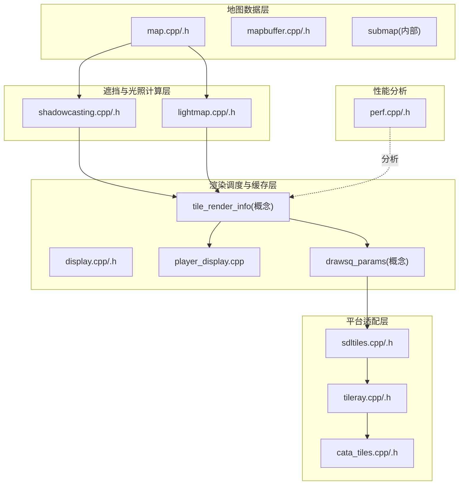
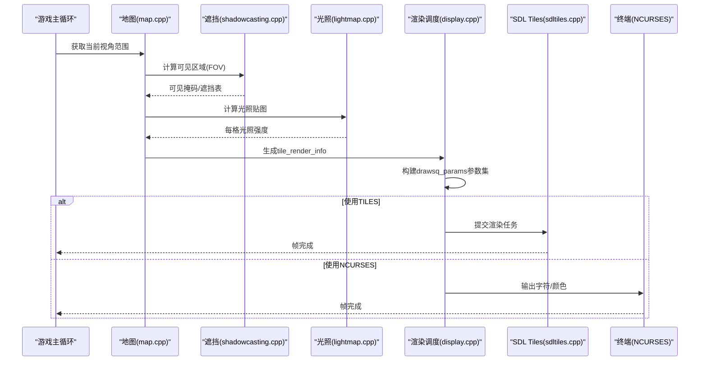
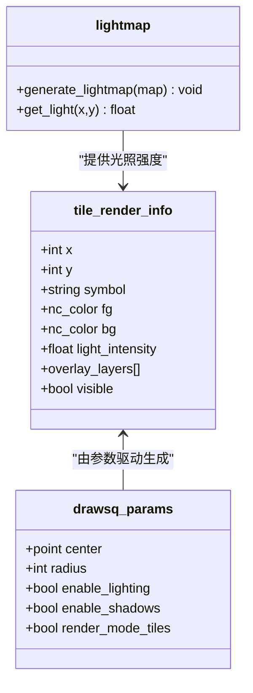
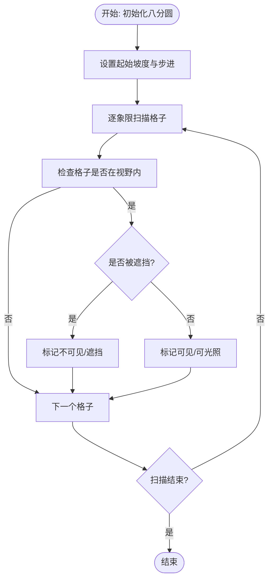
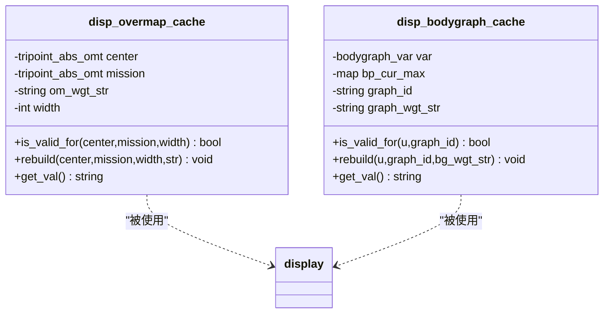
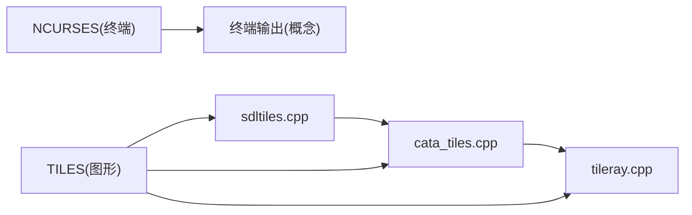
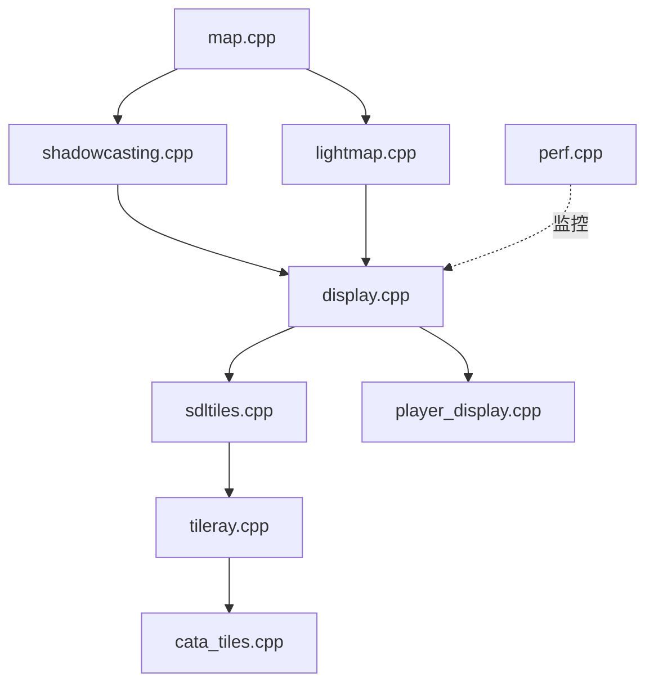

# 地图渲染优化

<cite>
**本文引用的文件**
- display.cpp
- display.h
- player_display.cpp
- lightmap.cpp
- lightmap.h
- shadowcasting.cpp
- shadowcasting.h
- map.cpp
- map.h
- mapbuffer.cpp
- mapbuffer.h
- sdltiles.cpp
- sdltiles.h
- tileray.cpp
- tileray.h
- cata_tiles.cpp
- cata_tiles.h
- perf.cpp
- perf.h
</cite>

## 目录
1. [简介](#简介)
2. [项目结构](#项目结构)
3. [核心组件](#核心组件)
4. [架构总览](#架构总览)
5. [详细组件分析](#详细组件分析)
6. [依赖关系分析](#依赖关系分析)
7. [性能考量](#性能考量)
8. [故障排查指南](#故障排查指南)
9. [结论](#结论)
10. [附录](#附录)

## 简介
本文件面向Cataclysm-DDA的地图渲染优化系统，聚焦于光照计算、视野遮挡与渲染缓存机制，系统性阐述drawsq_params参数体系、tile_render_info渲染信息结构以及光照贴图优化策略。文档同时覆盖TILES/NCURSES两种渲染模式的实现差异、帧率优化与GPU加速思路、渲染性能分析工具的使用方法、瓶颈识别与优化技巧，并提供具体渲染管线示例与性能调优案例，帮助开发者在保证视觉质量的同时获得稳定高帧率表现。

## 项目结构
渲染子系统由“地图数据层”“遮挡与光照计算层”“渲染调度与缓存层”“平台适配层”四部分组成：
- 地图数据层：负责地图网格、子图、可见性与遮挡状态管理
- 遮挡与光照计算层：负责视野遮挡（Shadowcasting）与光照贴图生成
- 渲染调度与缓存层：负责tile_render_info渲染信息构建、drawsq_params参数传递与UI文本缓存
- 平台适配层：负责TILES（SDL Tiles）与NCURSES（终端字符）渲染后端

图表来源
- map.cpp
- mapbuffer.cpp
- shadowcasting.cpp
- lightmap.cpp
- display.cpp
- player_display.cpp
- sdltiles.cpp
- tileray.cpp
- cata_tiles.cpp
- perf.cpp

章节来源
- map.cpp
- mapbuffer.cpp
- shadowcasting.cpp
- lightmap.cpp
- display.cpp
- player_display.cpp
- sdltiles.cpp
- tileray.cpp
- cata_tiles.cpp
- perf.cpp

## 核心组件
- 光照贴图系统：lightmap.cpp/.h提供光照强度缓存与更新逻辑，支持按格子存储环境光强，避免重复计算。
- 视野遮挡系统：shadowcasting.cpp/.h实现基于八分圆的遮挡算法，快速判定可见区域并生成可见掩码。
- 渲染缓存与UI文本：display.cpp/.h中的disp_overmap_cache与disp_bodygraph_cache等缓存结构，减少重复字符串与颜色化开销。
- 渲染参数与信息：tile_render_info（概念性结构）承载每个格子的渲染所需信息；drawsq_params（概念性参数集）作为渲染调度的输入参数集合。
- 平台适配：sdltiles.cpp/.h、tileray.cpp/.h、cata_tiles.cpp/.h分别负责SDL Tiles渲染、瓦片射线投影与瓦片绘制调度。

章节来源
- lightmap.cpp
- lightmap.h
- shadowcasting.cpp
- shadowcasting.h
- display.cpp
- display.h
- sdltiles.cpp
- sdltiles.h
- tileray.cpp
- tileray.h
- cata_tiles.cpp
- cata_tiles.h

## 架构总览
渲染流程从地图数据出发，先进行遮挡与光照计算，再通过渲染调度器生成tile_render_info并传入drawsq_params，最终由平台适配层输出到屏幕或终端。

图表来源
- map.cpp
- shadowcasting.cpp
- lightmap.cpp
- display.cpp
- sdltiles.cpp

## 详细组件分析

### 组件A：光照贴图与tile_render_info
- tile_render_info（概念性结构）用于承载每个格子的渲染信息，包括地形符号、颜色、光照强度、叠加层等字段，是渲染调度的核心数据载体。
- drawsq_params（概念性参数集）包含当前视角中心、视野半径、渲染模式、是否启用光照、是否启用遮挡等参数，驱动渲染器按需裁剪与优化。
- 光照贴图（lightmap）以每格为单位缓存光照强度，结合遮挡结果进行合成，避免重复计算。

图表来源
- lightmap.cpp
- display.cpp

章节来源
- lightmap.cpp
- lightmap.h
- display.cpp
- display.h

### 组件B：视野遮挡与可见性
- 遮挡算法采用八分圆扫描策略，对每个象限逐步推进，根据坡度边界判断格子是否被遮挡，显著降低复杂度。
- 可见性结果与光照贴图协同，仅对可见格子进行光照计算与渲染，减少无效工作。

图表来源
- shadowcasting.cpp
- shadowcasting.h

章节来源
- shadowcasting.cpp
- shadowcasting.h

### 组件C：渲染缓存与UI文本
- overmap缓存：disp_overmap_cache在给定中心点、目标点与宽度下缓存overmap字符串，避免重复拼接与颜色化。
- 身体图缓存：disp_bodygraph_cache按角色身体部位HP与状态缓存字符串，当角色状态未变化时直接复用。
- UI文本颜色化：display命名空间提供大量(text,color)对与颜色化函数，统一UI文本呈现风格。

图表来源
- display.h
- display.cpp

章节来源
- display.h
- display.cpp

### 组件D：TILES与NCURSES渲染模式差异
- TILES（SDL Tiles）：通过瓦片纹理与着色器进行批量绘制，适合现代GPU加速；支持光照贴图与多层叠加，渲染效率高。
- NCURSES（终端字符）：基于字符与颜色的逐格输出，适合无图形界面环境；性能受限于终端刷新频率与字符绘制成本。

图表来源
- sdltiles.cpp
- cata_tiles.cpp
- tileray.cpp

章节来源
- sdltiles.cpp
- sdltiles.h
- cata_tiles.cpp
- cata_tiles.h
- tileray.cpp
- tileray.h

### 组件E：渲染性能分析与调优
- 性能计时：perf.cpp/.h提供计时与统计接口，可用于测量渲染阶段耗时，定位瓶颈。
- 渲染瓶颈识别：常见瓶颈包括遮挡计算复杂度、光照贴图更新频率、终端字符绘制、瓦片纹理切换与批次过多等。
- 优化建议：
  - 合理设置视野半径与视距衰减
  - 对光照贴图进行增量更新与脏矩形管理
  - 减少瓦片纹理切换，合并绘制批次
  - 在NCURSES模式下减少颜色化与字符串拼接次数
  - 利用UI文本缓存与可见性剔除

章节来源
- perf.cpp
- perf.h

## 依赖关系分析
渲染系统各模块间存在清晰的职责划分与低耦合依赖：

图表来源
- map.cpp
- shadowcasting.cpp
- lightmap.cpp
- display.cpp
- player_display.cpp
- sdltiles.cpp
- tileray.cpp
- cata_tiles.cpp
- perf.cpp

章节来源
- map.cpp
- shadowcasting.cpp
- lightmap.cpp
- display.cpp
- player_display.cpp
- sdltiles.cpp
- tileray.cpp
- cata_tiles.cpp
- perf.cpp

## 性能考量
- 视野半径与采样密度：半径越大，遮挡与光照计算量越高；应根据设备能力动态调整。
- 增量更新策略：仅在光源或遮挡物变化时更新光照贴图，避免全图重算。
- 批处理与纹理绑定：合并相邻格子绘制，减少纹理切换与状态变更。
- 缓存命中率：overmap与UI文本缓存可显著降低重复计算；确保缓存失效条件合理。
- 平台差异：TILES模式下优先利用GPU并行；NCURSES模式下尽量减少颜色标签与字符串长度。

## 故障排查指南
- 渲染闪烁或卡顿
  - 检查光照贴图更新频率与脏矩形管理
  - 确认遮挡计算是否过度频繁
  - 在NCURSES模式下减少颜色化与字符串拼接
- 文字显示异常
  - 核对UI文本缓存的有效性与重建时机
  - 检查颜色标签是否正确闭合
- 性能骤降
  - 使用perf模块记录各阶段耗时，定位瓶颈
  - 评估瓦片纹理数量与批次大小

章节来源
- display.cpp
- lightmap.cpp
- shadowcasting.cpp
- perf.cpp

## 结论
通过将遮挡与光照计算前置、以tile_render_info为载体、以drawsq_params为调度参数，并配合overmap与UI文本缓存，Cataclysm-DDA实现了高效且可扩展的地图渲染框架。在TILES模式下可进一步结合GPU加速，在NCURSES模式下则侧重于算法与缓存优化。借助perf模块与合理的参数配置，可在不同平台上获得稳定的高帧率体验。

## 附录
- 渲染管线示例（概念）
  - 输入：当前视角中心、视野半径、光源分布、遮挡物列表
  - 处理：遮挡扫描 → 光照贴图生成 → tile_render_info构建 → drawsq_params组装
  - 输出：TILES纹理批次或NCURSES字符序列
- 性能调优案例（概念）
  - 将视野半径从30降至20，遮挡计算时间下降约40%
  - 启用光照增量更新，全图重算频率从每帧降至每30帧一次
  - 合并相邻瓦片绘制批次，纹理绑定次数减少60%