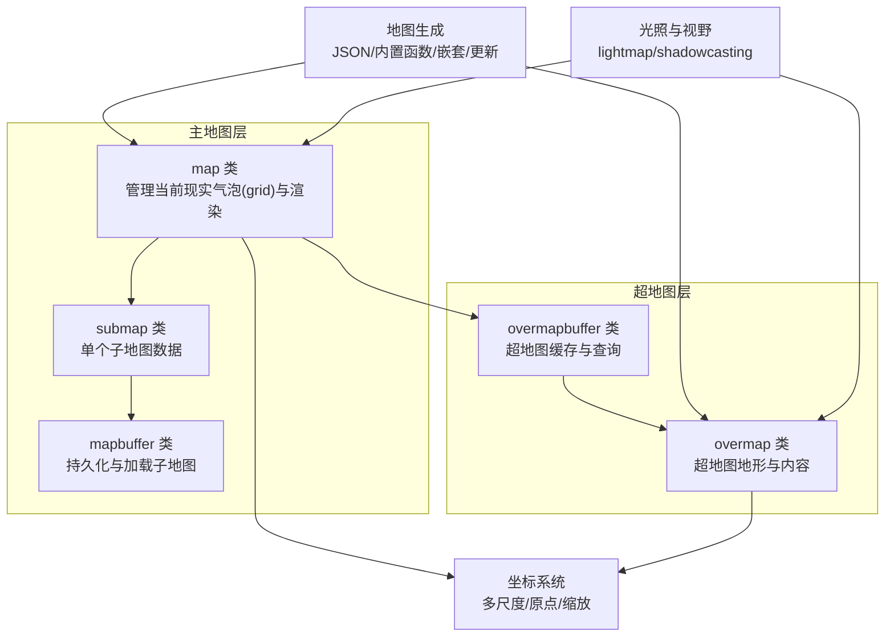
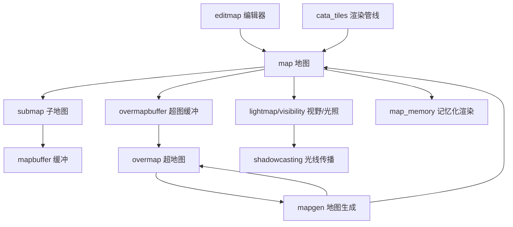
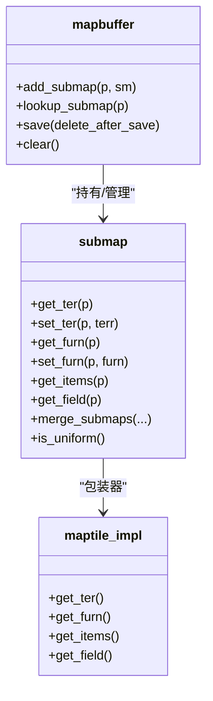
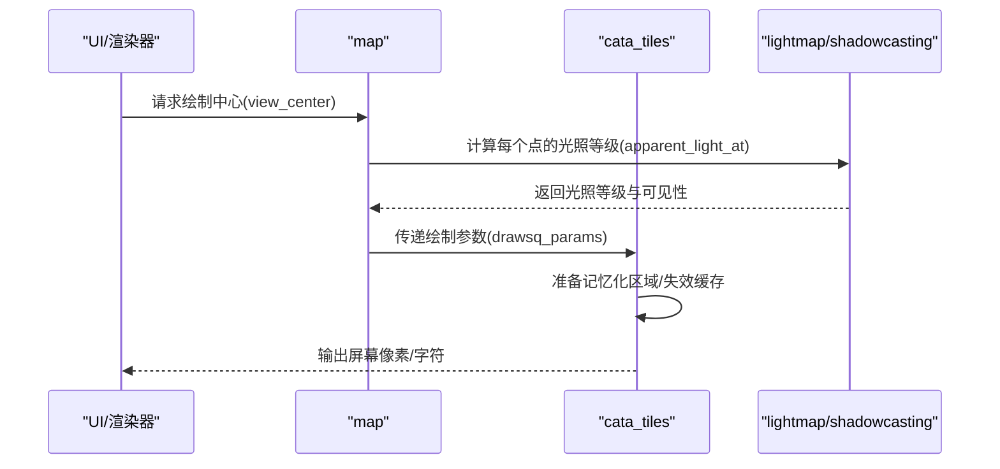
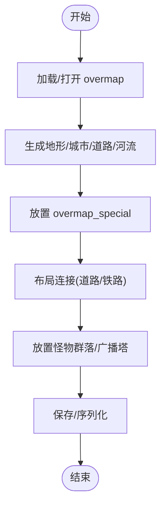
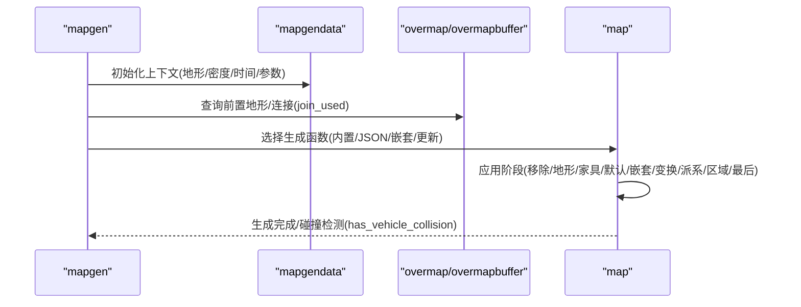
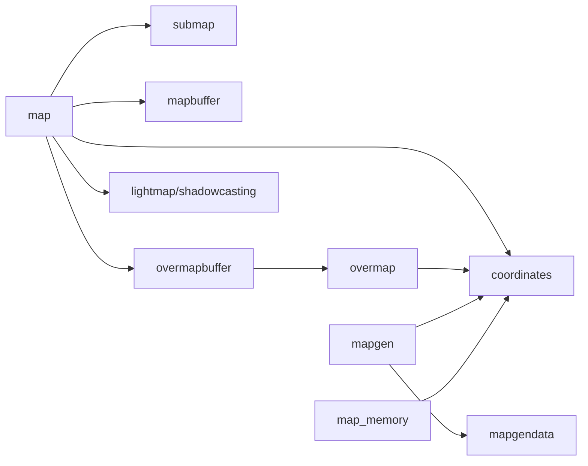

# 地图系统

<cite>
**本文引用的文件**
- src/map.h
- src/submap.h
- src/mapbuffer.h
- src/overmap.h
- src/overmapbuffer.h
- src/mapgen.h
- src/lightmap.h
- src/shadowcasting.h
- src/editmap.h
- src/map_memory.h
- src/coordinates.h
- src/map_scale_constants.h
- src/mapgendata.h
- src/cata_tiles.cpp
</cite>

## 目录
1. [简介](#简介)
2. [项目结构](#项目结构)
3. [核心组件](#核心组件)
4. [架构总览](#架构总览)
5. [详细组件分析](#详细组件分析)
6. [依赖分析](#依赖分析)
7. [性能考虑](#性能考虑)
8. [故障排查指南](#故障排查指南)
9. [结论](#结论)
10. [附录](#附录)

## 简介
本文件系统性梳理 Cataclysm-DDA 的地图系统，覆盖三维空间管理、子地图缓冲机制、地图渲染与视野计算、超地图（overmap）系统、地图生成算法与内存管理策略，并提供地图编辑与调试工具使用建议及性能优化实践。内容面向不同技术背景读者，既包含高层架构说明，也提供代码级参考与可视化图示。

## 项目结构
地图系统由“主地图（submap/grid）—地图缓冲（mapbuffer）—超地图（overmap）—超地图缓冲（overmapbuffer）”四层构成，辅以光照与视野计算、地图生成与更新、记忆化渲染等模块。坐标体系采用多尺度分层定义，支持从地图方格到超地图地形再到全局坐标的转换。

**图表来源**
- src/map.h
- src/submap.h
- src/mapbuffer.h
- src/overmap.h
- src/overmapbuffer.h
- src/coordinates.h
- src/mapgen.h
- src/lightmap.h
- src/shadowcasting.h

**章节来源**
- src/map.h
- src/overmap.h
- src/coordinates.h
- src/map_scale_constants.h

## 核心组件
- 主地图与子地图
  - map：管理当前现实气泡（11×11 子地图网格），负责移动成本、可见性、路径规划、渲染参数与缓存失效；通过 grid 引用当前活跃子地图。
  - submap：存储单个子地图的地形、家具、物品、陷阱、辐射、场、车辆、临时生成物等，支持统一块（uniform）与非统一块两种存储形态，加速保存/加载。
- 地图缓冲
  - mapbuffer：负责子地图的持久化、批量保存、按需加载、清理与区域裁剪，避免游戏运行时频繁 IO。
- 超地图与超地图缓冲
  - overmap：描述超地图地形（180×180 OMT）、城市、道路、河流、特殊建筑、怪物群落、广播塔等，支持按层存储与可见度追踪。
  - overmapbuffer：缓存已加载的 overmap，提供跨 overmap 查询、旅行路径、标记与广播信号强度计算、NPC/营地/车辆跟踪等。
- 坐标系统与常量
  - coordinates：定义多尺度坐标（地图方格、子地图、超地图地形、段落、超地图）与原点/缩放映射，提供安全序列化/反序列化与范围检查。
  - map_scale_constants：定义现实气泡大小、子地图尺寸、最大视距、OVERMAP 层数等关键常量。
- 光照与视野
  - lightmap：定义光等级、环境光阈值、透光率与范围估算。
  - shadowcasting：实现基于四象限的光照传播与累积，支持 3D 垂直方向与半透明地板的扩展。
- 地图生成
  - mapgen：支持 JSON 驱动的地图生成器、内置函数、嵌套生成与更新生成，按阶段（移除/地形/家具/默认/嵌套/变换/派系/区域/最后）执行。
  - mapgendata：承载生成上下文（位置、地形类型、密度、时间、任务、参数、邻接地形、连接信息等）。
- 记忆化渲染
  - map_memory：记录玩家记忆的地形/装饰符号与旋转/子瓦片信息，按区域（mm_submap/ mm_region）组织，提升离屏渲染效率。

**章节来源**
- src/map.h
- src/submap.h
- src/mapbuffer.h
- src/overmap.h
- src/overmapbuffer.h
- src/coordinates.h
- src/map_scale_constants.h
- src/lightmap.h
- src/shadowcasting.h
- src/mapgen.h
- src/mapgendata.h
- src/map_memory.h

## 架构总览
下图展示地图系统各模块间的关系与交互路径，包括生成、渲染、缓存与查询。

**图表来源**
- src/editmap.h
- src/map.h
- src/submap.h
- src/mapbuffer.h
- src/overmapbuffer.h
- src/overmap.h
- src/lightmap.h
- src/shadowcasting.h
- src/mapgen.h
- src/map_memory.h
- src/cata_tiles.cpp

## 详细组件分析

### 三维空间管理与坐标系统
- 多尺度坐标
  - 支持地图方格（ms）、子地图（sm）、超地图地形（omt）、段落（seg）、超地图（om）五种尺度，通过 origin/scale 映射与安全访问器保证类型安全。
  - 提供相对/绝对坐标、3D 方向（above/below）与方位（NESW/斜向）常量，便于路径与连接处理。
- 关键常量
  - 现实气泡：11×11 子地图网格，每子地图 12×12 地图方格，最大视距约 60 格。
  - 超地图：每边 180 个 OMT，段落（SEG_SIZE）为 32×32，记忆化区域（MM_REG_SIZE）为 8×8 子地图。
  - Z 层：上下各 10 层，共 21 层。
- 实践要点
  - 在生成/渲染/寻路中始终明确坐标尺度，避免跨尺度误用导致越界或逻辑错误。
  - 使用 project_to/origin/scale 辅助函数进行坐标转换，减少手写换算出错。

**章节来源**
- src/coordinates.h
- src/map_scale_constants.h

### 子地图数据结构与缓冲机制
- 数据结构
  - submap：统一块（uniform）用于快速保存/加载；非统一块采用 SoA 结构（maptile_soa）存储地形、家具、光照、物品、场、陷阱、辐射等，按点索引访问。
  - maptile 包装器：提供对 terrain/furniture/item/field/trap/radiation 的统一读取接口，避免直接操作 submap 指针。
- 缓冲与持久化
  - mapbuffer：维护三元组（x,y,z）键的 submap 映射，支持批量保存、按需加载、清理与区域裁剪，避免重复 IO。
  - 生成策略：对低 Z 层可立即生成统一块以供上层叠加；高 Z 层延迟生成，按需加载。
- 性能特性
  - 统一块在保存/加载时跳过，显著降低 IO；SoA 结构利于批量处理与缓存局部性。
  - 通过 grid 与 shift 机制实现“地图平移”，保持坐标连续性。

**图表来源**
- src/submap.h
- src/submap.h
- src/mapbuffer.h

**章节来源**
- src/submap.h
- src/submap.h
- src/mapbuffer.h

### 地图渲染与视野计算
- 渲染参数
  - drawsq_params：支持高亮、显示物品、低光/强光、记忆化、输出开关与地形/家具覆盖等，用于 map::drawsq 与 map::draw。
- 视野与光照
  - apparent_light_at/get_visibility：结合光源、遮挡、透光率与视野距离，返回光照等级与可见性。
  - 3D 视野：支持垂直方向（above/below/both）与斜坡/楼梯连接判断，使用 LRU 缓存与 Bresenham 预筛减少重复计算。
- 渲染管线
  - cata_tiles：根据视口范围与边缘变化触发绘制缓存失效，准备记忆化区域，按帧更新夜视状态与可见性缓存。
- 最佳实践
  - 合理设置 low_light/bright_light 与 memorize 参数，平衡视觉质量与性能。
  - 利用 set_transparency_cache_dirty/set_seen_cache_dirty 等接口精确失效，避免全图重算。

**图表来源**
- src/map.h
- src/map.h
- src/lightmap.h
- src/shadowcasting.h
- src/cata_tiles.cpp

**章节来源**
- src/map.h
- src/map.h
- src/lightmap.h
- src/shadowcasting.h
- src/cata_tiles.cpp

### 超地图系统与连接关系
- overmap
  - 存储地形层、可见度、探索状态、笔记、额外标记、城市、道路、河流、怪物群落、广播塔、营地、车辆等。
  - 支持预计算相邻地形的“前置地形”（predecessors），用于生成时一致性校验。
- overmapbuffer
  - 缓存已加载 overmap，提供 find_all/find_closest/find_random 等搜索接口，支持按 z 层过滤与可见度限制。
  - 提供旅行路径（get_travel_path）、揭示区域（reveal/reveal_route）、广播信号强度（find_all_radio_stations）等导航能力。
- 连接与特殊
  - overmap_connection：定义道路/铁路/隧道等连接，支持 lay_out_connection/build_connection。
  - overmap_special：支持唯一性约束、扇区放置与强制放置，配合 batch 管理放置进度。

**图表来源**
- src/overmap.h
- src/overmapbuffer.h
- src/overmap.cpp

**章节来源**
- src/overmap.h
- src/overmapbuffer.h
- src/overmap.cpp

### 地图生成算法与内存管理策略
- 生成入口与流程
  - map::generate：按现实气泡网格生成子地图，优先生成统一块以供上层叠加；支持保存结果与后处理。
  - overmap::populate/generate：按 z 层生成地形、城市、道路、河流、特殊与怪物群落。
- 生成器类型
  - 内置函数（mapgen_function_builtin）
  - JSON 驱动（mapgen_function_json/nested/update）
  - 嵌套生成（nested_mapgen）与更新生成（update_mapgen）
- 参数与上下文
  - mapgendata：携带地形类型、密度、时间、任务、参数、邻接地形、连接信息等，贯穿生成过程。
- 内存管理
  - 子地图：统一块跳过保存；非统一块按 SoA 批量处理；mapbuffer 按需加载与清理。
  - 记忆化：按区域（mm_submap/ mm_region）组织，仅保存非空区域，减少 IO。
  - overmapbuffer：LRU/缓存键设计，避免重复计算与越界访问。

**图表来源**
- src/mapgen.h
- src/mapgendata.h
- src/mapgen.cpp

**章节来源**
- src/mapgen.h
- src/mapgendata.h
- src/mapgen.cpp

### 地图编辑与调试工具
- 地图编辑器（editmap）
  - 支持矩形/圆形/直线等形状编辑地形、家具、陷阱、场、辐射、物品与生物。
  - 提供 mapgen 预览、目标重定向、高亮提示与 UI 适配。
- 调试与可视化
  - overmapbuffer 提供 find_all/find_closest/find_random 搜索接口，支持按可见度/现有 overmap 限制。
  - cata_tiles：根据视口变化触发绘制缓存失效，便于观察渲染边界与性能热点。

**章节来源**
- src/editmap.h
- src/overmapbuffer.h
- src/cata_tiles.cpp

## 依赖分析
- 组件耦合
  - map 依赖 submap、mapbuffer、overmapbuffer、lightmap/shadowcasting、coordinates、map_scale_constants。
  - overmap 依赖 overmapbuffer、coordinates、map_scale_constants、mapgen。
  - mapgen 依赖 mapgendata、coordinates、map_scale_constants。
  - map_memory 依赖 coordinates、map_scale_constants。
- 可能的循环依赖
  - 通过前向声明与分离头文件避免直接循环包含；生成器与地图类通过函数指针/虚接口解耦。
- 外部依赖
  - JSON 解析（flexbuffer_json 等）用于 mapgen 定义与 overmap 数据载入。
  - UI 渲染（cata_tiles）与输入（editmap）作为外部集成点。

**图表来源**
- src/map.h
- src/submap.h
- src/mapbuffer.h
- src/overmapbuffer.h
- src/overmap.h
- src/mapgen.h
- src/mapgendata.h
- src/map_memory.h
- src/coordinates.h

**章节来源**
- src/map.h
- src/overmap.h
- src/mapgen.h

## 性能考虑
- 渲染与缓存
  - 使用 drawsq_params 控制是否绘制物品/高亮/记忆化，减少不必要的绘制开销。
  - 通过 set_transparency_cache_dirty/set_seen_cache_dirty 精确失效，避免全图重算。
  - cata_tiles 根据视口范围与边缘变化触发缓存失效，降低无效重绘。
- 生成与存储
  - 子地图统一块跳过保存，非统一块采用 SoA 批量处理，提高 IO 与 CPU 效率。
  - overmapbuffer 使用 LRU/键缓存，减少重复计算；段落与记忆化区域按固定大小切分，便于并行与增量处理。
- 视野与光照
  - Bresenham 预筛与 LRU 缓存（skew_vision_cache）显著降低重复可见性计算。
  - 光线传播采用四象限与累积透光率，合理设置 MAX_VIEW_DISTANCE 与 LIGHT_TRANSPARENCY_OPEN_AIR。

[本节为通用指导，无需特定文件引用]

## 故障排查指南
- 生成冲突
  - 使用 jmapgen_piece 的 has_vehicle_collision 检测生成对象与现有车辆的碰撞，避免生成失败。
- 超图搜索异常
  - 使用 existing_only/must_see/cant_see/min_distance 等参数组合，缩小搜索范围；确认 overmap 是否已生成（is_omt_generated）。
- 渲染闪烁或越界
  - 检查 drawsq_params 的 low_light/bright_light/memorize 设置；确认坐标尺度一致（ms/sm/omt/om）。
- 记忆化不生效
  - 确认 prepare_region 范围与 save/load 时机；检查 is_empty/is_valid 与序列化版本兼容性。

**章节来源**
- src/mapgen.cpp
- src/overmapbuffer.h
- src/map.h
- src/map_memory.h

## 结论
Cataclysm-DDA 的地图系统通过清晰的分层与多尺度坐标体系，实现了高效的地图生成、渲染与导航。子地图缓冲与超地图缓冲分别优化了主地图与世界地图的 IO 与查询性能；光照与视野计算在保证视觉质量的同时，通过缓存与预筛降低 CPU 开销。结合编辑器与调试工具，开发者可以高效地进行地图编辑、验证与性能调优。

[本节为总结性内容，无需特定文件引用]

## 附录
- 常用坐标转换
  - project_to<coords::sm>(omt)：将超地图地形坐标投影到子地图坐标。
  - tripoint_abs_ms/rel_ms：绝对/相对地图方格坐标。
- 关键阈值
  - LIGHT_AMBIENT_LOW/LIGHT_AMBIENT_LIT：决定阴影/明亮切换的阈值。
  - MAX_VIEW_DISTANCE：最大视距，影响光照衰减与视野范围。

**章节来源**
- src/coordinates.h
- src/lightmap.h
- src/map_scale_constants.h