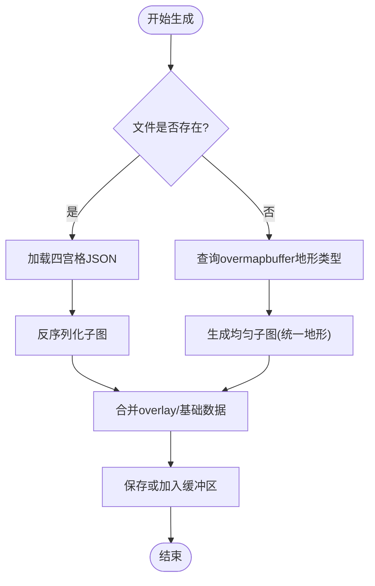

# 子地图缓冲系统

<cite>
**本文档引用的文件**
- mapbuffer.h
- mapbuffer.cpp
- submap.h
- submap.cpp
- map.h
- map.cpp
- coordinates.h
- map_memory.h
- map_memory.cpp
- overmapbuffer.h
- overmapbuffer.cpp
- mapgen.h
- mapgen.cpp
</cite>

## 目录
1. [简介](#简介)
2. [项目结构](#项目结构)
3. [核心组件](#核心组件)
4. [架构总览](#架构总览)
5. [详细组件分析](#详细组件分析)
6. [依赖关系分析](#依赖关系分析)
7. [性能考量](#性能考量)
8. [故障排除指南](#故障排除指南)
9. [结论](#结论)
10. [附录](#附录)

## 简介
本文件系统性阐述Cataclysm-DDA中子地图缓冲系统（mapbuffer）的设计与实现，覆盖子地图的加载、缓存、持久化与动态加载机制，解释mapbuffer的工作原理与内存优化策略，并说明子地图之间的数据共享、缓存失效与同步机制。文档同时提供最佳实践、性能调优与内存使用优化建议，以及具体代码示例路径与调试技巧。

## 项目结构
子地图缓冲系统主要由以下模块构成：
- mapbuffer：全局子地图缓冲区，负责子地图的增删改查、序列化/反序列化、按四宫格批量保存与压缩存储。
- submap：单个子地图的数据容器，包含地形、家具、陷阱、物品、场、辐射、温度等数据，支持均匀/非均匀两种模式。
- map：游戏主地图类，负责当前视域内的子地图网格管理、坐标转换、缓存失效与渲染。
- coordinates：坐标系统与投影工具，提供绝对/相对坐标、子图/超图坐标间的转换。
- overmapbuffer：超图缓冲，为mapbuffer提供地形类型等元信息以驱动均匀子地图的快速生成。
- map_memory：另一种子地图缓存层，用于记忆化与区域化加载。
- mapgen：地图生成框架，与mapbuffer协作完成子地图的生成与合并。

图表来源
- mapbuffer.h
- map.h
- coordinates.h
- overmapbuffer.h
- map_memory.h
- mapgen.h

章节来源
- mapbuffer.h
- mapbuffer.cpp
- submap.h
- map.h
- coordinates.h

## 核心组件
- mapbuffer：提供add_submap、lookup_submap、save、clear等接口；内部以std::map<tripoint_abs_sm, std::unique_ptr<submap>>管理子地图；按四宫格批量保存，支持压缩存储。
- submap：统一的子地图数据结构，采用SoA布局（maptile_soa），支持均匀模式（仅记录统一地形）与非均匀模式（完整数据）；提供旋转、镜像、合并等操作。
- map：管理11×11网格的子地图视域，负责坐标转换、缓存失效、渲染与事件处理；通过mapbuffer进行持久化。
- coordinates：提供tripoint系与scale/origin之间的安全投影与转换，确保跨层级坐标一致。
- overmapbuffer：提供超图地形类型，驱动均匀子地图的快速生成。
- map_memory：区域化子地图缓存，按区域批量加载/分配。

章节来源
- mapbuffer.h
- submap.h
- map.h
- coordinates.h
- overmapbuffer.h
- map_memory.h

## 架构总览
mapbuffer作为全局缓冲区，协调子地图的生命周期：生成、缓存、持久化与动态加载。map在运行时维护当前视域网格，通过mapbuffer进行读写；overmapbuffer提供地形类型以加速均匀子地图生成；coordinates保证不同层级坐标的一致性；map_memory提供额外的区域化缓存层。

图表来源
- mapbuffer.cpp
- mapbuffer.cpp
- mapbuffer.cpp
- overmapbuffer.h

## 详细组件分析

### mapbuffer组件分析
- 职责与接口
  - add_submap：向缓冲区添加子地图，返回是否成功（避免重复插入）。
  - lookup_submap：查找或动态加载子地图，失败时返回空指针。
  - save：按四宫格批量保存，支持删除已保存的子图与压缩存储。
  - clear/clear_outside_reality_bubble：清理缓冲区，保留现实气泡范围内的子图。
  - submap_exists/submap_exists_approx：检查子图是否存在，后者基于文件系统/压缩包快速判断。
- 数据结构
  - 使用std::map<tripoint_abs_sm, std::unique_ptr<submap>>存储子图，键为绝对子图坐标。
  - 每次保存按四宫格聚合，减少文件系统开销。
- 序列化策略
  - 非均匀子图：逐子图写入JSON对象，包含版本号与坐标。
  - 均匀子图：不保存，通过超图地形类型快速再生。
  - 支持zzip压缩包，按需读取/写入，自动紧凑压缩。

图表来源
- mapbuffer.h
- mapbuffer.cpp
- mapbuffer.cpp
- mapbuffer.cpp
- submap.h

章节来源
- mapbuffer.h
- mapbuffer.cpp
- mapbuffer.cpp
- mapbuffer.cpp

### submap组件分析
- 数据模型
  - 地形、家具、陷阱、场、辐射、光照等均以SoA布局存储于maptile_soa，提升缓存局部性。
  - 均匀模式下仅保存统一地形类型，节省空间与IO。
  - 提供ensure_nonuniform将均匀子图转为非均匀以便修改。
- 关键方法
  - get/set_ter/furn/trap/items/fields/radiation/lum：访问器与修改器，非均匀模式下直接操作数组。
  - update_lum_add/rem：根据物品发光性更新光照计数。
  - rotate/mirror：对齐子图内容（含cosmetics、spawns、vehicles、active_items、computers）。
  - revert_submap/get_revert_submap：支持回退到上一状态。
  - merge_submaps：将另一个子图的内容合并到当前子图，overlay优先级更高。
- 生命周期
  - 由mapbuffer管理所有权，通过unique_ptr传递与释放。
  - 与active_item_cache、vehicles、computers等组件协同。

图表来源
- submap.h
- submap.cpp
- submap.cpp

章节来源
- submap.h
- submap.cpp
- submap.cpp
- submap.cpp

### map与坐标系统
- 视域管理
  - 维护11×11网格的子地图视域，随玩家移动整体平移。
  - 提供get_submap_at/get_submap_at_grid等接口，内部使用project_remain进行坐标投影。
- 缓存失效
  - set_transparency_cache_dirty/set_seen_cache_dirty等接口触发相关缓存失效。
- 与mapbuffer交互
  - 通过saven/saveload/save/load等接口与mapbuffer协作，确保持久化与加载一致性。

图表来源
- map.h
- map.h
- coordinates.h

章节来源
- map.h
- map.h
- coordinates.h

### 地图生成与均匀子图
- 均匀子图生成
  - 当文件不存在或子图为空时，通过overmapbuffer查询地形类型，快速生成统一地形的子图。
- 合并策略
  - 在mapgen过程中，可能从多个来源合并子图数据，overlay优先级更高，确保最终一致性。

图表来源
- mapbuffer.cpp
- mapbuffer.cpp
- mapgen.cpp

章节来源
- mapbuffer.cpp
- mapbuffer.cpp
- mapgen.cpp

## 依赖关系分析
- mapbuffer依赖
  - submap：持有与管理子图所有权。
  - overmapbuffer：提供地形类型以生成均匀子图。
  - 文件系统/zzip：四宫格批量保存与读取。
  - coordinates：坐标投影与转换。
- map依赖
  - mapbuffer：持久化与动态加载。
  - map_memory：区域化缓存。
  - coordinates：坐标计算。
- map_memory与mapbuffer
  - map_memory按区域批量加载/分配，与mapbuffer的四宫格保存策略互补。

图表来源
- mapbuffer.h
- map.h
- map_memory.h
- coordinates.h

章节来源
- mapbuffer.h
- map.h
- map_memory.h
- coordinates.h

## 性能考量
- 四宫格批量保存
  - mapbuffer按四宫格聚合保存，显著降低文件系统开销；对均匀子图直接跳过保存，进一步提升性能。
- 压缩存储
  - 支持zzip压缩包，按需读取/写入，自动紧凑压缩，减少磁盘占用与IO时间。
- SoA布局
  - submap采用SoA布局，提升缓存局部性，减少分支预测失败。
- 均匀子图快速再生
  - 均匀子图不保存，通过地形类型快速重建，避免序列化/反序列化成本。
- 缓存失效粒度
  - map提供细粒度缓存失效接口，避免全量重建，提升响应速度。

章节来源
- mapbuffer.cpp
- submap.h
- mapbuffer.cpp

## 故障排除指南
- 子图加载失败
  - 现象：lookup_submap返回空指针。
  - 排查：确认文件系统/压缩包中是否存在对应四宫格文件；检查overmapbuffer地形类型是否有效；查看调试日志。
  - 参考路径：mapbuffer.cpp、mapbuffer.cpp
- 重复插入子图
  - 现象：add_submap返回false。
  - 排查：确认坐标是否已存在；避免重复添加同一子图。
  - 参考路径：mapbuffer.cpp
- 均匀子图未正确再生
  - 现象：文件缺失但子图仍为空。
  - 排查：确认overmapbuffer地形类型；检查generate_uniform_omt逻辑。
  - 参考路径：mapbuffer.cpp
- 旋转/镜像后数据不一致
  - 现象：cosmetics/spawns/vehicles/computers位置异常。
  - 排查：确认rotate/mirror是否同步更新所有相关数据结构。
  - 参考路径：submap.cpp
- 缓存失效导致渲染异常
  - 现象：视野/光照/可见性显示错误。
  - 排查：调用set_transparency_cache_dirty/set_seen_cache_dirty等接口触发重建。
  - 参考路径：map.h

章节来源
- mapbuffer.cpp
- mapbuffer.cpp
- mapbuffer.cpp
- mapbuffer.cpp
- submap.cpp
- map.h

## 结论
mapbuffer通过四宫格批量保存、压缩存储与均匀子图快速再生，实现了高效且可扩展的子地图缓冲系统。配合map的视域管理、coordinates的坐标投影与overmapbuffer的地形类型，系统在保证功能完整性的同时兼顾了性能与内存效率。建议在实际开发中遵循本文的最佳实践与调试技巧，以获得稳定可靠的子地图管理体验。

## 附录
- 最佳实践
  - 使用add_submap进行子图添加，避免重复插入。
  - 对非均匀子图进行修改前调用ensure_nonuniform。
  - 批量保存时启用delete_after_save以回收内存。
  - 在地图生成阶段合理使用merge_submaps，确保overlay优先级。
- 性能调优
  - 合理设置现实气泡范围，减少不必要的子图加载。
  - 利用zzip压缩包减少IO压力。
  - 避免频繁的旋转/镜像操作，必要时批量执行。
- 调试技巧
  - 使用lookup_submap的调试日志定位加载问题。
  - 通过submap_exists_approx快速判断文件存在性。
  - 在生成阶段打印地形类型与坐标，验证均匀子图生成逻辑。