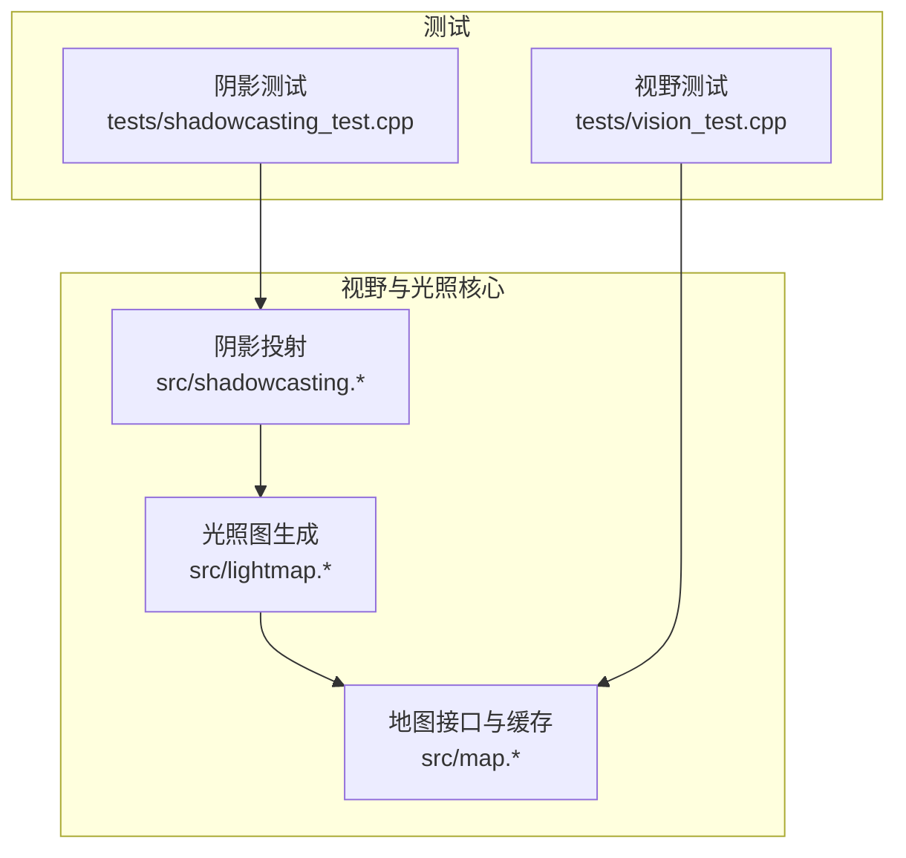
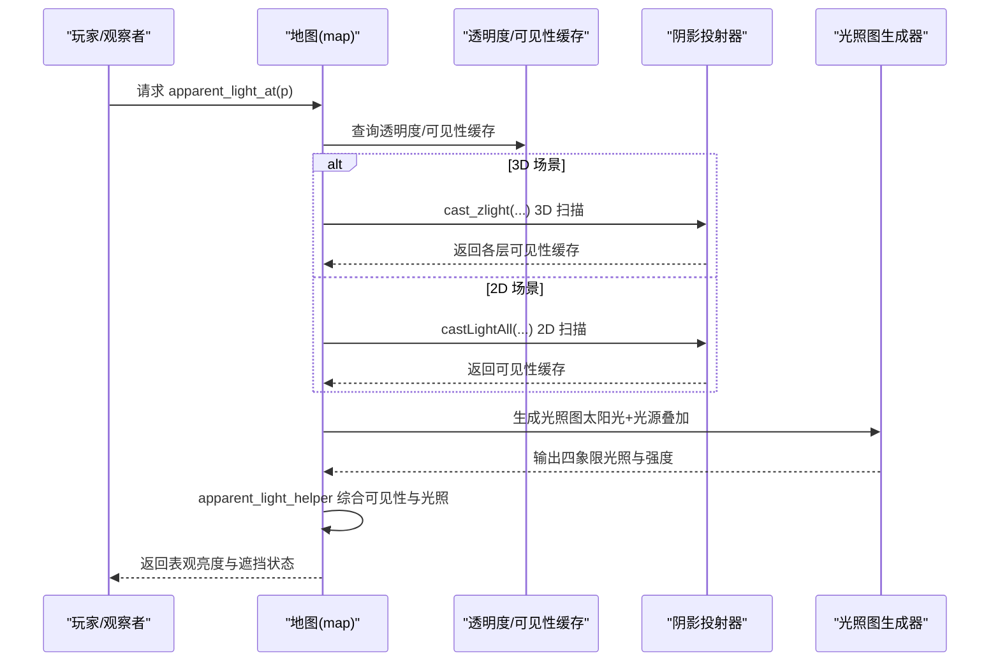
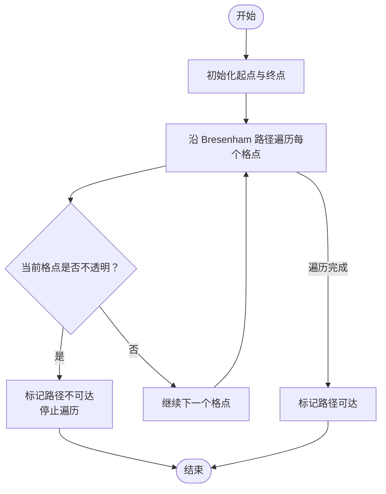
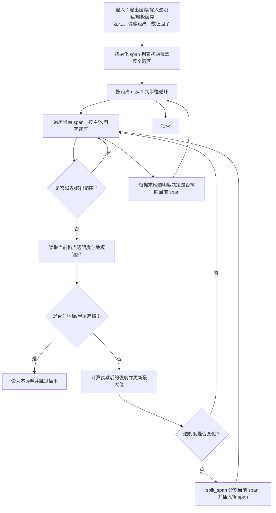
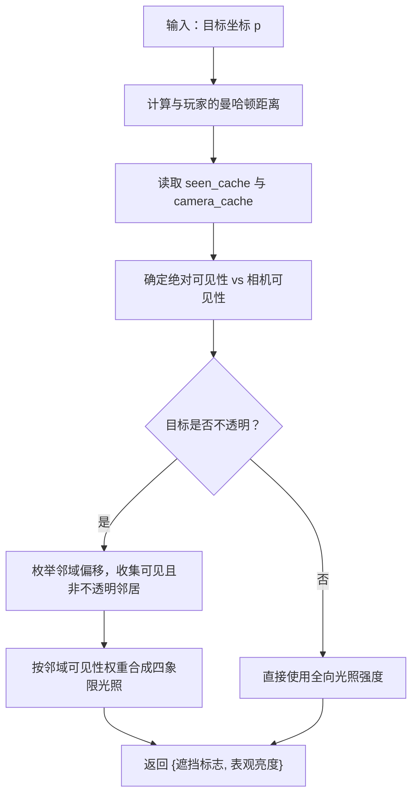
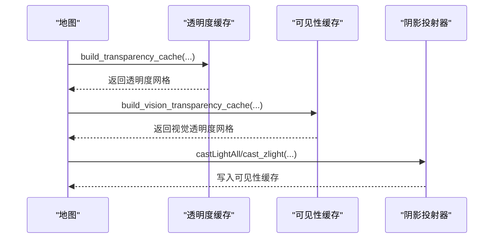
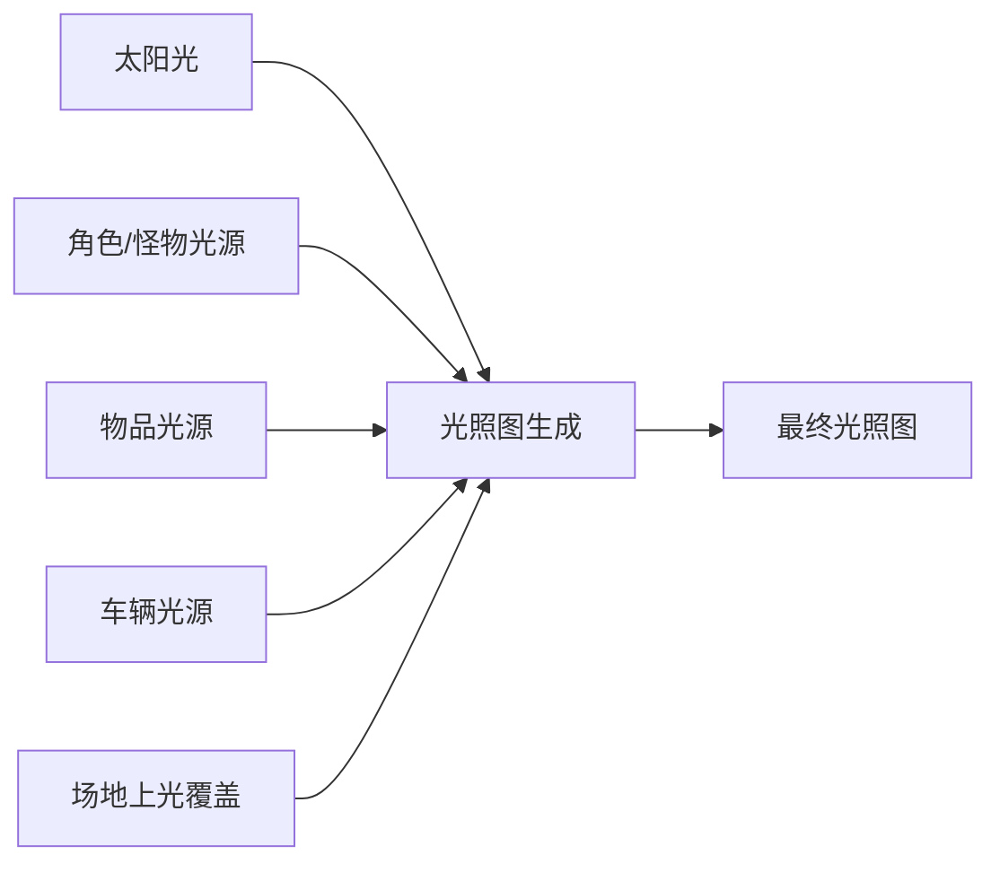
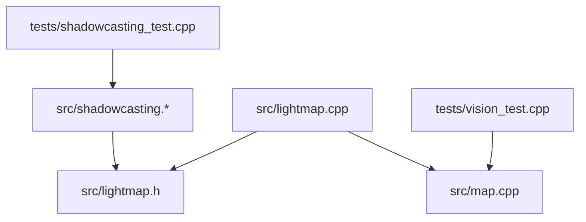

# 视野计算系统

<cite>
**本文档引用的文件**
- shadowcasting.cpp
- shadowcasting.h
- lightmap.cpp
- lightmap.h
- vision_test.cpp
- shadowcasting_test.cpp
- map.cpp
</cite>

## 目录
1. [简介](#简介)
2. [项目结构](#项目结构)
3. [核心组件](#核心组件)
4. [架构总览](#架构总览)
5. [详细组件分析](#详细组件分析)
6. [依赖关系分析](#依赖关系分析)
7. [性能考虑](#性能考虑)
8. [故障排除指南](#故障排除指南)
9. [结论](#结论)
10. [附录](#附录)

## 简介
本文件系统化梳理 Cataclysm-DDA 的视野与光照计算体系，重点覆盖以下方面：
- Bresenham 光线投射与阴影投射算法在可见性判定中的应用
- 3D 视野遮挡检测（含地板/屋顶影响）与可见性缓存机制
- visibility_variables 变量系统、apparent_light_at 光照计算与 get_visibility 可见性判断
- 不同光源类型（太阳光、实体光源、角色/怪物光源、车辆光源等）的处理流程
- 动态遮挡物与视野范围限制策略
- 视野优化技巧、性能分析方法与常见视觉效果实现
- 算法示例与调试工具使用指南

## 项目结构
视野与光照系统主要由以下模块构成：
- 阴影投射与可见性：src/shadowcasting.*（3D 视野扫描、透明度累积、四象限光照）
- 光照图生成：src/lightmap.*（太阳光缓存、光源叠加、最终光照等级）
- 地图接口与缓存：src/map.*（透明度缓存、可见性缓存、apparent_light 计算）
- 测试用例：tests/vision_test.cpp、tests/shadowcasting_test.cpp（功能验证与性能基准）

**图表来源**
- shadowcasting.cpp
- lightmap.cpp
- map.cpp
- vision_test.cpp
- shadowcasting_test.cpp

**章节来源**
- shadowcasting.cpp
- lightmap.cpp
- map.cpp
- vision_test.cpp
- shadowcasting_test.cpp

## 核心组件
- 四象限光照模型：用于记录从四个方向（东北、东南、西南、西北）到达的光照强度，支持墙角等复杂视角下的光照合成。
- 3D 视野扫描器：基于水平/垂直扇形的 span 切片与斜率比较，逐距离推进并按透明度累积衰减，同时处理地板/屋顶遮挡。
- 透明度缓存：按子图块批量构建，考虑地形/家具/场地上透明度与天气视距惩罚。
- 光照图生成：自上而下累加太阳光，叠加角色/NPC/车辆/物品光源，并应用局部覆盖与方向性光照。
- apparent_light 计算：结合可见性缓存、相机缓存、邻域可见性与四象限光照，综合得出“表观亮度”。

**章节来源**
- shadowcasting.h
- shadowcasting.cpp
- lightmap.cpp
- lightmap.cpp
- lightmap.cpp

## 架构总览
视野与光照的端到端流程如下：

**图表来源**
- lightmap.cpp
- shadowcasting.cpp
- lightmap.cpp

## 详细组件分析

### Bresenham 光线投射与可见性判定
- 在测试中对比了旧版 Bresenham 可见性检查与新阴影投射算法的一致性，确保两者在典型场景下结果一致或可解释差异。
- Bresenham 路径上的每个格点若遇到不透明则阻断，否则路径可达；该方法用于验证阴影投射的正确性。

**图表来源**
- shadowcasting_test.cpp

**章节来源**
- shadowcasting_test.cpp

### 3D 阴影投射与遮挡检测
- 水平/垂直扇区扫描：通过主/次斜率界定当前行/列的可视区间，按距离推进并累积透明度衰减。
- 地板/屋顶遮挡：当目标格点位于玩家上下方时，若对应层存在地板/屋顶，则视为不可见（或以不透明处理），避免“看到天花板/地板下方”的异常。
- span 分割：当透明度发生变化时，将当前 span 切分为最多四段，分别处理已处理/当前行剩余/未处理区域，防止漏检或重复处理。

**图表来源**
- shadowcasting.cpp
- shadowcasting.cpp

**章节来源**
- shadowcasting.cpp
- shadowcasting.cpp

### visibility_variables 变量系统与 apparent_light_at
- visibility_variables 缓存：地图维护多层透明度、可见性与相机缓存，按需重建与失效。
- apparent_light_at：综合玩家位置、未受损视野距离、绝对可见性与相机可见性、邻域可见性与四象限光照，得到表观亮度；对不透明目标采用邻域四象限合成，对透明目标采用全向合成。
- 遮挡判断：当目标或其邻域被遮挡时，obstructed/abs_obstructed 标志用于后续渲染与交互逻辑。

**图表来源**
- lightmap.cpp

**章节来源**
- lightmap.cpp

### get_visibility 可见性判断
- 2D 与 3D 可见性：2D 使用 castLightAll，3D 使用 cast_zlight；两者均以透明度为输入，输出可见性缓存。
- 透明度缓存构建：按子图块批量填充，考虑地形/家具/场地上透明度、天气视距惩罚与“半透明”标志位。
- 视觉透明度缓存：额外处理玩家蹲伏/趴卧/低姿态导致的邻域遮挡，以及“半透明”地形对视线的影响。

**图表来源**
- lightmap.cpp
- shadowcasting.cpp

**章节来源**
- lightmap.cpp
- shadowcasting.cpp

### 光源类型与光照叠加
- 太阳光：自顶向下累加，考虑天气视距惩罚与楼层遮挡，快速填充四象限光照。
- 实体光源：角色、NPC、怪物、物品、车辆部件等，按缓冲区批量应用，减少重复光线投射。
- 局部覆盖与方向性：对建筑开口进行外部光照渗透，对特定方向应用定向光照，提升真实感。
- 局部覆盖优先级：某些场地上可覆盖整体光照，如强光源覆盖。

**图表来源**
- lightmap.cpp

**章节来源**
- lightmap.cpp

### 动态遮挡物与视野范围限制
- 动态遮挡：玩家蹲伏/趴卧/低姿态时，邻域遮挡生效；半透明地形对视线进行额外遮挡。
- 视野范围：基于最大视距常量与指数衰减，超过一定距离后透明度累积降至阈值以下。
- 地形/场地上透明度：玻璃等半透明材质在光照上可能不衰减，在可见性上按不透明处理。

**章节来源**
- lightmap.cpp
- lightmap.h

## 依赖关系分析

**图表来源**
- shadowcasting.cpp
- lightmap.cpp
- map.cpp
- vision_test.cpp
- shadowcasting_test.cpp

**章节来源**
- shadowcasting.cpp
- lightmap.cpp
- map.cpp
- vision_test.cpp
- shadowcasting_test.cpp

## 性能考虑
- 批量化与缓存
  - 透明度缓存按子图块批量构建，避免重复计算。
  - 光源缓冲区批量应用，显著降低光线投射次数（例如大型火堆）。
- 3D 扫描优化
  - 通过 span 切分与斜率裁剪，减少无效格点访问。
  - 对首行/首列 skip 标记，避免重复扫描同一行/列。
- 距离衰减
  - 使用指数衰减函数，透明度累积随距离增加而快速下降，缩短有效扫描半径。
- 测试与基准
  - 提供阴影投射与 3D 扫描的性能基准测试，便于回归与优化。

**章节来源**
- lightmap.cpp
- shadowcasting_test.cpp
- shadowcasting.cpp

## 故障排除指南
- 可见性不一致
  - 使用 Bresenham 可见性检查作为对照，定位阴影投射边界情况（如墙角、柱子间隙）。
- 遮挡异常
  - 检查地板/屋顶遮挡逻辑与视觉透明度缓存，确认半透明地形与玩家姿态设置。
- 性能退化
  - 关注光源数量与分布，利用光源缓冲区批量应用；减少不必要的 3D 扫描层数。
- 调试工具
  - 使用测试用例中的网格打印与计时，定位问题区域与热点。

**章节来源**
- shadowcasting_test.cpp
- vision_test.cpp

## 结论
Cataclysm-DDA 的视野与光照系统通过 3D 阴影投射、四象限光照与多层缓存实现了高效且真实的视觉体验。系统在性能与正确性之间取得平衡，支持多种光源类型与动态遮挡物，并提供了完善的测试与调试工具链，便于持续优化与扩展。

## 附录

### 常见视觉效果实现要点
- 半透明材质：在光照上可透光但在可见性上按不透明处理，避免“看到墙体另一侧”的错觉。
- 车辆光源：根据部件类型（圆锥/宽锥/半圆）应用不同角度与强度的光弧。
- 场地上光覆盖：对强光源进行局部覆盖，保证高亮区域的真实感。

**章节来源**
- lightmap.cpp
- lightmap.cpp