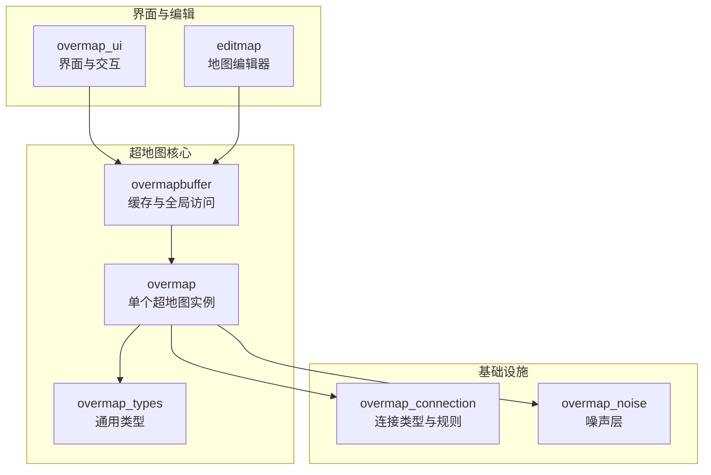
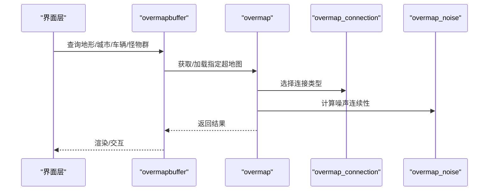
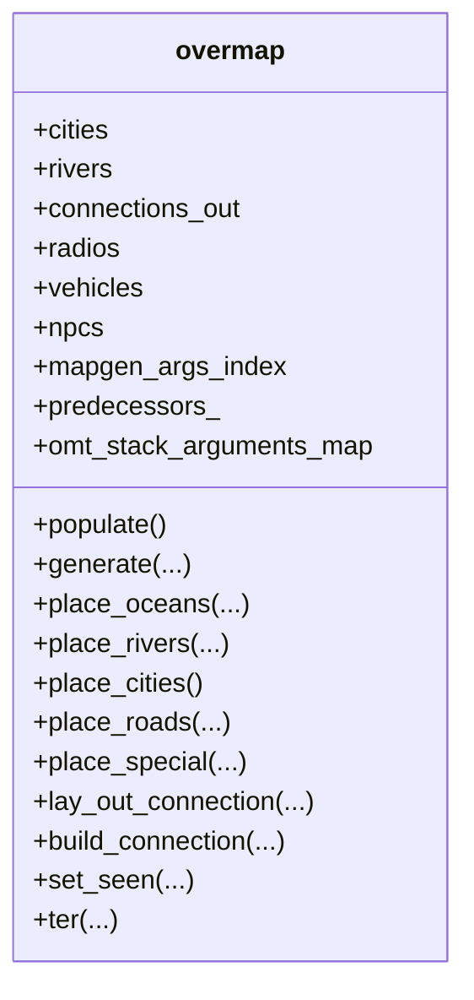
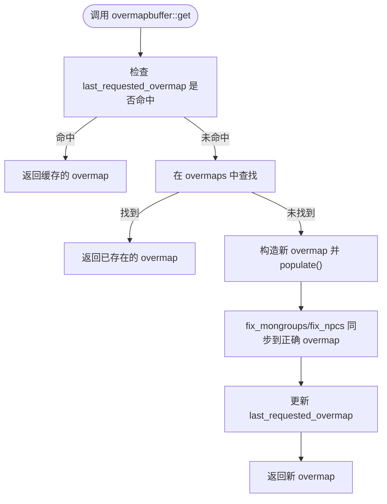
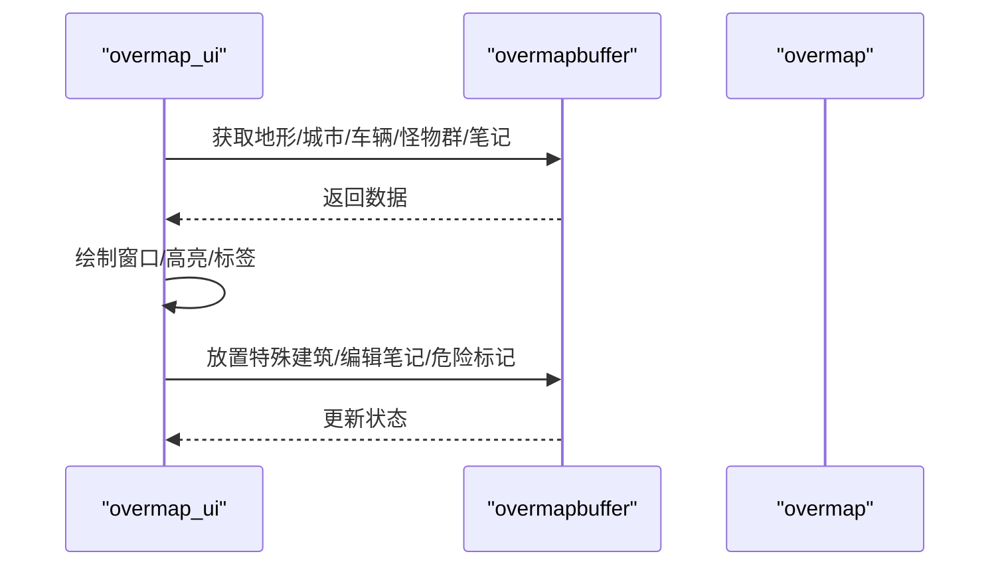
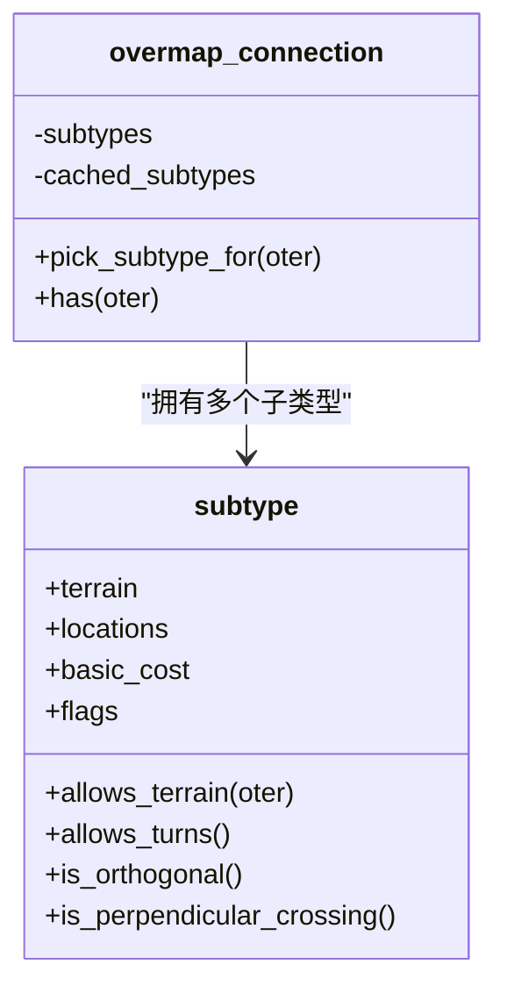
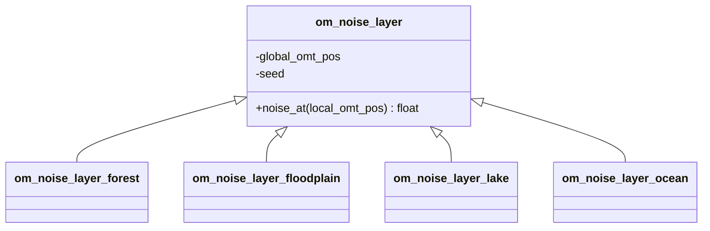
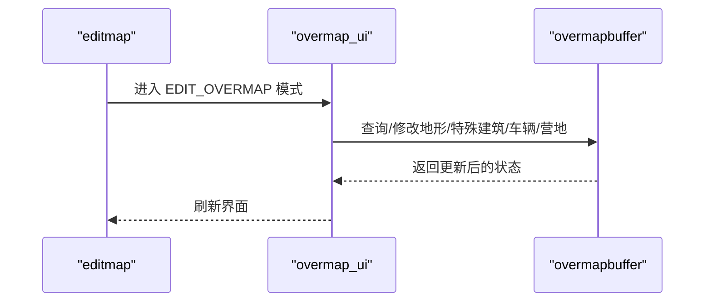
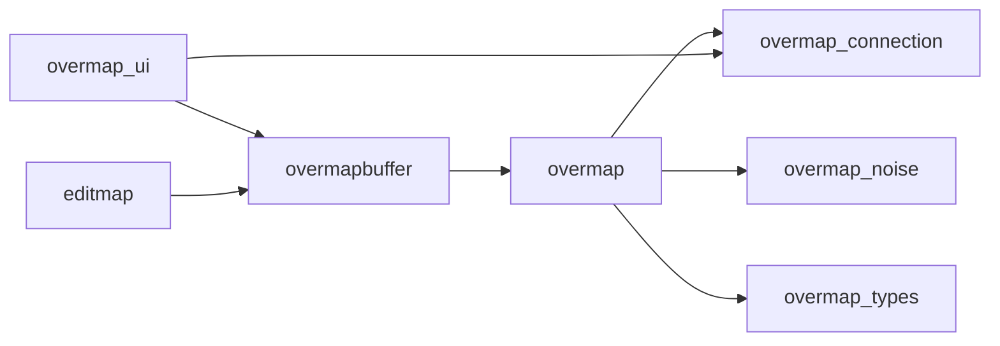

# 超地图系统

<cite>
**本文引用的文件**
- overmap.h
- overmap.cpp
- overmapbuffer.h
- overmapbuffer.cpp
- overmap_types.h
- overmap_ui.h
- overmap_ui.cpp
- overmap_connection.h
- overmap_connection.cpp
- overmap_noise.h
- editmap.h
- editmap.cpp
</cite>

## 目录
1. [引言](#引言)
2. [项目结构](#项目结构)
3. [核心组件](#核心组件)
4. [架构总览](#架构总览)
5. [详细组件分析](#详细组件分析)
6. [依赖关系分析](#依赖关系分析)
7. [性能考量](#性能考量)
8. [故障排查指南](#故障排查指南)
9. [结论](#结论)
10. [附录](#附录)

## 引言
本文件系统性梳理Cataclysm-DDA的超地图（Overmap）系统，覆盖设计理念、数据结构、生成算法、与普通地图的关系、坐标转换机制、无缝切换、城市与道路网络、特殊地点标记、缓存管理、编辑工具使用、自定义生成与调试技巧，并给出可扩展与性能优化建议。目标是帮助开发者与模组制作者在不深入底层实现的前提下，高效理解并扩展超地图能力。

## 项目结构
超地图系统主要由以下模块构成：
- overmap：单个超地图实例，负责地形、城市、河流、连接、怪物群等的生成与维护
- overmapbuffer：超地图缓存与全局访问入口，负责跨过载图的统一查询、路径规划、NPC/车辆/营地跟踪
- overmap_ui：超地图界面层，负责渲染、交互、编辑模式、天气/气味/远征路径显示
- overmap_connection：连接类型与规则，用于指导道路/地铁/下水道等线性结构的生成与连接
- overmap_noise：噪声层抽象，为地形生成提供连续且可复用的噪声源
- editmap：地图编辑器（含超地图编辑），支持地形/设施/字段/辐射/物品/怪物/过载图编辑等
- overmap_types：超地图通用类型（如气味轨迹）

图表来源
- overmap.h
- overmapbuffer.h
- overmap_ui.h
- overmap_connection.h
- overmap_noise.h
- overmap_types.h
- editmap.h

章节来源
- overmap.h
- overmapbuffer.h
- overmap_ui.h
- overmap_connection.h
- overmap_noise.h
- overmap_types.h
- editmap.h

## 核心组件
- overmap：承载单个超地图的地形、城市、河流、连接、怪物群、无线电、营地、笔记、额外标记等；提供生成、放置特殊建筑、计算城市度/森林度、河流/道路/铁路生成、预处理与后处理等接口
- overmapbuffer：LRU式缓存容器，按需加载/保存超地图；提供全局查询（地形、城市、营地、车辆、怪物群）、旅行路径规划、嗅觉追踪、安全判定、笔记/额外标记管理、唯一特殊计数等
- overmap_ui：超地图渲染与交互，支持编辑模式、远征路径高亮、天气/气味/远征标记、城市名标注、NPC路径可视化等
- overmap_connection：连接类型定义与选择逻辑，决定某地形可被何种连接类型覆盖（如道路/地铁/下水道）
- overmap_noise：噪声层抽象，保证跨超地图边界连续性
- editmap：地图编辑器，支持地形/设施/字段/辐射/物品/怪物/过载图编辑等
- overmap_types：超地图通用类型（如气味轨迹）

章节来源
- overmap.h
- overmapbuffer.h
- overmap_ui.h
- overmap_connection.h
- overmap_noise.h
- editmap.h
- overmap_types.h

## 架构总览
超地图系统采用“单体超地图 + 全局缓冲”的分层设计：
- overmap：面向单个超地图的生成与维护
- overmapbuffer：面向全局的查询、缓存、路径与状态同步
- overmap_ui：面向玩家的可视化与交互
- editmap：面向调试/模组开发的编辑能力

图表来源
- overmapbuffer.cpp
- overmap.cpp
- overmap_connection.cpp
- overmap_noise.h

章节来源
- overmapbuffer.cpp
- overmap.cpp
- overmap_connection.cpp
- overmap_noise.h

## 详细组件分析

### overmap：超地图实例
- 数据结构
  - 多层地形网格（mdarray封装）、可见度/探索标记、笔记/额外标记列表
  - 城市集合、河流节点、连接出口、无线电塔、营地、怪物群、车辆、NPC列表
  - 预处理/后处理参数索引（mapgen_args、predecessors、omt_stack_arguments_map）
- 关键流程
  - 初始化与生成：populate/generate/generate_sub/generate_over
  - 地形与地貌：place_oceans/place_rivers/place_lakes/place_forests/place_ravines
  - 城市与道路：place_cities/place_roads/place_railroads/build_city_street
  - 特殊建筑：place_special/place_specials/place_special_attempt
  - 连接与路径：lay_out_connection/build_connection/connect_closest_points
  - 视野与可见度：set_seen/seen/is_explored/find_random_omt/find_terrain
  - 笔记与额外标记：add_note/delete_note/mark_note_dangerous/add_extra/delete_extra
  - 怪物群：spawn_mon_group/add_mon_group/place_mongroups/process_mongroups/move_hordes
- 协同组件
  - overmapbuffer：通过get_om_global/get_existing_om_global进行坐标投影与加载
  - overmap_connection：连接类型选择与构建
  - overmap_noise：噪声层以保证连续性
  - overmap_types：scent_trace等类型

图表来源
- overmap.h

章节来源
- overmap.h
- overmap.cpp

### overmapbuffer：超地图缓存与全局访问
- 缓存策略
  - `unordered_map<point_abs_om, unique_ptr<overmap>> overmaps`
  - last_requested_overmap缓存最近一次请求，减少重复查找
  - known_non_existing避免重复文件系统检查
- 全局查询
  - get/get_existing/has：按全局超地图坐标获取/判断存在
  - get_om_global/get_existing_om_global：返回overmap指针与本地OMT坐标
  - find_all/find_closest/find_random：基于omt_find_params的搜索
  - ter/ter_existing/ter_set：地形读写
  - is_omt_generated：是否已生成
  - reveal/reveal_route：视野揭示
  - get_travel_path：基于overmap_path_params的旅行路径
  - get_npcs_near/get_npcs_near_omt/find_npc/remove_npc/insert_npc：NPC管理
  - get_cities_near/closest_city：城市检索
  - get_camps_near：营地检索
  - move_vehicle/add_vehicle/remove_vehicle：车辆跟踪
  - add_camp/remove_camp：营地管理
  - scent_at/set_scent/scents_near：嗅觉追踪
  - place_special/place_special_forced：直接放置特殊建筑
  - signal_hordes/move_hordes/process_mongroups/signal_nemesis/move_nemesis/remove_nemesis：怪物群与宿敌移动
  - serialize_overmap_global_state/deserialize_overmap_global_state：唯一特殊计数持久化

图表来源
- overmapbuffer.cpp
- overmapbuffer.cpp

章节来源
- overmapbuffer.h
- overmapbuffer.cpp
- overmapbuffer.cpp

### overmap_ui：超地图界面与交互
- 显示模式
  - display/display_hordes/display_weather/display_visible_weather/display_scents/display_zones/display_editor
  - choose_point：交互式点选择（支持距离限制、Z层、消息提示）
- 可视化增强
  - 气候缓存（天气类型按位置与时间缓存）
  - 嗅觉符号绘制（强度随时间衰减）
  - 城市名/营地名标注（仅在可见度足够时）
  - 远征路径高亮（玩家/NPC路径）
- 编辑模式
  - overmap_editor：支持直接放置特殊建筑、旋转/方向调整、预览
  - notes/extras管理与危险标记
- 内部优化
  - oter_display_lru缓存常用地形符号/颜色
  - generated_omts缓存生成状态

图表来源
- overmap_ui.cpp
- overmap_ui.cpp
- overmap_ui.cpp

章节来源
- overmap_ui.h
- overmap_ui.cpp
- overmap_ui.cpp

### overmap_connection：连接类型与规则
- 定义
  - subtype：包含地形类型、允许的overmap_location集合、基本代价、标志（正交/垂直交叉）
  - pick_subtype_for：根据地面地形选择合适的连接子类型
- 使用
  - 在overmap中用于选择道路/地铁/下水道等线性结构的连接类型
  - 提供allow_terrain/location匹配与缓存

图表来源
- overmap_connection.h
- overmap_connection.cpp

章节来源
- overmap_connection.h
- overmap_connection.cpp

### overmap_noise：噪声层与连续性
- 抽象基类
  - noise_at：在局部OMT坐标上返回噪声值
  - 提供全局基点与种子，确保跨超地图边界连续
- 具体实现
  - om_noise_layer_forest/floodplain/lake/ocean：不同地貌的噪声层

图表来源
- overmap_noise.h
- overmap_noise.h

章节来源
- overmap_noise.h
- overmap_noise.h

### editmap：超地图编辑工具
- 功能概览
  - 地形/家具/陷阱/字段/辐射/物品/怪物/过载图编辑
  - 形状选择（矩形/实心矩形/线/圆）、目标列表、高亮显示
  - 超地图编辑模式：mapgen_preview/mapgen_veh_query/mapgen_veh_destroy
- 交互
  - 键位绑定、信息面板、UI自适应重绘、闪烁高亮
  - 与overmapbuffer交互进行地形/特殊建筑/车辆/营地的增删改

图表来源
- editmap.cpp
- editmap.h

章节来源
- editmap.h
- editmap.cpp

## 依赖关系分析
- overmap依赖
  - overmap_connection：连接类型选择
  - overmap_noise：地貌噪声
  - overmap_types：scent_trace等
  - overmapbuffer：坐标投影与加载
- overmapbuffer依赖
  - overmap：实际生成与查询
  - coordinates：投影/转换（project_remain/project_to）
  - pathfinding：旅行路径
  - 界面与编辑：overmap_ui/editmap
- overmap_ui依赖
  - overmapbuffer：数据源
  - overmap_connection：连接类型（用于路径/连接显示）
  - overmap_noise：噪声（用于生成/渲染一致性）

图表来源
- overmap.h
- overmapbuffer.h
- overmap_ui.h
- overmap_connection.h
- overmap_noise.h
- overmap_types.h
- editmap.h

章节来源
- overmap.h
- overmapbuffer.h
- overmap_ui.h
- overmap_connection.h
- overmap_noise.h
- overmap_types.h
- editmap.h

## 性能考量
- 缓存与命中
  - overmapbuffer的last_requested_overmap与overmaps哈希表提升热点访问性能
  - oter_display_lru减少地形符号/颜色查询开销
  - generated_omts缓存生成状态，避免重复查询
- I/O与序列化
  - get/save按需加载/保存，避免全量常驻内存
  - serialize_view/serialize仅保存玩家视角数据
- 路径与搜索
  - overmap_path_params定制旅行成本，避免不必要的搜索
  - find_all/find_closest/find_random支持范围/最小距离过滤
- 渲染
  - 气候缓存（天气类型按位置与时间缓存）减少重复计算
  - 嗅觉符号按时间衰减，避免过度绘制

章节来源
- overmapbuffer.cpp
- overmap_ui.cpp
- overmap_ui.cpp

## 故障排查指南
- 加载失败或空缺
  - known_non_existing避免重复文件系统检查；若get_existing返回空，确认文件是否存在
- 怪物群/宿敌越界
  - fix_mongroups/fix_npcs/fix_nemesis会自动迁移至正确超地图；若异常，检查abs坐标投影
- 车辆/营地跟踪丢失
  - move_vehicle/add_vehicle/remove_vehicle/add_camp/remove_camp确保与overmap::vehicles/camps同步
- 笔记/额外标记无效
  - has_note/has_extra/note/extra需要先get_existing_om_global定位到正确overmap
- 唯一特殊放置计数异常
  - serialize_overmap_global_state/deserialize_overmap_global_state持久化唯一特殊计数

章节来源
- overmapbuffer.cpp
- overmapbuffer.cpp
- overmapbuffer.cpp
- overmapbuffer.cpp
- overmapbuffer.cpp

## 结论
超地图系统通过“单体超地图 + 全局缓冲 + 界面/编辑”的清晰分层，实现了大世界无缝生成与交互。其关键优势在于：
- 可扩展的连接类型与噪声层，便于自定义地貌与道路网络
- 完整的缓存与路径系统，兼顾性能与交互体验
- 丰富的编辑与调试工具，降低模组开发门槛
建议在扩展时遵循现有坐标投影与缓存模式，优先利用overmapbuffer提供的统一接口，确保跨超地图的一致性与性能。

## 附录

### 坐标转换与投影
- 常用投影
  - project_remain<coords::om>：全局OMT坐标分解为(overmap坐标, 局部OMT坐标)
  - project_to<coords::omt>/project_to<coords::sm>/project_to<coords::ms>：跨层级投影
- 用途
  - overmapbuffer::get_om_global/get_existing_om_global用于定位overmap与本地坐标
  - overmap::ter/ter_set/ter_unsafe用于地形读写

章节来源
- overmapbuffer.cpp
- overmapbuffer.cpp

### 自定义地图生成与调试技巧
- 使用overmapbuffer::create_custom_overmap传入自定义overmap_special_batch，直接生成特定内容
- 通过overmap_ui::display_editor启用编辑模式，结合editmap::edit_mapgen进行过载图编辑
- 使用overmapbuffer::place_special_forced直接放置特殊建筑，绕过常规放置算法
- 利用overmapbuffer::serialize_overmap_global_state/deserialize_overmap_global_state持久化唯一特殊计数，便于调试与回放

章节来源
- overmapbuffer.h
- overmapbuffer.cpp
- overmap_ui.h
- editmap.cpp
- overmapbuffer.cpp