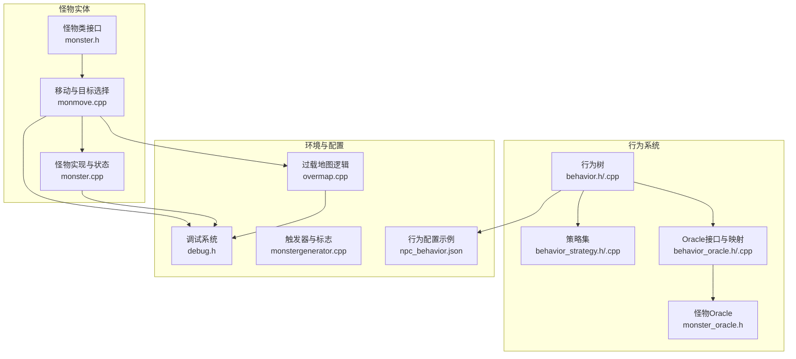
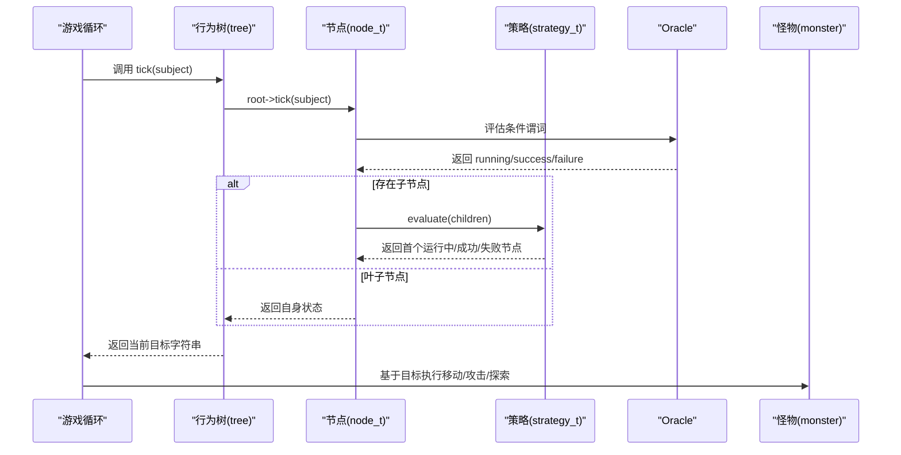
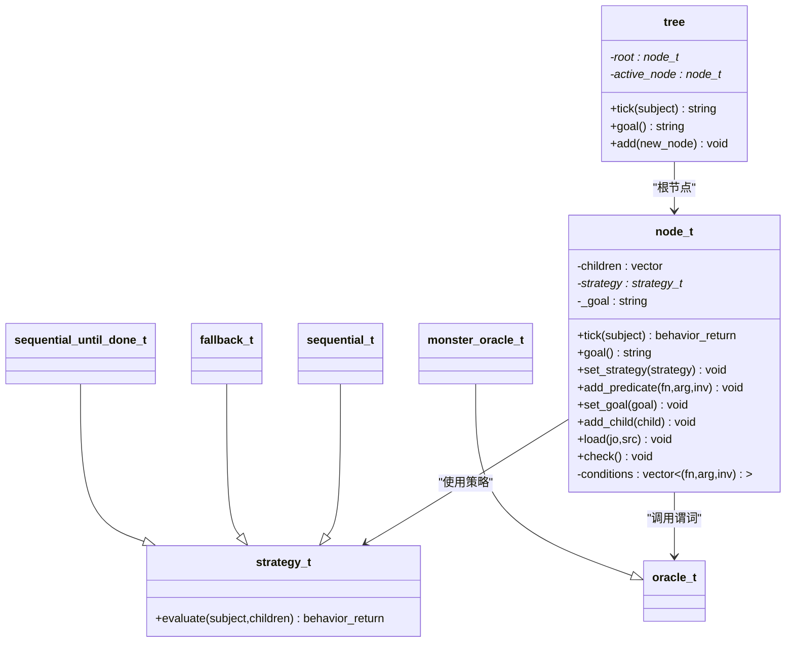
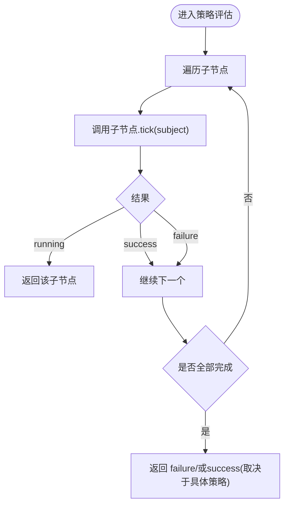
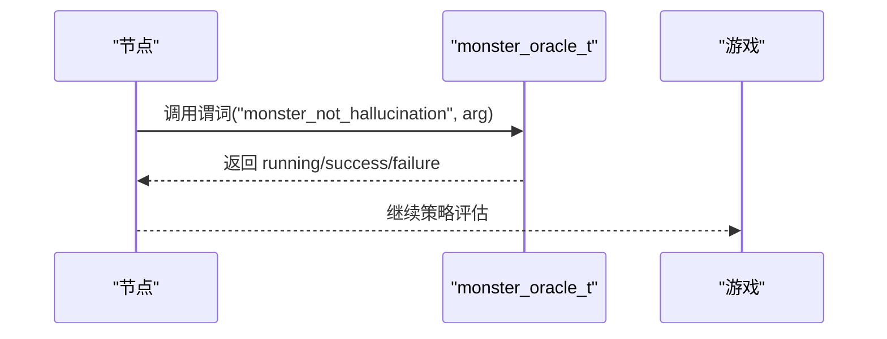
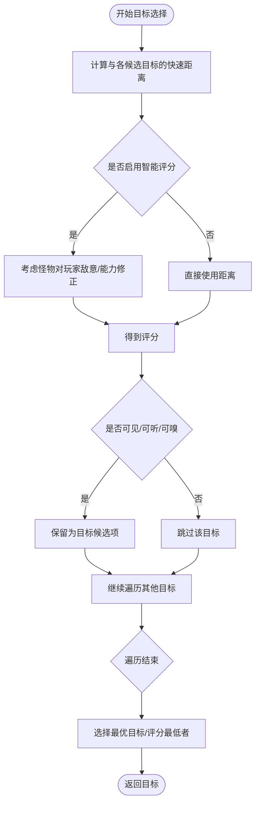
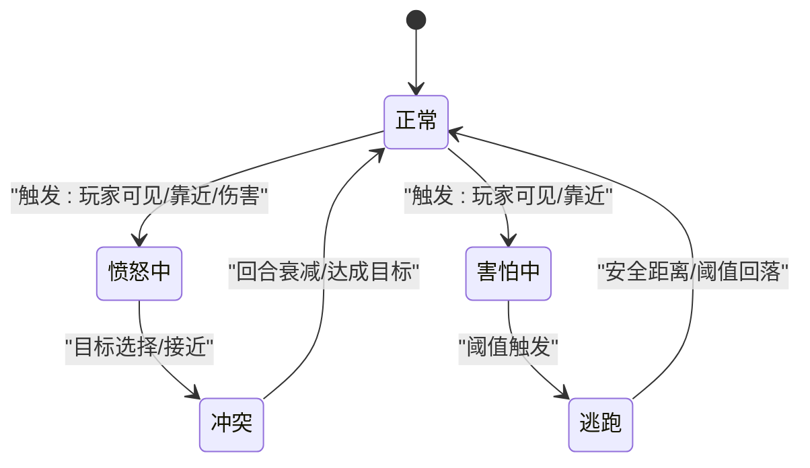
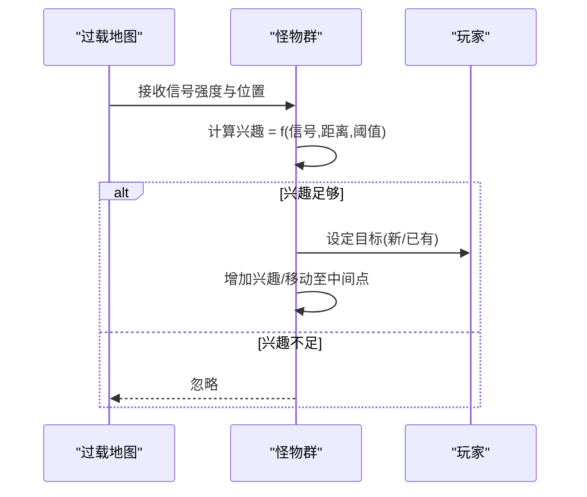
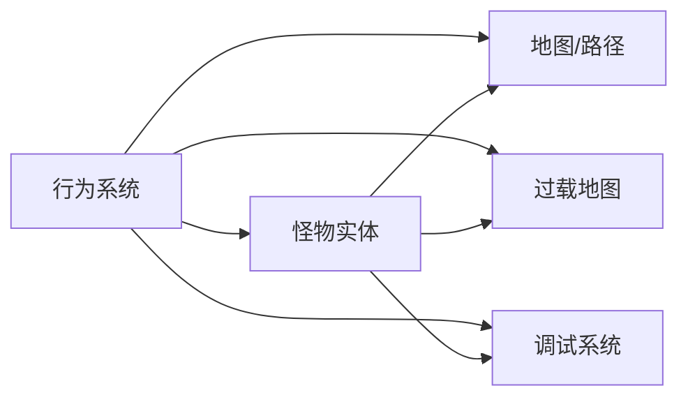

# 怪物AI行为系统

<cite>
**本文引用的文件**
- behavior.h
- behavior.cpp
- behavior_strategy.h
- behavior_strategy.cpp
- behavior_oracle.h
- behavior_oracle.cpp
- monster_oracle.h
- monmove.cpp
- monster.h
- monster.cpp
- debug.h
- overmap.cpp
- monstergenerator.cpp
- npc_behavior.json
</cite>

## 目录
1. [引言](#引言)
2. [项目结构](#项目结构)
3. [核心组件](#核心组件)
4. [架构总览](#架构总览)
5. [详细组件分析](#详细组件分析)
6. [依赖关系分析](#依赖关系分析)
7. [性能考量](#性能考量)
8. [故障排查指南](#故障排查指南)
9. [结论](#结论)
10. [附录](#附录)

## 引言
本文件系统性梳理 Cataclysm-DDA 的怪物AI行为系统，重点覆盖以下方面：
- 行为树与决策算法：节点、策略、条件谓词与目标选择流程
- 状态机与行为优先级：基于触发器的状态变化与情绪/愤怒值管理
- 感知系统与目标选择：视觉、听觉、嗅觉、路径规划与威胁评估
- AI调试工具：调试过滤器与日志输出
- 不同AI类型差异与行为模式定制：通过JSON配置与触发器标志实现差异化行为
- 性能优化策略：启发式距离、速率限制、路径代价过滤等

## 项目结构
围绕怪物AI行为系统的关键源文件与数据如下：
- 行为树与策略：behavior.h/.cpp、behavior_strategy.h/.cpp
- 行为谓词与Oracle：behavior_oracle.h/.cpp、monster_oracle.h
- 怪物移动与目标选择：monmove.cpp、monster.h/.cpp
- 调试与日志：debug.h
- 过载地图与群体行为：overmap.cpp
- 触发器与标志：monstergenerator.cpp
- 配置示例：npc_behavior.json（NPC行为树配置）

**图表来源**
- behavior.h
- behavior_strategy.h
- behavior_oracle.h
- monster_oracle.h
- monster.h
- monmove.cpp
- monster.cpp
- debug.h
- overmap.cpp
- monstergenerator.cpp
- npc_behavior.json

**章节来源**
- behavior.h
- behavior_strategy.h
- behavior_oracle.h
- monster_oracle.h
- monster.h
- monmove.cpp
- monster.cpp
- debug.h
- overmap.cpp
- monstergenerator.cpp
- npc_behavior.json

## 核心组件
- 行为树与节点
  - tree：入口点，按深度优先遍历返回最高优先级“可执行”节点的目标字符串
  - node_t：节点封装目标、子节点、策略与条件谓词；支持延迟初始化与一致性检查
- 行为策略
  - sequential_t：顺序执行，遇失败或运行中即返回
  - fallback_t：顺序执行，遇成功或运行中即返回
  - sequential_until_done_t：无条件顺序执行，仅在遇到运行中时返回
- Oracle与谓词
  - oracle_t：抽象观察者接口
  - predicate_map：怪物谓词集合，如“非幻觉”、“物品可用”、“可分裂”等
- 怪物Oracle
  - monster_oracle_t：面向怪物的谓词封装，连接行为树与怪物实体状态
- 移动与目标选择
  - rate_target：基于距离与能力评分目标
  - 计划结构体：包含愤怒/恐惧阈值、智能规划开关、群体与逃跑状态等
- 调试系统
  - debugmode::DF_MONSTER、DF_MONMOVE 等过滤器用于输出怪物AI相关日志

**章节来源**
- behavior.h
- behavior.cpp
- behavior_strategy.h
- behavior_strategy.cpp
- behavior_oracle.h
- behavior_oracle.cpp
- monster_oracle.h
- monmove.cpp
- debug.h

## 架构总览
行为树驱动怪物AI的决策流程：每次tick从根节点开始，按策略顺序评估子节点，遇到“运行中”的叶子节点即作为当前目标；同时怪物根据触发器与状态调整愤怒/恐惧值并进行目标选择与路径规划。

**图表来源**
- behavior.h
- behavior_strategy.cpp
- behavior_oracle.cpp
- monster.cpp

## 详细组件分析

### 行为树与节点
- 节点职责
  - 设置目标字符串、添加子节点、绑定策略、注册条件谓词
  - tick时先处理条件谓词，若为叶子则直接返回结果；否则由策略决定子节点访问顺序
- 加载与校验
  - 支持延迟初始化：先记录子节点ID，最终化阶段再建立父子关系
  - 一致性检查：必须满足“有子节点则无目标且有策略，或有目标则无子节点”之一

**图表来源**
- behavior.h
- behavior_strategy.h
- behavior_oracle.h
- monster_oracle.h

**章节来源**
- behavior.h
- behavior.cpp
- behavior.cpp

### 行为策略
- sequential_t：顺序执行子节点，遇失败或运行中即短路返回
- fallback_t：顺序执行直到成功或运行中
- sequential_until_done_t：强制顺序执行，仅在遇到运行中时返回

**图表来源**
- behavior_strategy.cpp

**章节来源**
- behavior_strategy.h
- behavior_strategy.cpp

### Oracle与谓词
- predicate_map：集中注册怪物相关谓词，如“非幻觉”、“物品可用”、“可分裂”、“附近植物”、“特殊可用”
- monster_oracle_t：以怪物为被观察主体，提供上述谓词的具体实现

**图表来源**
- behavior_oracle.cpp
- monster_oracle.h

**章节来源**
- behavior_oracle.h
- behavior_oracle.cpp
- monster_oracle.h

### 怪物移动与目标选择
- rate_target：综合距离与怪物能力（如对玩家的敌意）计算目标评分，用于优先级排序
- monster_plan：封装怪物的智能规划参数（是否优先目标、最大视野、愤怒/恐惧阈值、逃跑/群体状态等）
- 感知与追踪
  - 嗅觉追踪：基于气味图与物种接受度筛选方向，考虑“强鼻”与阈值
  - 听觉/视觉：结合可听范围与可见性判断是否接近目标
- 路径代价过滤：忽略免疫的领域、陷阱、尖锐地形等，提升路径质量与性能

**图表来源**
- monmove.cpp
- monmove.cpp
- monmove.cpp

**章节来源**
- monmove.cpp
- monmove.cpp
- monmove.cpp

### 态度与触发器系统
- 态度与触发器
  - 怪物类型定义愤怒/恐惧/安抚触发器（如“玩家靠近弱小”“玩家可见”“交配季节”等）
  - 怪物实例维护愤怒与道德值，随触发事件动态增减
- 状态演进
  - process_trigger：根据触发器类型更新愤怒/道德
  - 每回合平滑回归基础值，避免永久性极端状态
  - 友方死亡等事件影响群体情绪与愤怒

**图表来源**
- monster.cpp
- monstergenerator.cpp

**章节来源**
- monster.cpp
- monstergenerator.cpp

### 过载地图与群体行为
- 群体兴趣与信号
  - 基于信号强度、距离与最小初始兴趣决定是否加入追击
  - 对已追击目标增加兴趣并朝中间点移动
- 与单体AI协同
  - 单体怪物仍遵循自身触发器与目标选择逻辑，群体行为在过载层面协调

**图表来源**
- overmap.cpp

**章节来源**
- overmap.cpp

### AI调试工具
- 调试过滤器
  - debugmode::DF_MONSTER、DF_MONMOVE 等可用于开启怪物AI相关日志输出
- 日志输出
  - 使用 DebugLog 与 add_msg_debug 输出AI决策过程与触发事件，便于定位问题

**章节来源**
- debug.h
- monmove.cpp
- monster.cpp

## 依赖关系分析
- 组件耦合
  - 行为树与策略解耦，策略通过接口注入；节点与策略之间为组合关系
  - Oracle提供统一谓词接口，怪物Oracle继承扩展
  - 怪物实体依赖行为树目标字符串与移动模块，形成闭环
- 外部依赖
  - 地图与路径模块提供可达性与代价评估
  - 过载地图提供群体兴趣与目标协调
  - 调试系统贯穿AI各层，便于观测与排错

**图表来源**
- behavior.h
- monster.h
- monmove.cpp
- overmap.cpp
- debug.h

**章节来源**
- behavior.h
- monster.h
- monmove.cpp
- overmap.cpp
- debug.h

## 性能考量
- 启发式距离与早期短路
  - rate_target 使用快速距离估算，当不智能规划且距离大于当前最优时直接短路
- 速率限制与思考节流
  - 在无明显威胁时降低怪物思考频率，减少CPU占用
- 路径代价过滤
  - 过滤免疫领域、陷阱、尖锐地形等，避免无效探索
- 智能评分
  - 结合怪物对玩家敌意与能力修正，减少无效接近尝试

**章节来源**
- monmove.cpp
- monmove.cpp

## 故障排查指南
- 开启AI调试
  - 使用 debugmode 过滤器（如 DF_MONSTER、DF_MONMOVE）查看AI决策与触发事件
- 关注关键日志
  - 例如“character aggro triggered by…”“character aggro reset”等提示愤怒/道德变化
- 检查行为树配置
  - 行为树加载失败会抛出错误，检查策略与谓词名称是否正确
- 排查路径问题
  - 若怪物卡位，检查 can_move_to/will_move_to 的危险规避标志与地形限制

**章节来源**
- debug.h
- behavior.cpp
- monster.cpp
- monmove.cpp

## 结论
Cataclysm-DDA 的怪物AI以行为树为核心，结合策略、谓词与怪物状态机，形成可配置、可扩展且具备性能意识的行为框架。通过触发器与情绪系统实现复杂的状态演进，配合嗅觉、听觉、视觉与路径代价过滤，达到自然且高效的怪物行为表现。调试系统贯穿其中，便于开发者定位与优化。

## 附录
- 行为树配置示例参考：npc_behavior.json
- 触发器枚举与字符串映射：monstergenerator.cpp 中的枚举到字符串转换

**章节来源**
- npc_behavior.json
- monstergenerator.cpp