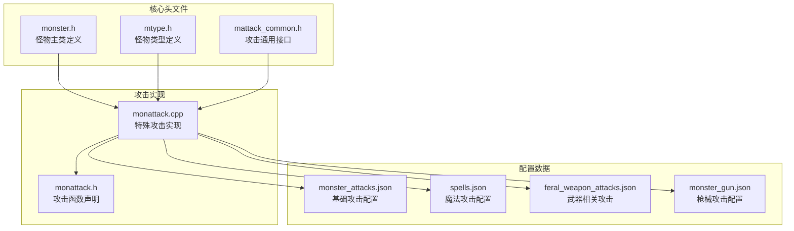
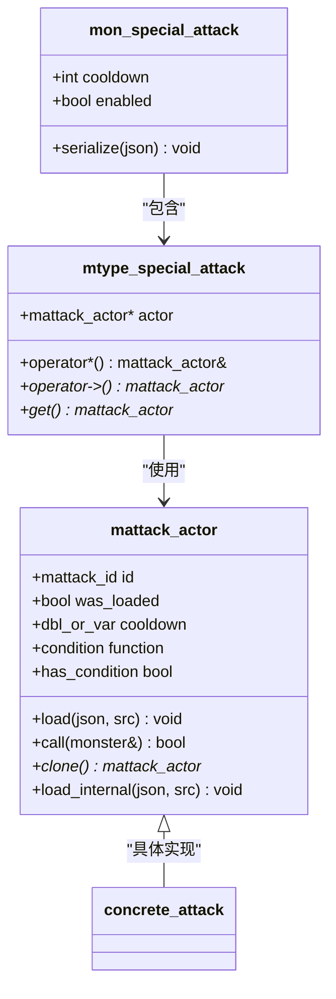
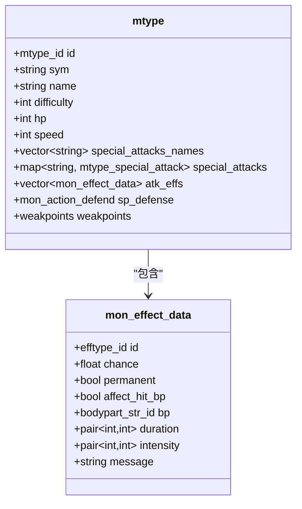
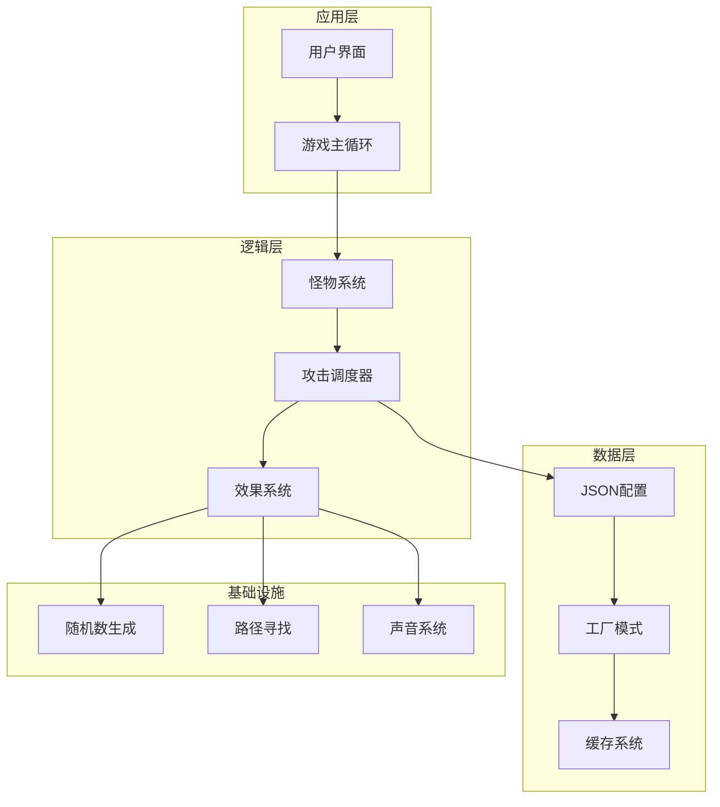
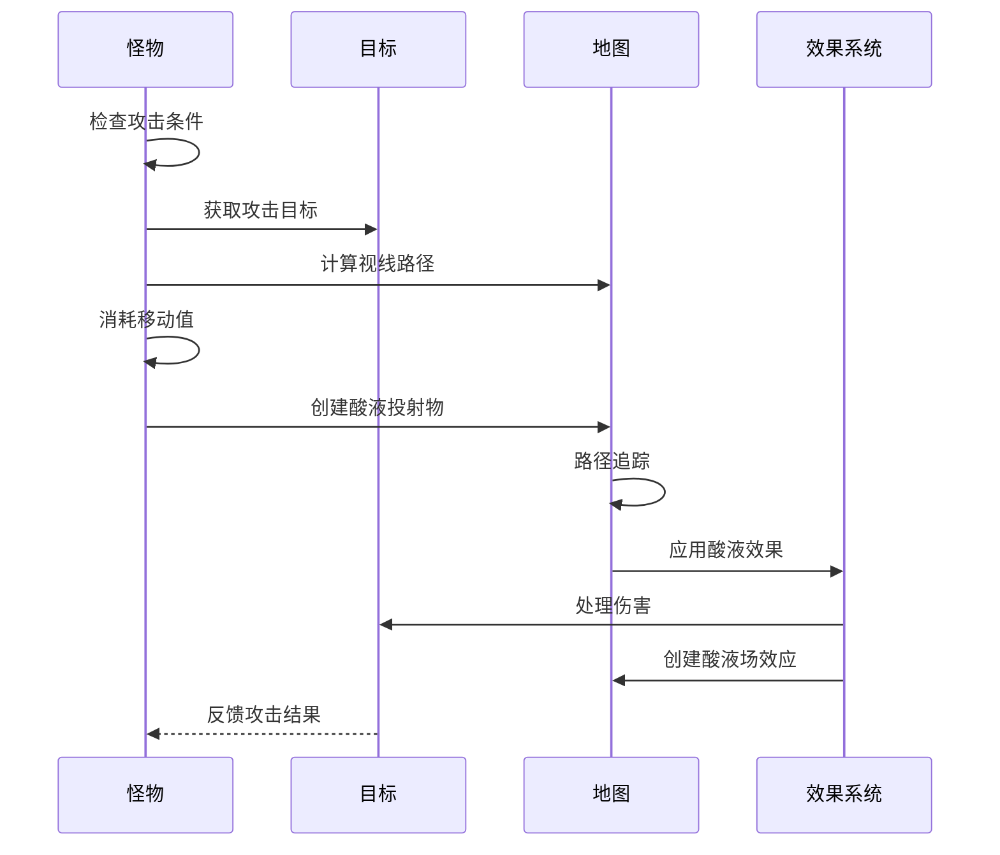
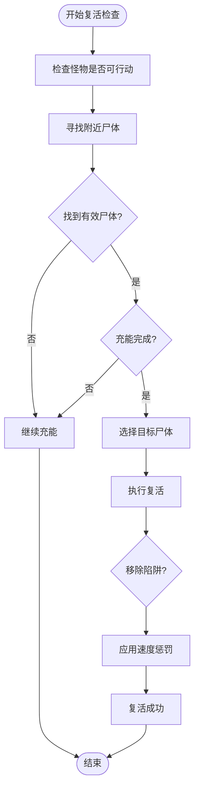
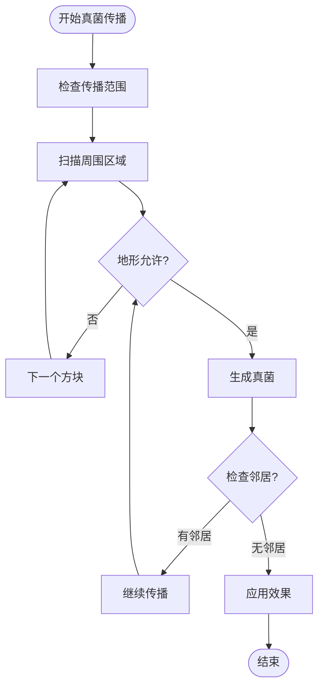
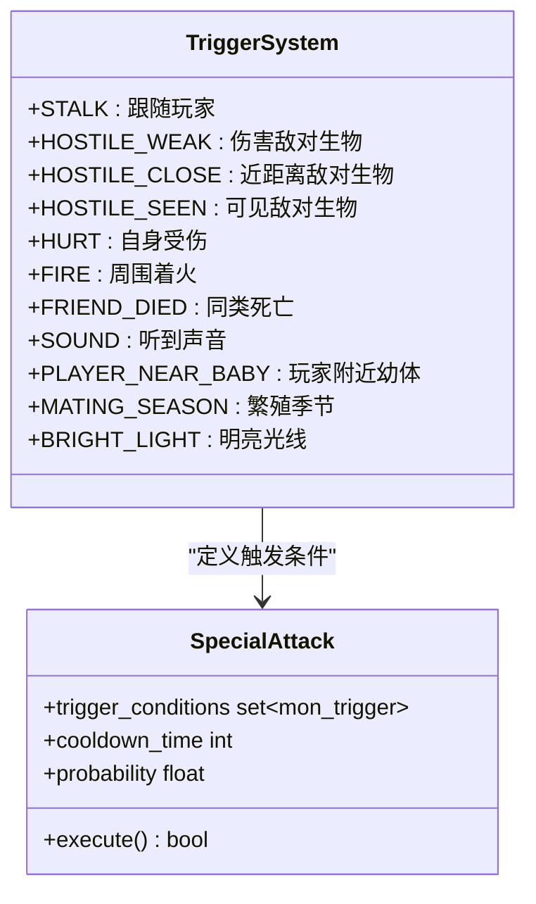
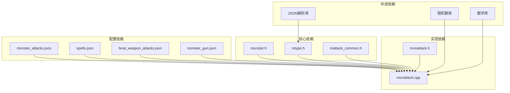

# 怪物特殊能力系统

<cite>
**本文档引用的文件**
- monster.h
- monattack.h
- monattack.cpp
- mattack_common.h
- mtype.h
- monster_attacks.json
- feral_weapon_attacks.json
- spells.json
- monster_gun.json
</cite>

## 目录
1. [简介](#简介)
2. [项目结构](#项目结构)
3. [核心组件](#核心组件)
4. [架构概览](#架构概览)
5. [详细组件分析](#详细组件分析)
6. [依赖关系分析](#依赖关系分析)
7. [性能考量](#性能考量)
8. [故障排除指南](#故障排除指南)
9. [结论](#结论)

## 简介

Cataclysm-DDA的怪物特殊能力系统是一个复杂而精细的游戏机制，它为各种怪物提供了超越普通近战攻击的独特能力。这个系统不仅包括传统的物理攻击（如酸液喷射、电风暴），还包括魔法类能力（如复活、传送）和环境影响技能（如植物生长、真菌传播）。该系统的设计目标是在保持游戏平衡性的同时，为玩家提供多样化的挑战体验。

系统的核心设计理念是通过JSON配置文件定义怪物的能力，然后在运行时动态加载和执行这些能力。每个怪物类型都可以拥有多个特殊攻击，这些攻击具有独立的冷却时间、触发条件和效果范围。

## 项目结构

怪物特殊能力系统主要分布在以下关键文件中：

**图表来源**
- monster.h
- mtype.h
- monattack.h

**章节来源**
- monster.h
- monattack.h
- mattack_common.h

## 核心组件

### 特殊攻击数据结构

系统的核心数据结构围绕`mon_special_attack`和`mtype_special_attack`展开：

**图表来源**
- monster.h
- mattack_common.h

### 怪物类型系统

每个怪物类型都通过`mtype`结构体定义其特殊能力：

**图表来源**
- mtype.h

**章节来源**
- monster.h
- mattack_common.h
- mtype.h

## 架构概览

怪物特殊能力系统采用分层架构设计，确保了高度的模块化和可扩展性：

**图表来源**
- monattack.cpp
- monster.h

系统的核心流程遵循以下模式：

1. **初始化阶段**：从JSON配置文件加载怪物类型定义
2. **运行时阶段**：根据触发条件评估并执行特殊攻击
3. **效果应用阶段**：处理攻击产生的各种游戏效果
4. **状态更新阶段**：维护冷却时间和怪物状态

## 详细组件分析

### 特殊攻击实现机制

系统支持多种类型的特殊攻击，每种都有其独特的实现方式：

#### 酸液攻击系统

酸液攻击是最常见的特殊攻击之一，具有精确的目标选择和伤害扩散机制：

**图表来源**
- monattack.cpp

#### 复活系统

复活系统体现了游戏中最复杂的特殊能力之一，涉及多个层次的状态管理和效果叠加：

**图表来源**
- monattack.cpp

#### 真菌传播系统

真菌传播展示了环境影响型特殊攻击的复杂性：

**图表来源**
- monattack.cpp

### 冷却系统设计

冷却系统是维持游戏平衡的关键机制，确保特殊攻击不会被滥用：

| 冷却类型 | 描述 | 实现方式 |
|---------|------|----------|
| 基础冷却 | 每个特殊攻击的固定冷却时间 | `mon_special_attack.cooldown` |
| 动态冷却 | 根据怪物状态调整的冷却时间 | 运行时计算 |
| 组合冷却 | 多个特殊攻击共享的冷却池 | 状态管理 |
| 触发冷却 | 基于触发条件的延迟机制 | 条件检查 |

### 触发条件系统

系统支持多种触发条件，使特殊攻击更加智能化：

**图表来源**
- mtype.h

**章节来源**
- monattack.cpp
- monattack.cpp
- monattack.cpp

## 依赖关系分析

系统各组件之间的依赖关系体现了清晰的分层设计：

**图表来源**
- monattack.cpp
- mtype.h

**章节来源**
- monattack.cpp
- mtype.h

## 性能考量

系统在设计时充分考虑了性能优化：

### 冷却时间管理
- 使用整数计时器避免浮点运算开销
- 批量更新减少循环次数
- 内存池管理减少频繁分配

### 触发条件优化
- 早期退出策略减少不必要的计算
- 缓存常用计算结果
- 分级检查优先处理最可能的条件

### 内存使用优化
- 对象池模式管理临时对象
- 智能指针避免内存泄漏
- 延迟加载配置数据

## 故障排除指南

### 常见问题诊断

**问题1：特殊攻击不触发**
- 检查冷却时间是否已过
- 验证触发条件是否满足
- 确认目标在攻击范围内

**问题2：攻击效果异常**
- 检查伤害计算公式
- 验证概率计算逻辑
- 确认目标抗性处理

**问题3：性能问题**
- 监控冷却系统更新频率
- 检查触发条件检查成本
- 优化效果应用算法

### 调试工具

系统提供了多种调试功能：

| 调试功能 | 用途 | 实现方式 |
|---------|------|----------|
| 冷却显示 | 显示剩余冷却时间 | UI标签 |
| 触发日志 | 记录触发条件评估 | 日志系统 |
| 效果可视化 | 显示攻击范围和效果 | 渲染系统 |
| 性能监控 | 监控执行时间 | 性能计数器 |

**章节来源**
- monster.h

## 结论

Cataclysm-DDA的怪物特殊能力系统展现了优秀的软件工程实践，通过模块化设计、清晰的分层架构和灵活的配置系统，实现了高度可扩展和可维护的特殊攻击机制。系统不仅为游戏提供了丰富的战术深度，还为mod开发者提供了完善的扩展接口。

该系统的主要优势包括：
- **高度模块化**：每个特殊攻击都是独立的模块
- **灵活配置**：通过JSON文件轻松定义新能力
- **性能优化**：智能的缓存和延迟加载机制
- **平衡性设计**：完善的冷却系统和触发条件
- **可扩展性**：清晰的接口设计支持二次开发

未来的发展方向可能包括：
- 更复杂的AI决策系统
- 动态难度调整机制
- 更丰富的视觉效果
- 增强的模组支持