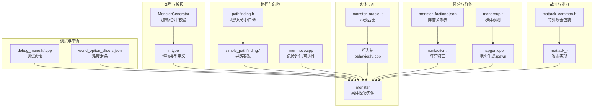
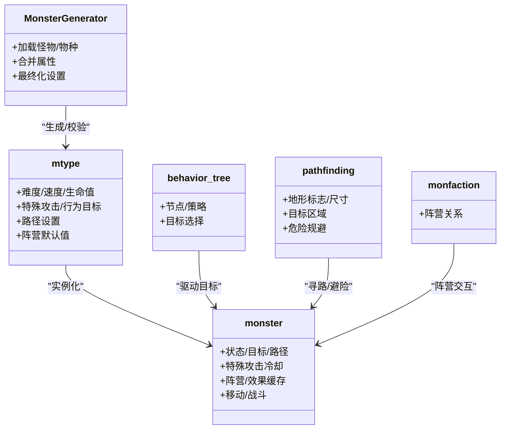
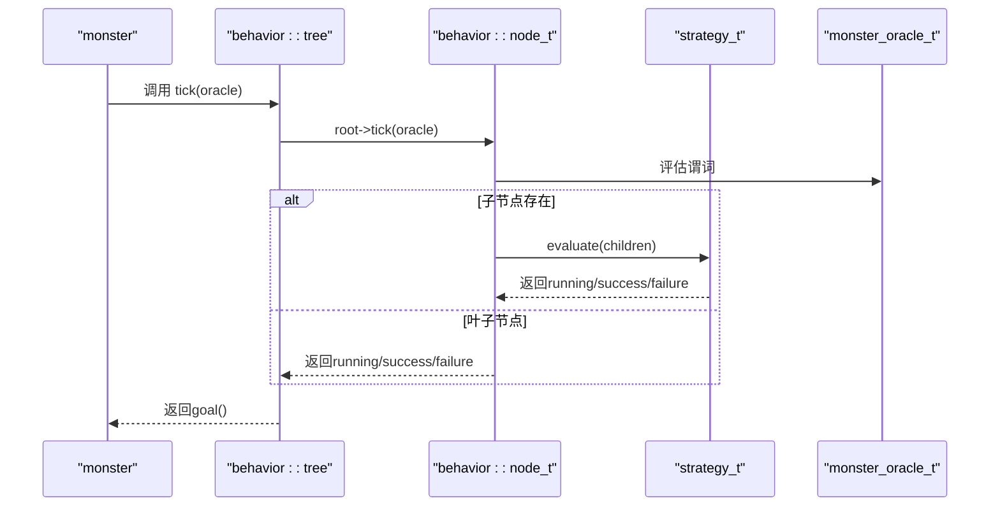
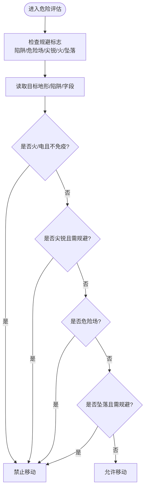
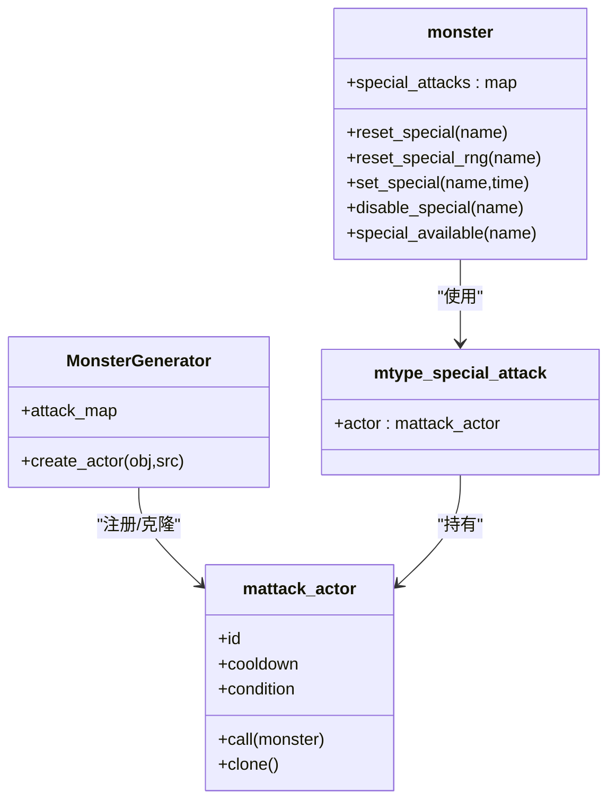
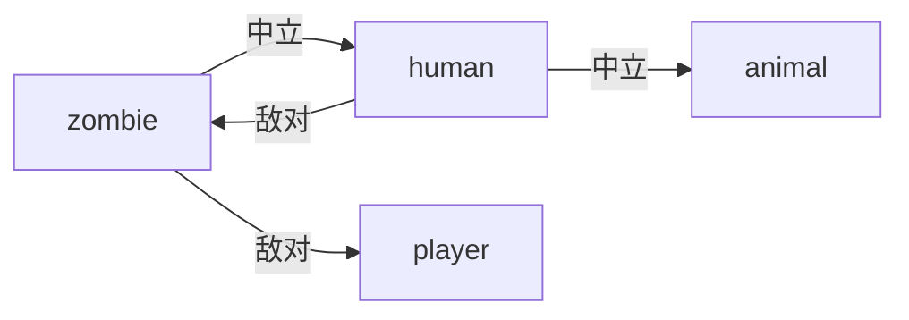
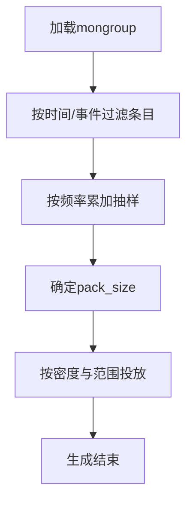
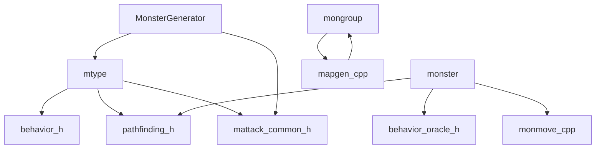

# 怪物系统

<cite>
**本文引用的文件**
- monster.h
- monster.cpp
- monmove.cpp
- mtype.h
- monstergenerator.h
- monstergenerator.cpp
- behavior.h
- behavior.cpp
- behavior_strategy.h
- behavior_strategy.cpp
- behavior_oracle.h
- monster_oracle.h
- pathfinding.h
- simple_pathfinding.h
- simple_pathfinding.cpp
- pathfinding.cpp
- mongroup.h
- mongroup.cpp
- mapgen.cpp
- monfaction.h
- monster_factions.json
- world_option_sliders.json
- debug_menu.h
- debug_menu.cpp
- monattack.h
- mattack_common.h
</cite>

## 目录
1. [简介](#简介)
2. [项目结构](#项目结构)
3. [核心组件](#核心组件)
4. [架构总览](#架构总览)
5. [详细组件分析](#详细组件分析)
6. [依赖分析](#依赖分析)
7. [性能考量](#性能考量)
8. [故障排查指南](#故障排查指南)
9. [结论](#结论)
10. [附录](#附录)

## 简介
本文件系统化梳理 Cataclysm-DDA 的怪物系统，覆盖怪物类型定义、AI 行为树、路径规划与危险评估、阵营关系、群体生成、特殊能力机制、平衡性与难度曲线、调试工具与性能优化，并提供新怪物类型的开发指南与最佳实践。内容以源码为依据，配合图示帮助理解。

## 项目结构
怪物系统主要由以下模块构成：
- 类型与模板：mtype 定义怪物属性、旗标、行为目标、路径设置等；MonsterGenerator 负责加载与合并数据。
- 实体与行为：monster 是具体实体，承载 AI 决策、移动、战斗、特殊能力冷却等；行为树（behavior）提供高层目标选择。
- 路径与危险评估：pathfinding 提供地形与尺寸抽象；monmove 中的 know_danger_at/can_move_to 等实现危险规避。
- 阵营与群体：monfaction/monster_factions.json 描述阵营关系；mongroup/mapgen 控制群体生成与密度。
- 攻击与特殊能力：mattack_* 与 mtype.special_attacks 组合实现多样化战斗行为。
- 调试与平衡：debug_menu 提供怪物生成与可视化；world_option_sliders.json 提供世界难度滑条。

**图表来源**
- mtype.h
- monstergenerator.h
- monster.h
- behavior.h
- behavior_strategy.h
- pathfinding.h
- simple_pathfinding.h
- monmove.cpp
- monfaction.h
- mongroup.h
- mapgen.cpp
- monattack.h
- mattack_common.h
- debug_menu.h
- world_option_sliders.json

**章节来源**
- mtype.h
- monstergenerator.h
- monster.h
- behavior.h
- pathfinding.h
- mongroup.h
- mapgen.cpp

## 核心组件
- mtype：怪物类型模板，包含旗标、难度、速度、生命值、攻击成本、特殊攻击、行为目标、路径设置、阵营默认值等。
- MonsterGenerator：负责加载怪物 JSON、合并物种属性、最终化路径设置、校验与注册。
- monster：具体怪物实体，包含当前状态（愤怒/友好/理智）、目标路径、特殊攻击冷却、阵营、效果缓存、移动与战斗逻辑。
- 行为树：以节点与策略组织高层目标选择，通过预言器查询状态，返回最高优先级可推进的目标。
- 路径系统：抽象地形属性与尺寸限制，提供目标区域、最大距离/长度、危险规避选项；结合寻路实现进行路径计算。
- 阵营系统：基于 monfaction 接口与 JSON 配置，描述阵营间友好/中立/敌对与情绪变化。
- 群体生成：mongroup 定义频率、成本、组内最小/最大数量、条件与事件；mapgen 在地图生成时按密度与规则投放。

**章节来源**
- mtype.h
- monstergenerator.cpp
- monster.h
- behavior.h
- pathfinding.h
- monfaction.h
- mongroup.h

## 架构总览
怪物系统采用“类型模板 + 实体实例 + 行为树 + 寻路”的分层设计：
- 类型层：mtype 定义静态属性与行为蓝图。
- 实例层：monster 承载动态状态与决策。
- 决策层：行为树根据预言器状态选择目标，驱动实体执行动作。
- 运动层：路径系统与寻路实现保障移动与危险规避。
- 关系层：阵营与群体规则影响生成、互动与对抗。

**图表来源**
- mtype.h
- monstergenerator.h
- monster.h
- behavior.h
- pathfinding.h
- monfaction.h

## 详细组件分析

### AI 行为树与目标选择
- 行为树结构：tree 持有根节点，node_t 可挂载策略与谓词，叶子节点返回 running/success/failure；策略包括顺序执行、失败即换、顺序直到完成。
- 预言器：oracle_t 提供统一查询接口；monster_oracle_t 为怪物提供 not_hallucination、items_available、adjacent_plants、special_available、split_possible 等谓词。
- 目标选择流程：每回合调用 tree::tick，深度优先遍历，返回首个 running 的节点作为当前目标；goal() 返回最近确定目标字符串。

**图表来源**
- behavior.h
- behavior_strategy.h
- behavior_strategy.cpp
- behavior_oracle.h
- monster_oracle.h

**章节来源**
- behavior.h
- behavior_strategy.h
- behavior_strategy.cpp
- behavior_oracle.h
- monster_oracle.h

### 路径规划与危险评估
- 地形标志：PathfindingFlag 抽象地面/障碍/危险/门/楼梯/尖锐/洞/熔岩等；PathfindingFlags 位集组合。
- 目标区域：支持点目标、邻接、半径三种；pathfinding_settings 控制最大距离/长度、攀爬/开门/陷阱/粗糙地形/尖锐/危险场等规避。
- 危险评估：monster::know_danger_at 检查目标格是否危险（火/电/陷阱/危险场/尖锐/坠落），并考虑怪物抗性与感知。
- 可达性：monster::can_reach_to 考虑 z 层差异与坡道；monster::will_move_to 基于地形与旗标判断是否允许移动。
- 寻路实现：simple_pathfinding 提供 A* 等算法封装；monmove.cpp 中与危险评估结合，避免高危格。

**图表来源**
- pathfinding.h
- monmove.cpp

**章节来源**
- pathfinding.h
- monmove.cpp

### 特殊能力与攻击机制
- 特殊攻击包装：mtype_special_attack 包裹 mattack_actor，支持冷却、条件与克隆；MonsterGenerator 动态注册攻击实现。
- 攻击实现：monattack 头文件列举多种攻击类型（如 leap、melee、bite、gun、spell、suicide 等）；monster 对应冷却管理与可用性判定。
- 能力冷却：monster::reset_special/reset_special_rng/set_special/disable_special/has_special/special_available 管理冷却与启用状态。

**图表来源**
- mattack_common.h
- monstergenerator.cpp
- monattack.h
- monster.h

**章节来源**
- mattack_common.h
- monstergenerator.cpp
- monattack.h
- monster.h

### 阵营关系与互动
- 阵营接口：monfaction 提供阵营枚举与映射；阵营态度（by_mood/neutral/friendly/hate）决定互动倾向。
- 配置来源：monster_factions.json 定义阵营名称、基础阵营、情绪列表与关系矩阵；可扩展至模组。
- 态度判定：怪物在不同情绪下改变态度，阵营关系影响攻击/防御/中立行为。

**图表来源**
- monfaction.h
- monster_factions.json

**章节来源**
- monfaction.h
- monster_factions.json

### 群体生成与密度控制
- 群体规则：mongroup 定义频率、成本、最小/最大数量、条件与事件；MonsterGroupManager 根据时间/季节/事件筛选并随机抽取。
- 地图生成：mapgen 在指定区域内按 spawn_density 与密度倍数生成怪物，支持单体或按 pack_size 投放。
- 选项联动：world_option_sliders.json 提供 Spawn Density、Monster Resilience、Monster Speed 等滑条，影响整体难度与密度。

**图表来源**
- mongroup.h
- mongroup.cpp
- mapgen.cpp
- mapgen.cpp
- world_option_sliders.json

**章节来源**
- mongroup.h
- mongroup.cpp
- mapgen.cpp
- mapgen.cpp
- world_option_sliders.json

### 怪物种类系统与平衡性
- 种类与旗标：mtype 含重量、体积、难度、速度、生命值、攻击成本、近战/闪避/格挡、特殊攻击、路径设置、阵营默认值等；mon_flag_id_set 与预设旗标集合。
- 平衡参数：难度、速度、regenerates、bleed_rate、vision_day/night、agro/morale、tracking_distance 等共同决定威胁等级。
- 世界难度：通过 world_option_sliders.json 调整 Spawn Density、Monster Resilience、Monster Speed 等，形成难度曲线。

**章节来源**
- mtype.h
- world_option_sliders.json

### 行为模式定制与调试工具
- 行为树定制：通过 behavior JSON 注册节点、策略与谓词；node_t::load 支持 children/strategy/conditions/goal。
- 调试命令：debug_menu 提供 wishmonster、wishmonstergroup、显示阵营信息、显示可见性/光照/透明度/辐射等，便于验证 AI 与生成。
- 性能观测：monster 路径寻路带有指数回退冷却，降低重复寻路开销。

**章节来源**
- behavior.cpp
- debug_menu.h
- debug_menu.cpp
- monster.h

## 依赖分析
- mtype 依赖：behavior.h（目标树）、pathfinding.h（路径设置）、mattack_common.h（特殊攻击）、translation.h（本地化）。
- MonsterGenerator 依赖：generic_factory（注册/查找）、MonsterGenerator 内部映射（attack_map/death_map/defense_map）。
- monster 依赖：behavior_oracle.h（预言器）、pathfinding.h（设置）、monmove.cpp（危险评估/可达性）、mtype（类型模板）。
- mongroup 依赖：mongroup_id、时间/节日、随机数。
- mapgen 依赖：spawn_density 选项、mongroup 结果。

**图表来源**
- mtype.h
- monstergenerator.h
- monster.h
- mongroup.h
- mapgen.cpp

**章节来源**
- mtype.h
- monstergenerator.h
- monster.h
- mongroup.h
- mapgen.cpp

## 性能考量
- 寻路回退：monster 路径寻路具有指数回退冷却，避免频繁重算导致 CPU 泄漏。
- 路径设置：合理配置 max_dist/max_length/bash_strength/climb_cost/allow_open_doors/avoid_traps/avoid_rough_terrain/avoid_sharp/avoid_dangerous_fields，减少无效探索。
- 危险评估：在 know_danger_at 中尽早短路，优先检查高代价危险（如熔岩/电/陷阱）。
- 群体密度：Spawn Density 与动物密度选项直接影响生成成本，建议在高密度场景适度下调。

**章节来源**
- monster.h
- pathfinding.h
- monmove.cpp
- world_option_sliders.json

## 故障排查指南
- 行为树未生效：检查 behavior JSON 是否正确注册节点、策略与谓词；确认 node_t::check 断言未触发。
- 怪物不移动：检查 know_danger_at 返回值、can_move_to/can_reach_to 条件；确认路径设置与尺寸限制。
- 特殊攻击不触发：核对 special_available 冷却与启用状态；检查 mattack_actor 条件与 id 注册。
- 阵营异常：核对 monster_factions.json 中阵营关系与 by_mood 列表；确认怪物默认阵营。
- 群体生成异常：检查 mongroup 条件/事件/频率；确认 mapgen 密度与范围。

**章节来源**
- behavior.cpp
- monmove.cpp
- monster.h
- monster_factions.json
- mongroup.cpp
- mapgen.cpp

## 结论
Cataclysm-DDA 的怪物系统以类型模板为核心，结合行为树进行高层目标选择，辅以路径系统与危险评估实现智能移动，再通过阵营与群体规则塑造生态与挑战。借助调试工具与难度滑条，开发者可在保证性能的前提下快速迭代与平衡怪物体验。

## 附录
- 新怪物类型开发步骤
  1) 在 JSON 中定义 mtype 字段（难度/速度/生命/攻击/特殊攻击/行为目标/路径设置/阵营默认值）。
  2) 使用 MonsterGenerator 加载并合并，确保旗标与触发器正确。
  3) 设计行为树节点与策略，编写预言器谓词。
  4) 如需特殊攻击，注册 mattack_actor 并在 mtype.special_attacks 中引用。
  5) 在 mongroup 中添加群体规则，必要时在 mapgen 中配置密度与投放。
  6) 使用 debug_menu 生成与验证，调整 world_option_sliders.json 参数观察效果。
- 最佳实践
  - 将高代价危险（火/电/熔岩）置于 know_danger_at 早期短路。
  - 合理设置路径规避标志，避免怪物误入高危区域。
  - 使用行为树策略明确优先级，确保目标可推进。
  - 通过难度滑条与密度选项渐进式提升挑战性。
  - 为特殊攻击设定合理冷却与条件，避免滥用。